# Kết quả chạy các state.
## stage-00-chat
Tiến hành chạy thử và thu thập kết quả.

    Tôi mua ngày 28/09/2026, yêu cầu hoàn ngày 06/10/2026, chưa kích hoạt. Tôi có được hoàn không?

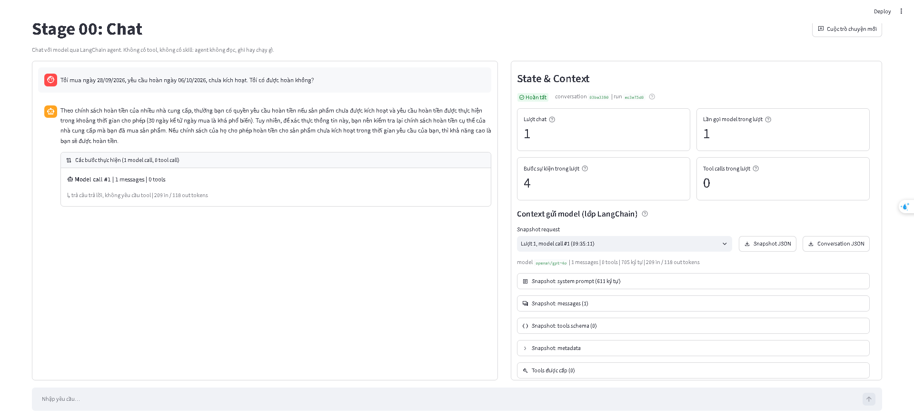
chat trả lời như sau.
```
Theo chính sách hoàn tiền của nhiều nhà cung cấp, thường bạn có quyền yêu cầu hoàn tiền nếu sản phẩm chưa được kích hoạt và yêu cầu hoàn tiền được thực hiện trong khoảng thời gian cho phép (30 ngày kể từ ngày mua là khá phổ biến). Tuy nhiên, để xác thực thông tin này, bạn nên kiểm tra lại chính sách hoàn tiền cụ thể của nhà cung cấp mà bạn đã mua sản phẩm. Nếu chính sách của họ cho phép hoàn tiền cho sản phẩm chưa kích hoạt trong thời gian yêu cầu của bạn, thì khả năng cao là bạn sẽ được hoàn tiền.
```
Tổng hợp conversation.jsol là:
```
{
  "label": "Context gửi model (lớp LangChain), không phải provider wire payload",
  "conversation_id": "63ba33900ef347a78d20e7df11692c53",
  "counters": {
    "Trạng thái": "Hoàn tất",
    "Lượt chat": 1,
    "Lần gọi model trong lượt": 1,
    "Bước sự kiện trong lượt": 4,
    "Tool calls trong lượt": 0
  },
  "messages": [
    {
      "role": "user",
      "type": "human",
      "content": "Tôi mua ngày 28/09/2026, yêu cầu hoàn ngày 06/10/2026, chưa kích hoạt. Tôi có được hoàn không?",
      "id": "70f7b84a-0655-4eae-a3eb-23d12f46eeb5"
    },
    {
      "role": "assistant",
      "type": "ai",
      "content": "Theo chính sách hoàn tiền của nhiều nhà cung cấp, thường bạn có quyền yêu cầu hoàn tiền nếu sản phẩm chưa được kích hoạt và yêu cầu hoàn tiền được thực hiện trong khoảng thời gian cho phép (30 ngày kể từ ngày mua là khá phổ biến). Tuy nhiên, để xác thực thông tin này, bạn nên kiểm tra lại chính sách hoàn tiền cụ thể của nhà cung cấp mà bạn đã mua sản phẩm. Nếu chính sách của họ cho phép hoàn tiền cho sản phẩm chưa kích hoạt trong thời gian yêu cầu của bạn, thì khả năng cao là bạn sẽ được hoàn tiền.",
      "id": "lc_run--01a115b7-883a-7150-8e59-0980c283ac58-0",
      "tool_calls": [],
      "usage_metadata": {
        "input_tokens": 209,
        "output_tokens": 118,
        "total_tokens": 327,
        "input_token_details": {
          "audio": 0,
          "cache_read": 0,
          "cache_creation": 0
        },
        "output_token_details": {
          "audio": 0,
          "reasoning": 0
        }
      }
    }
  ],
  "snapshots": [
    {
      "label": "Context gửi model (lớp LangChain)",
      "conversation_id": "63ba33900ef347a78d20e7df11692c53",
      "run_id": "ec3e75d6823f4889bc997eb98f56fe33",
      "chat_turn": 1,
      "model_call_index": 1,
      "event_sequence": 2,
      "captured_at": "2026-10-07T09:35:11.930+00:00",
      "model_name": "openai/gpt-4o",
      "system_prompt": "Bạn là trợ lý trong lab \"Agent Tools & Skills\". Trả lời bằng tiếng Việt, ngắn gọn, rõ ràng.\n\nQuy tắc:\n- Chỉ dùng các tool được cấp trong request để thao tác dữ liệu. Nếu không có tool phù hợp, nói rõ giới hạn thay vì đoán.\n- Chỉ nói đã đọc, ghi hoặc chạy một thứ khi đã nhận tool result thành công cho đúng thao tác đó.\n- Khi tool trả lỗi, báo lỗi cho người dùng và đề xuất cách xử lý; không bịa kết quả.\n\nProject này không cấp tool nào: bạn không đọc được file, không ghi được file và không chạy được lệnh.\nNếu người dùng yêu cầu đọc file hoặc dữ liệu, nói rõ bạn không có quyền truy cập và không bịa nội dung.",
      "messages": [
        {
          "role": "user",
          "type": "human",
          "content": "Tôi mua ngày 28/09/2026, yêu cầu hoàn ngày 06/10/2026, chưa kích hoạt. Tôi có được hoàn không?",
          "id": "70f7b84a-0655-4eae-a3eb-23d12f46eeb5"
        }
      ],
      "tools": [],
      "message_count": 1,
      "system_prompt_chars": 611,
      "message_chars": 94,
      "usage": {
        "input_tokens": 209,
        "output_tokens": 118,
        "total_tokens": 327,
        "input_token_details": {
          "audio": 0,
          "cache_read": 0,
          "cache_creation": 0
        },
        "output_token_details": {
          "audio": 0,
          "reasoning": 0
        }
      }
    }
  ],
  "events": [
    {
      "conversation_id": "63ba33900ef347a78d20e7df11692c53",
      "run_id": "ec3e75d6823f4889bc997eb98f56fe33",
      "chat_turn": 1,
      "sequence": 1,
      "type": "user_submitted",
      "timestamp": "2026-10-07T09:35:10.556+00:00",
      "text": "Tôi mua ngày 28/09/2026, yêu cầu hoàn ngày 06/10/2026, chưa kích hoạt. Tôi có được hoàn không?",
      "tools": [],
      "skills": []
    },
    {
      "conversation_id": "63ba33900ef347a78d20e7df11692c53",
      "run_id": "ec3e75d6823f4889bc997eb98f56fe33",
      "chat_turn": 1,
      "sequence": 2,
      "type": "model_request",
      "timestamp": "2026-10-07T09:35:11.931+00:00",
      "model_call_index": 1,
      "snapshot": {
        "label": "Context gửi model (lớp LangChain)",
        "conversation_id": "63ba33900ef347a78d20e7df11692c53",
        "run_id": "ec3e75d6823f4889bc997eb98f56fe33",
        "chat_turn": 1,
        "model_call_index": 1,
        "event_sequence": 2,
        "captured_at": "2026-10-07T09:35:11.930+00:00",
        "model_name": "openai/gpt-4o",
        "system_prompt": "Bạn là trợ lý trong lab \"Agent Tools & Skills\". Trả lời bằng tiếng Việt, ngắn gọn, rõ ràng.\n\nQuy tắc:\n- Chỉ dùng các tool được cấp trong request để thao tác dữ liệu. Nếu không có tool phù hợp, nói rõ giới hạn thay vì đoán.\n- Chỉ nói đã đọc, ghi hoặc chạy một thứ khi đã nhận tool result thành công cho đúng thao tác đó.\n- Khi tool trả lỗi, báo lỗi cho người dùng và đề xuất cách xử lý; không bịa kết quả.\n\nProject này không cấp tool nào: bạn không đọc được file, không ghi được file và không chạy được lệnh.\nNếu người dùng yêu cầu đọc file hoặc dữ liệu, nói rõ bạn không có quyền truy cập và không bịa nội dung.",
        "messages": [
          {
            "role": "user",
            "type": "human",
            "content": "Tôi mua ngày 28/09/2026, yêu cầu hoàn ngày 06/10/2026, chưa kích hoạt. Tôi có được hoàn không?",
            "id": "70f7b84a-0655-4eae-a3eb-23d12f46eeb5"
          }
        ],
        "tools": [],
        "message_count": 1,
        "system_prompt_chars": 611,
        "message_chars": 94,
        "usage": null
      }
    },
    {
      "conversation_id": "63ba33900ef347a78d20e7df11692c53",
      "run_id": "ec3e75d6823f4889bc997eb98f56fe33",
      "chat_turn": 1,
      "sequence": 3,
      "type": "model_response",
      "timestamp": "2026-10-07T09:35:17.146+00:00",
      "model_call_index": 1,
      "elapsed_ms": 5215.0,
      "tool_calls_requested": [],
      "usage": {
        "input_tokens": 209,
        "output_tokens": 118,
        "total_tokens": 327,
        "input_token_details": {
          "audio": 0,
          "cache_read": 0,
          "cache_creation": 0
        },
        "output_token_details": {
          "audio": 0,
          "reasoning": 0
        }
      }
    },
    {
      "conversation_id": "63ba33900ef347a78d20e7df11692c53",
      "run_id": "ec3e75d6823f4889bc997eb98f56fe33",
      "chat_turn": 1,
      "sequence": 4,
      "type": "run_completed",
      "timestamp": "2026-10-07T09:35:17.221+00:00",
      "answer_chars": 503
    }
  ]
}
```

    Tôi mua ngày 02/10/2026, yêu cầu hoàn ngày 12/10/2026 chưa kích hoạt. Tôi có được hoàn không?


Chat trả lời như hình.

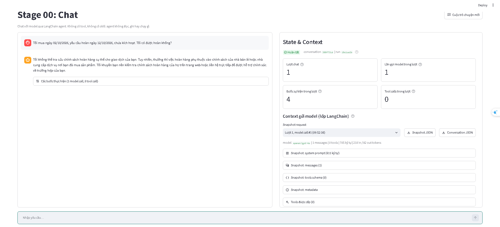

conversation.jsol như sau.
```
{
  "label": "Context gửi model (lớp LangChain), không phải provider wire payload",
  "conversation_id": "399f731d332d443bb89bc9da8a2137a2",
  "counters": {
    "Trạng thái": "Hoàn tất",
    "Lượt chat": 1,
    "Lần gọi model trong lượt": 1,
    "Bước sự kiện trong lượt": 4,
    "Tool calls trong lượt": 0
  },
  "messages": [
    {
      "role": "user",
      "type": "human",
      "content": "Tôi mua ngày 02/10/2026, yêu cầu hoàn ngày 12/10/2026,\nchưa kích hoạt. Tôi có được hoàn không?",
      "id": "a7de2464-86b9-4996-a92e-8cf5f4bc70ef"
    },
    {
      "role": "assistant",
      "type": "ai",
      "content": "Tôi không thể tra cứu chính sách hoàn hàng cụ thể cho giao dịch của bạn. Tuy nhiên, thường thì việc hoàn hàng phụ thuộc vào chính sách của nhà bán lẻ hoặc nhà cung cấp dịch vụ nơi bạn đã mua sản phẩm. Tôi khuyên bạn nên kiểm tra chính sách hoàn hàng của họ trên trang web hoặc liên hệ trực tiếp để được hỗ trợ chính xác về trường hợp của bạn.",
      "id": "lc_run--01a115c7-7a23-7c73-a1b3-e357873ef8c5-0",
      "tool_calls": [],
      "usage_metadata": {
        "input_tokens": 210,
        "output_tokens": 82,
        "total_tokens": 292,
        "input_token_details": {
          "audio": 0,
          "cache_read": 0,
          "cache_creation": 0
        },
        "output_token_details": {
          "audio": 0,
          "reasoning": 0
        }
      }
    }
  ],
  "snapshots": [
    {
      "label": "Context gửi model (lớp LangChain)",
      "conversation_id": "399f731d332d443bb89bc9da8a2137a2",
      "run_id": "19c1ce2b29504abcb191a94e4abed631",
      "chat_turn": 1,
      "model_call_index": 1,
      "event_sequence": 2,
      "captured_at": "2026-10-07T09:52:36.898+00:00",
      "model_name": "openai/gpt-4o",
      "system_prompt": "Bạn là trợ lý trong lab \"Agent Tools & Skills\". Trả lời bằng tiếng Việt, ngắn gọn, rõ ràng.\n\nQuy tắc:\n- Chỉ dùng các tool được cấp trong request để thao tác dữ liệu. Nếu không có tool phù hợp, nói rõ giới hạn thay vì đoán.\n- Chỉ nói đã đọc, ghi hoặc chạy một thứ khi đã nhận tool result thành công cho đúng thao tác đó.\n- Khi tool trả lỗi, báo lỗi cho người dùng và đề xuất cách xử lý; không bịa kết quả.\n\nProject này không cấp tool nào: bạn không đọc được file, không ghi được file và không chạy được lệnh.\nNếu người dùng yêu cầu đọc file hoặc dữ liệu, nói rõ bạn không có quyền truy cập và không bịa nội dung.",
      "messages": [
        {
          "role": "user",
          "type": "human",
          "content": "Tôi mua ngày 02/10/2026, yêu cầu hoàn ngày 12/10/2026,\nchưa kích hoạt. Tôi có được hoàn không?",
          "id": "a7de2464-86b9-4996-a92e-8cf5f4bc70ef"
        }
      ],
      "tools": [],
      "message_count": 1,
      "system_prompt_chars": 611,
      "message_chars": 94,
      "usage": {
        "input_tokens": 210,
        "output_tokens": 82,
        "total_tokens": 292,
        "input_token_details": {
          "audio": 0,
          "cache_read": 0,
          "cache_creation": 0
        },
        "output_token_details": {
          "audio": 0,
          "reasoning": 0
        }
      }
    }
  ],
  "events": [
    {
      "conversation_id": "399f731d332d443bb89bc9da8a2137a2",
      "run_id": "19c1ce2b29504abcb191a94e4abed631",
      "chat_turn": 1,
      "sequence": 1,
      "type": "user_submitted",
      "timestamp": "2026-10-07T09:52:35.627+00:00",
      "text": "Tôi mua ngày 02/10/2026, yêu cầu hoàn ngày 12/10/2026,\nchưa kích hoạt. Tôi có được hoàn không?",
      "tools": [],
      "skills": []
    },
    {
      "conversation_id": "399f731d332d443bb89bc9da8a2137a2",
      "run_id": "19c1ce2b29504abcb191a94e4abed631",
      "chat_turn": 1,
      "sequence": 2,
      "type": "model_request",
      "timestamp": "2026-10-07T09:52:36.899+00:00",
      "model_call_index": 1,
      "snapshot": {
        "label": "Context gửi model (lớp LangChain)",
        "conversation_id": "399f731d332d443bb89bc9da8a2137a2",
        "run_id": "19c1ce2b29504abcb191a94e4abed631",
        "chat_turn": 1,
        "model_call_index": 1,
        "event_sequence": 2,
        "captured_at": "2026-10-07T09:52:36.898+00:00",
        "model_name": "openai/gpt-4o",
        "system_prompt": "Bạn là trợ lý trong lab \"Agent Tools & Skills\". Trả lời bằng tiếng Việt, ngắn gọn, rõ ràng.\n\nQuy tắc:\n- Chỉ dùng các tool được cấp trong request để thao tác dữ liệu. Nếu không có tool phù hợp, nói rõ giới hạn thay vì đoán.\n- Chỉ nói đã đọc, ghi hoặc chạy một thứ khi đã nhận tool result thành công cho đúng thao tác đó.\n- Khi tool trả lỗi, báo lỗi cho người dùng và đề xuất cách xử lý; không bịa kết quả.\n\nProject này không cấp tool nào: bạn không đọc được file, không ghi được file và không chạy được lệnh.\nNếu người dùng yêu cầu đọc file hoặc dữ liệu, nói rõ bạn không có quyền truy cập và không bịa nội dung.",
        "messages": [
          {
            "role": "user",
            "type": "human",
            "content": "Tôi mua ngày 02/10/2026, yêu cầu hoàn ngày 12/10/2026,\nchưa kích hoạt. Tôi có được hoàn không?",
            "id": "a7de2464-86b9-4996-a92e-8cf5f4bc70ef"
          }
        ],
        "tools": [],
        "message_count": 1,
        "system_prompt_chars": 611,
        "message_chars": 94,
        "usage": null
      }
    },
    {
      "conversation_id": "399f731d332d443bb89bc9da8a2137a2",
      "run_id": "19c1ce2b29504abcb191a94e4abed631",
      "chat_turn": 1,
      "sequence": 3,
      "type": "model_response",
      "timestamp": "2026-10-07T09:52:40.000+00:00",
      "model_call_index": 1,
      "elapsed_ms": 3100.4,
      "tool_calls_requested": [],
      "usage": {
        "input_tokens": 210,
        "output_tokens": 82,
        "total_tokens": 292,
        "input_token_details": {
          "audio": 0,
          "cache_read": 0,
          "cache_creation": 0
        },
        "output_token_details": {
          "audio": 0,
          "reasoning": 0
        }
      }
    },
    {
      "conversation_id": "399f731d332d443bb89bc9da8a2137a2",
      "run_id": "19c1ce2b29504abcb191a94e4abed631",
      "chat_turn": 1,
      "sequence": 4,
      "type": "run_completed",
      "timestamp": "2026-10-07T09:52:40.078+00:00",
      "answer_chars": 342
    }
  ]
}
```

## stage-01-files

Tiến hành chạy thử rồi thu thập kết quả.

Viết test_tools.py như sau:

```
# Import hàm list_files từ file tool bạn đã viết
from tools import list_files

print("--- TH 1: Thư mục hợp lệ ---")
print(list_files.invoke({"path": "data/policies"}))

print("\n--- TH 2: Đường dẫn là File ---")
print(list_files.invoke({"path": "data/policies/policy-before-oct.md"}))

print("\n--- TH 3: Thư mục không tồn tại ---")
print(list_files.invoke({"path": "data/not_exist_folder"}))

print("\n--- TH 4: Đường dẫn vượt workspace ---")
print(list_files.invoke({"path": "../"}))
```

chạy và nhận được kết quả.

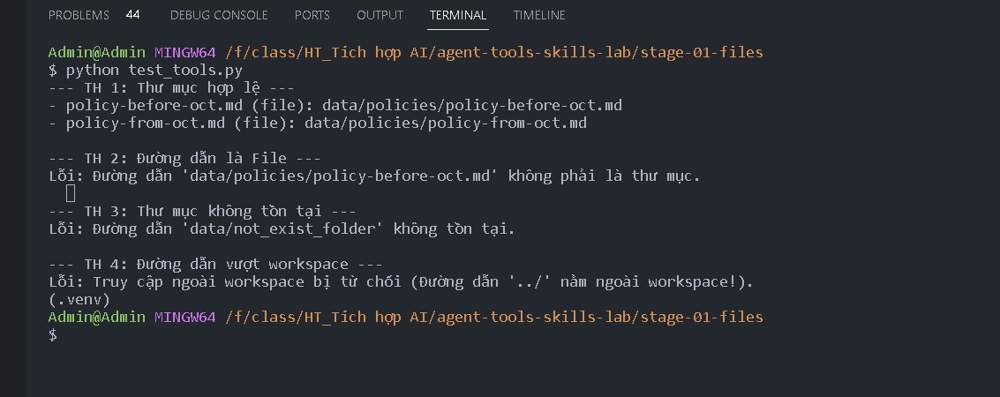
```
Admin@Admin MINGW64 /f/class/HT_Tích hợp AI/agent-tools-skills-lab/stage-01-files
$ python test_tools.py
--- TH 1: Thư mục hợp lệ ---
- policy-before-oct.md (file): data/policies/policy-before-oct.md
- policy-from-oct.md (file): data/policies/policy-from-oct.md

--- TH 2: Đường dẫn là File ---
Lỗi: Đường dẫn 'data/policies/policy-before-oct.md' không phải là thư mục.

--- TH 3: Thư mục không tồn tại ---
Lỗi: Đường dẫn 'data/not_exist_folder' không tồn tại.

--- TH 4: Đường dẫn vượt workspace ---
Lỗi: Truy cập ngoài workspace bị từ chối (Đường dẫn '../' nằm ngoài workspace!).
(.venv)
```

như vậy cấu hình tool đã hoàn thành và không lỗi.

Yêu cầu agent rằng:

    Liệt kê giúp tôi danh sách file đang có trong thư mục data/policies.

Kết quả hình ảnh:
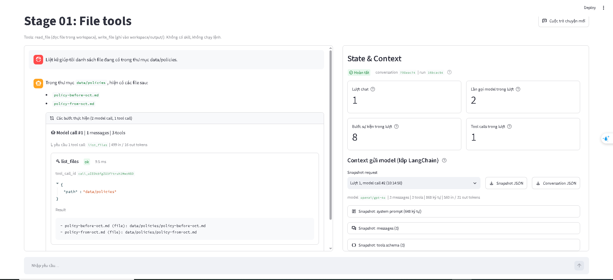

file conversation.

```
{
  "label": "Context gửi model (lớp LangChain), không phải provider wire payload",
  "conversation_id": "798eac74d3914062b121b4dc324e4564",
  "counters": {
    "Trạng thái": "Hoàn tất",
    "Lượt chat": 1,
    "Lần gọi model trong lượt": 2,
    "Bước sự kiện trong lượt": 8,
    "Tool calls trong lượt": 1
  },
  "messages": [
    {
      "role": "user",
      "type": "human",
      "content": "Liệt kê giúp tôi danh sách file đang có trong thư mục data/policies.",
      "id": "60bfa171-6eab-4721-919d-c32f7f59eb6f"
    },
    {
      "role": "assistant",
      "type": "ai",
      "content": "",
      "id": "lc_run--01a115db-c882-74d0-b0da-5a8241f26417-0",
      "tool_calls": [
        {
          "id": "call_uIEDk5fgZO3f7truh2MwzNBD",
          "name": "list_files",
          "args": {
            "path": "data/policies"
          }
        }
      ],
      "usage_metadata": {
        "input_tokens": 499,
        "output_tokens": 16,
        "total_tokens": 515,
        "input_token_details": {
          "audio": 0,
          "cache_read": 0,
          "cache_creation": 0
        },
        "output_token_details": {
          "audio": 0,
          "reasoning": 0
        }
      }
    },
    {
      "role": "tool",
      "type": "tool",
      "content": "- policy-before-oct.md (file): data/policies/policy-before-oct.md\n- policy-from-oct.md (file): data/policies/policy-from-oct.md",
      "id": "c9df5c6a-d186-412d-bf6c-2f5f0a7a8d6d",
      "tool_call_id": "call_uIEDk5fgZO3f7truh2MwzNBD",
      "name": "list_files",
      "status": "success"
    },
    {
      "role": "assistant",
      "type": "ai",
      "content": "Trong thư mục `data/policies`, hiện có các file sau:\n\n- `policy-before-oct.md`\n- `policy-from-oct.md`",
      "id": "lc_run--01a115db-d2f2-7542-adb3-179cf88481fb-0",
      "tool_calls": [],
      "usage_metadata": {
        "input_tokens": 560,
        "output_tokens": 31,
        "total_tokens": 591,
        "input_token_details": {
          "audio": 0,
          "cache_read": 0,
          "cache_creation": 0
        },
        "output_token_details": {
          "audio": 0,
          "reasoning": 0
        }
      }
    }
  ],
  "snapshots": [
    {
      "label": "Context gửi model (lớp LangChain)",
      "conversation_id": "798eac74d3914062b121b4dc324e4564",
      "run_id": "16bcac5462c44f4b91706c2e54634457",
      "chat_turn": 1,
      "model_call_index": 1,
      "event_sequence": 2,
      "captured_at": "2026-10-07T10:14:47.681+00:00",
      "model_name": "openai/gpt-4o",
      "system_prompt": "Bạn là trợ lý trong lab \"Agent Tools & Skills\". Trả lời bằng tiếng Việt, ngắn gọn, rõ ràng.\n\nQuy tắc:\n- Chỉ dùng các tool được cấp trong request để thao tác dữ liệu. Nếu không có tool phù hợp, nói rõ giới hạn thay vì đoán.\n- Chỉ nói đã đọc, ghi hoặc chạy một thứ khi đã nhận tool result thành công cho đúng thao tác đó.\n- Khi tool trả lỗi, báo lỗi cho người dùng và đề xuất cách xử lý; không bịa kết quả.\n\nWorkspace:\n- Mọi đường dẫn file đều tương đối workspace, ví dụ data/weekly_notes.md.\n- read_file đọc được file trong workspace. write_file chỉ ghi được dưới output/, ví dụ output/summary.md.\n- Bạn không chạy được lệnh shell trong project này.",
      "messages": [
        {
          "role": "user",
          "type": "human",
          "content": "Liệt kê giúp tôi danh sách file đang có trong thư mục data/policies.",
          "id": "60bfa171-6eab-4721-919d-c32f7f59eb6f"
        }
      ],
      "tools": [
        {
          "name": "read_file",
          "description": "Đọc một file văn bản UTF-8 trong workspace và trả về JSON.\n\npath là đường dẫn tương đối workspace, ví dụ: data/weekly_notes.md, output/summary.md.\nDùng để đọc dữ liệu đầu vào, file SKILL.md của một skill và các file reference trong thư mục skill.\nThành công: {\"ok\": true, \"path\": ..., \"content\": ...}. Lỗi: {\"ok\": false, \"error\": {\"code\": ..., \"message\": ...}}.",
          "parameters": {
            "properties": {
              "path": {
                "type": "string"
              }
            },
            "required": [
              "path"
            ],
            "type": "object"
          }
        },
        {
          "name": "write_file",
          "description": "Ghi nội dung văn bản UTF-8 vào một file dưới output/ của workspace và trả về JSON.\n\npath là đường dẫn tương đối workspace và phải bắt đầu bằng output/, ví dụ output/summary.md.\nTự tạo thư mục con. Ghi đè nếu file đã tồn tại.\nThành công: {\"ok\": true, \"path\": ..., \"bytes\": ..., \"status\": \"created\" | \"updated\"}. Lỗi: {\"ok\": false, \"error\": {...}}.",
          "parameters": {
            "properties": {
              "path": {
                "type": "string"
              },
              "content": {
                "type": "string"
              }
            },
            "required": [
              "path",
              "content"
            ],
            "type": "object"
          }
        },
        {
          "name": "list_files",
          "description": "Liệt kê các file và thư mục con trực tiếp trong một thư mục thuộc workspace.\n\nArgs:\n    path: Đường dẫn thư mục tương đối với workspace (ví dụ: 'data/policies').",
          "parameters": {
            "properties": {
              "path": {
                "type": "string"
              }
            },
            "required": [
              "path"
            ],
            "type": "object"
          }
        }
      ],
      "message_count": 1,
      "system_prompt_chars": 648,
      "message_chars": 68,
      "usage": {
        "input_tokens": 499,
        "output_tokens": 16,
        "total_tokens": 515,
        "input_token_details": {
          "audio": 0,
          "cache_read": 0,
          "cache_creation": 0
        },
        "output_token_details": {
          "audio": 0,
          "reasoning": 0
        }
      }
    },
    {
      "label": "Context gửi model (lớp LangChain)",
      "conversation_id": "798eac74d3914062b121b4dc324e4564",
      "run_id": "16bcac5462c44f4b91706c2e54634457",
      "chat_turn": 1,
      "model_call_index": 2,
      "event_sequence": 6,
      "captured_at": "2026-10-07T10:14:50.354+00:00",
      "model_name": "openai/gpt-4o",
      "system_prompt": "Bạn là trợ lý trong lab \"Agent Tools & Skills\". Trả lời bằng tiếng Việt, ngắn gọn, rõ ràng.\n\nQuy tắc:\n- Chỉ dùng các tool được cấp trong request để thao tác dữ liệu. Nếu không có tool phù hợp, nói rõ giới hạn thay vì đoán.\n- Chỉ nói đã đọc, ghi hoặc chạy một thứ khi đã nhận tool result thành công cho đúng thao tác đó.\n- Khi tool trả lỗi, báo lỗi cho người dùng và đề xuất cách xử lý; không bịa kết quả.\n\nWorkspace:\n- Mọi đường dẫn file đều tương đối workspace, ví dụ data/weekly_notes.md.\n- read_file đọc được file trong workspace. write_file chỉ ghi được dưới output/, ví dụ output/summary.md.\n- Bạn không chạy được lệnh shell trong project này.",
      "messages": [
        {
          "role": "user",
          "type": "human",
          "content": "Liệt kê giúp tôi danh sách file đang có trong thư mục data/policies.",
          "id": "60bfa171-6eab-4721-919d-c32f7f59eb6f"
        },
        {
          "role": "assistant",
          "type": "ai",
          "content": "",
          "id": "lc_run--01a115db-c882-74d0-b0da-5a8241f26417-0",
          "tool_calls": [
            {
              "id": "call_uIEDk5fgZO3f7truh2MwzNBD",
              "name": "list_files",
              "args": {
                "path": "data/policies"
              }
            }
          ],
          "usage_metadata": {
            "input_tokens": 499,
            "output_tokens": 16,
            "total_tokens": 515,
            "input_token_details": {
              "audio": 0,
              "cache_read": 0,
              "cache_creation": 0
            },
            "output_token_details": {
              "audio": 0,
              "reasoning": 0
            }
          }
        },
        {
          "role": "tool",
          "type": "tool",
          "content": "- policy-before-oct.md (file): data/policies/policy-before-oct.md\n- policy-from-oct.md (file): data/policies/policy-from-oct.md",
          "id": "c9df5c6a-d186-412d-bf6c-2f5f0a7a8d6d",
          "tool_call_id": "call_uIEDk5fgZO3f7truh2MwzNBD",
          "name": "list_files",
          "status": "success"
        }
      ],
      "tools": [
        {
          "name": "read_file",
          "description": "Đọc một file văn bản UTF-8 trong workspace và trả về JSON.\n\npath là đường dẫn tương đối workspace, ví dụ: data/weekly_notes.md, output/summary.md.\nDùng để đọc dữ liệu đầu vào, file SKILL.md của một skill và các file reference trong thư mục skill.\nThành công: {\"ok\": true, \"path\": ..., \"content\": ...}. Lỗi: {\"ok\": false, \"error\": {\"code\": ..., \"message\": ...}}.",
          "parameters": {
            "properties": {
              "path": {
                "type": "string"
              }
            },
            "required": [
              "path"
            ],
            "type": "object"
          }
        },
        {
          "name": "write_file",
          "description": "Ghi nội dung văn bản UTF-8 vào một file dưới output/ của workspace và trả về JSON.\n\npath là đường dẫn tương đối workspace và phải bắt đầu bằng output/, ví dụ output/summary.md.\nTự tạo thư mục con. Ghi đè nếu file đã tồn tại.\nThành công: {\"ok\": true, \"path\": ..., \"bytes\": ..., \"status\": \"created\" | \"updated\"}. Lỗi: {\"ok\": false, \"error\": {...}}.",
          "parameters": {
            "properties": {
              "path": {
                "type": "string"
              },
              "content": {
                "type": "string"
              }
            },
            "required": [
              "path",
              "content"
            ],
            "type": "object"
          }
        },
        {
          "name": "list_files",
          "description": "Liệt kê các file và thư mục con trực tiếp trong một thư mục thuộc workspace.\n\nArgs:\n    path: Đường dẫn thư mục tương đối với workspace (ví dụ: 'data/policies').",
          "parameters": {
            "properties": {
              "path": {
                "type": "string"
              }
            },
            "required": [
              "path"
            ],
            "type": "object"
          }
        }
      ],
      "message_count": 3,
      "system_prompt_chars": 648,
      "message_chars": 220,
      "usage": {
        "input_tokens": 560,
        "output_tokens": 31,
        "total_tokens": 591,
        "input_token_details": {
          "audio": 0,
          "cache_read": 0,
          "cache_creation": 0
        },
        "output_token_details": {
          "audio": 0,
          "reasoning": 0
        }
      }
    }
  ],
  "events": [
    {
      "conversation_id": "798eac74d3914062b121b4dc324e4564",
      "run_id": "16bcac5462c44f4b91706c2e54634457",
      "chat_turn": 1,
      "sequence": 1,
      "type": "user_submitted",
      "timestamp": "2026-10-07T10:14:46.381+00:00",
      "text": "Liệt kê giúp tôi danh sách file đang có trong thư mục data/policies.",
      "tools": [
        "read_file",
        "write_file",
        "list_files"
      ],
      "skills": []
    },
    {
      "conversation_id": "798eac74d3914062b121b4dc324e4564",
      "run_id": "16bcac5462c44f4b91706c2e54634457",
      "chat_turn": 1,
      "sequence": 2,
      "type": "model_request",
      "timestamp": "2026-10-07T10:14:47.683+00:00",
      "model_call_index": 1,
      "snapshot": {
        "label": "Context gửi model (lớp LangChain)",
        "conversation_id": "798eac74d3914062b121b4dc324e4564",
        "run_id": "16bcac5462c44f4b91706c2e54634457",
        "chat_turn": 1,
        "model_call_index": 1,
        "event_sequence": 2,
        "captured_at": "2026-10-07T10:14:47.681+00:00",
        "model_name": "openai/gpt-4o",
        "system_prompt": "Bạn là trợ lý trong lab \"Agent Tools & Skills\". Trả lời bằng tiếng Việt, ngắn gọn, rõ ràng.\n\nQuy tắc:\n- Chỉ dùng các tool được cấp trong request để thao tác dữ liệu. Nếu không có tool phù hợp, nói rõ giới hạn thay vì đoán.\n- Chỉ nói đã đọc, ghi hoặc chạy một thứ khi đã nhận tool result thành công cho đúng thao tác đó.\n- Khi tool trả lỗi, báo lỗi cho người dùng và đề xuất cách xử lý; không bịa kết quả.\n\nWorkspace:\n- Mọi đường dẫn file đều tương đối workspace, ví dụ data/weekly_notes.md.\n- read_file đọc được file trong workspace. write_file chỉ ghi được dưới output/, ví dụ output/summary.md.\n- Bạn không chạy được lệnh shell trong project này.",
        "messages": [
          {
            "role": "user",
            "type": "human",
            "content": "Liệt kê giúp tôi danh sách file đang có trong thư mục data/policies.",
            "id": "60bfa171-6eab-4721-919d-c32f7f59eb6f"
          }
        ],
        "tools": [
          {
            "name": "read_file",
            "description": "Đọc một file văn bản UTF-8 trong workspace và trả về JSON.\n\npath là đường dẫn tương đối workspace, ví dụ: data/weekly_notes.md, output/summary.md.\nDùng để đọc dữ liệu đầu vào, file SKILL.md của một skill và các file reference trong thư mục skill.\nThành công: {\"ok\": true, \"path\": ..., \"content\": ...}. Lỗi: {\"ok\": false, \"error\": {\"code\": ..., \"message\": ...}}.",
            "parameters": {
              "properties": {
                "path": {
                  "type": "string"
                }
              },
              "required": [
                "path"
              ],
              "type": "object"
            }
          },
          {
            "name": "write_file",
            "description": "Ghi nội dung văn bản UTF-8 vào một file dưới output/ của workspace và trả về JSON.\n\npath là đường dẫn tương đối workspace và phải bắt đầu bằng output/, ví dụ output/summary.md.\nTự tạo thư mục con. Ghi đè nếu file đã tồn tại.\nThành công: {\"ok\": true, \"path\": ..., \"bytes\": ..., \"status\": \"created\" | \"updated\"}. Lỗi: {\"ok\": false, \"error\": {...}}.",
            "parameters": {
              "properties": {
                "path": {
                  "type": "string"
                },
                "content": {
                  "type": "string"
                }
              },
              "required": [
                "path",
                "content"
              ],
              "type": "object"
            }
          },
          {
            "name": "list_files",
            "description": "Liệt kê các file và thư mục con trực tiếp trong một thư mục thuộc workspace.\n\nArgs:\n    path: Đường dẫn thư mục tương đối với workspace (ví dụ: 'data/policies').",
            "parameters": {
              "properties": {
                "path": {
                  "type": "string"
                }
              },
              "required": [
                "path"
              ],
              "type": "object"
            }
          }
        ],
        "message_count": 1,
        "system_prompt_chars": 648,
        "message_chars": 68,
        "usage": null
      }
    },
    {
      "conversation_id": "798eac74d3914062b121b4dc324e4564",
      "run_id": "16bcac5462c44f4b91706c2e54634457",
      "chat_turn": 1,
      "sequence": 3,
      "type": "model_response",
      "timestamp": "2026-10-07T10:14:50.050+00:00",
      "model_call_index": 1,
      "elapsed_ms": 2367.1,
      "tool_calls_requested": [
        {
          "id": "call_uIEDk5fgZO3f7truh2MwzNBD",
          "name": "list_files"
        }
      ],
      "usage": {
        "input_tokens": 499,
        "output_tokens": 16,
        "total_tokens": 515,
        "input_token_details": {
          "audio": 0,
          "cache_read": 0,
          "cache_creation": 0
        },
        "output_token_details": {
          "audio": 0,
          "reasoning": 0
        }
      }
    },
    {
      "conversation_id": "798eac74d3914062b121b4dc324e4564",
      "run_id": "16bcac5462c44f4b91706c2e54634457",
      "chat_turn": 1,
      "sequence": 4,
      "type": "tool_started",
      "timestamp": "2026-10-07T10:14:50.197+00:00",
      "tool_call_id": "call_uIEDk5fgZO3f7truh2MwzNBD",
      "tool_name": "list_files",
      "arguments": {
        "path": "data/policies"
      }
    },
    {
      "conversation_id": "798eac74d3914062b121b4dc324e4564",
      "run_id": "16bcac5462c44f4b91706c2e54634457",
      "chat_turn": 1,
      "sequence": 5,
      "type": "tool_finished",
      "timestamp": "2026-10-07T10:14:50.244+00:00",
      "tool_call_id": "call_uIEDk5fgZO3f7truh2MwzNBD",
      "tool_name": "list_files",
      "elapsed_ms": 9.5,
      "status": "success",
      "result": "- policy-before-oct.md (file): data/policies/policy-before-oct.md\n- policy-from-oct.md (file): data/policies/policy-from-oct.md"
    },
    {
      "conversation_id": "798eac74d3914062b121b4dc324e4564",
      "run_id": "16bcac5462c44f4b91706c2e54634457",
      "chat_turn": 1,
      "sequence": 6,
      "type": "model_request",
      "timestamp": "2026-10-07T10:14:50.358+00:00",
      "model_call_index": 2,
      "snapshot": {
        "label": "Context gửi model (lớp LangChain)",
        "conversation_id": "798eac74d3914062b121b4dc324e4564",
        "run_id": "16bcac5462c44f4b91706c2e54634457",
        "chat_turn": 1,
        "model_call_index": 2,
        "event_sequence": 6,
        "captured_at": "2026-10-07T10:14:50.354+00:00",
        "model_name": "openai/gpt-4o",
        "system_prompt": "Bạn là trợ lý trong lab \"Agent Tools & Skills\". Trả lời bằng tiếng Việt, ngắn gọn, rõ ràng.\n\nQuy tắc:\n- Chỉ dùng các tool được cấp trong request để thao tác dữ liệu. Nếu không có tool phù hợp, nói rõ giới hạn thay vì đoán.\n- Chỉ nói đã đọc, ghi hoặc chạy một thứ khi đã nhận tool result thành công cho đúng thao tác đó.\n- Khi tool trả lỗi, báo lỗi cho người dùng và đề xuất cách xử lý; không bịa kết quả.\n\nWorkspace:\n- Mọi đường dẫn file đều tương đối workspace, ví dụ data/weekly_notes.md.\n- read_file đọc được file trong workspace. write_file chỉ ghi được dưới output/, ví dụ output/summary.md.\n- Bạn không chạy được lệnh shell trong project này.",
        "messages": [
          {
            "role": "user",
            "type": "human",
            "content": "Liệt kê giúp tôi danh sách file đang có trong thư mục data/policies.",
            "id": "60bfa171-6eab-4721-919d-c32f7f59eb6f"
          },
          {
            "role": "assistant",
            "type": "ai",
            "content": "",
            "id": "lc_run--01a115db-c882-74d0-b0da-5a8241f26417-0",
            "tool_calls": [
              {
                "id": "call_uIEDk5fgZO3f7truh2MwzNBD",
                "name": "list_files",
                "args": {
                  "path": "data/policies"
                }
              }
            ],
            "usage_metadata": {
              "input_tokens": 499,
              "output_tokens": 16,
              "total_tokens": 515,
              "input_token_details": {
                "audio": 0,
                "cache_read": 0,
                "cache_creation": 0
              },
              "output_token_details": {
                "audio": 0,
                "reasoning": 0
              }
            }
          },
          {
            "role": "tool",
            "type": "tool",
            "content": "- policy-before-oct.md (file): data/policies/policy-before-oct.md\n- policy-from-oct.md (file): data/policies/policy-from-oct.md",
            "id": "c9df5c6a-d186-412d-bf6c-2f5f0a7a8d6d",
            "tool_call_id": "call_uIEDk5fgZO3f7truh2MwzNBD",
            "name": "list_files",
            "status": "success"
          }
        ],
        "tools": [
          {
            "name": "read_file",
            "description": "Đọc một file văn bản UTF-8 trong workspace và trả về JSON.\n\npath là đường dẫn tương đối workspace, ví dụ: data/weekly_notes.md, output/summary.md.\nDùng để đọc dữ liệu đầu vào, file SKILL.md của một skill và các file reference trong thư mục skill.\nThành công: {\"ok\": true, \"path\": ..., \"content\": ...}. Lỗi: {\"ok\": false, \"error\": {\"code\": ..., \"message\": ...}}.",
            "parameters": {
              "properties": {
                "path": {
                  "type": "string"
                }
              },
              "required": [
                "path"
              ],
              "type": "object"
            }
          },
          {
            "name": "write_file",
            "description": "Ghi nội dung văn bản UTF-8 vào một file dưới output/ của workspace và trả về JSON.\n\npath là đường dẫn tương đối workspace và phải bắt đầu bằng output/, ví dụ output/summary.md.\nTự tạo thư mục con. Ghi đè nếu file đã tồn tại.\nThành công: {\"ok\": true, \"path\": ..., \"bytes\": ..., \"status\": \"created\" | \"updated\"}. Lỗi: {\"ok\": false, \"error\": {...}}.",
            "parameters": {
              "properties": {
                "path": {
                  "type": "string"
                },
                "content": {
                  "type": "string"
                }
              },
              "required": [
                "path",
                "content"
              ],
              "type": "object"
            }
          },
          {
            "name": "list_files",
            "description": "Liệt kê các file và thư mục con trực tiếp trong một thư mục thuộc workspace.\n\nArgs:\n    path: Đường dẫn thư mục tương đối với workspace (ví dụ: 'data/policies').",
            "parameters": {
              "properties": {
                "path": {
                  "type": "string"
                }
              },
              "required": [
                "path"
              ],
              "type": "object"
            }
          }
        ],
        "message_count": 3,
        "system_prompt_chars": 648,
        "message_chars": 220,
        "usage": null
      }
    },
    {
      "conversation_id": "798eac74d3914062b121b4dc324e4564",
      "run_id": "16bcac5462c44f4b91706c2e54634457",
      "chat_turn": 1,
      "sequence": 7,
      "type": "model_response",
      "timestamp": "2026-10-07T10:14:52.066+00:00",
      "model_call_index": 2,
      "elapsed_ms": 1711.7,
      "tool_calls_requested": [],
      "usage": {
        "input_tokens": 560,
        "output_tokens": 31,
        "total_tokens": 591,
        "input_token_details": {
          "audio": 0,
          "cache_read": 0,
          "cache_creation": 0
        },
        "output_token_details": {
          "audio": 0,
          "reasoning": 0
        }
      }
    },
    {
      "conversation_id": "798eac74d3914062b121b4dc324e4564",
      "run_id": "16bcac5462c44f4b91706c2e54634457",
      "chat_turn": 1,
      "sequence": 8,
      "type": "run_completed",
      "timestamp": "2026-10-07T10:14:52.194+00:00",
      "answer_chars": 101
    }
  ]
}
```

Yêu cầu agent rằng(thư mục nằm ngoài workspace):

    "Liệt kê giúp tôi danh sách file đang có trong thư mục F:\class"

Kết quả đạt được như sau.

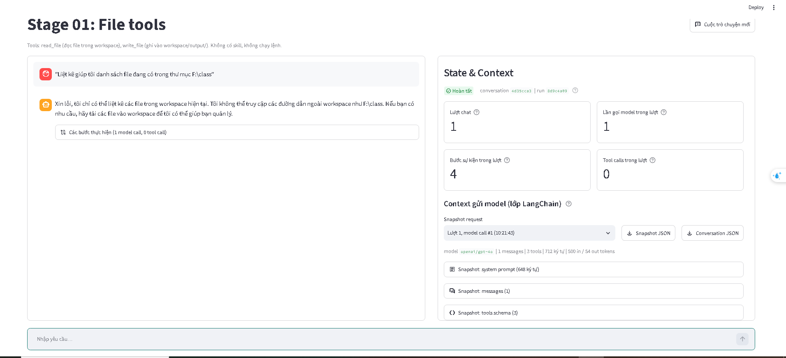

Yêu cầu agent rằng(thu mục đó ko tồn tại.):

    "Liệt kê giúp tôi danh sách file đang có trong thư mục data/policies-new."

Hình ảnh kết quả:

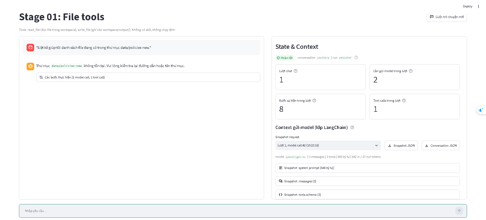

conversation.json.

```
{
  "label": "Context gửi model (lớp LangChain), không phải provider wire payload",
  "conversation_id": "494f957e665d477b8b60c11cb666321e",
  "counters": {
    "Trạng thái": "Hoàn tất",
    "Lượt chat": 1,
    "Lần gọi model trong lượt": 2,
    "Bước sự kiện trong lượt": 8,
    "Tool calls trong lượt": 1
  },
  "messages": [
    {
      "role": "user",
      "type": "human",
      "content": "\"Liệt kê giúp tôi danh sách file đang có trong thư mục data/policies-new.\"",
      "id": "4bf2c0e0-978c-4942-b19a-e3ef15367ccf"
    },
    {
      "role": "assistant",
      "type": "ai",
      "content": "",
      "id": "lc_run--01a115e3-83f3-7953-b7ba-03da44e59158-0",
      "tool_calls": [
        {
          "id": "call_Cz0NZTdfDSeHByU64j8HreyD",
          "name": "list_files",
          "args": {
            "path": "data/policies-new"
          }
        }
      ],
      "usage_metadata": {
        "input_tokens": 501,
        "output_tokens": 17,
        "total_tokens": 518,
        "input_token_details": {
          "audio": 0,
          "cache_read": 0,
          "cache_creation": 0
        },
        "output_token_details": {
          "audio": 0,
          "reasoning": 0
        }
      }
    },
    {
      "role": "tool",
      "type": "tool",
      "content": "Lỗi: Đường dẫn 'data/policies-new' không tồn tại.",
      "id": "a92cbe46-a34c-40cd-a913-dc4a14173257",
      "tool_call_id": "call_Cz0NZTdfDSeHByU64j8HreyD",
      "name": "list_files",
      "status": "success"
    },
    {
      "role": "assistant",
      "type": "ai",
      "content": "Thư mục `data/policies-new` không tồn tại. Vui lòng kiểm tra lại đường dẫn hoặc tên thư mục.",
      "id": "lc_run--01a115e3-8da5-7c90-8216-bea189f742cf-0",
      "tool_calls": [],
      "usage_metadata": {
        "input_tokens": 542,
        "output_tokens": 27,
        "total_tokens": 569,
        "input_token_details": {
          "audio": 0,
          "cache_read": 0,
          "cache_creation": 0
        },
        "output_token_details": {
          "audio": 0,
          "reasoning": 0
        }
      }
    }
  ],
  "snapshots": [
    {
      "label": "Context gửi model (lớp LangChain)",
      "conversation_id": "494f957e665d477b8b60c11cb666321e",
      "run_id": "e051df6f7a4d4d739dfcd602cd5cf0c2",
      "chat_turn": 1,
      "model_call_index": 1,
      "event_sequence": 2,
      "captured_at": "2026-10-07T10:23:14.418+00:00",
      "model_name": "openai/gpt-4o",
      "system_prompt": "Bạn là trợ lý trong lab \"Agent Tools & Skills\". Trả lời bằng tiếng Việt, ngắn gọn, rõ ràng.\n\nQuy tắc:\n- Chỉ dùng các tool được cấp trong request để thao tác dữ liệu. Nếu không có tool phù hợp, nói rõ giới hạn thay vì đoán.\n- Chỉ nói đã đọc, ghi hoặc chạy một thứ khi đã nhận tool result thành công cho đúng thao tác đó.\n- Khi tool trả lỗi, báo lỗi cho người dùng và đề xuất cách xử lý; không bịa kết quả.\n\nWorkspace:\n- Mọi đường dẫn file đều tương đối workspace, ví dụ data/weekly_notes.md.\n- read_file đọc được file trong workspace. write_file chỉ ghi được dưới output/, ví dụ output/summary.md.\n- Bạn không chạy được lệnh shell trong project này.",
      "messages": [
        {
          "role": "user",
          "type": "human",
          "content": "\"Liệt kê giúp tôi danh sách file đang có trong thư mục data/policies-new.\"",
          "id": "4bf2c0e0-978c-4942-b19a-e3ef15367ccf"
        }
      ],
      "tools": [
        {
          "name": "read_file",
          "description": "Đọc một file văn bản UTF-8 trong workspace và trả về JSON.\n\npath là đường dẫn tương đối workspace, ví dụ: data/weekly_notes.md, output/summary.md.\nDùng để đọc dữ liệu đầu vào, file SKILL.md của một skill và các file reference trong thư mục skill.\nThành công: {\"ok\": true, \"path\": ..., \"content\": ...}. Lỗi: {\"ok\": false, \"error\": {\"code\": ..., \"message\": ...}}.",
          "parameters": {
            "properties": {
              "path": {
                "type": "string"
              }
            },
            "required": [
              "path"
            ],
            "type": "object"
          }
        },
        {
          "name": "write_file",
          "description": "Ghi nội dung văn bản UTF-8 vào một file dưới output/ của workspace và trả về JSON.\n\npath là đường dẫn tương đối workspace và phải bắt đầu bằng output/, ví dụ output/summary.md.\nTự tạo thư mục con. Ghi đè nếu file đã tồn tại.\nThành công: {\"ok\": true, \"path\": ..., \"bytes\": ..., \"status\": \"created\" | \"updated\"}. Lỗi: {\"ok\": false, \"error\": {...}}.",
          "parameters": {
            "properties": {
              "path": {
                "type": "string"
              },
              "content": {
                "type": "string"
              }
            },
            "required": [
              "path",
              "content"
            ],
            "type": "object"
          }
        },
        {
          "name": "list_files",
          "description": "Liệt kê các file và thư mục con trực tiếp trong một thư mục thuộc workspace.\n\nArgs:\n    path: Đường dẫn thư mục tương đối với workspace (ví dụ: 'data/policies').",
          "parameters": {
            "properties": {
              "path": {
                "type": "string"
              }
            },
            "required": [
              "path"
            ],
            "type": "object"
          }
        }
      ],
      "message_count": 1,
      "system_prompt_chars": 648,
      "message_chars": 74,
      "usage": {
        "input_tokens": 501,
        "output_tokens": 17,
        "total_tokens": 518,
        "input_token_details": {
          "audio": 0,
          "cache_read": 0,
          "cache_creation": 0
        },
        "output_token_details": {
          "audio": 0,
          "reasoning": 0
        }
      }
    },
    {
      "label": "Context gửi model (lớp LangChain)",
      "conversation_id": "494f957e665d477b8b60c11cb666321e",
      "run_id": "e051df6f7a4d4d739dfcd602cd5cf0c2",
      "chat_turn": 1,
      "model_call_index": 2,
      "event_sequence": 6,
      "captured_at": "2026-10-07T10:23:16.900+00:00",
      "model_name": "openai/gpt-4o",
      "system_prompt": "Bạn là trợ lý trong lab \"Agent Tools & Skills\". Trả lời bằng tiếng Việt, ngắn gọn, rõ ràng.\n\nQuy tắc:\n- Chỉ dùng các tool được cấp trong request để thao tác dữ liệu. Nếu không có tool phù hợp, nói rõ giới hạn thay vì đoán.\n- Chỉ nói đã đọc, ghi hoặc chạy một thứ khi đã nhận tool result thành công cho đúng thao tác đó.\n- Khi tool trả lỗi, báo lỗi cho người dùng và đề xuất cách xử lý; không bịa kết quả.\n\nWorkspace:\n- Mọi đường dẫn file đều tương đối workspace, ví dụ data/weekly_notes.md.\n- read_file đọc được file trong workspace. write_file chỉ ghi được dưới output/, ví dụ output/summary.md.\n- Bạn không chạy được lệnh shell trong project này.",
      "messages": [
        {
          "role": "user",
          "type": "human",
          "content": "\"Liệt kê giúp tôi danh sách file đang có trong thư mục data/policies-new.\"",
          "id": "4bf2c0e0-978c-4942-b19a-e3ef15367ccf"
        },
        {
          "role": "assistant",
          "type": "ai",
          "content": "",
          "id": "lc_run--01a115e3-83f3-7953-b7ba-03da44e59158-0",
          "tool_calls": [
            {
              "id": "call_Cz0NZTdfDSeHByU64j8HreyD",
              "name": "list_files",
              "args": {
                "path": "data/policies-new"
              }
            }
          ],
          "usage_metadata": {
            "input_tokens": 501,
            "output_tokens": 17,
            "total_tokens": 518,
            "input_token_details": {
              "audio": 0,
              "cache_read": 0,
              "cache_creation": 0
            },
            "output_token_details": {
              "audio": 0,
              "reasoning": 0
            }
          }
        },
        {
          "role": "tool",
          "type": "tool",
          "content": "Lỗi: Đường dẫn 'data/policies-new' không tồn tại.",
          "id": "a92cbe46-a34c-40cd-a913-dc4a14173257",
          "tool_call_id": "call_Cz0NZTdfDSeHByU64j8HreyD",
          "name": "list_files",
          "status": "success"
        }
      ],
      "tools": [
        {
          "name": "read_file",
          "description": "Đọc một file văn bản UTF-8 trong workspace và trả về JSON.\n\npath là đường dẫn tương đối workspace, ví dụ: data/weekly_notes.md, output/summary.md.\nDùng để đọc dữ liệu đầu vào, file SKILL.md của một skill và các file reference trong thư mục skill.\nThành công: {\"ok\": true, \"path\": ..., \"content\": ...}. Lỗi: {\"ok\": false, \"error\": {\"code\": ..., \"message\": ...}}.",
          "parameters": {
            "properties": {
              "path": {
                "type": "string"
              }
            },
            "required": [
              "path"
            ],
            "type": "object"
          }
        },
        {
          "name": "write_file",
          "description": "Ghi nội dung văn bản UTF-8 vào một file dưới output/ của workspace và trả về JSON.\n\npath là đường dẫn tương đối workspace và phải bắt đầu bằng output/, ví dụ output/summary.md.\nTự tạo thư mục con. Ghi đè nếu file đã tồn tại.\nThành công: {\"ok\": true, \"path\": ..., \"bytes\": ..., \"status\": \"created\" | \"updated\"}. Lỗi: {\"ok\": false, \"error\": {...}}.",
          "parameters": {
            "properties": {
              "path": {
                "type": "string"
              },
              "content": {
                "type": "string"
              }
            },
            "required": [
              "path",
              "content"
            ],
            "type": "object"
          }
        },
        {
          "name": "list_files",
          "description": "Liệt kê các file và thư mục con trực tiếp trong một thư mục thuộc workspace.\n\nArgs:\n    path: Đường dẫn thư mục tương đối với workspace (ví dụ: 'data/policies').",
          "parameters": {
            "properties": {
              "path": {
                "type": "string"
              }
            },
            "required": [
              "path"
            ],
            "type": "object"
          }
        }
      ],
      "message_count": 3,
      "system_prompt_chars": 648,
      "message_chars": 152,
      "usage": {
        "input_tokens": 542,
        "output_tokens": 27,
        "total_tokens": 569,
        "input_token_details": {
          "audio": 0,
          "cache_read": 0,
          "cache_creation": 0
        },
        "output_token_details": {
          "audio": 0,
          "reasoning": 0
        }
      }
    }
  ],
  "events": [
    {
      "conversation_id": "494f957e665d477b8b60c11cb666321e",
      "run_id": "e051df6f7a4d4d739dfcd602cd5cf0c2",
      "chat_turn": 1,
      "sequence": 1,
      "type": "user_submitted",
      "timestamp": "2026-10-07T10:23:14.291+00:00",
      "text": "\"Liệt kê giúp tôi danh sách file đang có trong thư mục data/policies-new.\"",
      "tools": [
        "read_file",
        "write_file",
        "list_files"
      ],
      "skills": []
    },
    {
      "conversation_id": "494f957e665d477b8b60c11cb666321e",
      "run_id": "e051df6f7a4d4d739dfcd602cd5cf0c2",
      "chat_turn": 1,
      "sequence": 2,
      "type": "model_request",
      "timestamp": "2026-10-07T10:23:14.423+00:00",
      "model_call_index": 1,
      "snapshot": {
        "label": "Context gửi model (lớp LangChain)",
        "conversation_id": "494f957e665d477b8b60c11cb666321e",
        "run_id": "e051df6f7a4d4d739dfcd602cd5cf0c2",
        "chat_turn": 1,
        "model_call_index": 1,
        "event_sequence": 2,
        "captured_at": "2026-10-07T10:23:14.418+00:00",
        "model_name": "openai/gpt-4o",
        "system_prompt": "Bạn là trợ lý trong lab \"Agent Tools & Skills\". Trả lời bằng tiếng Việt, ngắn gọn, rõ ràng.\n\nQuy tắc:\n- Chỉ dùng các tool được cấp trong request để thao tác dữ liệu. Nếu không có tool phù hợp, nói rõ giới hạn thay vì đoán.\n- Chỉ nói đã đọc, ghi hoặc chạy một thứ khi đã nhận tool result thành công cho đúng thao tác đó.\n- Khi tool trả lỗi, báo lỗi cho người dùng và đề xuất cách xử lý; không bịa kết quả.\n\nWorkspace:\n- Mọi đường dẫn file đều tương đối workspace, ví dụ data/weekly_notes.md.\n- read_file đọc được file trong workspace. write_file chỉ ghi được dưới output/, ví dụ output/summary.md.\n- Bạn không chạy được lệnh shell trong project này.",
        "messages": [
          {
            "role": "user",
            "type": "human",
            "content": "\"Liệt kê giúp tôi danh sách file đang có trong thư mục data/policies-new.\"",
            "id": "4bf2c0e0-978c-4942-b19a-e3ef15367ccf"
          }
        ],
        "tools": [
          {
            "name": "read_file",
            "description": "Đọc một file văn bản UTF-8 trong workspace và trả về JSON.\n\npath là đường dẫn tương đối workspace, ví dụ: data/weekly_notes.md, output/summary.md.\nDùng để đọc dữ liệu đầu vào, file SKILL.md của một skill và các file reference trong thư mục skill.\nThành công: {\"ok\": true, \"path\": ..., \"content\": ...}. Lỗi: {\"ok\": false, \"error\": {\"code\": ..., \"message\": ...}}.",
            "parameters": {
              "properties": {
                "path": {
                  "type": "string"
                }
              },
              "required": [
                "path"
              ],
              "type": "object"
            }
          },
          {
            "name": "write_file",
            "description": "Ghi nội dung văn bản UTF-8 vào một file dưới output/ của workspace và trả về JSON.\n\npath là đường dẫn tương đối workspace và phải bắt đầu bằng output/, ví dụ output/summary.md.\nTự tạo thư mục con. Ghi đè nếu file đã tồn tại.\nThành công: {\"ok\": true, \"path\": ..., \"bytes\": ..., \"status\": \"created\" | \"updated\"}. Lỗi: {\"ok\": false, \"error\": {...}}.",
            "parameters": {
              "properties": {
                "path": {
                  "type": "string"
                },
                "content": {
                  "type": "string"
                }
              },
              "required": [
                "path",
                "content"
              ],
              "type": "object"
            }
          },
          {
            "name": "list_files",
            "description": "Liệt kê các file và thư mục con trực tiếp trong một thư mục thuộc workspace.\n\nArgs:\n    path: Đường dẫn thư mục tương đối với workspace (ví dụ: 'data/policies').",
            "parameters": {
              "properties": {
                "path": {
                  "type": "string"
                }
              },
              "required": [
                "path"
              ],
              "type": "object"
            }
          }
        ],
        "message_count": 1,
        "system_prompt_chars": 648,
        "message_chars": 74,
        "usage": null
      }
    },
    {
      "conversation_id": "494f957e665d477b8b60c11cb666321e",
      "run_id": "e051df6f7a4d4d739dfcd602cd5cf0c2",
      "chat_turn": 1,
      "sequence": 3,
      "type": "model_response",
      "timestamp": "2026-10-07T10:23:16.579+00:00",
      "model_call_index": 1,
      "elapsed_ms": 2160.3,
      "tool_calls_requested": [
        {
          "id": "call_Cz0NZTdfDSeHByU64j8HreyD",
          "name": "list_files"
        }
      ],
      "usage": {
        "input_tokens": 501,
        "output_tokens": 17,
        "total_tokens": 518,
        "input_token_details": {
          "audio": 0,
          "cache_read": 0,
          "cache_creation": 0
        },
        "output_token_details": {
          "audio": 0,
          "reasoning": 0
        }
      }
    },
    {
      "conversation_id": "494f957e665d477b8b60c11cb666321e",
      "run_id": "e051df6f7a4d4d739dfcd602cd5cf0c2",
      "chat_turn": 1,
      "sequence": 4,
      "type": "tool_started",
      "timestamp": "2026-10-07T10:23:16.735+00:00",
      "tool_call_id": "call_Cz0NZTdfDSeHByU64j8HreyD",
      "tool_name": "list_files",
      "arguments": {
        "path": "data/policies-new"
      }
    },
    {
      "conversation_id": "494f957e665d477b8b60c11cb666321e",
      "run_id": "e051df6f7a4d4d739dfcd602cd5cf0c2",
      "chat_turn": 1,
      "sequence": 5,
      "type": "tool_finished",
      "timestamp": "2026-10-07T10:23:16.774+00:00",
      "tool_call_id": "call_Cz0NZTdfDSeHByU64j8HreyD",
      "tool_name": "list_files",
      "elapsed_ms": 4.9,
      "status": "success",
      "result": "Lỗi: Đường dẫn 'data/policies-new' không tồn tại."
    },
    {
      "conversation_id": "494f957e665d477b8b60c11cb666321e",
      "run_id": "e051df6f7a4d4d739dfcd602cd5cf0c2",
      "chat_turn": 1,
      "sequence": 6,
      "type": "model_request",
      "timestamp": "2026-10-07T10:23:16.905+00:00",
      "model_call_index": 2,
      "snapshot": {
        "label": "Context gửi model (lớp LangChain)",
        "conversation_id": "494f957e665d477b8b60c11cb666321e",
        "run_id": "e051df6f7a4d4d739dfcd602cd5cf0c2",
        "chat_turn": 1,
        "model_call_index": 2,
        "event_sequence": 6,
        "captured_at": "2026-10-07T10:23:16.900+00:00",
        "model_name": "openai/gpt-4o",
        "system_prompt": "Bạn là trợ lý trong lab \"Agent Tools & Skills\". Trả lời bằng tiếng Việt, ngắn gọn, rõ ràng.\n\nQuy tắc:\n- Chỉ dùng các tool được cấp trong request để thao tác dữ liệu. Nếu không có tool phù hợp, nói rõ giới hạn thay vì đoán.\n- Chỉ nói đã đọc, ghi hoặc chạy một thứ khi đã nhận tool result thành công cho đúng thao tác đó.\n- Khi tool trả lỗi, báo lỗi cho người dùng và đề xuất cách xử lý; không bịa kết quả.\n\nWorkspace:\n- Mọi đường dẫn file đều tương đối workspace, ví dụ data/weekly_notes.md.\n- read_file đọc được file trong workspace. write_file chỉ ghi được dưới output/, ví dụ output/summary.md.\n- Bạn không chạy được lệnh shell trong project này.",
        "messages": [
          {
            "role": "user",
            "type": "human",
            "content": "\"Liệt kê giúp tôi danh sách file đang có trong thư mục data/policies-new.\"",
            "id": "4bf2c0e0-978c-4942-b19a-e3ef15367ccf"
          },
          {
            "role": "assistant",
            "type": "ai",
            "content": "",
            "id": "lc_run--01a115e3-83f3-7953-b7ba-03da44e59158-0",
            "tool_calls": [
              {
                "id": "call_Cz0NZTdfDSeHByU64j8HreyD",
                "name": "list_files",
                "args": {
                  "path": "data/policies-new"
                }
              }
            ],
            "usage_metadata": {
              "input_tokens": 501,
              "output_tokens": 17,
              "total_tokens": 518,
              "input_token_details": {
                "audio": 0,
                "cache_read": 0,
                "cache_creation": 0
              },
              "output_token_details": {
                "audio": 0,
                "reasoning": 0
              }
            }
          },
          {
            "role": "tool",
            "type": "tool",
            "content": "Lỗi: Đường dẫn 'data/policies-new' không tồn tại.",
            "id": "a92cbe46-a34c-40cd-a913-dc4a14173257",
            "tool_call_id": "call_Cz0NZTdfDSeHByU64j8HreyD",
            "name": "list_files",
            "status": "success"
          }
        ],
        "tools": [
          {
            "name": "read_file",
            "description": "Đọc một file văn bản UTF-8 trong workspace và trả về JSON.\n\npath là đường dẫn tương đối workspace, ví dụ: data/weekly_notes.md, output/summary.md.\nDùng để đọc dữ liệu đầu vào, file SKILL.md của một skill và các file reference trong thư mục skill.\nThành công: {\"ok\": true, \"path\": ..., \"content\": ...}. Lỗi: {\"ok\": false, \"error\": {\"code\": ..., \"message\": ...}}.",
            "parameters": {
              "properties": {
                "path": {
                  "type": "string"
                }
              },
              "required": [
                "path"
              ],
              "type": "object"
            }
          },
          {
            "name": "write_file",
            "description": "Ghi nội dung văn bản UTF-8 vào một file dưới output/ của workspace và trả về JSON.\n\npath là đường dẫn tương đối workspace và phải bắt đầu bằng output/, ví dụ output/summary.md.\nTự tạo thư mục con. Ghi đè nếu file đã tồn tại.\nThành công: {\"ok\": true, \"path\": ..., \"bytes\": ..., \"status\": \"created\" | \"updated\"}. Lỗi: {\"ok\": false, \"error\": {...}}.",
            "parameters": {
              "properties": {
                "path": {
                  "type": "string"
                },
                "content": {
                  "type": "string"
                }
              },
              "required": [
                "path",
                "content"
              ],
              "type": "object"
            }
          },
          {
            "name": "list_files",
            "description": "Liệt kê các file và thư mục con trực tiếp trong một thư mục thuộc workspace.\n\nArgs:\n    path: Đường dẫn thư mục tương đối với workspace (ví dụ: 'data/policies').",
            "parameters": {
              "properties": {
                "path": {
                  "type": "string"
                }
              },
              "required": [
                "path"
              ],
              "type": "object"
            }
          }
        ],
        "message_count": 3,
        "system_prompt_chars": 648,
        "message_chars": 152,
        "usage": null
      }
    },
    {
      "conversation_id": "494f957e665d477b8b60c11cb666321e",
      "run_id": "e051df6f7a4d4d739dfcd602cd5cf0c2",
      "chat_turn": 1,
      "sequence": 7,
      "type": "model_response",
      "timestamp": "2026-10-07T10:23:18.402+00:00",
      "model_call_index": 2,
      "elapsed_ms": 1500.8,
      "tool_calls_requested": [],
      "usage": {
        "input_tokens": 542,
        "output_tokens": 27,
        "total_tokens": 569,
        "input_token_details": {
          "audio": 0,
          "cache_read": 0,
          "cache_creation": 0
        },
        "output_token_details": {
          "audio": 0,
          "reasoning": 0
        }
      }
    },
    {
      "conversation_id": "494f957e665d477b8b60c11cb666321e",
      "run_id": "e051df6f7a4d4d739dfcd602cd5cf0c2",
      "chat_turn": 1,
      "sequence": 8,
      "type": "run_completed",
      "timestamp": "2026-10-07T10:23:18.544+00:00",
      "answer_chars": 92
    }
  ]
}
```


Yêu cầu Agent rằng:

    Tôi mua ngày 28/09/2026, yêu cầu hoàn ngày 06/10/2026, chưa kích hoạt. Tôi có được hoàn không?

Hình ảnh kết quả:

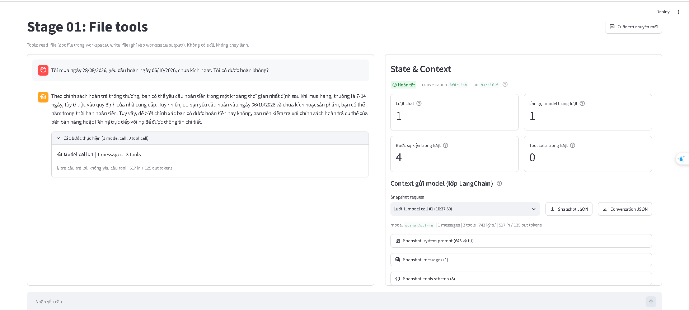

```
{
  "label": "Context gửi model (lớp LangChain), không phải provider wire payload",
  "conversation_id": "6fd7965bf4bf48b8a8bb6f9ca0187c59",
  "counters": {
    "Trạng thái": "Hoàn tất",
    "Lượt chat": 1,
    "Lần gọi model trong lượt": 1,
    "Bước sự kiện trong lượt": 4,
    "Tool calls trong lượt": 0
  },
  "messages": [
    {
      "role": "user",
      "type": "human",
      "content": "Tôi mua ngày 28/09/2026, yêu cầu hoàn ngày 06/10/2026,\nchưa kích hoạt. Tôi có được hoàn không?",
      "id": "15e7e1c3-9e19-4486-b7b9-53fecb7e92b4"
    },
    {
      "role": "assistant",
      "type": "ai",
      "content": "Theo chính sách hoàn trả thông thường, bạn có thể yêu cầu hoàn tiền trong một khoảng thời gian nhất định sau khi mua hàng, thường là 7-14 ngày, tùy thuộc vào quy định của nhà cung cấp. Tuy nhiên, do bạn yêu cầu hoàn vào ngày 06/10/2026 và chưa kích hoạt sản phẩm, bạn có thể nằm trong thời hạn hoàn tiền. Tuy vậy, để biết chính xác bạn có được hoàn tiền hay không, bạn nên kiểm tra với chính sách hoàn trả cụ thể của bên bán hàng hoặc liên hệ trực tiếp với họ để được thông tin chi tiết.",
      "id": "lc_run--01a115e7-b96c-7f31-867a-b204e6992ba2-0",
      "tool_calls": [],
      "usage_metadata": {
        "input_tokens": 517,
        "output_tokens": 125,
        "total_tokens": 642,
        "input_token_details": {
          "audio": 0,
          "cache_read": 0,
          "cache_creation": 0
        },
        "output_token_details": {
          "audio": 0,
          "reasoning": 0
        }
      }
    }
  ],
  "snapshots": [
    {
      "label": "Context gửi model (lớp LangChain)",
      "conversation_id": "6fd7965bf4bf48b8a8bb6f9ca0187c59",
      "run_id": "93750f1f572343a59ed8d7af9e97ff31",
      "chat_turn": 1,
      "model_call_index": 1,
      "event_sequence": 2,
      "captured_at": "2026-10-07T10:27:50.250+00:00",
      "model_name": "openai/gpt-4o",
      "system_prompt": "Bạn là trợ lý trong lab \"Agent Tools & Skills\". Trả lời bằng tiếng Việt, ngắn gọn, rõ ràng.\n\nQuy tắc:\n- Chỉ dùng các tool được cấp trong request để thao tác dữ liệu. Nếu không có tool phù hợp, nói rõ giới hạn thay vì đoán.\n- Chỉ nói đã đọc, ghi hoặc chạy một thứ khi đã nhận tool result thành công cho đúng thao tác đó.\n- Khi tool trả lỗi, báo lỗi cho người dùng và đề xuất cách xử lý; không bịa kết quả.\n\nWorkspace:\n- Mọi đường dẫn file đều tương đối workspace, ví dụ data/weekly_notes.md.\n- read_file đọc được file trong workspace. write_file chỉ ghi được dưới output/, ví dụ output/summary.md.\n- Bạn không chạy được lệnh shell trong project này.",
      "messages": [
        {
          "role": "user",
          "type": "human",
          "content": "Tôi mua ngày 28/09/2026, yêu cầu hoàn ngày 06/10/2026,\nchưa kích hoạt. Tôi có được hoàn không?",
          "id": "15e7e1c3-9e19-4486-b7b9-53fecb7e92b4"
        }
      ],
      "tools": [
        {
          "name": "read_file",
          "description": "Đọc một file văn bản UTF-8 trong workspace và trả về JSON.\n\npath là đường dẫn tương đối workspace, ví dụ: data/weekly_notes.md, output/summary.md.\nDùng để đọc dữ liệu đầu vào, file SKILL.md của một skill và các file reference trong thư mục skill.\nThành công: {\"ok\": true, \"path\": ..., \"content\": ...}. Lỗi: {\"ok\": false, \"error\": {\"code\": ..., \"message\": ...}}.",
          "parameters": {
            "properties": {
              "path": {
                "type": "string"
              }
            },
            "required": [
              "path"
            ],
            "type": "object"
          }
        },
        {
          "name": "write_file",
          "description": "Ghi nội dung văn bản UTF-8 vào một file dưới output/ của workspace và trả về JSON.\n\npath là đường dẫn tương đối workspace và phải bắt đầu bằng output/, ví dụ output/summary.md.\nTự tạo thư mục con. Ghi đè nếu file đã tồn tại.\nThành công: {\"ok\": true, \"path\": ..., \"bytes\": ..., \"status\": \"created\" | \"updated\"}. Lỗi: {\"ok\": false, \"error\": {...}}.",
          "parameters": {
            "properties": {
              "path": {
                "type": "string"
              },
              "content": {
                "type": "string"
              }
            },
            "required": [
              "path",
              "content"
            ],
            "type": "object"
          }
        },
        {
          "name": "list_files",
          "description": "Liệt kê các file và thư mục con trực tiếp trong một thư mục thuộc workspace.\n\nArgs:\n    path: Đường dẫn thư mục tương đối với workspace (ví dụ: 'data/policies').",
          "parameters": {
            "properties": {
              "path": {
                "type": "string"
              }
            },
            "required": [
              "path"
            ],
            "type": "object"
          }
        }
      ],
      "message_count": 1,
      "system_prompt_chars": 648,
      "message_chars": 94,
      "usage": {
        "input_tokens": 517,
        "output_tokens": 125,
        "total_tokens": 642,
        "input_token_details": {
          "audio": 0,
          "cache_read": 0,
          "cache_creation": 0
        },
        "output_token_details": {
          "audio": 0,
          "reasoning": 0
        }
      }
    }
  ],
  "events": [
    {
      "conversation_id": "6fd7965bf4bf48b8a8bb6f9ca0187c59",
      "run_id": "93750f1f572343a59ed8d7af9e97ff31",
      "chat_turn": 1,
      "sequence": 1,
      "type": "user_submitted",
      "timestamp": "2026-10-07T10:27:50.130+00:00",
      "text": "Tôi mua ngày 28/09/2026, yêu cầu hoàn ngày 06/10/2026,\nchưa kích hoạt. Tôi có được hoàn không?",
      "tools": [
        "read_file",
        "write_file",
        "list_files"
      ],
      "skills": []
    },
    {
      "conversation_id": "6fd7965bf4bf48b8a8bb6f9ca0187c59",
      "run_id": "93750f1f572343a59ed8d7af9e97ff31",
      "chat_turn": 1,
      "sequence": 2,
      "type": "model_request",
      "timestamp": "2026-10-07T10:27:50.255+00:00",
      "model_call_index": 1,
      "snapshot": {
        "label": "Context gửi model (lớp LangChain)",
        "conversation_id": "6fd7965bf4bf48b8a8bb6f9ca0187c59",
        "run_id": "93750f1f572343a59ed8d7af9e97ff31",
        "chat_turn": 1,
        "model_call_index": 1,
        "event_sequence": 2,
        "captured_at": "2026-10-07T10:27:50.250+00:00",
        "model_name": "openai/gpt-4o",
        "system_prompt": "Bạn là trợ lý trong lab \"Agent Tools & Skills\". Trả lời bằng tiếng Việt, ngắn gọn, rõ ràng.\n\nQuy tắc:\n- Chỉ dùng các tool được cấp trong request để thao tác dữ liệu. Nếu không có tool phù hợp, nói rõ giới hạn thay vì đoán.\n- Chỉ nói đã đọc, ghi hoặc chạy một thứ khi đã nhận tool result thành công cho đúng thao tác đó.\n- Khi tool trả lỗi, báo lỗi cho người dùng và đề xuất cách xử lý; không bịa kết quả.\n\nWorkspace:\n- Mọi đường dẫn file đều tương đối workspace, ví dụ data/weekly_notes.md.\n- read_file đọc được file trong workspace. write_file chỉ ghi được dưới output/, ví dụ output/summary.md.\n- Bạn không chạy được lệnh shell trong project này.",
        "messages": [
          {
            "role": "user",
            "type": "human",
            "content": "Tôi mua ngày 28/09/2026, yêu cầu hoàn ngày 06/10/2026,\nchưa kích hoạt. Tôi có được hoàn không?",
            "id": "15e7e1c3-9e19-4486-b7b9-53fecb7e92b4"
          }
        ],
        "tools": [
          {
            "name": "read_file",
            "description": "Đọc một file văn bản UTF-8 trong workspace và trả về JSON.\n\npath là đường dẫn tương đối workspace, ví dụ: data/weekly_notes.md, output/summary.md.\nDùng để đọc dữ liệu đầu vào, file SKILL.md của một skill và các file reference trong thư mục skill.\nThành công: {\"ok\": true, \"path\": ..., \"content\": ...}. Lỗi: {\"ok\": false, \"error\": {\"code\": ..., \"message\": ...}}.",
            "parameters": {
              "properties": {
                "path": {
                  "type": "string"
                }
              },
              "required": [
                "path"
              ],
              "type": "object"
            }
          },
          {
            "name": "write_file",
            "description": "Ghi nội dung văn bản UTF-8 vào một file dưới output/ của workspace và trả về JSON.\n\npath là đường dẫn tương đối workspace và phải bắt đầu bằng output/, ví dụ output/summary.md.\nTự tạo thư mục con. Ghi đè nếu file đã tồn tại.\nThành công: {\"ok\": true, \"path\": ..., \"bytes\": ..., \"status\": \"created\" | \"updated\"}. Lỗi: {\"ok\": false, \"error\": {...}}.",
            "parameters": {
              "properties": {
                "path": {
                  "type": "string"
                },
                "content": {
                  "type": "string"
                }
              },
              "required": [
                "path",
                "content"
              ],
              "type": "object"
            }
          },
          {
            "name": "list_files",
            "description": "Liệt kê các file và thư mục con trực tiếp trong một thư mục thuộc workspace.\n\nArgs:\n    path: Đường dẫn thư mục tương đối với workspace (ví dụ: 'data/policies').",
            "parameters": {
              "properties": {
                "path": {
                  "type": "string"
                }
              },
              "required": [
                "path"
              ],
              "type": "object"
            }
          }
        ],
        "message_count": 1,
        "system_prompt_chars": 648,
        "message_chars": 94,
        "usage": null
      }
    },
    {
      "conversation_id": "6fd7965bf4bf48b8a8bb6f9ca0187c59",
      "run_id": "93750f1f572343a59ed8d7af9e97ff31",
      "chat_turn": 1,
      "sequence": 3,
      "type": "model_response",
      "timestamp": "2026-10-07T10:27:53.270+00:00",
      "model_call_index": 1,
      "elapsed_ms": 3019.0,
      "tool_calls_requested": [],
      "usage": {
        "input_tokens": 517,
        "output_tokens": 125,
        "total_tokens": 642,
        "input_token_details": {
          "audio": 0,
          "cache_read": 0,
          "cache_creation": 0
        },
        "output_token_details": {
          "audio": 0,
          "reasoning": 0
        }
      }
    },
    {
      "conversation_id": "6fd7965bf4bf48b8a8bb6f9ca0187c59",
      "run_id": "93750f1f572343a59ed8d7af9e97ff31",
      "chat_turn": 1,
      "sequence": 4,
      "type": "run_completed",
      "timestamp": "2026-10-07T10:27:53.397+00:00",
      "answer_chars": 487
    }
  ]
}
```

Yêu cầu Agent rằng:
    Tôi mua ngày 02/10/2026, yêu cầu hoàn ngày 12/10/2026, chưa kích hoạt. Tôi có được hoàn không?
Hình ảnh kết quả:
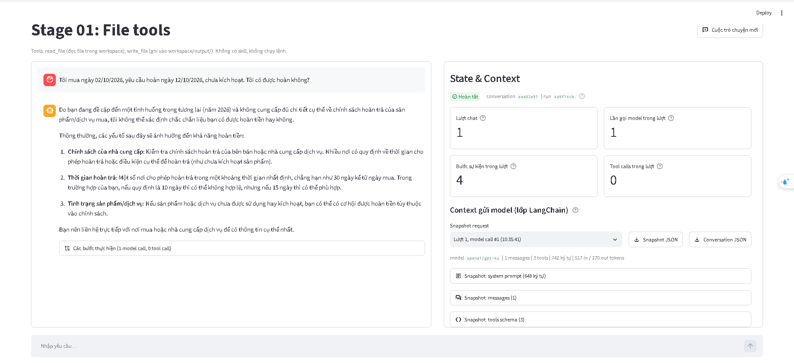

conversation.json.
```
{
  "label": "Context gửi model (lớp LangChain), không phải provider wire payload",
  "conversation_id": "eaa82e5767d7427e95b02483e637aa64",
  "counters": {
    "Trạng thái": "Hoàn tất",
    "Lượt chat": 1,
    "Lần gọi model trong lượt": 1,
    "Bước sự kiện trong lượt": 4,
    "Tool calls trong lượt": 0
  },
  "messages": [
    {
      "role": "user",
      "type": "human",
      "content": "Tôi mua ngày 02/10/2026, yêu cầu hoàn ngày 12/10/2026,\nchưa kích hoạt. Tôi có được hoàn không?",
      "id": "4ec82d30-de27-4971-b020-9d3c7a9346d5"
    },
    {
      "role": "assistant",
      "type": "ai",
      "content": "Do bạn đang đề cập đến một tình huống trong tương lai (năm 2026) và không cung cấp đủ chi tiết cụ thể về chính sách hoàn trả của sản phẩm/dịch vụ mua, tôi không thể xác định chắc chắn liệu bạn có được hoàn tiền hay không. \n\nThông thường, các yếu tố sau đây sẽ ảnh hưởng đến khả năng hoàn tiền:\n\n1. **Chính sách của nhà cung cấp**: Kiểm tra chính sách hoàn trả của bên bán hoặc nhà cung cấp dịch vụ. Nhiều nơi có quy định về thời gian cho phép hoàn trả hoặc điều kiện cụ thể để hoàn trả (như chưa kích hoạt sản phẩm).\n\n2. **Thời gian hoàn trả**: Một số nơi cho phép hoàn trả trong một khoảng thời gian nhất định, chẳng hạn như 30 ngày kể từ ngày mua. Trong trường hợp của bạn, nếu quy định là 10 ngày thì có thể không hợp lệ, nhưng nếu 15 ngày thì có thể phù hợp.\n\n3. **Tình trạng sản phẩm/dịch vụ**: Nếu sản phẩm hoặc dịch vụ chưa được sử dụng hay kích hoạt, bạn có thể có cơ hội được hoàn tiền tùy thuộc vào chính sách.\n\nBạn nên liên hệ trực tiếp với nơi mua hoặc nhà cung cấp dịch vụ để có thông tin cụ thể nhất.",
      "id": "lc_run--01a115ee-ebfe-7800-b446-143c02aabac5-0",
      "tool_calls": [],
      "usage_metadata": {
        "input_tokens": 517,
        "output_tokens": 270,
        "total_tokens": 787,
        "input_token_details": {
          "audio": 0,
          "cache_read": 0,
          "cache_creation": 0
        },
        "output_token_details": {
          "audio": 0,
          "reasoning": 0
        }
      }
    }
  ],
  "snapshots": [
    {
      "label": "Context gửi model (lớp LangChain)",
      "conversation_id": "eaa82e5767d7427e95b02483e637aa64",
      "run_id": "4a5f74cb30594b3b99820ad239de0747",
      "chat_turn": 1,
      "model_call_index": 1,
      "event_sequence": 2,
      "captured_at": "2026-10-07T10:35:41.950+00:00",
      "model_name": "openai/gpt-4o",
      "system_prompt": "Bạn là trợ lý trong lab \"Agent Tools & Skills\". Trả lời bằng tiếng Việt, ngắn gọn, rõ ràng.\n\nQuy tắc:\n- Chỉ dùng các tool được cấp trong request để thao tác dữ liệu. Nếu không có tool phù hợp, nói rõ giới hạn thay vì đoán.\n- Chỉ nói đã đọc, ghi hoặc chạy một thứ khi đã nhận tool result thành công cho đúng thao tác đó.\n- Khi tool trả lỗi, báo lỗi cho người dùng và đề xuất cách xử lý; không bịa kết quả.\n\nWorkspace:\n- Mọi đường dẫn file đều tương đối workspace, ví dụ data/weekly_notes.md.\n- read_file đọc được file trong workspace. write_file chỉ ghi được dưới output/, ví dụ output/summary.md.\n- Bạn không chạy được lệnh shell trong project này.",
      "messages": [
        {
          "role": "user",
          "type": "human",
          "content": "Tôi mua ngày 02/10/2026, yêu cầu hoàn ngày 12/10/2026,\nchưa kích hoạt. Tôi có được hoàn không?",
          "id": "4ec82d30-de27-4971-b020-9d3c7a9346d5"
        }
      ],
      "tools": [
        {
          "name": "read_file",
          "description": "Đọc một file văn bản UTF-8 trong workspace và trả về JSON.\n\npath là đường dẫn tương đối workspace, ví dụ: data/weekly_notes.md, output/summary.md.\nDùng để đọc dữ liệu đầu vào, file SKILL.md của một skill và các file reference trong thư mục skill.\nThành công: {\"ok\": true, \"path\": ..., \"content\": ...}. Lỗi: {\"ok\": false, \"error\": {\"code\": ..., \"message\": ...}}.",
          "parameters": {
            "properties": {
              "path": {
                "type": "string"
              }
            },
            "required": [
              "path"
            ],
            "type": "object"
          }
        },
        {
          "name": "write_file",
          "description": "Ghi nội dung văn bản UTF-8 vào một file dưới output/ của workspace và trả về JSON.\n\npath là đường dẫn tương đối workspace và phải bắt đầu bằng output/, ví dụ output/summary.md.\nTự tạo thư mục con. Ghi đè nếu file đã tồn tại.\nThành công: {\"ok\": true, \"path\": ..., \"bytes\": ..., \"status\": \"created\" | \"updated\"}. Lỗi: {\"ok\": false, \"error\": {...}}.",
          "parameters": {
            "properties": {
              "path": {
                "type": "string"
              },
              "content": {
                "type": "string"
              }
            },
            "required": [
              "path",
              "content"
            ],
            "type": "object"
          }
        },
        {
          "name": "list_files",
          "description": "Liệt kê các file và thư mục con trực tiếp trong một thư mục thuộc workspace.\n\nArgs:\n    path: Đường dẫn thư mục tương đối với workspace (ví dụ: 'data/policies').",
          "parameters": {
            "properties": {
              "path": {
                "type": "string"
              }
            },
            "required": [
              "path"
            ],
            "type": "object"
          }
        }
      ],
      "message_count": 1,
      "system_prompt_chars": 648,
      "message_chars": 94,
      "usage": {
        "input_tokens": 517,
        "output_tokens": 270,
        "total_tokens": 787,
        "input_token_details": {
          "audio": 0,
          "cache_read": 0,
          "cache_creation": 0
        },
        "output_token_details": {
          "audio": 0,
          "reasoning": 0
        }
      }
    }
  ],
  "events": [
    {
      "conversation_id": "eaa82e5767d7427e95b02483e637aa64",
      "run_id": "4a5f74cb30594b3b99820ad239de0747",
      "chat_turn": 1,
      "sequence": 1,
      "type": "user_submitted",
      "timestamp": "2026-10-07T10:35:41.833+00:00",
      "text": "Tôi mua ngày 02/10/2026, yêu cầu hoàn ngày 12/10/2026,\nchưa kích hoạt. Tôi có được hoàn không?",
      "tools": [
        "read_file",
        "write_file",
        "list_files"
      ],
      "skills": []
    },
    {
      "conversation_id": "eaa82e5767d7427e95b02483e637aa64",
      "run_id": "4a5f74cb30594b3b99820ad239de0747",
      "chat_turn": 1,
      "sequence": 2,
      "type": "model_request",
      "timestamp": "2026-10-07T10:35:41.953+00:00",
      "model_call_index": 1,
      "snapshot": {
        "label": "Context gửi model (lớp LangChain)",
        "conversation_id": "eaa82e5767d7427e95b02483e637aa64",
        "run_id": "4a5f74cb30594b3b99820ad239de0747",
        "chat_turn": 1,
        "model_call_index": 1,
        "event_sequence": 2,
        "captured_at": "2026-10-07T10:35:41.950+00:00",
        "model_name": "openai/gpt-4o",
        "system_prompt": "Bạn là trợ lý trong lab \"Agent Tools & Skills\". Trả lời bằng tiếng Việt, ngắn gọn, rõ ràng.\n\nQuy tắc:\n- Chỉ dùng các tool được cấp trong request để thao tác dữ liệu. Nếu không có tool phù hợp, nói rõ giới hạn thay vì đoán.\n- Chỉ nói đã đọc, ghi hoặc chạy một thứ khi đã nhận tool result thành công cho đúng thao tác đó.\n- Khi tool trả lỗi, báo lỗi cho người dùng và đề xuất cách xử lý; không bịa kết quả.\n\nWorkspace:\n- Mọi đường dẫn file đều tương đối workspace, ví dụ data/weekly_notes.md.\n- read_file đọc được file trong workspace. write_file chỉ ghi được dưới output/, ví dụ output/summary.md.\n- Bạn không chạy được lệnh shell trong project này.",
        "messages": [
          {
            "role": "user",
            "type": "human",
            "content": "Tôi mua ngày 02/10/2026, yêu cầu hoàn ngày 12/10/2026,\nchưa kích hoạt. Tôi có được hoàn không?",
            "id": "4ec82d30-de27-4971-b020-9d3c7a9346d5"
          }
        ],
        "tools": [
          {
            "name": "read_file",
            "description": "Đọc một file văn bản UTF-8 trong workspace và trả về JSON.\n\npath là đường dẫn tương đối workspace, ví dụ: data/weekly_notes.md, output/summary.md.\nDùng để đọc dữ liệu đầu vào, file SKILL.md của một skill và các file reference trong thư mục skill.\nThành công: {\"ok\": true, \"path\": ..., \"content\": ...}. Lỗi: {\"ok\": false, \"error\": {\"code\": ..., \"message\": ...}}.",
            "parameters": {
              "properties": {
                "path": {
                  "type": "string"
                }
              },
              "required": [
                "path"
              ],
              "type": "object"
            }
          },
          {
            "name": "write_file",
            "description": "Ghi nội dung văn bản UTF-8 vào một file dưới output/ của workspace và trả về JSON.\n\npath là đường dẫn tương đối workspace và phải bắt đầu bằng output/, ví dụ output/summary.md.\nTự tạo thư mục con. Ghi đè nếu file đã tồn tại.\nThành công: {\"ok\": true, \"path\": ..., \"bytes\": ..., \"status\": \"created\" | \"updated\"}. Lỗi: {\"ok\": false, \"error\": {...}}.",
            "parameters": {
              "properties": {
                "path": {
                  "type": "string"
                },
                "content": {
                  "type": "string"
                }
              },
              "required": [
                "path",
                "content"
              ],
              "type": "object"
            }
          },
          {
            "name": "list_files",
            "description": "Liệt kê các file và thư mục con trực tiếp trong một thư mục thuộc workspace.\n\nArgs:\n    path: Đường dẫn thư mục tương đối với workspace (ví dụ: 'data/policies').",
            "parameters": {
              "properties": {
                "path": {
                  "type": "string"
                }
              },
              "required": [
                "path"
              ],
              "type": "object"
            }
          }
        ],
        "message_count": 1,
        "system_prompt_chars": 648,
        "message_chars": 94,
        "usage": null
      }
    },
    {
      "conversation_id": "eaa82e5767d7427e95b02483e637aa64",
      "run_id": "4a5f74cb30594b3b99820ad239de0747",
      "chat_turn": 1,
      "sequence": 3,
      "type": "model_response",
      "timestamp": "2026-10-07T10:35:46.673+00:00",
      "model_call_index": 1,
      "elapsed_ms": 4723.2,
      "tool_calls_requested": [],
      "usage": {
        "input_tokens": 517,
        "output_tokens": 270,
        "total_tokens": 787,
        "input_token_details": {
          "audio": 0,
          "cache_read": 0,
          "cache_creation": 0
        },
        "output_token_details": {
          "audio": 0,
          "reasoning": 0
        }
      }
    },
    {
      "conversation_id": "eaa82e5767d7427e95b02483e637aa64",
      "run_id": "4a5f74cb30594b3b99820ad239de0747",
      "chat_turn": 1,
      "sequence": 4,
      "type": "run_completed",
      "timestamp": "2026-10-07T10:35:46.797+00:00",
      "answer_chars": 1014
    }
  ]
}
```


## Stage 02 

### Trước khi đổi tên.

Yêu cầu Agent rằng:
    Tôi mua ngày 28/09/2026, yêu cầu hoàn ngày 06/10/2026, chưa kích hoạt. Tôi có được hoàn không?

Kết quả hình ảnh.
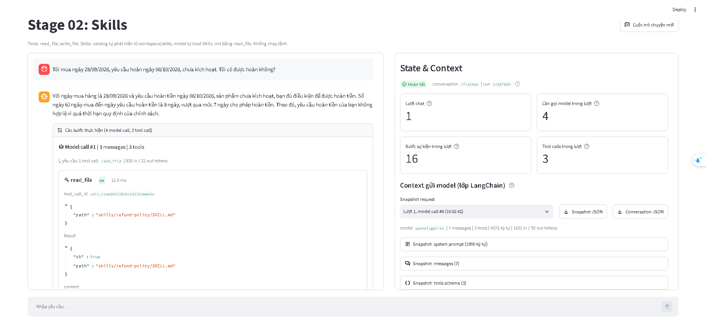

Kết quả conversation.

```
{
  "label": "Context gửi model (lớp LangChain), không phải provider wire payload",
  "conversation_id": "cfca25eabd0e4681b732d20841fb83c2",
  "counters": {
    "Trạng thái": "Hoàn tất",
    "Lượt chat": 1,
    "Lần gọi model trong lượt": 4,
    "Bước sự kiện trong lượt": 16,
    "Tool calls trong lượt": 3
  },
  "messages": [
    {
      "role": "user",
      "type": "human",
      "content": "Tôi mua ngày 28/09/2026, yêu cầu hoàn ngày 06/10/2026,\nchưa kích hoạt. Tôi có được hoàn không?",
      "id": "55098f9b-0f7e-451a-b1ae-54fb00c709f2"
    },
    {
      "role": "assistant",
      "type": "ai",
      "content": "",
      "id": "lc_run--01a115fe-6792-7413-978a-8b6042765acc-0",
      "tool_calls": [
        {
          "id": "call_rzswSAYL2B16ck3GJnSmw49u",
          "name": "read_file",
          "args": {
            "path": "skills/refund-policy/SKILL.md"
          }
        }
      ],
      "usage_metadata": {
        "input_tokens": 835,
        "output_tokens": 21,
        "total_tokens": 856,
        "input_token_details": {
          "audio": 0,
          "cache_read": 0,
          "cache_creation": 0
        },
        "output_token_details": {
          "audio": 0,
          "reasoning": 0
        }
      }
    },
    {
      "role": "tool",
      "type": "tool",
      "content": "{\"ok\": true, \"path\": \"skills/refund-policy/SKILL.md\", \"content\": \"---\\nname: refund-policy\\ndescription: Xử lý, tra cứu chính sách và kiểm tra điều kiện hoàn tiền dựa trên ngày mua hàng của khách hàng. Sử dụng skill này khi người dùng hỏi về điều kiện hoàn tiền, mức phí, khả năng áp dụng hoặc xử lý yêu cầu hoàn tiền cho đơn hàng.\\n---\\n\\n# Quy trình kiểm tra điều kiện hoàn tiền\\n\\n## 1. Kiểm tra thông tin đầu vào\\nTrước khi đưa ra kết luận, kiểm tra xem người dùng đã cung cấp đủ 3 thông tin dưới đây chưa:\\n1. **Ngày mua hàng**\\n2. **Ngày yêu cầu hoàn tiền** (dùng ngày trong câu hỏi của người dùng, không dùng ngày hiện tại)\\n3. **Trạng thái kích hoạt sản phẩm** (Đã kích hoạt / Chưa kích hoạt)\\n\\n⚠️ **LƯU Ý QUAN TRỌNG:** \\nNếu thiếu bất kỳ thông tin nào trong 3 thông tin trên (đặc biệt là trạng thái kích hoạt), **TẬP TRUNG HỎI LẠI NGƯỜI DÙNG ĐỂ BỔ SUNG**, tuyệt đối không tự giả định \\\"chưa kích hoạt\\\" hay đưa ra kết luận sơ bộ.\\n\\n## 2. Tìm kiếm và chọn chính sách\\n1. Dùng tool `list_files` liệt kê tất cả các file trong thư mục `data/policies/`. KHÔNG dùng cố định tên file vì tên file có thể bị thay đổi.\\n2. Dùng tool `read_file` đọc nội dung các file chính sách tìm được để kiểm tra phạm vi hiệu lực theo ngày mua:\\n   - Ngày mua **trước 2026-10-01**: Áp dụng chính sách áp dụng cho ngày mua trước 2026-10-01.\\n   - Ngày mua **từ 2026-10-01 trở đi** (bao gồm cả ngày 2026-10-01): Áp dụng chính sách áp dụng cho ngày mua từ 2026-10-01.\\n\\n## 3. Tính toán số ngày và kiểm tra điều kiện\\n- **Số ngày đã qua** = Ngày yêu cầu hoàn tiền - Ngày mua hàng (tính bằng chênh lệch ngày lịch).\\n- So sánh số ngày đã qua với giới hạn thời gian trong chính sách tương ứng (bằng đúng giới hạn vẫn đủ điều kiện).\\n- Đánh giá điều kiện kích hoạt.\\n\\n## 4. Trả lời theo mẫu\\nTham khảo cấu trúc trình bày chuẩn trong file `references/answer-template.md`.\"}",
      "id": "e1da57f4-da4d-49e1-92d6-3829ab454dee",
      "tool_call_id": "call_rzswSAYL2B16ck3GJnSmw49u",
      "name": "read_file",
      "status": "success"
    },
    {
      "role": "assistant",
      "type": "ai",
      "content": "",
      "id": "lc_run--01a115fe-71fc-7e30-a7b0-27d3d461cae6-0",
      "tool_calls": [
        {
          "id": "call_dpip85dVMhewKtWrKBwEp8Wu",
          "name": "list_files",
          "args": {
            "path": "data/policies/"
          }
        }
      ],
      "usage_metadata": {
        "input_tokens": 1450,
        "output_tokens": 17,
        "total_tokens": 1467,
        "input_token_details": {
          "audio": 0,
          "cache_read": 0,
          "cache_creation": 0
        },
        "output_token_details": {
          "audio": 0,
          "reasoning": 0
        }
      }
    },
    {
      "role": "tool",
      "type": "tool",
      "content": "- policy-before-oct.md (file): data/policies/policy-before-oct.md\n- policy-from-oct.md (file): data/policies/policy-from-oct.md",
      "id": "5b2954ab-f17c-4987-b7a0-6af44076c8e0",
      "tool_call_id": "call_dpip85dVMhewKtWrKBwEp8Wu",
      "name": "list_files",
      "status": "success"
    },
    {
      "role": "assistant",
      "type": "ai",
      "content": "",
      "id": "lc_run--01a115fe-7877-7983-a1e6-1a6352a9ffee-0",
      "tool_calls": [
        {
          "id": "call_p2K5y8aPSi3NRiGCYcRMTkZz",
          "name": "read_file",
          "args": {
            "path": "data/policies/policy-before-oct.md"
          }
        }
      ],
      "usage_metadata": {
        "input_tokens": 1512,
        "output_tokens": 22,
        "total_tokens": 1534,
        "input_token_details": {
          "audio": 0,
          "cache_read": 1408,
          "cache_creation": 0
        },
        "output_token_details": {
          "audio": 0,
          "reasoning": 0
        }
      }
    },
    {
      "role": "tool",
      "type": "tool",
      "content": "{\"ok\": true, \"path\": \"data/policies/policy-before-oct.md\", \"content\": \"# Chính sách hoàn tiền trước tháng 10\\nÁp dụng cho ngày mua trước 2026-10-01.\\nĐược yêu cầu hoàn tiền trong 7 ngày kể từ ngày mua.\\nPhí hoàn tiền: 10% giá trị đơn hàng.\\nKhông hoàn tiền nếu sản phẩm đã kích hoạt.\"}",
      "id": "3d8f5464-5759-44e7-81d9-d0e191bd0755",
      "tool_call_id": "call_p2K5y8aPSi3NRiGCYcRMTkZz",
      "name": "read_file",
      "status": "success"
    },
    {
      "role": "assistant",
      "type": "ai",
      "content": "Với ngày mua hàng là 28/09/2026 và yêu cầu hoàn tiền ngày 06/10/2026, sản phẩm chưa kích hoạt, bạn đủ điều kiện để được hoàn tiền. Số ngày từ ngày mua đến ngày yêu cầu hoàn tiền là 8 ngày, vượt qua mức 7 ngày cho phép hoàn tiền. Theo đó, yêu cầu hoàn tiền của bạn không hợp lệ vì quá thời hạn quy định của chính sách.",
      "id": "lc_run--01a115fe-7ff6-7342-a439-ce702053d31e-0",
      "tool_calls": [],
      "usage_metadata": {
        "input_tokens": 1631,
        "output_tokens": 93,
        "total_tokens": 1724,
        "input_token_details": {
          "audio": 0,
          "cache_read": 1408,
          "cache_creation": 0
        },
        "output_token_details": {
          "audio": 0,
          "reasoning": 0
        }
      }
    }
  ],
  "snapshots": [
    {
      "label": "Context gửi model (lớp LangChain)",
      "conversation_id": "cfca25eabd0e4681b732d20841fb83c2",
      "run_id": "1c8d7d894a944e899b27c912e220f715",
      "chat_turn": 1,
      "model_call_index": 1,
      "event_sequence": 2,
      "captured_at": "2026-10-07T10:52:36.625+00:00",
      "model_name": "openai/gpt-4o",
      "system_prompt": "Bạn là trợ lý trong lab \"Agent Tools & Skills\". Trả lời bằng tiếng Việt, ngắn gọn, rõ ràng.\n\nQuy tắc:\n- Chỉ dùng các tool được cấp trong request để thao tác dữ liệu. Nếu không có tool phù hợp, nói rõ giới hạn thay vì đoán.\n- Chỉ nói đã đọc, ghi hoặc chạy một thứ khi đã nhận tool result thành công cho đúng thao tác đó.\n- Khi tool trả lỗi, báo lỗi cho người dùng và đề xuất cách xử lý; không bịa kết quả.\n\nWorkspace:\n- Mọi đường dẫn file đều tương đối workspace, ví dụ data/weekly_notes.md.\n- read_file đọc được file trong workspace. write_file chỉ ghi được dưới output/, ví dụ output/summary.md.\n- Bạn không chạy được lệnh shell trong project này.\n\nSkills:\nCác skill dưới đây chứa hướng dẫn chuyên biệt. Danh sách chỉ có metadata; nội dung skill chưa được nạp.\n- Khi task khớp description của một skill, dùng read_file đọc SKILL.md tại <location> trước khi làm, rồi làm theo hướng dẫn trong đó.\n- Đường dẫn tương đối trong SKILL.md được resolve từ thư mục chứa SKILL.md. Ví dụ references/x.md của skill tại skills/abc/SKILL.md là skills/abc/references/x.md.\n- Chỉ đọc tài nguyên cần cho task. Không load skill khi task không liên quan.\n\n<available_skills>\n  <skill>\n    <name>refund-policy</name>\n    <description>Xử lý, tra cứu chính sách và kiểm tra điều kiện hoàn tiền dựa trên ngày mua hàng của khách hàng. Sử dụng skill này khi người dùng hỏi về điều kiện hoàn tiền, mức phí, khả năng áp dụng hoặc xử lý yêu cầu hoàn tiền cho đơn hàng.</description>\n    <location>skills/refund-policy/SKILL.md</location>\n  </skill>\n  <skill>\n    <name>weekly-report</name>\n    <description>Tạo báo cáo tiến độ tuần từ file ghi chú công việc trong workspace (ví dụ data/weekly_notes.md) và lưu thành file Markdown dưới output/. Dùng khi người dùng yêu cầu báo cáo tuần, tổng hợp tiến độ tuần hoặc weekly report.</description>\n    <location>skills/weekly-report/SKILL.md</location>\n  </skill>\n</available_skills>",
      "messages": [
        {
          "role": "user",
          "type": "human",
          "content": "Tôi mua ngày 28/09/2026, yêu cầu hoàn ngày 06/10/2026,\nchưa kích hoạt. Tôi có được hoàn không?",
          "id": "55098f9b-0f7e-451a-b1ae-54fb00c709f2"
        }
      ],
      "tools": [
        {
          "name": "read_file",
          "description": "Đọc một file văn bản UTF-8 trong workspace và trả về JSON.\n\npath là đường dẫn tương đối workspace, ví dụ: data/weekly_notes.md, output/summary.md.\nDùng để đọc dữ liệu đầu vào, file SKILL.md của một skill và các file reference trong thư mục skill.\nThành công: {\"ok\": true, \"path\": ..., \"content\": ...}. Lỗi: {\"ok\": false, \"error\": {\"code\": ..., \"message\": ...}}.",
          "parameters": {
            "properties": {
              "path": {
                "type": "string"
              }
            },
            "required": [
              "path"
            ],
            "type": "object"
          }
        },
        {
          "name": "write_file",
          "description": "Ghi nội dung văn bản UTF-8 vào một file dưới output/ của workspace và trả về JSON.\n\npath là đường dẫn tương đối workspace và phải bắt đầu bằng output/, ví dụ output/summary.md.\nTự tạo thư mục con. Ghi đè nếu file đã tồn tại.\nThành công: {\"ok\": true, \"path\": ..., \"bytes\": ..., \"status\": \"created\" | \"updated\"}. Lỗi: {\"ok\": false, \"error\": {...}}.",
          "parameters": {
            "properties": {
              "path": {
                "type": "string"
              },
              "content": {
                "type": "string"
              }
            },
            "required": [
              "path",
              "content"
            ],
            "type": "object"
          }
        },
        {
          "name": "list_files",
          "description": "Liệt kê các file và thư mục con trực tiếp trong một thư mục thuộc workspace.\n\nArgs:\n    path: Đường dẫn thư mục tương đối với workspace (ví dụ: 'data/policies').",
          "parameters": {
            "properties": {
              "path": {
                "type": "string"
              }
            },
            "required": [
              "path"
            ],
            "type": "object"
          }
        }
      ],
      "message_count": 1,
      "system_prompt_chars": 1900,
      "message_chars": 94,
      "usage": {
        "input_tokens": 835,
        "output_tokens": 21,
        "total_tokens": 856,
        "input_token_details": {
          "audio": 0,
          "cache_read": 0,
          "cache_creation": 0
        },
        "output_token_details": {
          "audio": 0,
          "reasoning": 0
        }
      }
    },
    {
      "label": "Context gửi model (lớp LangChain)",
      "conversation_id": "cfca25eabd0e4681b732d20841fb83c2",
      "run_id": "1c8d7d894a944e899b27c912e220f715",
      "chat_turn": 1,
      "model_call_index": 2,
      "event_sequence": 6,
      "captured_at": "2026-10-07T10:52:39.292+00:00",
      "model_name": "openai/gpt-4o",
      "system_prompt": "Bạn là trợ lý trong lab \"Agent Tools & Skills\". Trả lời bằng tiếng Việt, ngắn gọn, rõ ràng.\n\nQuy tắc:\n- Chỉ dùng các tool được cấp trong request để thao tác dữ liệu. Nếu không có tool phù hợp, nói rõ giới hạn thay vì đoán.\n- Chỉ nói đã đọc, ghi hoặc chạy một thứ khi đã nhận tool result thành công cho đúng thao tác đó.\n- Khi tool trả lỗi, báo lỗi cho người dùng và đề xuất cách xử lý; không bịa kết quả.\n\nWorkspace:\n- Mọi đường dẫn file đều tương đối workspace, ví dụ data/weekly_notes.md.\n- read_file đọc được file trong workspace. write_file chỉ ghi được dưới output/, ví dụ output/summary.md.\n- Bạn không chạy được lệnh shell trong project này.\n\nSkills:\nCác skill dưới đây chứa hướng dẫn chuyên biệt. Danh sách chỉ có metadata; nội dung skill chưa được nạp.\n- Khi task khớp description của một skill, dùng read_file đọc SKILL.md tại <location> trước khi làm, rồi làm theo hướng dẫn trong đó.\n- Đường dẫn tương đối trong SKILL.md được resolve từ thư mục chứa SKILL.md. Ví dụ references/x.md của skill tại skills/abc/SKILL.md là skills/abc/references/x.md.\n- Chỉ đọc tài nguyên cần cho task. Không load skill khi task không liên quan.\n\n<available_skills>\n  <skill>\n    <name>refund-policy</name>\n    <description>Xử lý, tra cứu chính sách và kiểm tra điều kiện hoàn tiền dựa trên ngày mua hàng của khách hàng. Sử dụng skill này khi người dùng hỏi về điều kiện hoàn tiền, mức phí, khả năng áp dụng hoặc xử lý yêu cầu hoàn tiền cho đơn hàng.</description>\n    <location>skills/refund-policy/SKILL.md</location>\n  </skill>\n  <skill>\n    <name>weekly-report</name>\n    <description>Tạo báo cáo tiến độ tuần từ file ghi chú công việc trong workspace (ví dụ data/weekly_notes.md) và lưu thành file Markdown dưới output/. Dùng khi người dùng yêu cầu báo cáo tuần, tổng hợp tiến độ tuần hoặc weekly report.</description>\n    <location>skills/weekly-report/SKILL.md</location>\n  </skill>\n</available_skills>",
      "messages": [
        {
          "role": "user",
          "type": "human",
          "content": "Tôi mua ngày 28/09/2026, yêu cầu hoàn ngày 06/10/2026,\nchưa kích hoạt. Tôi có được hoàn không?",
          "id": "55098f9b-0f7e-451a-b1ae-54fb00c709f2"
        },
        {
          "role": "assistant",
          "type": "ai",
          "content": "",
          "id": "lc_run--01a115fe-6792-7413-978a-8b6042765acc-0",
          "tool_calls": [
            {
              "id": "call_rzswSAYL2B16ck3GJnSmw49u",
              "name": "read_file",
              "args": {
                "path": "skills/refund-policy/SKILL.md"
              }
            }
          ],
          "usage_metadata": {
            "input_tokens": 835,
            "output_tokens": 21,
            "total_tokens": 856,
            "input_token_details": {
              "audio": 0,
              "cache_read": 0,
              "cache_creation": 0
            },
            "output_token_details": {
              "audio": 0,
              "reasoning": 0
            }
          }
        },
        {
          "role": "tool",
          "type": "tool",
          "content": "{\"ok\": true, \"path\": \"skills/refund-policy/SKILL.md\", \"content\": \"---\\nname: refund-policy\\ndescription: Xử lý, tra cứu chính sách và kiểm tra điều kiện hoàn tiền dựa trên ngày mua hàng của khách hàng. Sử dụng skill này khi người dùng hỏi về điều kiện hoàn tiền, mức phí, khả năng áp dụng hoặc xử lý yêu cầu hoàn tiền cho đơn hàng.\\n---\\n\\n# Quy trình kiểm tra điều kiện hoàn tiền\\n\\n## 1. Kiểm tra thông tin đầu vào\\nTrước khi đưa ra kết luận, kiểm tra xem người dùng đã cung cấp đủ 3 thông tin dưới đây chưa:\\n1. **Ngày mua hàng**\\n2. **Ngày yêu cầu hoàn tiền** (dùng ngày trong câu hỏi của người dùng, không dùng ngày hiện tại)\\n3. **Trạng thái kích hoạt sản phẩm** (Đã kích hoạt / Chưa kích hoạt)\\n\\n⚠️ **LƯU Ý QUAN TRỌNG:** \\nNếu thiếu bất kỳ thông tin nào trong 3 thông tin trên (đặc biệt là trạng thái kích hoạt), **TẬP TRUNG HỎI LẠI NGƯỜI DÙNG ĐỂ BỔ SUNG**, tuyệt đối không tự giả định \\\"chưa kích hoạt\\\" hay đưa ra kết luận sơ bộ.\\n\\n## 2. Tìm kiếm và chọn chính sách\\n1. Dùng tool `list_files` liệt kê tất cả các file trong thư mục `data/policies/`. KHÔNG dùng cố định tên file vì tên file có thể bị thay đổi.\\n2. Dùng tool `read_file` đọc nội dung các file chính sách tìm được để kiểm tra phạm vi hiệu lực theo ngày mua:\\n   - Ngày mua **trước 2026-10-01**: Áp dụng chính sách áp dụng cho ngày mua trước 2026-10-01.\\n   - Ngày mua **từ 2026-10-01 trở đi** (bao gồm cả ngày 2026-10-01): Áp dụng chính sách áp dụng cho ngày mua từ 2026-10-01.\\n\\n## 3. Tính toán số ngày và kiểm tra điều kiện\\n- **Số ngày đã qua** = Ngày yêu cầu hoàn tiền - Ngày mua hàng (tính bằng chênh lệch ngày lịch).\\n- So sánh số ngày đã qua với giới hạn thời gian trong chính sách tương ứng (bằng đúng giới hạn vẫn đủ điều kiện).\\n- Đánh giá điều kiện kích hoạt.\\n\\n## 4. Trả lời theo mẫu\\nTham khảo cấu trúc trình bày chuẩn trong file `references/answer-template.md`.\"}",
          "id": "e1da57f4-da4d-49e1-92d6-3829ab454dee",
          "tool_call_id": "call_rzswSAYL2B16ck3GJnSmw49u",
          "name": "read_file",
          "status": "success"
        }
      ],
      "tools": [
        {
          "name": "read_file",
          "description": "Đọc một file văn bản UTF-8 trong workspace và trả về JSON.\n\npath là đường dẫn tương đối workspace, ví dụ: data/weekly_notes.md, output/summary.md.\nDùng để đọc dữ liệu đầu vào, file SKILL.md của một skill và các file reference trong thư mục skill.\nThành công: {\"ok\": true, \"path\": ..., \"content\": ...}. Lỗi: {\"ok\": false, \"error\": {\"code\": ..., \"message\": ...}}.",
          "parameters": {
            "properties": {
              "path": {
                "type": "string"
              }
            },
            "required": [
              "path"
            ],
            "type": "object"
          }
        },
        {
          "name": "write_file",
          "description": "Ghi nội dung văn bản UTF-8 vào một file dưới output/ của workspace và trả về JSON.\n\npath là đường dẫn tương đối workspace và phải bắt đầu bằng output/, ví dụ output/summary.md.\nTự tạo thư mục con. Ghi đè nếu file đã tồn tại.\nThành công: {\"ok\": true, \"path\": ..., \"bytes\": ..., \"status\": \"created\" | \"updated\"}. Lỗi: {\"ok\": false, \"error\": {...}}.",
          "parameters": {
            "properties": {
              "path": {
                "type": "string"
              },
              "content": {
                "type": "string"
              }
            },
            "required": [
              "path",
              "content"
            ],
            "type": "object"
          }
        },
        {
          "name": "list_files",
          "description": "Liệt kê các file và thư mục con trực tiếp trong một thư mục thuộc workspace.\n\nArgs:\n    path: Đường dẫn thư mục tương đối với workspace (ví dụ: 'data/policies').",
          "parameters": {
            "properties": {
              "path": {
                "type": "string"
              }
            },
            "required": [
              "path"
            ],
            "type": "object"
          }
        }
      ],
      "message_count": 3,
      "system_prompt_chars": 1900,
      "message_chars": 1988,
      "usage": {
        "input_tokens": 1450,
        "output_tokens": 17,
        "total_tokens": 1467,
        "input_token_details": {
          "audio": 0,
          "cache_read": 0,
          "cache_creation": 0
        },
        "output_token_details": {
          "audio": 0,
          "reasoning": 0
        }
      }
    },
    {
      "label": "Context gửi model (lớp LangChain)",
      "conversation_id": "cfca25eabd0e4681b732d20841fb83c2",
      "run_id": "1c8d7d894a944e899b27c912e220f715",
      "chat_turn": 1,
      "model_call_index": 3,
      "event_sequence": 10,
      "captured_at": "2026-10-07T10:52:40.950+00:00",
      "model_name": "openai/gpt-4o",
      "system_prompt": "Bạn là trợ lý trong lab \"Agent Tools & Skills\". Trả lời bằng tiếng Việt, ngắn gọn, rõ ràng.\n\nQuy tắc:\n- Chỉ dùng các tool được cấp trong request để thao tác dữ liệu. Nếu không có tool phù hợp, nói rõ giới hạn thay vì đoán.\n- Chỉ nói đã đọc, ghi hoặc chạy một thứ khi đã nhận tool result thành công cho đúng thao tác đó.\n- Khi tool trả lỗi, báo lỗi cho người dùng và đề xuất cách xử lý; không bịa kết quả.\n\nWorkspace:\n- Mọi đường dẫn file đều tương đối workspace, ví dụ data/weekly_notes.md.\n- read_file đọc được file trong workspace. write_file chỉ ghi được dưới output/, ví dụ output/summary.md.\n- Bạn không chạy được lệnh shell trong project này.\n\nSkills:\nCác skill dưới đây chứa hướng dẫn chuyên biệt. Danh sách chỉ có metadata; nội dung skill chưa được nạp.\n- Khi task khớp description của một skill, dùng read_file đọc SKILL.md tại <location> trước khi làm, rồi làm theo hướng dẫn trong đó.\n- Đường dẫn tương đối trong SKILL.md được resolve từ thư mục chứa SKILL.md. Ví dụ references/x.md của skill tại skills/abc/SKILL.md là skills/abc/references/x.md.\n- Chỉ đọc tài nguyên cần cho task. Không load skill khi task không liên quan.\n\n<available_skills>\n  <skill>\n    <name>refund-policy</name>\n    <description>Xử lý, tra cứu chính sách và kiểm tra điều kiện hoàn tiền dựa trên ngày mua hàng của khách hàng. Sử dụng skill này khi người dùng hỏi về điều kiện hoàn tiền, mức phí, khả năng áp dụng hoặc xử lý yêu cầu hoàn tiền cho đơn hàng.</description>\n    <location>skills/refund-policy/SKILL.md</location>\n  </skill>\n  <skill>\n    <name>weekly-report</name>\n    <description>Tạo báo cáo tiến độ tuần từ file ghi chú công việc trong workspace (ví dụ data/weekly_notes.md) và lưu thành file Markdown dưới output/. Dùng khi người dùng yêu cầu báo cáo tuần, tổng hợp tiến độ tuần hoặc weekly report.</description>\n    <location>skills/weekly-report/SKILL.md</location>\n  </skill>\n</available_skills>",
      "messages": [
        {
          "role": "user",
          "type": "human",
          "content": "Tôi mua ngày 28/09/2026, yêu cầu hoàn ngày 06/10/2026,\nchưa kích hoạt. Tôi có được hoàn không?",
          "id": "55098f9b-0f7e-451a-b1ae-54fb00c709f2"
        },
        {
          "role": "assistant",
          "type": "ai",
          "content": "",
          "id": "lc_run--01a115fe-6792-7413-978a-8b6042765acc-0",
          "tool_calls": [
            {
              "id": "call_rzswSAYL2B16ck3GJnSmw49u",
              "name": "read_file",
              "args": {
                "path": "skills/refund-policy/SKILL.md"
              }
            }
          ],
          "usage_metadata": {
            "input_tokens": 835,
            "output_tokens": 21,
            "total_tokens": 856,
            "input_token_details": {
              "audio": 0,
              "cache_read": 0,
              "cache_creation": 0
            },
            "output_token_details": {
              "audio": 0,
              "reasoning": 0
            }
          }
        },
        {
          "role": "tool",
          "type": "tool",
          "content": "{\"ok\": true, \"path\": \"skills/refund-policy/SKILL.md\", \"content\": \"---\\nname: refund-policy\\ndescription: Xử lý, tra cứu chính sách và kiểm tra điều kiện hoàn tiền dựa trên ngày mua hàng của khách hàng. Sử dụng skill này khi người dùng hỏi về điều kiện hoàn tiền, mức phí, khả năng áp dụng hoặc xử lý yêu cầu hoàn tiền cho đơn hàng.\\n---\\n\\n# Quy trình kiểm tra điều kiện hoàn tiền\\n\\n## 1. Kiểm tra thông tin đầu vào\\nTrước khi đưa ra kết luận, kiểm tra xem người dùng đã cung cấp đủ 3 thông tin dưới đây chưa:\\n1. **Ngày mua hàng**\\n2. **Ngày yêu cầu hoàn tiền** (dùng ngày trong câu hỏi của người dùng, không dùng ngày hiện tại)\\n3. **Trạng thái kích hoạt sản phẩm** (Đã kích hoạt / Chưa kích hoạt)\\n\\n⚠️ **LƯU Ý QUAN TRỌNG:** \\nNếu thiếu bất kỳ thông tin nào trong 3 thông tin trên (đặc biệt là trạng thái kích hoạt), **TẬP TRUNG HỎI LẠI NGƯỜI DÙNG ĐỂ BỔ SUNG**, tuyệt đối không tự giả định \\\"chưa kích hoạt\\\" hay đưa ra kết luận sơ bộ.\\n\\n## 2. Tìm kiếm và chọn chính sách\\n1. Dùng tool `list_files` liệt kê tất cả các file trong thư mục `data/policies/`. KHÔNG dùng cố định tên file vì tên file có thể bị thay đổi.\\n2. Dùng tool `read_file` đọc nội dung các file chính sách tìm được để kiểm tra phạm vi hiệu lực theo ngày mua:\\n   - Ngày mua **trước 2026-10-01**: Áp dụng chính sách áp dụng cho ngày mua trước 2026-10-01.\\n   - Ngày mua **từ 2026-10-01 trở đi** (bao gồm cả ngày 2026-10-01): Áp dụng chính sách áp dụng cho ngày mua từ 2026-10-01.\\n\\n## 3. Tính toán số ngày và kiểm tra điều kiện\\n- **Số ngày đã qua** = Ngày yêu cầu hoàn tiền - Ngày mua hàng (tính bằng chênh lệch ngày lịch).\\n- So sánh số ngày đã qua với giới hạn thời gian trong chính sách tương ứng (bằng đúng giới hạn vẫn đủ điều kiện).\\n- Đánh giá điều kiện kích hoạt.\\n\\n## 4. Trả lời theo mẫu\\nTham khảo cấu trúc trình bày chuẩn trong file `references/answer-template.md`.\"}",
          "id": "e1da57f4-da4d-49e1-92d6-3829ab454dee",
          "tool_call_id": "call_rzswSAYL2B16ck3GJnSmw49u",
          "name": "read_file",
          "status": "success"
        },
        {
          "role": "assistant",
          "type": "ai",
          "content": "",
          "id": "lc_run--01a115fe-71fc-7e30-a7b0-27d3d461cae6-0",
          "tool_calls": [
            {
              "id": "call_dpip85dVMhewKtWrKBwEp8Wu",
              "name": "list_files",
              "args": {
                "path": "data/policies/"
              }
            }
          ],
          "usage_metadata": {
            "input_tokens": 1450,
            "output_tokens": 17,
            "total_tokens": 1467,
            "input_token_details": {
              "audio": 0,
              "cache_read": 0,
              "cache_creation": 0
            },
            "output_token_details": {
              "audio": 0,
              "reasoning": 0
            }
          }
        },
        {
          "role": "tool",
          "type": "tool",
          "content": "- policy-before-oct.md (file): data/policies/policy-before-oct.md\n- policy-from-oct.md (file): data/policies/policy-from-oct.md",
          "id": "5b2954ab-f17c-4987-b7a0-6af44076c8e0",
          "tool_call_id": "call_dpip85dVMhewKtWrKBwEp8Wu",
          "name": "list_files",
          "status": "success"
        }
      ],
      "tools": [
        {
          "name": "read_file",
          "description": "Đọc một file văn bản UTF-8 trong workspace và trả về JSON.\n\npath là đường dẫn tương đối workspace, ví dụ: data/weekly_notes.md, output/summary.md.\nDùng để đọc dữ liệu đầu vào, file SKILL.md của một skill và các file reference trong thư mục skill.\nThành công: {\"ok\": true, \"path\": ..., \"content\": ...}. Lỗi: {\"ok\": false, \"error\": {\"code\": ..., \"message\": ...}}.",
          "parameters": {
            "properties": {
              "path": {
                "type": "string"
              }
            },
            "required": [
              "path"
            ],
            "type": "object"
          }
        },
        {
          "name": "write_file",
          "description": "Ghi nội dung văn bản UTF-8 vào một file dưới output/ của workspace và trả về JSON.\n\npath là đường dẫn tương đối workspace và phải bắt đầu bằng output/, ví dụ output/summary.md.\nTự tạo thư mục con. Ghi đè nếu file đã tồn tại.\nThành công: {\"ok\": true, \"path\": ..., \"bytes\": ..., \"status\": \"created\" | \"updated\"}. Lỗi: {\"ok\": false, \"error\": {...}}.",
          "parameters": {
            "properties": {
              "path": {
                "type": "string"
              },
              "content": {
                "type": "string"
              }
            },
            "required": [
              "path",
              "content"
            ],
            "type": "object"
          }
        },
        {
          "name": "list_files",
          "description": "Liệt kê các file và thư mục con trực tiếp trong một thư mục thuộc workspace.\n\nArgs:\n    path: Đường dẫn thư mục tương đối với workspace (ví dụ: 'data/policies').",
          "parameters": {
            "properties": {
              "path": {
                "type": "string"
              }
            },
            "required": [
              "path"
            ],
            "type": "object"
          }
        }
      ],
      "message_count": 5,
      "system_prompt_chars": 1900,
      "message_chars": 2141,
      "usage": {
        "input_tokens": 1512,
        "output_tokens": 22,
        "total_tokens": 1534,
        "input_token_details": {
          "audio": 0,
          "cache_read": 1408,
          "cache_creation": 0
        },
        "output_token_details": {
          "audio": 0,
          "reasoning": 0
        }
      }
    },
    {
      "label": "Context gửi model (lớp LangChain)",
      "conversation_id": "cfca25eabd0e4681b732d20841fb83c2",
      "run_id": "1c8d7d894a944e899b27c912e220f715",
      "chat_turn": 1,
      "model_call_index": 4,
      "event_sequence": 14,
      "captured_at": "2026-10-07T10:52:42.868+00:00",
      "model_name": "openai/gpt-4o",
      "system_prompt": "Bạn là trợ lý trong lab \"Agent Tools & Skills\". Trả lời bằng tiếng Việt, ngắn gọn, rõ ràng.\n\nQuy tắc:\n- Chỉ dùng các tool được cấp trong request để thao tác dữ liệu. Nếu không có tool phù hợp, nói rõ giới hạn thay vì đoán.\n- Chỉ nói đã đọc, ghi hoặc chạy một thứ khi đã nhận tool result thành công cho đúng thao tác đó.\n- Khi tool trả lỗi, báo lỗi cho người dùng và đề xuất cách xử lý; không bịa kết quả.\n\nWorkspace:\n- Mọi đường dẫn file đều tương đối workspace, ví dụ data/weekly_notes.md.\n- read_file đọc được file trong workspace. write_file chỉ ghi được dưới output/, ví dụ output/summary.md.\n- Bạn không chạy được lệnh shell trong project này.\n\nSkills:\nCác skill dưới đây chứa hướng dẫn chuyên biệt. Danh sách chỉ có metadata; nội dung skill chưa được nạp.\n- Khi task khớp description của một skill, dùng read_file đọc SKILL.md tại <location> trước khi làm, rồi làm theo hướng dẫn trong đó.\n- Đường dẫn tương đối trong SKILL.md được resolve từ thư mục chứa SKILL.md. Ví dụ references/x.md của skill tại skills/abc/SKILL.md là skills/abc/references/x.md.\n- Chỉ đọc tài nguyên cần cho task. Không load skill khi task không liên quan.\n\n<available_skills>\n  <skill>\n    <name>refund-policy</name>\n    <description>Xử lý, tra cứu chính sách và kiểm tra điều kiện hoàn tiền dựa trên ngày mua hàng của khách hàng. Sử dụng skill này khi người dùng hỏi về điều kiện hoàn tiền, mức phí, khả năng áp dụng hoặc xử lý yêu cầu hoàn tiền cho đơn hàng.</description>\n    <location>skills/refund-policy/SKILL.md</location>\n  </skill>\n  <skill>\n    <name>weekly-report</name>\n    <description>Tạo báo cáo tiến độ tuần từ file ghi chú công việc trong workspace (ví dụ data/weekly_notes.md) và lưu thành file Markdown dưới output/. Dùng khi người dùng yêu cầu báo cáo tuần, tổng hợp tiến độ tuần hoặc weekly report.</description>\n    <location>skills/weekly-report/SKILL.md</location>\n  </skill>\n</available_skills>",
      "messages": [
        {
          "role": "user",
          "type": "human",
          "content": "Tôi mua ngày 28/09/2026, yêu cầu hoàn ngày 06/10/2026,\nchưa kích hoạt. Tôi có được hoàn không?",
          "id": "55098f9b-0f7e-451a-b1ae-54fb00c709f2"
        },
        {
          "role": "assistant",
          "type": "ai",
          "content": "",
          "id": "lc_run--01a115fe-6792-7413-978a-8b6042765acc-0",
          "tool_calls": [
            {
              "id": "call_rzswSAYL2B16ck3GJnSmw49u",
              "name": "read_file",
              "args": {
                "path": "skills/refund-policy/SKILL.md"
              }
            }
          ],
          "usage_metadata": {
            "input_tokens": 835,
            "output_tokens": 21,
            "total_tokens": 856,
            "input_token_details": {
              "audio": 0,
              "cache_read": 0,
              "cache_creation": 0
            },
            "output_token_details": {
              "audio": 0,
              "reasoning": 0
            }
          }
        },
        {
          "role": "tool",
          "type": "tool",
          "content": "{\"ok\": true, \"path\": \"skills/refund-policy/SKILL.md\", \"content\": \"---\\nname: refund-policy\\ndescription: Xử lý, tra cứu chính sách và kiểm tra điều kiện hoàn tiền dựa trên ngày mua hàng của khách hàng. Sử dụng skill này khi người dùng hỏi về điều kiện hoàn tiền, mức phí, khả năng áp dụng hoặc xử lý yêu cầu hoàn tiền cho đơn hàng.\\n---\\n\\n# Quy trình kiểm tra điều kiện hoàn tiền\\n\\n## 1. Kiểm tra thông tin đầu vào\\nTrước khi đưa ra kết luận, kiểm tra xem người dùng đã cung cấp đủ 3 thông tin dưới đây chưa:\\n1. **Ngày mua hàng**\\n2. **Ngày yêu cầu hoàn tiền** (dùng ngày trong câu hỏi của người dùng, không dùng ngày hiện tại)\\n3. **Trạng thái kích hoạt sản phẩm** (Đã kích hoạt / Chưa kích hoạt)\\n\\n⚠️ **LƯU Ý QUAN TRỌNG:** \\nNếu thiếu bất kỳ thông tin nào trong 3 thông tin trên (đặc biệt là trạng thái kích hoạt), **TẬP TRUNG HỎI LẠI NGƯỜI DÙNG ĐỂ BỔ SUNG**, tuyệt đối không tự giả định \\\"chưa kích hoạt\\\" hay đưa ra kết luận sơ bộ.\\n\\n## 2. Tìm kiếm và chọn chính sách\\n1. Dùng tool `list_files` liệt kê tất cả các file trong thư mục `data/policies/`. KHÔNG dùng cố định tên file vì tên file có thể bị thay đổi.\\n2. Dùng tool `read_file` đọc nội dung các file chính sách tìm được để kiểm tra phạm vi hiệu lực theo ngày mua:\\n   - Ngày mua **trước 2026-10-01**: Áp dụng chính sách áp dụng cho ngày mua trước 2026-10-01.\\n   - Ngày mua **từ 2026-10-01 trở đi** (bao gồm cả ngày 2026-10-01): Áp dụng chính sách áp dụng cho ngày mua từ 2026-10-01.\\n\\n## 3. Tính toán số ngày và kiểm tra điều kiện\\n- **Số ngày đã qua** = Ngày yêu cầu hoàn tiền - Ngày mua hàng (tính bằng chênh lệch ngày lịch).\\n- So sánh số ngày đã qua với giới hạn thời gian trong chính sách tương ứng (bằng đúng giới hạn vẫn đủ điều kiện).\\n- Đánh giá điều kiện kích hoạt.\\n\\n## 4. Trả lời theo mẫu\\nTham khảo cấu trúc trình bày chuẩn trong file `references/answer-template.md`.\"}",
          "id": "e1da57f4-da4d-49e1-92d6-3829ab454dee",
          "tool_call_id": "call_rzswSAYL2B16ck3GJnSmw49u",
          "name": "read_file",
          "status": "success"
        },
        {
          "role": "assistant",
          "type": "ai",
          "content": "",
          "id": "lc_run--01a115fe-71fc-7e30-a7b0-27d3d461cae6-0",
          "tool_calls": [
            {
              "id": "call_dpip85dVMhewKtWrKBwEp8Wu",
              "name": "list_files",
              "args": {
                "path": "data/policies/"
              }
            }
          ],
          "usage_metadata": {
            "input_tokens": 1450,
            "output_tokens": 17,
            "total_tokens": 1467,
            "input_token_details": {
              "audio": 0,
              "cache_read": 0,
              "cache_creation": 0
            },
            "output_token_details": {
              "audio": 0,
              "reasoning": 0
            }
          }
        },
        {
          "role": "tool",
          "type": "tool",
          "content": "- policy-before-oct.md (file): data/policies/policy-before-oct.md\n- policy-from-oct.md (file): data/policies/policy-from-oct.md",
          "id": "5b2954ab-f17c-4987-b7a0-6af44076c8e0",
          "tool_call_id": "call_dpip85dVMhewKtWrKBwEp8Wu",
          "name": "list_files",
          "status": "success"
        },
        {
          "role": "assistant",
          "type": "ai",
          "content": "",
          "id": "lc_run--01a115fe-7877-7983-a1e6-1a6352a9ffee-0",
          "tool_calls": [
            {
              "id": "call_p2K5y8aPSi3NRiGCYcRMTkZz",
              "name": "read_file",
              "args": {
                "path": "data/policies/policy-before-oct.md"
              }
            }
          ],
          "usage_metadata": {
            "input_tokens": 1512,
            "output_tokens": 22,
            "total_tokens": 1534,
            "input_token_details": {
              "audio": 0,
              "cache_read": 1408,
              "cache_creation": 0
            },
            "output_token_details": {
              "audio": 0,
              "reasoning": 0
            }
          }
        },
        {
          "role": "tool",
          "type": "tool",
          "content": "{\"ok\": true, \"path\": \"data/policies/policy-before-oct.md\", \"content\": \"# Chính sách hoàn tiền trước tháng 10\\nÁp dụng cho ngày mua trước 2026-10-01.\\nĐược yêu cầu hoàn tiền trong 7 ngày kể từ ngày mua.\\nPhí hoàn tiền: 10% giá trị đơn hàng.\\nKhông hoàn tiền nếu sản phẩm đã kích hoạt.\"}",
          "id": "3d8f5464-5759-44e7-81d9-d0e191bd0755",
          "tool_call_id": "call_p2K5y8aPSi3NRiGCYcRMTkZz",
          "name": "read_file",
          "status": "success"
        }
      ],
      "tools": [
        {
          "name": "read_file",
          "description": "Đọc một file văn bản UTF-8 trong workspace và trả về JSON.\n\npath là đường dẫn tương đối workspace, ví dụ: data/weekly_notes.md, output/summary.md.\nDùng để đọc dữ liệu đầu vào, file SKILL.md của một skill và các file reference trong thư mục skill.\nThành công: {\"ok\": true, \"path\": ..., \"content\": ...}. Lỗi: {\"ok\": false, \"error\": {\"code\": ..., \"message\": ...}}.",
          "parameters": {
            "properties": {
              "path": {
                "type": "string"
              }
            },
            "required": [
              "path"
            ],
            "type": "object"
          }
        },
        {
          "name": "write_file",
          "description": "Ghi nội dung văn bản UTF-8 vào một file dưới output/ của workspace và trả về JSON.\n\npath là đường dẫn tương đối workspace và phải bắt đầu bằng output/, ví dụ output/summary.md.\nTự tạo thư mục con. Ghi đè nếu file đã tồn tại.\nThành công: {\"ok\": true, \"path\": ..., \"bytes\": ..., \"status\": \"created\" | \"updated\"}. Lỗi: {\"ok\": false, \"error\": {...}}.",
          "parameters": {
            "properties": {
              "path": {
                "type": "string"
              },
              "content": {
                "type": "string"
              }
            },
            "required": [
              "path",
              "content"
            ],
            "type": "object"
          }
        },
        {
          "name": "list_files",
          "description": "Liệt kê các file và thư mục con trực tiếp trong một thư mục thuộc workspace.\n\nArgs:\n    path: Đường dẫn thư mục tương đối với workspace (ví dụ: 'data/policies').",
          "parameters": {
            "properties": {
              "path": {
                "type": "string"
              }
            },
            "required": [
              "path"
            ],
            "type": "object"
          }
        }
      ],
      "message_count": 7,
      "system_prompt_chars": 1900,
      "message_chars": 2472,
      "usage": {
        "input_tokens": 1631,
        "output_tokens": 93,
        "total_tokens": 1724,
        "input_token_details": {
          "audio": 0,
          "cache_read": 1408,
          "cache_creation": 0
        },
        "output_token_details": {
          "audio": 0,
          "reasoning": 0
        }
      }
    }
  ],
  "events": [
    {
      "conversation_id": "cfca25eabd0e4681b732d20841fb83c2",
      "run_id": "1c8d7d894a944e899b27c912e220f715",
      "chat_turn": 1,
      "sequence": 1,
      "type": "user_submitted",
      "timestamp": "2026-10-07T10:52:35.215+00:00",
      "text": "Tôi mua ngày 28/09/2026, yêu cầu hoàn ngày 06/10/2026,\nchưa kích hoạt. Tôi có được hoàn không?",
      "tools": [
        "read_file",
        "write_file",
        "list_files"
      ],
      "skills": [
        {
          "name": "refund-policy",
          "description": "Xử lý, tra cứu chính sách và kiểm tra điều kiện hoàn tiền dựa trên ngày mua hàng của khách hàng. Sử dụng skill này khi người dùng hỏi về điều kiện hoàn tiền, mức phí, khả năng áp dụng hoặc xử lý yêu cầu hoàn tiền cho đơn hàng.",
          "location": "skills/refund-policy/SKILL.md"
        },
        {
          "name": "weekly-report",
          "description": "Tạo báo cáo tiến độ tuần từ file ghi chú công việc trong workspace (ví dụ data/weekly_notes.md) và lưu thành file Markdown dưới output/. Dùng khi người dùng yêu cầu báo cáo tuần, tổng hợp tiến độ tuần hoặc weekly report.",
          "location": "skills/weekly-report/SKILL.md"
        }
      ]
    },
    {
      "conversation_id": "cfca25eabd0e4681b732d20841fb83c2",
      "run_id": "1c8d7d894a944e899b27c912e220f715",
      "chat_turn": 1,
      "sequence": 2,
      "type": "model_request",
      "timestamp": "2026-10-07T10:52:36.626+00:00",
      "model_call_index": 1,
      "snapshot": {
        "label": "Context gửi model (lớp LangChain)",
        "conversation_id": "cfca25eabd0e4681b732d20841fb83c2",
        "run_id": "1c8d7d894a944e899b27c912e220f715",
        "chat_turn": 1,
        "model_call_index": 1,
        "event_sequence": 2,
        "captured_at": "2026-10-07T10:52:36.625+00:00",
        "model_name": "openai/gpt-4o",
        "system_prompt": "Bạn là trợ lý trong lab \"Agent Tools & Skills\". Trả lời bằng tiếng Việt, ngắn gọn, rõ ràng.\n\nQuy tắc:\n- Chỉ dùng các tool được cấp trong request để thao tác dữ liệu. Nếu không có tool phù hợp, nói rõ giới hạn thay vì đoán.\n- Chỉ nói đã đọc, ghi hoặc chạy một thứ khi đã nhận tool result thành công cho đúng thao tác đó.\n- Khi tool trả lỗi, báo lỗi cho người dùng và đề xuất cách xử lý; không bịa kết quả.\n\nWorkspace:\n- Mọi đường dẫn file đều tương đối workspace, ví dụ data/weekly_notes.md.\n- read_file đọc được file trong workspace. write_file chỉ ghi được dưới output/, ví dụ output/summary.md.\n- Bạn không chạy được lệnh shell trong project này.\n\nSkills:\nCác skill dưới đây chứa hướng dẫn chuyên biệt. Danh sách chỉ có metadata; nội dung skill chưa được nạp.\n- Khi task khớp description của một skill, dùng read_file đọc SKILL.md tại <location> trước khi làm, rồi làm theo hướng dẫn trong đó.\n- Đường dẫn tương đối trong SKILL.md được resolve từ thư mục chứa SKILL.md. Ví dụ references/x.md của skill tại skills/abc/SKILL.md là skills/abc/references/x.md.\n- Chỉ đọc tài nguyên cần cho task. Không load skill khi task không liên quan.\n\n<available_skills>\n  <skill>\n    <name>refund-policy</name>\n    <description>Xử lý, tra cứu chính sách và kiểm tra điều kiện hoàn tiền dựa trên ngày mua hàng của khách hàng. Sử dụng skill này khi người dùng hỏi về điều kiện hoàn tiền, mức phí, khả năng áp dụng hoặc xử lý yêu cầu hoàn tiền cho đơn hàng.</description>\n    <location>skills/refund-policy/SKILL.md</location>\n  </skill>\n  <skill>\n    <name>weekly-report</name>\n    <description>Tạo báo cáo tiến độ tuần từ file ghi chú công việc trong workspace (ví dụ data/weekly_notes.md) và lưu thành file Markdown dưới output/. Dùng khi người dùng yêu cầu báo cáo tuần, tổng hợp tiến độ tuần hoặc weekly report.</description>\n    <location>skills/weekly-report/SKILL.md</location>\n  </skill>\n</available_skills>",
        "messages": [
          {
            "role": "user",
            "type": "human",
            "content": "Tôi mua ngày 28/09/2026, yêu cầu hoàn ngày 06/10/2026,\nchưa kích hoạt. Tôi có được hoàn không?",
            "id": "55098f9b-0f7e-451a-b1ae-54fb00c709f2"
          }
        ],
        "tools": [
          {
            "name": "read_file",
            "description": "Đọc một file văn bản UTF-8 trong workspace và trả về JSON.\n\npath là đường dẫn tương đối workspace, ví dụ: data/weekly_notes.md, output/summary.md.\nDùng để đọc dữ liệu đầu vào, file SKILL.md của một skill và các file reference trong thư mục skill.\nThành công: {\"ok\": true, \"path\": ..., \"content\": ...}. Lỗi: {\"ok\": false, \"error\": {\"code\": ..., \"message\": ...}}.",
            "parameters": {
              "properties": {
                "path": {
                  "type": "string"
                }
              },
              "required": [
                "path"
              ],
              "type": "object"
            }
          },
          {
            "name": "write_file",
            "description": "Ghi nội dung văn bản UTF-8 vào một file dưới output/ của workspace và trả về JSON.\n\npath là đường dẫn tương đối workspace và phải bắt đầu bằng output/, ví dụ output/summary.md.\nTự tạo thư mục con. Ghi đè nếu file đã tồn tại.\nThành công: {\"ok\": true, \"path\": ..., \"bytes\": ..., \"status\": \"created\" | \"updated\"}. Lỗi: {\"ok\": false, \"error\": {...}}.",
            "parameters": {
              "properties": {
                "path": {
                  "type": "string"
                },
                "content": {
                  "type": "string"
                }
              },
              "required": [
                "path",
                "content"
              ],
              "type": "object"
            }
          },
          {
            "name": "list_files",
            "description": "Liệt kê các file và thư mục con trực tiếp trong một thư mục thuộc workspace.\n\nArgs:\n    path: Đường dẫn thư mục tương đối với workspace (ví dụ: 'data/policies').",
            "parameters": {
              "properties": {
                "path": {
                  "type": "string"
                }
              },
              "required": [
                "path"
              ],
              "type": "object"
            }
          }
        ],
        "message_count": 1,
        "system_prompt_chars": 1900,
        "message_chars": 94,
        "usage": null
      }
    },
    {
      "conversation_id": "cfca25eabd0e4681b732d20841fb83c2",
      "run_id": "1c8d7d894a944e899b27c912e220f715",
      "chat_turn": 1,
      "sequence": 3,
      "type": "model_response",
      "timestamp": "2026-10-07T10:52:38.986+00:00",
      "model_call_index": 1,
      "elapsed_ms": 2359.9,
      "tool_calls_requested": [
        {
          "id": "call_rzswSAYL2B16ck3GJnSmw49u",
          "name": "read_file"
        }
      ],
      "usage": {
        "input_tokens": 835,
        "output_tokens": 21,
        "total_tokens": 856,
        "input_token_details": {
          "audio": 0,
          "cache_read": 0,
          "cache_creation": 0
        },
        "output_token_details": {
          "audio": 0,
          "reasoning": 0
        }
      }
    },
    {
      "conversation_id": "cfca25eabd0e4681b732d20841fb83c2",
      "run_id": "1c8d7d894a944e899b27c912e220f715",
      "chat_turn": 1,
      "sequence": 4,
      "type": "tool_started",
      "timestamp": "2026-10-07T10:52:39.124+00:00",
      "tool_call_id": "call_rzswSAYL2B16ck3GJnSmw49u",
      "tool_name": "read_file",
      "arguments": {
        "path": "skills/refund-policy/SKILL.md"
      }
    },
    {
      "conversation_id": "cfca25eabd0e4681b732d20841fb83c2",
      "run_id": "1c8d7d894a944e899b27c912e220f715",
      "chat_turn": 1,
      "sequence": 5,
      "type": "tool_finished",
      "timestamp": "2026-10-07T10:52:39.180+00:00",
      "tool_call_id": "call_rzswSAYL2B16ck3GJnSmw49u",
      "tool_name": "read_file",
      "elapsed_ms": 11.6,
      "status": "success",
      "result": {
        "ok": true,
        "path": "skills/refund-policy/SKILL.md",
        "content": "---\nname: refund-policy\ndescription: Xử lý, tra cứu chính sách và kiểm tra điều kiện hoàn tiền dựa trên ngày mua hàng của khách hàng. Sử dụng skill này khi người dùng hỏi về điều kiện hoàn tiền, mức phí, khả năng áp dụng hoặc xử lý yêu cầu hoàn tiền cho đơn hàng.\n---\n\n# Quy trình kiểm tra điều kiện hoàn tiền\n\n## 1. Kiểm tra thông tin đầu vào\nTrước khi đưa ra kết luận, kiểm tra xem người dùng đã cung cấp đủ 3 thông tin dưới đây chưa:\n1. **Ngày mua hàng**\n2. **Ngày yêu cầu hoàn tiền** (dùng ngày trong câu hỏi của người dùng, không dùng ngày hiện tại)\n3. **Trạng thái kích hoạt sản phẩm** (Đã kích hoạt / Chưa kích hoạt)\n\n⚠️ **LƯU Ý QUAN TRỌNG:** \nNếu thiếu bất kỳ thông tin nào trong 3 thông tin trên (đặc biệt là trạng thái kích hoạt), **TẬP TRUNG HỎI LẠI NGƯỜI DÙNG ĐỂ BỔ SUNG**, tuyệt đối không tự giả định \"chưa kích hoạt\" hay đưa ra kết luận sơ bộ.\n\n## 2. Tìm kiếm và chọn chính sách\n1. Dùng tool `list_files` liệt kê tất cả các file trong thư mục `data/policies/`. KHÔNG dùng cố định tên file vì tên file có thể bị thay đổi.\n2. Dùng tool `read_file` đọc nội dung các file chính sách tìm được để kiểm tra phạm vi hiệu lực theo ngày mua:\n   - Ngày mua **trước 2026-10-01**: Áp dụng chính sách áp dụng cho ngày mua trước 2026-10-01.\n   - Ngày mua **từ 2026-10-01 trở đi** (bao gồm cả ngày 2026-10-01): Áp dụng chính sách áp dụng cho ngày mua từ 2026-10-01.\n\n## 3. Tính toán số ngày và kiểm tra điều kiện\n- **Số ngày đã qua** = Ngày yêu cầu hoàn tiền - Ngày mua hàng (tính bằng chênh lệch ngày lịch).\n- So sánh số ngày đã qua với giới hạn thời gian trong chính sách tương ứng (bằng đúng giới hạn vẫn đủ điều kiện).\n- Đánh giá điều kiện kích hoạt.\n\n## 4. Trả lời theo mẫu\nTham khảo cấu trúc trình bày chuẩn trong file `references/answer-template.md`."
      }
    },
    {
      "conversation_id": "cfca25eabd0e4681b732d20841fb83c2",
      "run_id": "1c8d7d894a944e899b27c912e220f715",
      "chat_turn": 1,
      "sequence": 6,
      "type": "model_request",
      "timestamp": "2026-10-07T10:52:39.296+00:00",
      "model_call_index": 2,
      "snapshot": {
        "label": "Context gửi model (lớp LangChain)",
        "conversation_id": "cfca25eabd0e4681b732d20841fb83c2",
        "run_id": "1c8d7d894a944e899b27c912e220f715",
        "chat_turn": 1,
        "model_call_index": 2,
        "event_sequence": 6,
        "captured_at": "2026-10-07T10:52:39.292+00:00",
        "model_name": "openai/gpt-4o",
        "system_prompt": "Bạn là trợ lý trong lab \"Agent Tools & Skills\". Trả lời bằng tiếng Việt, ngắn gọn, rõ ràng.\n\nQuy tắc:\n- Chỉ dùng các tool được cấp trong request để thao tác dữ liệu. Nếu không có tool phù hợp, nói rõ giới hạn thay vì đoán.\n- Chỉ nói đã đọc, ghi hoặc chạy một thứ khi đã nhận tool result thành công cho đúng thao tác đó.\n- Khi tool trả lỗi, báo lỗi cho người dùng và đề xuất cách xử lý; không bịa kết quả.\n\nWorkspace:\n- Mọi đường dẫn file đều tương đối workspace, ví dụ data/weekly_notes.md.\n- read_file đọc được file trong workspace. write_file chỉ ghi được dưới output/, ví dụ output/summary.md.\n- Bạn không chạy được lệnh shell trong project này.\n\nSkills:\nCác skill dưới đây chứa hướng dẫn chuyên biệt. Danh sách chỉ có metadata; nội dung skill chưa được nạp.\n- Khi task khớp description của một skill, dùng read_file đọc SKILL.md tại <location> trước khi làm, rồi làm theo hướng dẫn trong đó.\n- Đường dẫn tương đối trong SKILL.md được resolve từ thư mục chứa SKILL.md. Ví dụ references/x.md của skill tại skills/abc/SKILL.md là skills/abc/references/x.md.\n- Chỉ đọc tài nguyên cần cho task. Không load skill khi task không liên quan.\n\n<available_skills>\n  <skill>\n    <name>refund-policy</name>\n    <description>Xử lý, tra cứu chính sách và kiểm tra điều kiện hoàn tiền dựa trên ngày mua hàng của khách hàng. Sử dụng skill này khi người dùng hỏi về điều kiện hoàn tiền, mức phí, khả năng áp dụng hoặc xử lý yêu cầu hoàn tiền cho đơn hàng.</description>\n    <location>skills/refund-policy/SKILL.md</location>\n  </skill>\n  <skill>\n    <name>weekly-report</name>\n    <description>Tạo báo cáo tiến độ tuần từ file ghi chú công việc trong workspace (ví dụ data/weekly_notes.md) và lưu thành file Markdown dưới output/. Dùng khi người dùng yêu cầu báo cáo tuần, tổng hợp tiến độ tuần hoặc weekly report.</description>\n    <location>skills/weekly-report/SKILL.md</location>\n  </skill>\n</available_skills>",
        "messages": [
          {
            "role": "user",
            "type": "human",
            "content": "Tôi mua ngày 28/09/2026, yêu cầu hoàn ngày 06/10/2026,\nchưa kích hoạt. Tôi có được hoàn không?",
            "id": "55098f9b-0f7e-451a-b1ae-54fb00c709f2"
          },
          {
            "role": "assistant",
            "type": "ai",
            "content": "",
            "id": "lc_run--01a115fe-6792-7413-978a-8b6042765acc-0",
            "tool_calls": [
              {
                "id": "call_rzswSAYL2B16ck3GJnSmw49u",
                "name": "read_file",
                "args": {
                  "path": "skills/refund-policy/SKILL.md"
                }
              }
            ],
            "usage_metadata": {
              "input_tokens": 835,
              "output_tokens": 21,
              "total_tokens": 856,
              "input_token_details": {
                "audio": 0,
                "cache_read": 0,
                "cache_creation": 0
              },
              "output_token_details": {
                "audio": 0,
                "reasoning": 0
              }
            }
          },
          {
            "role": "tool",
            "type": "tool",
            "content": "{\"ok\": true, \"path\": \"skills/refund-policy/SKILL.md\", \"content\": \"---\\nname: refund-policy\\ndescription: Xử lý, tra cứu chính sách và kiểm tra điều kiện hoàn tiền dựa trên ngày mua hàng của khách hàng. Sử dụng skill này khi người dùng hỏi về điều kiện hoàn tiền, mức phí, khả năng áp dụng hoặc xử lý yêu cầu hoàn tiền cho đơn hàng.\\n---\\n\\n# Quy trình kiểm tra điều kiện hoàn tiền\\n\\n## 1. Kiểm tra thông tin đầu vào\\nTrước khi đưa ra kết luận, kiểm tra xem người dùng đã cung cấp đủ 3 thông tin dưới đây chưa:\\n1. **Ngày mua hàng**\\n2. **Ngày yêu cầu hoàn tiền** (dùng ngày trong câu hỏi của người dùng, không dùng ngày hiện tại)\\n3. **Trạng thái kích hoạt sản phẩm** (Đã kích hoạt / Chưa kích hoạt)\\n\\n⚠️ **LƯU Ý QUAN TRỌNG:** \\nNếu thiếu bất kỳ thông tin nào trong 3 thông tin trên (đặc biệt là trạng thái kích hoạt), **TẬP TRUNG HỎI LẠI NGƯỜI DÙNG ĐỂ BỔ SUNG**, tuyệt đối không tự giả định \\\"chưa kích hoạt\\\" hay đưa ra kết luận sơ bộ.\\n\\n## 2. Tìm kiếm và chọn chính sách\\n1. Dùng tool `list_files` liệt kê tất cả các file trong thư mục `data/policies/`. KHÔNG dùng cố định tên file vì tên file có thể bị thay đổi.\\n2. Dùng tool `read_file` đọc nội dung các file chính sách tìm được để kiểm tra phạm vi hiệu lực theo ngày mua:\\n   - Ngày mua **trước 2026-10-01**: Áp dụng chính sách áp dụng cho ngày mua trước 2026-10-01.\\n   - Ngày mua **từ 2026-10-01 trở đi** (bao gồm cả ngày 2026-10-01): Áp dụng chính sách áp dụng cho ngày mua từ 2026-10-01.\\n\\n## 3. Tính toán số ngày và kiểm tra điều kiện\\n- **Số ngày đã qua** = Ngày yêu cầu hoàn tiền - Ngày mua hàng (tính bằng chênh lệch ngày lịch).\\n- So sánh số ngày đã qua với giới hạn thời gian trong chính sách tương ứng (bằng đúng giới hạn vẫn đủ điều kiện).\\n- Đánh giá điều kiện kích hoạt.\\n\\n## 4. Trả lời theo mẫu\\nTham khảo cấu trúc trình bày chuẩn trong file `references/answer-template.md`.\"}",
            "id": "e1da57f4-da4d-49e1-92d6-3829ab454dee",
            "tool_call_id": "call_rzswSAYL2B16ck3GJnSmw49u",
            "name": "read_file",
            "status": "success"
          }
        ],
        "tools": [
          {
            "name": "read_file",
            "description": "Đọc một file văn bản UTF-8 trong workspace và trả về JSON.\n\npath là đường dẫn tương đối workspace, ví dụ: data/weekly_notes.md, output/summary.md.\nDùng để đọc dữ liệu đầu vào, file SKILL.md của một skill và các file reference trong thư mục skill.\nThành công: {\"ok\": true, \"path\": ..., \"content\": ...}. Lỗi: {\"ok\": false, \"error\": {\"code\": ..., \"message\": ...}}.",
            "parameters": {
              "properties": {
                "path": {
                  "type": "string"
                }
              },
              "required": [
                "path"
              ],
              "type": "object"
            }
          },
          {
            "name": "write_file",
            "description": "Ghi nội dung văn bản UTF-8 vào một file dưới output/ của workspace và trả về JSON.\n\npath là đường dẫn tương đối workspace và phải bắt đầu bằng output/, ví dụ output/summary.md.\nTự tạo thư mục con. Ghi đè nếu file đã tồn tại.\nThành công: {\"ok\": true, \"path\": ..., \"bytes\": ..., \"status\": \"created\" | \"updated\"}. Lỗi: {\"ok\": false, \"error\": {...}}.",
            "parameters": {
              "properties": {
                "path": {
                  "type": "string"
                },
                "content": {
                  "type": "string"
                }
              },
              "required": [
                "path",
                "content"
              ],
              "type": "object"
            }
          },
          {
            "name": "list_files",
            "description": "Liệt kê các file và thư mục con trực tiếp trong một thư mục thuộc workspace.\n\nArgs:\n    path: Đường dẫn thư mục tương đối với workspace (ví dụ: 'data/policies').",
            "parameters": {
              "properties": {
                "path": {
                  "type": "string"
                }
              },
              "required": [
                "path"
              ],
              "type": "object"
            }
          }
        ],
        "message_count": 3,
        "system_prompt_chars": 1900,
        "message_chars": 1988,
        "usage": null
      }
    },
    {
      "conversation_id": "cfca25eabd0e4681b732d20841fb83c2",
      "run_id": "1c8d7d894a944e899b27c912e220f715",
      "chat_turn": 1,
      "sequence": 7,
      "type": "model_response",
      "timestamp": "2026-10-07T10:52:40.582+00:00",
      "model_call_index": 2,
      "elapsed_ms": 1289.9,
      "tool_calls_requested": [
        {
          "id": "call_dpip85dVMhewKtWrKBwEp8Wu",
          "name": "list_files"
        }
      ],
      "usage": {
        "input_tokens": 1450,
        "output_tokens": 17,
        "total_tokens": 1467,
        "input_token_details": {
          "audio": 0,
          "cache_read": 0,
          "cache_creation": 0
        },
        "output_token_details": {
          "audio": 0,
          "reasoning": 0
        }
      }
    },
    {
      "conversation_id": "cfca25eabd0e4681b732d20841fb83c2",
      "run_id": "1c8d7d894a944e899b27c912e220f715",
      "chat_turn": 1,
      "sequence": 8,
      "type": "tool_started",
      "timestamp": "2026-10-07T10:52:40.740+00:00",
      "tool_call_id": "call_dpip85dVMhewKtWrKBwEp8Wu",
      "tool_name": "list_files",
      "arguments": {
        "path": "data/policies/"
      }
    },
    {
      "conversation_id": "cfca25eabd0e4681b732d20841fb83c2",
      "run_id": "1c8d7d894a944e899b27c912e220f715",
      "chat_turn": 1,
      "sequence": 9,
      "type": "tool_finished",
      "timestamp": "2026-10-07T10:52:40.787+00:00",
      "tool_call_id": "call_dpip85dVMhewKtWrKBwEp8Wu",
      "tool_name": "list_files",
      "elapsed_ms": 7.3,
      "status": "success",
      "result": "- policy-before-oct.md (file): data/policies/policy-before-oct.md\n- policy-from-oct.md (file): data/policies/policy-from-oct.md"
    },
    {
      "conversation_id": "cfca25eabd0e4681b732d20841fb83c2",
      "run_id": "1c8d7d894a944e899b27c912e220f715",
      "chat_turn": 1,
      "sequence": 10,
      "type": "model_request",
      "timestamp": "2026-10-07T10:52:40.955+00:00",
      "model_call_index": 3,
      "snapshot": {
        "label": "Context gửi model (lớp LangChain)",
        "conversation_id": "cfca25eabd0e4681b732d20841fb83c2",
        "run_id": "1c8d7d894a944e899b27c912e220f715",
        "chat_turn": 1,
        "model_call_index": 3,
        "event_sequence": 10,
        "captured_at": "2026-10-07T10:52:40.950+00:00",
        "model_name": "openai/gpt-4o",
        "system_prompt": "Bạn là trợ lý trong lab \"Agent Tools & Skills\". Trả lời bằng tiếng Việt, ngắn gọn, rõ ràng.\n\nQuy tắc:\n- Chỉ dùng các tool được cấp trong request để thao tác dữ liệu. Nếu không có tool phù hợp, nói rõ giới hạn thay vì đoán.\n- Chỉ nói đã đọc, ghi hoặc chạy một thứ khi đã nhận tool result thành công cho đúng thao tác đó.\n- Khi tool trả lỗi, báo lỗi cho người dùng và đề xuất cách xử lý; không bịa kết quả.\n\nWorkspace:\n- Mọi đường dẫn file đều tương đối workspace, ví dụ data/weekly_notes.md.\n- read_file đọc được file trong workspace. write_file chỉ ghi được dưới output/, ví dụ output/summary.md.\n- Bạn không chạy được lệnh shell trong project này.\n\nSkills:\nCác skill dưới đây chứa hướng dẫn chuyên biệt. Danh sách chỉ có metadata; nội dung skill chưa được nạp.\n- Khi task khớp description của một skill, dùng read_file đọc SKILL.md tại <location> trước khi làm, rồi làm theo hướng dẫn trong đó.\n- Đường dẫn tương đối trong SKILL.md được resolve từ thư mục chứa SKILL.md. Ví dụ references/x.md của skill tại skills/abc/SKILL.md là skills/abc/references/x.md.\n- Chỉ đọc tài nguyên cần cho task. Không load skill khi task không liên quan.\n\n<available_skills>\n  <skill>\n    <name>refund-policy</name>\n    <description>Xử lý, tra cứu chính sách và kiểm tra điều kiện hoàn tiền dựa trên ngày mua hàng của khách hàng. Sử dụng skill này khi người dùng hỏi về điều kiện hoàn tiền, mức phí, khả năng áp dụng hoặc xử lý yêu cầu hoàn tiền cho đơn hàng.</description>\n    <location>skills/refund-policy/SKILL.md</location>\n  </skill>\n  <skill>\n    <name>weekly-report</name>\n    <description>Tạo báo cáo tiến độ tuần từ file ghi chú công việc trong workspace (ví dụ data/weekly_notes.md) và lưu thành file Markdown dưới output/. Dùng khi người dùng yêu cầu báo cáo tuần, tổng hợp tiến độ tuần hoặc weekly report.</description>\n    <location>skills/weekly-report/SKILL.md</location>\n  </skill>\n</available_skills>",
        "messages": [
          {
            "role": "user",
            "type": "human",
            "content": "Tôi mua ngày 28/09/2026, yêu cầu hoàn ngày 06/10/2026,\nchưa kích hoạt. Tôi có được hoàn không?",
            "id": "55098f9b-0f7e-451a-b1ae-54fb00c709f2"
          },
          {
            "role": "assistant",
            "type": "ai",
            "content": "",
            "id": "lc_run--01a115fe-6792-7413-978a-8b6042765acc-0",
            "tool_calls": [
              {
                "id": "call_rzswSAYL2B16ck3GJnSmw49u",
                "name": "read_file",
                "args": {
                  "path": "skills/refund-policy/SKILL.md"
                }
              }
            ],
            "usage_metadata": {
              "input_tokens": 835,
              "output_tokens": 21,
              "total_tokens": 856,
              "input_token_details": {
                "audio": 0,
                "cache_read": 0,
                "cache_creation": 0
              },
              "output_token_details": {
                "audio": 0,
                "reasoning": 0
              }
            }
          },
          {
            "role": "tool",
            "type": "tool",
            "content": "{\"ok\": true, \"path\": \"skills/refund-policy/SKILL.md\", \"content\": \"---\\nname: refund-policy\\ndescription: Xử lý, tra cứu chính sách và kiểm tra điều kiện hoàn tiền dựa trên ngày mua hàng của khách hàng. Sử dụng skill này khi người dùng hỏi về điều kiện hoàn tiền, mức phí, khả năng áp dụng hoặc xử lý yêu cầu hoàn tiền cho đơn hàng.\\n---\\n\\n# Quy trình kiểm tra điều kiện hoàn tiền\\n\\n## 1. Kiểm tra thông tin đầu vào\\nTrước khi đưa ra kết luận, kiểm tra xem người dùng đã cung cấp đủ 3 thông tin dưới đây chưa:\\n1. **Ngày mua hàng**\\n2. **Ngày yêu cầu hoàn tiền** (dùng ngày trong câu hỏi của người dùng, không dùng ngày hiện tại)\\n3. **Trạng thái kích hoạt sản phẩm** (Đã kích hoạt / Chưa kích hoạt)\\n\\n⚠️ **LƯU Ý QUAN TRỌNG:** \\nNếu thiếu bất kỳ thông tin nào trong 3 thông tin trên (đặc biệt là trạng thái kích hoạt), **TẬP TRUNG HỎI LẠI NGƯỜI DÙNG ĐỂ BỔ SUNG**, tuyệt đối không tự giả định \\\"chưa kích hoạt\\\" hay đưa ra kết luận sơ bộ.\\n\\n## 2. Tìm kiếm và chọn chính sách\\n1. Dùng tool `list_files` liệt kê tất cả các file trong thư mục `data/policies/`. KHÔNG dùng cố định tên file vì tên file có thể bị thay đổi.\\n2. Dùng tool `read_file` đọc nội dung các file chính sách tìm được để kiểm tra phạm vi hiệu lực theo ngày mua:\\n   - Ngày mua **trước 2026-10-01**: Áp dụng chính sách áp dụng cho ngày mua trước 2026-10-01.\\n   - Ngày mua **từ 2026-10-01 trở đi** (bao gồm cả ngày 2026-10-01): Áp dụng chính sách áp dụng cho ngày mua từ 2026-10-01.\\n\\n## 3. Tính toán số ngày và kiểm tra điều kiện\\n- **Số ngày đã qua** = Ngày yêu cầu hoàn tiền - Ngày mua hàng (tính bằng chênh lệch ngày lịch).\\n- So sánh số ngày đã qua với giới hạn thời gian trong chính sách tương ứng (bằng đúng giới hạn vẫn đủ điều kiện).\\n- Đánh giá điều kiện kích hoạt.\\n\\n## 4. Trả lời theo mẫu\\nTham khảo cấu trúc trình bày chuẩn trong file `references/answer-template.md`.\"}",
            "id": "e1da57f4-da4d-49e1-92d6-3829ab454dee",
            "tool_call_id": "call_rzswSAYL2B16ck3GJnSmw49u",
            "name": "read_file",
            "status": "success"
          },
          {
            "role": "assistant",
            "type": "ai",
            "content": "",
            "id": "lc_run--01a115fe-71fc-7e30-a7b0-27d3d461cae6-0",
            "tool_calls": [
              {
                "id": "call_dpip85dVMhewKtWrKBwEp8Wu",
                "name": "list_files",
                "args": {
                  "path": "data/policies/"
                }
              }
            ],
            "usage_metadata": {
              "input_tokens": 1450,
              "output_tokens": 17,
              "total_tokens": 1467,
              "input_token_details": {
                "audio": 0,
                "cache_read": 0,
                "cache_creation": 0
              },
              "output_token_details": {
                "audio": 0,
                "reasoning": 0
              }
            }
          },
          {
            "role": "tool",
            "type": "tool",
            "content": "- policy-before-oct.md (file): data/policies/policy-before-oct.md\n- policy-from-oct.md (file): data/policies/policy-from-oct.md",
            "id": "5b2954ab-f17c-4987-b7a0-6af44076c8e0",
            "tool_call_id": "call_dpip85dVMhewKtWrKBwEp8Wu",
            "name": "list_files",
            "status": "success"
          }
        ],
        "tools": [
          {
            "name": "read_file",
            "description": "Đọc một file văn bản UTF-8 trong workspace và trả về JSON.\n\npath là đường dẫn tương đối workspace, ví dụ: data/weekly_notes.md, output/summary.md.\nDùng để đọc dữ liệu đầu vào, file SKILL.md của một skill và các file reference trong thư mục skill.\nThành công: {\"ok\": true, \"path\": ..., \"content\": ...}. Lỗi: {\"ok\": false, \"error\": {\"code\": ..., \"message\": ...}}.",
            "parameters": {
              "properties": {
                "path": {
                  "type": "string"
                }
              },
              "required": [
                "path"
              ],
              "type": "object"
            }
          },
          {
            "name": "write_file",
            "description": "Ghi nội dung văn bản UTF-8 vào một file dưới output/ của workspace và trả về JSON.\n\npath là đường dẫn tương đối workspace và phải bắt đầu bằng output/, ví dụ output/summary.md.\nTự tạo thư mục con. Ghi đè nếu file đã tồn tại.\nThành công: {\"ok\": true, \"path\": ..., \"bytes\": ..., \"status\": \"created\" | \"updated\"}. Lỗi: {\"ok\": false, \"error\": {...}}.",
            "parameters": {
              "properties": {
                "path": {
                  "type": "string"
                },
                "content": {
                  "type": "string"
                }
              },
              "required": [
                "path",
                "content"
              ],
              "type": "object"
            }
          },
          {
            "name": "list_files",
            "description": "Liệt kê các file và thư mục con trực tiếp trong một thư mục thuộc workspace.\n\nArgs:\n    path: Đường dẫn thư mục tương đối với workspace (ví dụ: 'data/policies').",
            "parameters": {
              "properties": {
                "path": {
                  "type": "string"
                }
              },
              "required": [
                "path"
              ],
              "type": "object"
            }
          }
        ],
        "message_count": 5,
        "system_prompt_chars": 1900,
        "message_chars": 2141,
        "usage": null
      }
    },
    {
      "conversation_id": "cfca25eabd0e4681b732d20841fb83c2",
      "run_id": "1c8d7d894a944e899b27c912e220f715",
      "chat_turn": 1,
      "sequence": 11,
      "type": "model_response",
      "timestamp": "2026-10-07T10:52:42.502+00:00",
      "model_call_index": 3,
      "elapsed_ms": 1550.8,
      "tool_calls_requested": [
        {
          "id": "call_p2K5y8aPSi3NRiGCYcRMTkZz",
          "name": "read_file"
        }
      ],
      "usage": {
        "input_tokens": 1512,
        "output_tokens": 22,
        "total_tokens": 1534,
        "input_token_details": {
          "audio": 0,
          "cache_read": 1408,
          "cache_creation": 0
        },
        "output_token_details": {
          "audio": 0,
          "reasoning": 0
        }
      }
    },
    {
      "conversation_id": "cfca25eabd0e4681b732d20841fb83c2",
      "run_id": "1c8d7d894a944e899b27c912e220f715",
      "chat_turn": 1,
      "sequence": 12,
      "type": "tool_started",
      "timestamp": "2026-10-07T10:52:42.677+00:00",
      "tool_call_id": "call_p2K5y8aPSi3NRiGCYcRMTkZz",
      "tool_name": "read_file",
      "arguments": {
        "path": "data/policies/policy-before-oct.md"
      }
    },
    {
      "conversation_id": "cfca25eabd0e4681b732d20841fb83c2",
      "run_id": "1c8d7d894a944e899b27c912e220f715",
      "chat_turn": 1,
      "sequence": 13,
      "type": "tool_finished",
      "timestamp": "2026-10-07T10:52:42.727+00:00",
      "tool_call_id": "call_p2K5y8aPSi3NRiGCYcRMTkZz",
      "tool_name": "read_file",
      "elapsed_ms": 8.3,
      "status": "success",
      "result": {
        "ok": true,
        "path": "data/policies/policy-before-oct.md",
        "content": "# Chính sách hoàn tiền trước tháng 10\nÁp dụng cho ngày mua trước 2026-10-01.\nĐược yêu cầu hoàn tiền trong 7 ngày kể từ ngày mua.\nPhí hoàn tiền: 10% giá trị đơn hàng.\nKhông hoàn tiền nếu sản phẩm đã kích hoạt."
      }
    },
    {
      "conversation_id": "cfca25eabd0e4681b732d20841fb83c2",
      "run_id": "1c8d7d894a944e899b27c912e220f715",
      "chat_turn": 1,
      "sequence": 14,
      "type": "model_request",
      "timestamp": "2026-10-07T10:52:42.875+00:00",
      "model_call_index": 4,
      "snapshot": {
        "label": "Context gửi model (lớp LangChain)",
        "conversation_id": "cfca25eabd0e4681b732d20841fb83c2",
        "run_id": "1c8d7d894a944e899b27c912e220f715",
        "chat_turn": 1,
        "model_call_index": 4,
        "event_sequence": 14,
        "captured_at": "2026-10-07T10:52:42.868+00:00",
        "model_name": "openai/gpt-4o",
        "system_prompt": "Bạn là trợ lý trong lab \"Agent Tools & Skills\". Trả lời bằng tiếng Việt, ngắn gọn, rõ ràng.\n\nQuy tắc:\n- Chỉ dùng các tool được cấp trong request để thao tác dữ liệu. Nếu không có tool phù hợp, nói rõ giới hạn thay vì đoán.\n- Chỉ nói đã đọc, ghi hoặc chạy một thứ khi đã nhận tool result thành công cho đúng thao tác đó.\n- Khi tool trả lỗi, báo lỗi cho người dùng và đề xuất cách xử lý; không bịa kết quả.\n\nWorkspace:\n- Mọi đường dẫn file đều tương đối workspace, ví dụ data/weekly_notes.md.\n- read_file đọc được file trong workspace. write_file chỉ ghi được dưới output/, ví dụ output/summary.md.\n- Bạn không chạy được lệnh shell trong project này.\n\nSkills:\nCác skill dưới đây chứa hướng dẫn chuyên biệt. Danh sách chỉ có metadata; nội dung skill chưa được nạp.\n- Khi task khớp description của một skill, dùng read_file đọc SKILL.md tại <location> trước khi làm, rồi làm theo hướng dẫn trong đó.\n- Đường dẫn tương đối trong SKILL.md được resolve từ thư mục chứa SKILL.md. Ví dụ references/x.md của skill tại skills/abc/SKILL.md là skills/abc/references/x.md.\n- Chỉ đọc tài nguyên cần cho task. Không load skill khi task không liên quan.\n\n<available_skills>\n  <skill>\n    <name>refund-policy</name>\n    <description>Xử lý, tra cứu chính sách và kiểm tra điều kiện hoàn tiền dựa trên ngày mua hàng của khách hàng. Sử dụng skill này khi người dùng hỏi về điều kiện hoàn tiền, mức phí, khả năng áp dụng hoặc xử lý yêu cầu hoàn tiền cho đơn hàng.</description>\n    <location>skills/refund-policy/SKILL.md</location>\n  </skill>\n  <skill>\n    <name>weekly-report</name>\n    <description>Tạo báo cáo tiến độ tuần từ file ghi chú công việc trong workspace (ví dụ data/weekly_notes.md) và lưu thành file Markdown dưới output/. Dùng khi người dùng yêu cầu báo cáo tuần, tổng hợp tiến độ tuần hoặc weekly report.</description>\n    <location>skills/weekly-report/SKILL.md</location>\n  </skill>\n</available_skills>",
        "messages": [
          {
            "role": "user",
            "type": "human",
            "content": "Tôi mua ngày 28/09/2026, yêu cầu hoàn ngày 06/10/2026,\nchưa kích hoạt. Tôi có được hoàn không?",
            "id": "55098f9b-0f7e-451a-b1ae-54fb00c709f2"
          },
          {
            "role": "assistant",
            "type": "ai",
            "content": "",
            "id": "lc_run--01a115fe-6792-7413-978a-8b6042765acc-0",
            "tool_calls": [
              {
                "id": "call_rzswSAYL2B16ck3GJnSmw49u",
                "name": "read_file",
                "args": {
                  "path": "skills/refund-policy/SKILL.md"
                }
              }
            ],
            "usage_metadata": {
              "input_tokens": 835,
              "output_tokens": 21,
              "total_tokens": 856,
              "input_token_details": {
                "audio": 0,
                "cache_read": 0,
                "cache_creation": 0
              },
              "output_token_details": {
                "audio": 0,
                "reasoning": 0
              }
            }
          },
          {
            "role": "tool",
            "type": "tool",
            "content": "{\"ok\": true, \"path\": \"skills/refund-policy/SKILL.md\", \"content\": \"---\\nname: refund-policy\\ndescription: Xử lý, tra cứu chính sách và kiểm tra điều kiện hoàn tiền dựa trên ngày mua hàng của khách hàng. Sử dụng skill này khi người dùng hỏi về điều kiện hoàn tiền, mức phí, khả năng áp dụng hoặc xử lý yêu cầu hoàn tiền cho đơn hàng.\\n---\\n\\n# Quy trình kiểm tra điều kiện hoàn tiền\\n\\n## 1. Kiểm tra thông tin đầu vào\\nTrước khi đưa ra kết luận, kiểm tra xem người dùng đã cung cấp đủ 3 thông tin dưới đây chưa:\\n1. **Ngày mua hàng**\\n2. **Ngày yêu cầu hoàn tiền** (dùng ngày trong câu hỏi của người dùng, không dùng ngày hiện tại)\\n3. **Trạng thái kích hoạt sản phẩm** (Đã kích hoạt / Chưa kích hoạt)\\n\\n⚠️ **LƯU Ý QUAN TRỌNG:** \\nNếu thiếu bất kỳ thông tin nào trong 3 thông tin trên (đặc biệt là trạng thái kích hoạt), **TẬP TRUNG HỎI LẠI NGƯỜI DÙNG ĐỂ BỔ SUNG**, tuyệt đối không tự giả định \\\"chưa kích hoạt\\\" hay đưa ra kết luận sơ bộ.\\n\\n## 2. Tìm kiếm và chọn chính sách\\n1. Dùng tool `list_files` liệt kê tất cả các file trong thư mục `data/policies/`. KHÔNG dùng cố định tên file vì tên file có thể bị thay đổi.\\n2. Dùng tool `read_file` đọc nội dung các file chính sách tìm được để kiểm tra phạm vi hiệu lực theo ngày mua:\\n   - Ngày mua **trước 2026-10-01**: Áp dụng chính sách áp dụng cho ngày mua trước 2026-10-01.\\n   - Ngày mua **từ 2026-10-01 trở đi** (bao gồm cả ngày 2026-10-01): Áp dụng chính sách áp dụng cho ngày mua từ 2026-10-01.\\n\\n## 3. Tính toán số ngày và kiểm tra điều kiện\\n- **Số ngày đã qua** = Ngày yêu cầu hoàn tiền - Ngày mua hàng (tính bằng chênh lệch ngày lịch).\\n- So sánh số ngày đã qua với giới hạn thời gian trong chính sách tương ứng (bằng đúng giới hạn vẫn đủ điều kiện).\\n- Đánh giá điều kiện kích hoạt.\\n\\n## 4. Trả lời theo mẫu\\nTham khảo cấu trúc trình bày chuẩn trong file `references/answer-template.md`.\"}",
            "id": "e1da57f4-da4d-49e1-92d6-3829ab454dee",
            "tool_call_id": "call_rzswSAYL2B16ck3GJnSmw49u",
            "name": "read_file",
            "status": "success"
          },
          {
            "role": "assistant",
            "type": "ai",
            "content": "",
            "id": "lc_run--01a115fe-71fc-7e30-a7b0-27d3d461cae6-0",
            "tool_calls": [
              {
                "id": "call_dpip85dVMhewKtWrKBwEp8Wu",
                "name": "list_files",
                "args": {
                  "path": "data/policies/"
                }
              }
            ],
            "usage_metadata": {
              "input_tokens": 1450,
              "output_tokens": 17,
              "total_tokens": 1467,
              "input_token_details": {
                "audio": 0,
                "cache_read": 0,
                "cache_creation": 0
              },
              "output_token_details": {
                "audio": 0,
                "reasoning": 0
              }
            }
          },
          {
            "role": "tool",
            "type": "tool",
            "content": "- policy-before-oct.md (file): data/policies/policy-before-oct.md\n- policy-from-oct.md (file): data/policies/policy-from-oct.md",
            "id": "5b2954ab-f17c-4987-b7a0-6af44076c8e0",
            "tool_call_id": "call_dpip85dVMhewKtWrKBwEp8Wu",
            "name": "list_files",
            "status": "success"
          },
          {
            "role": "assistant",
            "type": "ai",
            "content": "",
            "id": "lc_run--01a115fe-7877-7983-a1e6-1a6352a9ffee-0",
            "tool_calls": [
              {
                "id": "call_p2K5y8aPSi3NRiGCYcRMTkZz",
                "name": "read_file",
                "args": {
                  "path": "data/policies/policy-before-oct.md"
                }
              }
            ],
            "usage_metadata": {
              "input_tokens": 1512,
              "output_tokens": 22,
              "total_tokens": 1534,
              "input_token_details": {
                "audio": 0,
                "cache_read": 1408,
                "cache_creation": 0
              },
              "output_token_details": {
                "audio": 0,
                "reasoning": 0
              }
            }
          },
          {
            "role": "tool",
            "type": "tool",
            "content": "{\"ok\": true, \"path\": \"data/policies/policy-before-oct.md\", \"content\": \"# Chính sách hoàn tiền trước tháng 10\\nÁp dụng cho ngày mua trước 2026-10-01.\\nĐược yêu cầu hoàn tiền trong 7 ngày kể từ ngày mua.\\nPhí hoàn tiền: 10% giá trị đơn hàng.\\nKhông hoàn tiền nếu sản phẩm đã kích hoạt.\"}",
            "id": "3d8f5464-5759-44e7-81d9-d0e191bd0755",
            "tool_call_id": "call_p2K5y8aPSi3NRiGCYcRMTkZz",
            "name": "read_file",
            "status": "success"
          }
        ],
        "tools": [
          {
            "name": "read_file",
            "description": "Đọc một file văn bản UTF-8 trong workspace và trả về JSON.\n\npath là đường dẫn tương đối workspace, ví dụ: data/weekly_notes.md, output/summary.md.\nDùng để đọc dữ liệu đầu vào, file SKILL.md của một skill và các file reference trong thư mục skill.\nThành công: {\"ok\": true, \"path\": ..., \"content\": ...}. Lỗi: {\"ok\": false, \"error\": {\"code\": ..., \"message\": ...}}.",
            "parameters": {
              "properties": {
                "path": {
                  "type": "string"
                }
              },
              "required": [
                "path"
              ],
              "type": "object"
            }
          },
          {
            "name": "write_file",
            "description": "Ghi nội dung văn bản UTF-8 vào một file dưới output/ của workspace và trả về JSON.\n\npath là đường dẫn tương đối workspace và phải bắt đầu bằng output/, ví dụ output/summary.md.\nTự tạo thư mục con. Ghi đè nếu file đã tồn tại.\nThành công: {\"ok\": true, \"path\": ..., \"bytes\": ..., \"status\": \"created\" | \"updated\"}. Lỗi: {\"ok\": false, \"error\": {...}}.",
            "parameters": {
              "properties": {
                "path": {
                  "type": "string"
                },
                "content": {
                  "type": "string"
                }
              },
              "required": [
                "path",
                "content"
              ],
              "type": "object"
            }
          },
          {
            "name": "list_files",
            "description": "Liệt kê các file và thư mục con trực tiếp trong một thư mục thuộc workspace.\n\nArgs:\n    path: Đường dẫn thư mục tương đối với workspace (ví dụ: 'data/policies').",
            "parameters": {
              "properties": {
                "path": {
                  "type": "string"
                }
              },
              "required": [
                "path"
              ],
              "type": "object"
            }
          }
        ],
        "message_count": 7,
        "system_prompt_chars": 1900,
        "message_chars": 2472,
        "usage": null
      }
    },
    {
      "conversation_id": "cfca25eabd0e4681b732d20841fb83c2",
      "run_id": "1c8d7d894a944e899b27c912e220f715",
      "chat_turn": 1,
      "sequence": 15,
      "type": "model_response",
      "timestamp": "2026-10-07T10:52:44.709+00:00",
      "model_call_index": 4,
      "elapsed_ms": 1839.2,
      "tool_calls_requested": [],
      "usage": {
        "input_tokens": 1631,
        "output_tokens": 93,
        "total_tokens": 1724,
        "input_token_details": {
          "audio": 0,
          "cache_read": 1408,
          "cache_creation": 0
        },
        "output_token_details": {
          "audio": 0,
          "reasoning": 0
        }
      }
    },
    {
      "conversation_id": "cfca25eabd0e4681b732d20841fb83c2",
      "run_id": "1c8d7d894a944e899b27c912e220f715",
      "chat_turn": 1,
      "sequence": 16,
      "type": "run_completed",
      "timestamp": "2026-10-07T10:52:44.891+00:00",
      "answer_chars": 317
    }
  ]
}
```

Yêu cầu rằng:

    Tôi mua ngày 02/10/2026, yêu cầu hoàn ngày 12/10/2026, chưa kích hoạt. Tôi có được hoàn không?

Kêt quả hình ảnh.

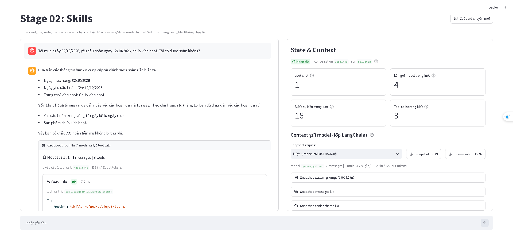

Kêt quả conversation.json.
```
{
  "label": "Context gửi model (lớp LangChain), không phải provider wire payload",
  "conversation_id": "1351144e107f4e4495d1dd1c5877df6b",
  "counters": {
    "Trạng thái": "Hoàn tất",
    "Lượt chat": 1,
    "Lần gọi model trong lượt": 4,
    "Bước sự kiện trong lượt": 16,
    "Tool calls trong lượt": 3
  },
  "messages": [
    {
      "role": "user",
      "type": "human",
      "content": "Tôi mua ngày 02/10/2026, yêu cầu hoàn ngày 12/10/2026,\nchưa kích hoạt. Tôi có được hoàn không?",
      "id": "eed06a23-b9b2-4bec-8da9-38d86caf3cc0"
    },
    {
      "role": "assistant",
      "type": "ai",
      "content": "",
      "id": "lc_run--01a11602-0801-7652-afae-8fcc311f9af3-0",
      "tool_calls": [
        {
          "id": "call_t8qq0zDPIkN2am0ykP3hcqmi",
          "name": "read_file",
          "args": {
            "path": "skills/refund-policy/SKILL.md"
          }
        }
      ],
      "usage_metadata": {
        "input_tokens": 835,
        "output_tokens": 21,
        "total_tokens": 856,
        "input_token_details": {
          "audio": 0,
          "cache_read": 0,
          "cache_creation": 0
        },
        "output_token_details": {
          "audio": 0,
          "reasoning": 0
        }
      }
    },
    {
      "role": "tool",
      "type": "tool",
      "content": "{\"ok\": true, \"path\": \"skills/refund-policy/SKILL.md\", \"content\": \"---\\nname: refund-policy\\ndescription: Xử lý, tra cứu chính sách và kiểm tra điều kiện hoàn tiền dựa trên ngày mua hàng của khách hàng. Sử dụng skill này khi người dùng hỏi về điều kiện hoàn tiền, mức phí, khả năng áp dụng hoặc xử lý yêu cầu hoàn tiền cho đơn hàng.\\n---\\n\\n# Quy trình kiểm tra điều kiện hoàn tiền\\n\\n## 1. Kiểm tra thông tin đầu vào\\nTrước khi đưa ra kết luận, kiểm tra xem người dùng đã cung cấp đủ 3 thông tin dưới đây chưa:\\n1. **Ngày mua hàng**\\n2. **Ngày yêu cầu hoàn tiền** (dùng ngày trong câu hỏi của người dùng, không dùng ngày hiện tại)\\n3. **Trạng thái kích hoạt sản phẩm** (Đã kích hoạt / Chưa kích hoạt)\\n\\n⚠️ **LƯU Ý QUAN TRỌNG:** \\nNếu thiếu bất kỳ thông tin nào trong 3 thông tin trên (đặc biệt là trạng thái kích hoạt), **TẬP TRUNG HỎI LẠI NGƯỜI DÙNG ĐỂ BỔ SUNG**, tuyệt đối không tự giả định \\\"chưa kích hoạt\\\" hay đưa ra kết luận sơ bộ.\\n\\n## 2. Tìm kiếm và chọn chính sách\\n1. Dùng tool `list_files` liệt kê tất cả các file trong thư mục `data/policies/`. KHÔNG dùng cố định tên file vì tên file có thể bị thay đổi.\\n2. Dùng tool `read_file` đọc nội dung các file chính sách tìm được để kiểm tra phạm vi hiệu lực theo ngày mua:\\n   - Ngày mua **trước 2026-10-01**: Áp dụng chính sách áp dụng cho ngày mua trước 2026-10-01.\\n   - Ngày mua **từ 2026-10-01 trở đi** (bao gồm cả ngày 2026-10-01): Áp dụng chính sách áp dụng cho ngày mua từ 2026-10-01.\\n\\n## 3. Tính toán số ngày và kiểm tra điều kiện\\n- **Số ngày đã qua** = Ngày yêu cầu hoàn tiền - Ngày mua hàng (tính bằng chênh lệch ngày lịch).\\n- So sánh số ngày đã qua với giới hạn thời gian trong chính sách tương ứng (bằng đúng giới hạn vẫn đủ điều kiện).\\n- Đánh giá điều kiện kích hoạt.\\n\\n## 4. Trả lời theo mẫu\\nTham khảo cấu trúc trình bày chuẩn trong file `references/answer-template.md`.\"}",
      "id": "11395a9f-b484-455f-ae18-178a0ce2b029",
      "tool_call_id": "call_t8qq0zDPIkN2am0ykP3hcqmi",
      "name": "read_file",
      "status": "success"
    },
    {
      "role": "assistant",
      "type": "ai",
      "content": "",
      "id": "lc_run--01a11602-1065-7691-9de8-3caf06e2c454-0",
      "tool_calls": [
        {
          "id": "call_fxOWr2qLeBb10ZnPaOyPhLvp",
          "name": "list_files",
          "args": {
            "path": "data/policies/"
          }
        }
      ],
      "usage_metadata": {
        "input_tokens": 1450,
        "output_tokens": 17,
        "total_tokens": 1467,
        "input_token_details": {
          "audio": 0,
          "cache_read": 0,
          "cache_creation": 0
        },
        "output_token_details": {
          "audio": 0,
          "reasoning": 0
        }
      }
    },
    {
      "role": "tool",
      "type": "tool",
      "content": "- policy-before-oct.md (file): data/policies/policy-before-oct.md\n- policy-from-oct.md (file): data/policies/policy-from-oct.md",
      "id": "be733fef-36e2-4d7b-ae71-fea5c5bfe421",
      "tool_call_id": "call_fxOWr2qLeBb10ZnPaOyPhLvp",
      "name": "list_files",
      "status": "success"
    },
    {
      "role": "assistant",
      "type": "ai",
      "content": "",
      "id": "lc_run--01a11602-17c5-7cc1-ae9f-9a0efd8a8ffa-0",
      "tool_calls": [
        {
          "id": "call_pphgEBvGNRuw3h6fNMpxs79v",
          "name": "read_file",
          "args": {
            "path": "data/policies/policy-from-oct.md"
          }
        }
      ],
      "usage_metadata": {
        "input_tokens": 1512,
        "output_tokens": 22,
        "total_tokens": 1534,
        "input_token_details": {
          "audio": 0,
          "cache_read": 1408,
          "cache_creation": 0
        },
        "output_token_details": {
          "audio": 0,
          "reasoning": 0
        }
      }
    },
    {
      "role": "tool",
      "type": "tool",
      "content": "{\"ok\": true, \"path\": \"data/policies/policy-from-oct.md\", \"content\": \"# Chính sách hoàn tiền từ tháng 10\\nÁp dụng cho ngày mua từ 2026-10-01, bao gồm ngày này.\\nĐược yêu cầu hoàn tiền trong 14 ngày kể từ ngày mua.\\nKhông thu phí hoàn tiền.\\nKhông hoàn tiền nếu sản phẩm đã kích hoạt.\"}",
      "id": "cd7f1b62-58f5-45aa-9e0e-95d6a2452fee",
      "tool_call_id": "call_pphgEBvGNRuw3h6fNMpxs79v",
      "name": "read_file",
      "status": "success"
    },
    {
      "role": "assistant",
      "type": "ai",
      "content": "Dựa trên các thông tin bạn đã cung cấp và chính sách hoàn tiền hiện tại:\n\n- Ngày mua hàng: 02/10/2026\n- Ngày yêu cầu hoàn tiền: 12/10/2026\n- Trạng thái kích hoạt: Chưa kích hoạt\n\n**Số ngày đã qua** từ ngày mua đến ngày yêu cầu hoàn tiền là 10 ngày. Theo chính sách từ tháng 10, bạn đủ điều kiện yêu cầu hoàn tiền vì:\n\n- Yêu cầu hoàn trong vòng 14 ngày kể từ ngày mua.\n- Sản phẩm chưa kích hoạt.\n\nVậy bạn có thể được hoàn tiền mà không bị thu phí.",
      "id": "lc_run--01a11602-1f78-7880-857f-df1b5c271726-0",
      "tool_calls": [],
      "usage_metadata": {
        "input_tokens": 1629,
        "output_tokens": 137,
        "total_tokens": 1766,
        "input_token_details": {
          "audio": 0,
          "cache_read": 1408,
          "cache_creation": 0
        },
        "output_token_details": {
          "audio": 0,
          "reasoning": 0
        }
      }
    }
  ],
  "snapshots": [
    {
      "label": "Context gửi model (lớp LangChain)",
      "conversation_id": "1351144e107f4e4495d1dd1c5877df6b",
      "run_id": "db17b60a50454a659984b7a3d208dff2",
      "chat_turn": 1,
      "model_call_index": 1,
      "event_sequence": 2,
      "captured_at": "2026-10-07T10:56:34.304+00:00",
      "model_name": "openai/gpt-4o",
      "system_prompt": "Bạn là trợ lý trong lab \"Agent Tools & Skills\". Trả lời bằng tiếng Việt, ngắn gọn, rõ ràng.\n\nQuy tắc:\n- Chỉ dùng các tool được cấp trong request để thao tác dữ liệu. Nếu không có tool phù hợp, nói rõ giới hạn thay vì đoán.\n- Chỉ nói đã đọc, ghi hoặc chạy một thứ khi đã nhận tool result thành công cho đúng thao tác đó.\n- Khi tool trả lỗi, báo lỗi cho người dùng và đề xuất cách xử lý; không bịa kết quả.\n\nWorkspace:\n- Mọi đường dẫn file đều tương đối workspace, ví dụ data/weekly_notes.md.\n- read_file đọc được file trong workspace. write_file chỉ ghi được dưới output/, ví dụ output/summary.md.\n- Bạn không chạy được lệnh shell trong project này.\n\nSkills:\nCác skill dưới đây chứa hướng dẫn chuyên biệt. Danh sách chỉ có metadata; nội dung skill chưa được nạp.\n- Khi task khớp description của một skill, dùng read_file đọc SKILL.md tại <location> trước khi làm, rồi làm theo hướng dẫn trong đó.\n- Đường dẫn tương đối trong SKILL.md được resolve từ thư mục chứa SKILL.md. Ví dụ references/x.md của skill tại skills/abc/SKILL.md là skills/abc/references/x.md.\n- Chỉ đọc tài nguyên cần cho task. Không load skill khi task không liên quan.\n\n<available_skills>\n  <skill>\n    <name>refund-policy</name>\n    <description>Xử lý, tra cứu chính sách và kiểm tra điều kiện hoàn tiền dựa trên ngày mua hàng của khách hàng. Sử dụng skill này khi người dùng hỏi về điều kiện hoàn tiền, mức phí, khả năng áp dụng hoặc xử lý yêu cầu hoàn tiền cho đơn hàng.</description>\n    <location>skills/refund-policy/SKILL.md</location>\n  </skill>\n  <skill>\n    <name>weekly-report</name>\n    <description>Tạo báo cáo tiến độ tuần từ file ghi chú công việc trong workspace (ví dụ data/weekly_notes.md) và lưu thành file Markdown dưới output/. Dùng khi người dùng yêu cầu báo cáo tuần, tổng hợp tiến độ tuần hoặc weekly report.</description>\n    <location>skills/weekly-report/SKILL.md</location>\n  </skill>\n</available_skills>",
      "messages": [
        {
          "role": "user",
          "type": "human",
          "content": "Tôi mua ngày 02/10/2026, yêu cầu hoàn ngày 12/10/2026,\nchưa kích hoạt. Tôi có được hoàn không?",
          "id": "eed06a23-b9b2-4bec-8da9-38d86caf3cc0"
        }
      ],
      "tools": [
        {
          "name": "read_file",
          "description": "Đọc một file văn bản UTF-8 trong workspace và trả về JSON.\n\npath là đường dẫn tương đối workspace, ví dụ: data/weekly_notes.md, output/summary.md.\nDùng để đọc dữ liệu đầu vào, file SKILL.md của một skill và các file reference trong thư mục skill.\nThành công: {\"ok\": true, \"path\": ..., \"content\": ...}. Lỗi: {\"ok\": false, \"error\": {\"code\": ..., \"message\": ...}}.",
          "parameters": {
            "properties": {
              "path": {
                "type": "string"
              }
            },
            "required": [
              "path"
            ],
            "type": "object"
          }
        },
        {
          "name": "write_file",
          "description": "Ghi nội dung văn bản UTF-8 vào một file dưới output/ của workspace và trả về JSON.\n\npath là đường dẫn tương đối workspace và phải bắt đầu bằng output/, ví dụ output/summary.md.\nTự tạo thư mục con. Ghi đè nếu file đã tồn tại.\nThành công: {\"ok\": true, \"path\": ..., \"bytes\": ..., \"status\": \"created\" | \"updated\"}. Lỗi: {\"ok\": false, \"error\": {...}}.",
          "parameters": {
            "properties": {
              "path": {
                "type": "string"
              },
              "content": {
                "type": "string"
              }
            },
            "required": [
              "path",
              "content"
            ],
            "type": "object"
          }
        },
        {
          "name": "list_files",
          "description": "Liệt kê các file và thư mục con trực tiếp trong một thư mục thuộc workspace.\n\nArgs:\n    path: Đường dẫn thư mục tương đối với workspace (ví dụ: 'data/policies').",
          "parameters": {
            "properties": {
              "path": {
                "type": "string"
              }
            },
            "required": [
              "path"
            ],
            "type": "object"
          }
        }
      ],
      "message_count": 1,
      "system_prompt_chars": 1900,
      "message_chars": 94,
      "usage": {
        "input_tokens": 835,
        "output_tokens": 21,
        "total_tokens": 856,
        "input_token_details": {
          "audio": 0,
          "cache_read": 0,
          "cache_creation": 0
        },
        "output_token_details": {
          "audio": 0,
          "reasoning": 0
        }
      }
    },
    {
      "label": "Context gửi model (lớp LangChain)",
      "conversation_id": "1351144e107f4e4495d1dd1c5877df6b",
      "run_id": "db17b60a50454a659984b7a3d208dff2",
      "chat_turn": 1,
      "model_call_index": 2,
      "event_sequence": 6,
      "captured_at": "2026-10-07T10:56:36.452+00:00",
      "model_name": "openai/gpt-4o",
      "system_prompt": "Bạn là trợ lý trong lab \"Agent Tools & Skills\". Trả lời bằng tiếng Việt, ngắn gọn, rõ ràng.\n\nQuy tắc:\n- Chỉ dùng các tool được cấp trong request để thao tác dữ liệu. Nếu không có tool phù hợp, nói rõ giới hạn thay vì đoán.\n- Chỉ nói đã đọc, ghi hoặc chạy một thứ khi đã nhận tool result thành công cho đúng thao tác đó.\n- Khi tool trả lỗi, báo lỗi cho người dùng và đề xuất cách xử lý; không bịa kết quả.\n\nWorkspace:\n- Mọi đường dẫn file đều tương đối workspace, ví dụ data/weekly_notes.md.\n- read_file đọc được file trong workspace. write_file chỉ ghi được dưới output/, ví dụ output/summary.md.\n- Bạn không chạy được lệnh shell trong project này.\n\nSkills:\nCác skill dưới đây chứa hướng dẫn chuyên biệt. Danh sách chỉ có metadata; nội dung skill chưa được nạp.\n- Khi task khớp description của một skill, dùng read_file đọc SKILL.md tại <location> trước khi làm, rồi làm theo hướng dẫn trong đó.\n- Đường dẫn tương đối trong SKILL.md được resolve từ thư mục chứa SKILL.md. Ví dụ references/x.md của skill tại skills/abc/SKILL.md là skills/abc/references/x.md.\n- Chỉ đọc tài nguyên cần cho task. Không load skill khi task không liên quan.\n\n<available_skills>\n  <skill>\n    <name>refund-policy</name>\n    <description>Xử lý, tra cứu chính sách và kiểm tra điều kiện hoàn tiền dựa trên ngày mua hàng của khách hàng. Sử dụng skill này khi người dùng hỏi về điều kiện hoàn tiền, mức phí, khả năng áp dụng hoặc xử lý yêu cầu hoàn tiền cho đơn hàng.</description>\n    <location>skills/refund-policy/SKILL.md</location>\n  </skill>\n  <skill>\n    <name>weekly-report</name>\n    <description>Tạo báo cáo tiến độ tuần từ file ghi chú công việc trong workspace (ví dụ data/weekly_notes.md) và lưu thành file Markdown dưới output/. Dùng khi người dùng yêu cầu báo cáo tuần, tổng hợp tiến độ tuần hoặc weekly report.</description>\n    <location>skills/weekly-report/SKILL.md</location>\n  </skill>\n</available_skills>",
      "messages": [
        {
          "role": "user",
          "type": "human",
          "content": "Tôi mua ngày 02/10/2026, yêu cầu hoàn ngày 12/10/2026,\nchưa kích hoạt. Tôi có được hoàn không?",
          "id": "eed06a23-b9b2-4bec-8da9-38d86caf3cc0"
        },
        {
          "role": "assistant",
          "type": "ai",
          "content": "",
          "id": "lc_run--01a11602-0801-7652-afae-8fcc311f9af3-0",
          "tool_calls": [
            {
              "id": "call_t8qq0zDPIkN2am0ykP3hcqmi",
              "name": "read_file",
              "args": {
                "path": "skills/refund-policy/SKILL.md"
              }
            }
          ],
          "usage_metadata": {
            "input_tokens": 835,
            "output_tokens": 21,
            "total_tokens": 856,
            "input_token_details": {
              "audio": 0,
              "cache_read": 0,
              "cache_creation": 0
            },
            "output_token_details": {
              "audio": 0,
              "reasoning": 0
            }
          }
        },
        {
          "role": "tool",
          "type": "tool",
          "content": "{\"ok\": true, \"path\": \"skills/refund-policy/SKILL.md\", \"content\": \"---\\nname: refund-policy\\ndescription: Xử lý, tra cứu chính sách và kiểm tra điều kiện hoàn tiền dựa trên ngày mua hàng của khách hàng. Sử dụng skill này khi người dùng hỏi về điều kiện hoàn tiền, mức phí, khả năng áp dụng hoặc xử lý yêu cầu hoàn tiền cho đơn hàng.\\n---\\n\\n# Quy trình kiểm tra điều kiện hoàn tiền\\n\\n## 1. Kiểm tra thông tin đầu vào\\nTrước khi đưa ra kết luận, kiểm tra xem người dùng đã cung cấp đủ 3 thông tin dưới đây chưa:\\n1. **Ngày mua hàng**\\n2. **Ngày yêu cầu hoàn tiền** (dùng ngày trong câu hỏi của người dùng, không dùng ngày hiện tại)\\n3. **Trạng thái kích hoạt sản phẩm** (Đã kích hoạt / Chưa kích hoạt)\\n\\n⚠️ **LƯU Ý QUAN TRỌNG:** \\nNếu thiếu bất kỳ thông tin nào trong 3 thông tin trên (đặc biệt là trạng thái kích hoạt), **TẬP TRUNG HỎI LẠI NGƯỜI DÙNG ĐỂ BỔ SUNG**, tuyệt đối không tự giả định \\\"chưa kích hoạt\\\" hay đưa ra kết luận sơ bộ.\\n\\n## 2. Tìm kiếm và chọn chính sách\\n1. Dùng tool `list_files` liệt kê tất cả các file trong thư mục `data/policies/`. KHÔNG dùng cố định tên file vì tên file có thể bị thay đổi.\\n2. Dùng tool `read_file` đọc nội dung các file chính sách tìm được để kiểm tra phạm vi hiệu lực theo ngày mua:\\n   - Ngày mua **trước 2026-10-01**: Áp dụng chính sách áp dụng cho ngày mua trước 2026-10-01.\\n   - Ngày mua **từ 2026-10-01 trở đi** (bao gồm cả ngày 2026-10-01): Áp dụng chính sách áp dụng cho ngày mua từ 2026-10-01.\\n\\n## 3. Tính toán số ngày và kiểm tra điều kiện\\n- **Số ngày đã qua** = Ngày yêu cầu hoàn tiền - Ngày mua hàng (tính bằng chênh lệch ngày lịch).\\n- So sánh số ngày đã qua với giới hạn thời gian trong chính sách tương ứng (bằng đúng giới hạn vẫn đủ điều kiện).\\n- Đánh giá điều kiện kích hoạt.\\n\\n## 4. Trả lời theo mẫu\\nTham khảo cấu trúc trình bày chuẩn trong file `references/answer-template.md`.\"}",
          "id": "11395a9f-b484-455f-ae18-178a0ce2b029",
          "tool_call_id": "call_t8qq0zDPIkN2am0ykP3hcqmi",
          "name": "read_file",
          "status": "success"
        }
      ],
      "tools": [
        {
          "name": "read_file",
          "description": "Đọc một file văn bản UTF-8 trong workspace và trả về JSON.\n\npath là đường dẫn tương đối workspace, ví dụ: data/weekly_notes.md, output/summary.md.\nDùng để đọc dữ liệu đầu vào, file SKILL.md của một skill và các file reference trong thư mục skill.\nThành công: {\"ok\": true, \"path\": ..., \"content\": ...}. Lỗi: {\"ok\": false, \"error\": {\"code\": ..., \"message\": ...}}.",
          "parameters": {
            "properties": {
              "path": {
                "type": "string"
              }
            },
            "required": [
              "path"
            ],
            "type": "object"
          }
        },
        {
          "name": "write_file",
          "description": "Ghi nội dung văn bản UTF-8 vào một file dưới output/ của workspace và trả về JSON.\n\npath là đường dẫn tương đối workspace và phải bắt đầu bằng output/, ví dụ output/summary.md.\nTự tạo thư mục con. Ghi đè nếu file đã tồn tại.\nThành công: {\"ok\": true, \"path\": ..., \"bytes\": ..., \"status\": \"created\" | \"updated\"}. Lỗi: {\"ok\": false, \"error\": {...}}.",
          "parameters": {
            "properties": {
              "path": {
                "type": "string"
              },
              "content": {
                "type": "string"
              }
            },
            "required": [
              "path",
              "content"
            ],
            "type": "object"
          }
        },
        {
          "name": "list_files",
          "description": "Liệt kê các file và thư mục con trực tiếp trong một thư mục thuộc workspace.\n\nArgs:\n    path: Đường dẫn thư mục tương đối với workspace (ví dụ: 'data/policies').",
          "parameters": {
            "properties": {
              "path": {
                "type": "string"
              }
            },
            "required": [
              "path"
            ],
            "type": "object"
          }
        }
      ],
      "message_count": 3,
      "system_prompt_chars": 1900,
      "message_chars": 1988,
      "usage": {
        "input_tokens": 1450,
        "output_tokens": 17,
        "total_tokens": 1467,
        "input_token_details": {
          "audio": 0,
          "cache_read": 0,
          "cache_creation": 0
        },
        "output_token_details": {
          "audio": 0,
          "reasoning": 0
        }
      }
    },
    {
      "label": "Context gửi model (lớp LangChain)",
      "conversation_id": "1351144e107f4e4495d1dd1c5877df6b",
      "run_id": "db17b60a50454a659984b7a3d208dff2",
      "chat_turn": 1,
      "model_call_index": 3,
      "event_sequence": 10,
      "captured_at": "2026-10-07T10:56:38.340+00:00",
      "model_name": "openai/gpt-4o",
      "system_prompt": "Bạn là trợ lý trong lab \"Agent Tools & Skills\". Trả lời bằng tiếng Việt, ngắn gọn, rõ ràng.\n\nQuy tắc:\n- Chỉ dùng các tool được cấp trong request để thao tác dữ liệu. Nếu không có tool phù hợp, nói rõ giới hạn thay vì đoán.\n- Chỉ nói đã đọc, ghi hoặc chạy một thứ khi đã nhận tool result thành công cho đúng thao tác đó.\n- Khi tool trả lỗi, báo lỗi cho người dùng và đề xuất cách xử lý; không bịa kết quả.\n\nWorkspace:\n- Mọi đường dẫn file đều tương đối workspace, ví dụ data/weekly_notes.md.\n- read_file đọc được file trong workspace. write_file chỉ ghi được dưới output/, ví dụ output/summary.md.\n- Bạn không chạy được lệnh shell trong project này.\n\nSkills:\nCác skill dưới đây chứa hướng dẫn chuyên biệt. Danh sách chỉ có metadata; nội dung skill chưa được nạp.\n- Khi task khớp description của một skill, dùng read_file đọc SKILL.md tại <location> trước khi làm, rồi làm theo hướng dẫn trong đó.\n- Đường dẫn tương đối trong SKILL.md được resolve từ thư mục chứa SKILL.md. Ví dụ references/x.md của skill tại skills/abc/SKILL.md là skills/abc/references/x.md.\n- Chỉ đọc tài nguyên cần cho task. Không load skill khi task không liên quan.\n\n<available_skills>\n  <skill>\n    <name>refund-policy</name>\n    <description>Xử lý, tra cứu chính sách và kiểm tra điều kiện hoàn tiền dựa trên ngày mua hàng của khách hàng. Sử dụng skill này khi người dùng hỏi về điều kiện hoàn tiền, mức phí, khả năng áp dụng hoặc xử lý yêu cầu hoàn tiền cho đơn hàng.</description>\n    <location>skills/refund-policy/SKILL.md</location>\n  </skill>\n  <skill>\n    <name>weekly-report</name>\n    <description>Tạo báo cáo tiến độ tuần từ file ghi chú công việc trong workspace (ví dụ data/weekly_notes.md) và lưu thành file Markdown dưới output/. Dùng khi người dùng yêu cầu báo cáo tuần, tổng hợp tiến độ tuần hoặc weekly report.</description>\n    <location>skills/weekly-report/SKILL.md</location>\n  </skill>\n</available_skills>",
      "messages": [
        {
          "role": "user",
          "type": "human",
          "content": "Tôi mua ngày 02/10/2026, yêu cầu hoàn ngày 12/10/2026,\nchưa kích hoạt. Tôi có được hoàn không?",
          "id": "eed06a23-b9b2-4bec-8da9-38d86caf3cc0"
        },
        {
          "role": "assistant",
          "type": "ai",
          "content": "",
          "id": "lc_run--01a11602-0801-7652-afae-8fcc311f9af3-0",
          "tool_calls": [
            {
              "id": "call_t8qq0zDPIkN2am0ykP3hcqmi",
              "name": "read_file",
              "args": {
                "path": "skills/refund-policy/SKILL.md"
              }
            }
          ],
          "usage_metadata": {
            "input_tokens": 835,
            "output_tokens": 21,
            "total_tokens": 856,
            "input_token_details": {
              "audio": 0,
              "cache_read": 0,
              "cache_creation": 0
            },
            "output_token_details": {
              "audio": 0,
              "reasoning": 0
            }
          }
        },
        {
          "role": "tool",
          "type": "tool",
          "content": "{\"ok\": true, \"path\": \"skills/refund-policy/SKILL.md\", \"content\": \"---\\nname: refund-policy\\ndescription: Xử lý, tra cứu chính sách và kiểm tra điều kiện hoàn tiền dựa trên ngày mua hàng của khách hàng. Sử dụng skill này khi người dùng hỏi về điều kiện hoàn tiền, mức phí, khả năng áp dụng hoặc xử lý yêu cầu hoàn tiền cho đơn hàng.\\n---\\n\\n# Quy trình kiểm tra điều kiện hoàn tiền\\n\\n## 1. Kiểm tra thông tin đầu vào\\nTrước khi đưa ra kết luận, kiểm tra xem người dùng đã cung cấp đủ 3 thông tin dưới đây chưa:\\n1. **Ngày mua hàng**\\n2. **Ngày yêu cầu hoàn tiền** (dùng ngày trong câu hỏi của người dùng, không dùng ngày hiện tại)\\n3. **Trạng thái kích hoạt sản phẩm** (Đã kích hoạt / Chưa kích hoạt)\\n\\n⚠️ **LƯU Ý QUAN TRỌNG:** \\nNếu thiếu bất kỳ thông tin nào trong 3 thông tin trên (đặc biệt là trạng thái kích hoạt), **TẬP TRUNG HỎI LẠI NGƯỜI DÙNG ĐỂ BỔ SUNG**, tuyệt đối không tự giả định \\\"chưa kích hoạt\\\" hay đưa ra kết luận sơ bộ.\\n\\n## 2. Tìm kiếm và chọn chính sách\\n1. Dùng tool `list_files` liệt kê tất cả các file trong thư mục `data/policies/`. KHÔNG dùng cố định tên file vì tên file có thể bị thay đổi.\\n2. Dùng tool `read_file` đọc nội dung các file chính sách tìm được để kiểm tra phạm vi hiệu lực theo ngày mua:\\n   - Ngày mua **trước 2026-10-01**: Áp dụng chính sách áp dụng cho ngày mua trước 2026-10-01.\\n   - Ngày mua **từ 2026-10-01 trở đi** (bao gồm cả ngày 2026-10-01): Áp dụng chính sách áp dụng cho ngày mua từ 2026-10-01.\\n\\n## 3. Tính toán số ngày và kiểm tra điều kiện\\n- **Số ngày đã qua** = Ngày yêu cầu hoàn tiền - Ngày mua hàng (tính bằng chênh lệch ngày lịch).\\n- So sánh số ngày đã qua với giới hạn thời gian trong chính sách tương ứng (bằng đúng giới hạn vẫn đủ điều kiện).\\n- Đánh giá điều kiện kích hoạt.\\n\\n## 4. Trả lời theo mẫu\\nTham khảo cấu trúc trình bày chuẩn trong file `references/answer-template.md`.\"}",
          "id": "11395a9f-b484-455f-ae18-178a0ce2b029",
          "tool_call_id": "call_t8qq0zDPIkN2am0ykP3hcqmi",
          "name": "read_file",
          "status": "success"
        },
        {
          "role": "assistant",
          "type": "ai",
          "content": "",
          "id": "lc_run--01a11602-1065-7691-9de8-3caf06e2c454-0",
          "tool_calls": [
            {
              "id": "call_fxOWr2qLeBb10ZnPaOyPhLvp",
              "name": "list_files",
              "args": {
                "path": "data/policies/"
              }
            }
          ],
          "usage_metadata": {
            "input_tokens": 1450,
            "output_tokens": 17,
            "total_tokens": 1467,
            "input_token_details": {
              "audio": 0,
              "cache_read": 0,
              "cache_creation": 0
            },
            "output_token_details": {
              "audio": 0,
              "reasoning": 0
            }
          }
        },
        {
          "role": "tool",
          "type": "tool",
          "content": "- policy-before-oct.md (file): data/policies/policy-before-oct.md\n- policy-from-oct.md (file): data/policies/policy-from-oct.md",
          "id": "be733fef-36e2-4d7b-ae71-fea5c5bfe421",
          "tool_call_id": "call_fxOWr2qLeBb10ZnPaOyPhLvp",
          "name": "list_files",
          "status": "success"
        }
      ],
      "tools": [
        {
          "name": "read_file",
          "description": "Đọc một file văn bản UTF-8 trong workspace và trả về JSON.\n\npath là đường dẫn tương đối workspace, ví dụ: data/weekly_notes.md, output/summary.md.\nDùng để đọc dữ liệu đầu vào, file SKILL.md của một skill và các file reference trong thư mục skill.\nThành công: {\"ok\": true, \"path\": ..., \"content\": ...}. Lỗi: {\"ok\": false, \"error\": {\"code\": ..., \"message\": ...}}.",
          "parameters": {
            "properties": {
              "path": {
                "type": "string"
              }
            },
            "required": [
              "path"
            ],
            "type": "object"
          }
        },
        {
          "name": "write_file",
          "description": "Ghi nội dung văn bản UTF-8 vào một file dưới output/ của workspace và trả về JSON.\n\npath là đường dẫn tương đối workspace và phải bắt đầu bằng output/, ví dụ output/summary.md.\nTự tạo thư mục con. Ghi đè nếu file đã tồn tại.\nThành công: {\"ok\": true, \"path\": ..., \"bytes\": ..., \"status\": \"created\" | \"updated\"}. Lỗi: {\"ok\": false, \"error\": {...}}.",
          "parameters": {
            "properties": {
              "path": {
                "type": "string"
              },
              "content": {
                "type": "string"
              }
            },
            "required": [
              "path",
              "content"
            ],
            "type": "object"
          }
        },
        {
          "name": "list_files",
          "description": "Liệt kê các file và thư mục con trực tiếp trong một thư mục thuộc workspace.\n\nArgs:\n    path: Đường dẫn thư mục tương đối với workspace (ví dụ: 'data/policies').",
          "parameters": {
            "properties": {
              "path": {
                "type": "string"
              }
            },
            "required": [
              "path"
            ],
            "type": "object"
          }
        }
      ],
      "message_count": 5,
      "system_prompt_chars": 1900,
      "message_chars": 2141,
      "usage": {
        "input_tokens": 1512,
        "output_tokens": 22,
        "total_tokens": 1534,
        "input_token_details": {
          "audio": 0,
          "cache_read": 1408,
          "cache_creation": 0
        },
        "output_token_details": {
          "audio": 0,
          "reasoning": 0
        }
      }
    },
    {
      "label": "Context gửi model (lớp LangChain)",
      "conversation_id": "1351144e107f4e4495d1dd1c5877df6b",
      "run_id": "db17b60a50454a659984b7a3d208dff2",
      "chat_turn": 1,
      "model_call_index": 4,
      "event_sequence": 14,
      "captured_at": "2026-10-07T10:56:40.311+00:00",
      "model_name": "openai/gpt-4o",
      "system_prompt": "Bạn là trợ lý trong lab \"Agent Tools & Skills\". Trả lời bằng tiếng Việt, ngắn gọn, rõ ràng.\n\nQuy tắc:\n- Chỉ dùng các tool được cấp trong request để thao tác dữ liệu. Nếu không có tool phù hợp, nói rõ giới hạn thay vì đoán.\n- Chỉ nói đã đọc, ghi hoặc chạy một thứ khi đã nhận tool result thành công cho đúng thao tác đó.\n- Khi tool trả lỗi, báo lỗi cho người dùng và đề xuất cách xử lý; không bịa kết quả.\n\nWorkspace:\n- Mọi đường dẫn file đều tương đối workspace, ví dụ data/weekly_notes.md.\n- read_file đọc được file trong workspace. write_file chỉ ghi được dưới output/, ví dụ output/summary.md.\n- Bạn không chạy được lệnh shell trong project này.\n\nSkills:\nCác skill dưới đây chứa hướng dẫn chuyên biệt. Danh sách chỉ có metadata; nội dung skill chưa được nạp.\n- Khi task khớp description của một skill, dùng read_file đọc SKILL.md tại <location> trước khi làm, rồi làm theo hướng dẫn trong đó.\n- Đường dẫn tương đối trong SKILL.md được resolve từ thư mục chứa SKILL.md. Ví dụ references/x.md của skill tại skills/abc/SKILL.md là skills/abc/references/x.md.\n- Chỉ đọc tài nguyên cần cho task. Không load skill khi task không liên quan.\n\n<available_skills>\n  <skill>\n    <name>refund-policy</name>\n    <description>Xử lý, tra cứu chính sách và kiểm tra điều kiện hoàn tiền dựa trên ngày mua hàng của khách hàng. Sử dụng skill này khi người dùng hỏi về điều kiện hoàn tiền, mức phí, khả năng áp dụng hoặc xử lý yêu cầu hoàn tiền cho đơn hàng.</description>\n    <location>skills/refund-policy/SKILL.md</location>\n  </skill>\n  <skill>\n    <name>weekly-report</name>\n    <description>Tạo báo cáo tiến độ tuần từ file ghi chú công việc trong workspace (ví dụ data/weekly_notes.md) và lưu thành file Markdown dưới output/. Dùng khi người dùng yêu cầu báo cáo tuần, tổng hợp tiến độ tuần hoặc weekly report.</description>\n    <location>skills/weekly-report/SKILL.md</location>\n  </skill>\n</available_skills>",
      "messages": [
        {
          "role": "user",
          "type": "human",
          "content": "Tôi mua ngày 02/10/2026, yêu cầu hoàn ngày 12/10/2026,\nchưa kích hoạt. Tôi có được hoàn không?",
          "id": "eed06a23-b9b2-4bec-8da9-38d86caf3cc0"
        },
        {
          "role": "assistant",
          "type": "ai",
          "content": "",
          "id": "lc_run--01a11602-0801-7652-afae-8fcc311f9af3-0",
          "tool_calls": [
            {
              "id": "call_t8qq0zDPIkN2am0ykP3hcqmi",
              "name": "read_file",
              "args": {
                "path": "skills/refund-policy/SKILL.md"
              }
            }
          ],
          "usage_metadata": {
            "input_tokens": 835,
            "output_tokens": 21,
            "total_tokens": 856,
            "input_token_details": {
              "audio": 0,
              "cache_read": 0,
              "cache_creation": 0
            },
            "output_token_details": {
              "audio": 0,
              "reasoning": 0
            }
          }
        },
        {
          "role": "tool",
          "type": "tool",
          "content": "{\"ok\": true, \"path\": \"skills/refund-policy/SKILL.md\", \"content\": \"---\\nname: refund-policy\\ndescription: Xử lý, tra cứu chính sách và kiểm tra điều kiện hoàn tiền dựa trên ngày mua hàng của khách hàng. Sử dụng skill này khi người dùng hỏi về điều kiện hoàn tiền, mức phí, khả năng áp dụng hoặc xử lý yêu cầu hoàn tiền cho đơn hàng.\\n---\\n\\n# Quy trình kiểm tra điều kiện hoàn tiền\\n\\n## 1. Kiểm tra thông tin đầu vào\\nTrước khi đưa ra kết luận, kiểm tra xem người dùng đã cung cấp đủ 3 thông tin dưới đây chưa:\\n1. **Ngày mua hàng**\\n2. **Ngày yêu cầu hoàn tiền** (dùng ngày trong câu hỏi của người dùng, không dùng ngày hiện tại)\\n3. **Trạng thái kích hoạt sản phẩm** (Đã kích hoạt / Chưa kích hoạt)\\n\\n⚠️ **LƯU Ý QUAN TRỌNG:** \\nNếu thiếu bất kỳ thông tin nào trong 3 thông tin trên (đặc biệt là trạng thái kích hoạt), **TẬP TRUNG HỎI LẠI NGƯỜI DÙNG ĐỂ BỔ SUNG**, tuyệt đối không tự giả định \\\"chưa kích hoạt\\\" hay đưa ra kết luận sơ bộ.\\n\\n## 2. Tìm kiếm và chọn chính sách\\n1. Dùng tool `list_files` liệt kê tất cả các file trong thư mục `data/policies/`. KHÔNG dùng cố định tên file vì tên file có thể bị thay đổi.\\n2. Dùng tool `read_file` đọc nội dung các file chính sách tìm được để kiểm tra phạm vi hiệu lực theo ngày mua:\\n   - Ngày mua **trước 2026-10-01**: Áp dụng chính sách áp dụng cho ngày mua trước 2026-10-01.\\n   - Ngày mua **từ 2026-10-01 trở đi** (bao gồm cả ngày 2026-10-01): Áp dụng chính sách áp dụng cho ngày mua từ 2026-10-01.\\n\\n## 3. Tính toán số ngày và kiểm tra điều kiện\\n- **Số ngày đã qua** = Ngày yêu cầu hoàn tiền - Ngày mua hàng (tính bằng chênh lệch ngày lịch).\\n- So sánh số ngày đã qua với giới hạn thời gian trong chính sách tương ứng (bằng đúng giới hạn vẫn đủ điều kiện).\\n- Đánh giá điều kiện kích hoạt.\\n\\n## 4. Trả lời theo mẫu\\nTham khảo cấu trúc trình bày chuẩn trong file `references/answer-template.md`.\"}",
          "id": "11395a9f-b484-455f-ae18-178a0ce2b029",
          "tool_call_id": "call_t8qq0zDPIkN2am0ykP3hcqmi",
          "name": "read_file",
          "status": "success"
        },
        {
          "role": "assistant",
          "type": "ai",
          "content": "",
          "id": "lc_run--01a11602-1065-7691-9de8-3caf06e2c454-0",
          "tool_calls": [
            {
              "id": "call_fxOWr2qLeBb10ZnPaOyPhLvp",
              "name": "list_files",
              "args": {
                "path": "data/policies/"
              }
            }
          ],
          "usage_metadata": {
            "input_tokens": 1450,
            "output_tokens": 17,
            "total_tokens": 1467,
            "input_token_details": {
              "audio": 0,
              "cache_read": 0,
              "cache_creation": 0
            },
            "output_token_details": {
              "audio": 0,
              "reasoning": 0
            }
          }
        },
        {
          "role": "tool",
          "type": "tool",
          "content": "- policy-before-oct.md (file): data/policies/policy-before-oct.md\n- policy-from-oct.md (file): data/policies/policy-from-oct.md",
          "id": "be733fef-36e2-4d7b-ae71-fea5c5bfe421",
          "tool_call_id": "call_fxOWr2qLeBb10ZnPaOyPhLvp",
          "name": "list_files",
          "status": "success"
        },
        {
          "role": "assistant",
          "type": "ai",
          "content": "",
          "id": "lc_run--01a11602-17c5-7cc1-ae9f-9a0efd8a8ffa-0",
          "tool_calls": [
            {
              "id": "call_pphgEBvGNRuw3h6fNMpxs79v",
              "name": "read_file",
              "args": {
                "path": "data/policies/policy-from-oct.md"
              }
            }
          ],
          "usage_metadata": {
            "input_tokens": 1512,
            "output_tokens": 22,
            "total_tokens": 1534,
            "input_token_details": {
              "audio": 0,
              "cache_read": 1408,
              "cache_creation": 0
            },
            "output_token_details": {
              "audio": 0,
              "reasoning": 0
            }
          }
        },
        {
          "role": "tool",
          "type": "tool",
          "content": "{\"ok\": true, \"path\": \"data/policies/policy-from-oct.md\", \"content\": \"# Chính sách hoàn tiền từ tháng 10\\nÁp dụng cho ngày mua từ 2026-10-01, bao gồm ngày này.\\nĐược yêu cầu hoàn tiền trong 14 ngày kể từ ngày mua.\\nKhông thu phí hoàn tiền.\\nKhông hoàn tiền nếu sản phẩm đã kích hoạt.\"}",
          "id": "cd7f1b62-58f5-45aa-9e0e-95d6a2452fee",
          "tool_call_id": "call_pphgEBvGNRuw3h6fNMpxs79v",
          "name": "read_file",
          "status": "success"
        }
      ],
      "tools": [
        {
          "name": "read_file",
          "description": "Đọc một file văn bản UTF-8 trong workspace và trả về JSON.\n\npath là đường dẫn tương đối workspace, ví dụ: data/weekly_notes.md, output/summary.md.\nDùng để đọc dữ liệu đầu vào, file SKILL.md của một skill và các file reference trong thư mục skill.\nThành công: {\"ok\": true, \"path\": ..., \"content\": ...}. Lỗi: {\"ok\": false, \"error\": {\"code\": ..., \"message\": ...}}.",
          "parameters": {
            "properties": {
              "path": {
                "type": "string"
              }
            },
            "required": [
              "path"
            ],
            "type": "object"
          }
        },
        {
          "name": "write_file",
          "description": "Ghi nội dung văn bản UTF-8 vào một file dưới output/ của workspace và trả về JSON.\n\npath là đường dẫn tương đối workspace và phải bắt đầu bằng output/, ví dụ output/summary.md.\nTự tạo thư mục con. Ghi đè nếu file đã tồn tại.\nThành công: {\"ok\": true, \"path\": ..., \"bytes\": ..., \"status\": \"created\" | \"updated\"}. Lỗi: {\"ok\": false, \"error\": {...}}.",
          "parameters": {
            "properties": {
              "path": {
                "type": "string"
              },
              "content": {
                "type": "string"
              }
            },
            "required": [
              "path",
              "content"
            ],
            "type": "object"
          }
        },
        {
          "name": "list_files",
          "description": "Liệt kê các file và thư mục con trực tiếp trong một thư mục thuộc workspace.\n\nArgs:\n    path: Đường dẫn thư mục tương đối với workspace (ví dụ: 'data/policies').",
          "parameters": {
            "properties": {
              "path": {
                "type": "string"
              }
            },
            "required": [
              "path"
            ],
            "type": "object"
          }
        }
      ],
      "message_count": 7,
      "system_prompt_chars": 1900,
      "message_chars": 2469,
      "usage": {
        "input_tokens": 1629,
        "output_tokens": 137,
        "total_tokens": 1766,
        "input_token_details": {
          "audio": 0,
          "cache_read": 1408,
          "cache_creation": 0
        },
        "output_token_details": {
          "audio": 0,
          "reasoning": 0
        }
      }
    }
  ],
  "events": [
    {
      "conversation_id": "1351144e107f4e4495d1dd1c5877df6b",
      "run_id": "db17b60a50454a659984b7a3d208dff2",
      "chat_turn": 1,
      "sequence": 1,
      "type": "user_submitted",
      "timestamp": "2026-10-07T10:56:34.111+00:00",
      "text": "Tôi mua ngày 02/10/2026, yêu cầu hoàn ngày 12/10/2026,\nchưa kích hoạt. Tôi có được hoàn không?",
      "tools": [
        "read_file",
        "write_file",
        "list_files"
      ],
      "skills": [
        {
          "name": "refund-policy",
          "description": "Xử lý, tra cứu chính sách và kiểm tra điều kiện hoàn tiền dựa trên ngày mua hàng của khách hàng. Sử dụng skill này khi người dùng hỏi về điều kiện hoàn tiền, mức phí, khả năng áp dụng hoặc xử lý yêu cầu hoàn tiền cho đơn hàng.",
          "location": "skills/refund-policy/SKILL.md"
        },
        {
          "name": "weekly-report",
          "description": "Tạo báo cáo tiến độ tuần từ file ghi chú công việc trong workspace (ví dụ data/weekly_notes.md) và lưu thành file Markdown dưới output/. Dùng khi người dùng yêu cầu báo cáo tuần, tổng hợp tiến độ tuần hoặc weekly report.",
          "location": "skills/weekly-report/SKILL.md"
        }
      ]
    },
    {
      "conversation_id": "1351144e107f4e4495d1dd1c5877df6b",
      "run_id": "db17b60a50454a659984b7a3d208dff2",
      "chat_turn": 1,
      "sequence": 2,
      "type": "model_request",
      "timestamp": "2026-10-07T10:56:34.308+00:00",
      "model_call_index": 1,
      "snapshot": {
        "label": "Context gửi model (lớp LangChain)",
        "conversation_id": "1351144e107f4e4495d1dd1c5877df6b",
        "run_id": "db17b60a50454a659984b7a3d208dff2",
        "chat_turn": 1,
        "model_call_index": 1,
        "event_sequence": 2,
        "captured_at": "2026-10-07T10:56:34.304+00:00",
        "model_name": "openai/gpt-4o",
        "system_prompt": "Bạn là trợ lý trong lab \"Agent Tools & Skills\". Trả lời bằng tiếng Việt, ngắn gọn, rõ ràng.\n\nQuy tắc:\n- Chỉ dùng các tool được cấp trong request để thao tác dữ liệu. Nếu không có tool phù hợp, nói rõ giới hạn thay vì đoán.\n- Chỉ nói đã đọc, ghi hoặc chạy một thứ khi đã nhận tool result thành công cho đúng thao tác đó.\n- Khi tool trả lỗi, báo lỗi cho người dùng và đề xuất cách xử lý; không bịa kết quả.\n\nWorkspace:\n- Mọi đường dẫn file đều tương đối workspace, ví dụ data/weekly_notes.md.\n- read_file đọc được file trong workspace. write_file chỉ ghi được dưới output/, ví dụ output/summary.md.\n- Bạn không chạy được lệnh shell trong project này.\n\nSkills:\nCác skill dưới đây chứa hướng dẫn chuyên biệt. Danh sách chỉ có metadata; nội dung skill chưa được nạp.\n- Khi task khớp description của một skill, dùng read_file đọc SKILL.md tại <location> trước khi làm, rồi làm theo hướng dẫn trong đó.\n- Đường dẫn tương đối trong SKILL.md được resolve từ thư mục chứa SKILL.md. Ví dụ references/x.md của skill tại skills/abc/SKILL.md là skills/abc/references/x.md.\n- Chỉ đọc tài nguyên cần cho task. Không load skill khi task không liên quan.\n\n<available_skills>\n  <skill>\n    <name>refund-policy</name>\n    <description>Xử lý, tra cứu chính sách và kiểm tra điều kiện hoàn tiền dựa trên ngày mua hàng của khách hàng. Sử dụng skill này khi người dùng hỏi về điều kiện hoàn tiền, mức phí, khả năng áp dụng hoặc xử lý yêu cầu hoàn tiền cho đơn hàng.</description>\n    <location>skills/refund-policy/SKILL.md</location>\n  </skill>\n  <skill>\n    <name>weekly-report</name>\n    <description>Tạo báo cáo tiến độ tuần từ file ghi chú công việc trong workspace (ví dụ data/weekly_notes.md) và lưu thành file Markdown dưới output/. Dùng khi người dùng yêu cầu báo cáo tuần, tổng hợp tiến độ tuần hoặc weekly report.</description>\n    <location>skills/weekly-report/SKILL.md</location>\n  </skill>\n</available_skills>",
        "messages": [
          {
            "role": "user",
            "type": "human",
            "content": "Tôi mua ngày 02/10/2026, yêu cầu hoàn ngày 12/10/2026,\nchưa kích hoạt. Tôi có được hoàn không?",
            "id": "eed06a23-b9b2-4bec-8da9-38d86caf3cc0"
          }
        ],
        "tools": [
          {
            "name": "read_file",
            "description": "Đọc một file văn bản UTF-8 trong workspace và trả về JSON.\n\npath là đường dẫn tương đối workspace, ví dụ: data/weekly_notes.md, output/summary.md.\nDùng để đọc dữ liệu đầu vào, file SKILL.md của một skill và các file reference trong thư mục skill.\nThành công: {\"ok\": true, \"path\": ..., \"content\": ...}. Lỗi: {\"ok\": false, \"error\": {\"code\": ..., \"message\": ...}}.",
            "parameters": {
              "properties": {
                "path": {
                  "type": "string"
                }
              },
              "required": [
                "path"
              ],
              "type": "object"
            }
          },
          {
            "name": "write_file",
            "description": "Ghi nội dung văn bản UTF-8 vào một file dưới output/ của workspace và trả về JSON.\n\npath là đường dẫn tương đối workspace và phải bắt đầu bằng output/, ví dụ output/summary.md.\nTự tạo thư mục con. Ghi đè nếu file đã tồn tại.\nThành công: {\"ok\": true, \"path\": ..., \"bytes\": ..., \"status\": \"created\" | \"updated\"}. Lỗi: {\"ok\": false, \"error\": {...}}.",
            "parameters": {
              "properties": {
                "path": {
                  "type": "string"
                },
                "content": {
                  "type": "string"
                }
              },
              "required": [
                "path",
                "content"
              ],
              "type": "object"
            }
          },
          {
            "name": "list_files",
            "description": "Liệt kê các file và thư mục con trực tiếp trong một thư mục thuộc workspace.\n\nArgs:\n    path: Đường dẫn thư mục tương đối với workspace (ví dụ: 'data/policies').",
            "parameters": {
              "properties": {
                "path": {
                  "type": "string"
                }
              },
              "required": [
                "path"
              ],
              "type": "object"
            }
          }
        ],
        "message_count": 1,
        "system_prompt_chars": 1900,
        "message_chars": 94,
        "usage": null
      }
    },
    {
      "conversation_id": "1351144e107f4e4495d1dd1c5877df6b",
      "run_id": "db17b60a50454a659984b7a3d208dff2",
      "chat_turn": 1,
      "sequence": 3,
      "type": "model_response",
      "timestamp": "2026-10-07T10:56:36.150+00:00",
      "model_call_index": 1,
      "elapsed_ms": 1845.9,
      "tool_calls_requested": [
        {
          "id": "call_t8qq0zDPIkN2am0ykP3hcqmi",
          "name": "read_file"
        }
      ],
      "usage": {
        "input_tokens": 835,
        "output_tokens": 21,
        "total_tokens": 856,
        "input_token_details": {
          "audio": 0,
          "cache_read": 0,
          "cache_creation": 0
        },
        "output_token_details": {
          "audio": 0,
          "reasoning": 0
        }
      }
    },
    {
      "conversation_id": "1351144e107f4e4495d1dd1c5877df6b",
      "run_id": "db17b60a50454a659984b7a3d208dff2",
      "chat_turn": 1,
      "sequence": 4,
      "type": "tool_started",
      "timestamp": "2026-10-07T10:56:36.287+00:00",
      "tool_call_id": "call_t8qq0zDPIkN2am0ykP3hcqmi",
      "tool_name": "read_file",
      "arguments": {
        "path": "skills/refund-policy/SKILL.md"
      }
    },
    {
      "conversation_id": "1351144e107f4e4495d1dd1c5877df6b",
      "run_id": "db17b60a50454a659984b7a3d208dff2",
      "chat_turn": 1,
      "sequence": 5,
      "type": "tool_finished",
      "timestamp": "2026-10-07T10:56:36.323+00:00",
      "tool_call_id": "call_t8qq0zDPIkN2am0ykP3hcqmi",
      "tool_name": "read_file",
      "elapsed_ms": 7.0,
      "status": "success",
      "result": {
        "ok": true,
        "path": "skills/refund-policy/SKILL.md",
        "content": "---\nname: refund-policy\ndescription: Xử lý, tra cứu chính sách và kiểm tra điều kiện hoàn tiền dựa trên ngày mua hàng của khách hàng. Sử dụng skill này khi người dùng hỏi về điều kiện hoàn tiền, mức phí, khả năng áp dụng hoặc xử lý yêu cầu hoàn tiền cho đơn hàng.\n---\n\n# Quy trình kiểm tra điều kiện hoàn tiền\n\n## 1. Kiểm tra thông tin đầu vào\nTrước khi đưa ra kết luận, kiểm tra xem người dùng đã cung cấp đủ 3 thông tin dưới đây chưa:\n1. **Ngày mua hàng**\n2. **Ngày yêu cầu hoàn tiền** (dùng ngày trong câu hỏi của người dùng, không dùng ngày hiện tại)\n3. **Trạng thái kích hoạt sản phẩm** (Đã kích hoạt / Chưa kích hoạt)\n\n⚠️ **LƯU Ý QUAN TRỌNG:** \nNếu thiếu bất kỳ thông tin nào trong 3 thông tin trên (đặc biệt là trạng thái kích hoạt), **TẬP TRUNG HỎI LẠI NGƯỜI DÙNG ĐỂ BỔ SUNG**, tuyệt đối không tự giả định \"chưa kích hoạt\" hay đưa ra kết luận sơ bộ.\n\n## 2. Tìm kiếm và chọn chính sách\n1. Dùng tool `list_files` liệt kê tất cả các file trong thư mục `data/policies/`. KHÔNG dùng cố định tên file vì tên file có thể bị thay đổi.\n2. Dùng tool `read_file` đọc nội dung các file chính sách tìm được để kiểm tra phạm vi hiệu lực theo ngày mua:\n   - Ngày mua **trước 2026-10-01**: Áp dụng chính sách áp dụng cho ngày mua trước 2026-10-01.\n   - Ngày mua **từ 2026-10-01 trở đi** (bao gồm cả ngày 2026-10-01): Áp dụng chính sách áp dụng cho ngày mua từ 2026-10-01.\n\n## 3. Tính toán số ngày và kiểm tra điều kiện\n- **Số ngày đã qua** = Ngày yêu cầu hoàn tiền - Ngày mua hàng (tính bằng chênh lệch ngày lịch).\n- So sánh số ngày đã qua với giới hạn thời gian trong chính sách tương ứng (bằng đúng giới hạn vẫn đủ điều kiện).\n- Đánh giá điều kiện kích hoạt.\n\n## 4. Trả lời theo mẫu\nTham khảo cấu trúc trình bày chuẩn trong file `references/answer-template.md`."
      }
    },
    {
      "conversation_id": "1351144e107f4e4495d1dd1c5877df6b",
      "run_id": "db17b60a50454a659984b7a3d208dff2",
      "chat_turn": 1,
      "sequence": 6,
      "type": "model_request",
      "timestamp": "2026-10-07T10:56:36.456+00:00",
      "model_call_index": 2,
      "snapshot": {
        "label": "Context gửi model (lớp LangChain)",
        "conversation_id": "1351144e107f4e4495d1dd1c5877df6b",
        "run_id": "db17b60a50454a659984b7a3d208dff2",
        "chat_turn": 1,
        "model_call_index": 2,
        "event_sequence": 6,
        "captured_at": "2026-10-07T10:56:36.452+00:00",
        "model_name": "openai/gpt-4o",
        "system_prompt": "Bạn là trợ lý trong lab \"Agent Tools & Skills\". Trả lời bằng tiếng Việt, ngắn gọn, rõ ràng.\n\nQuy tắc:\n- Chỉ dùng các tool được cấp trong request để thao tác dữ liệu. Nếu không có tool phù hợp, nói rõ giới hạn thay vì đoán.\n- Chỉ nói đã đọc, ghi hoặc chạy một thứ khi đã nhận tool result thành công cho đúng thao tác đó.\n- Khi tool trả lỗi, báo lỗi cho người dùng và đề xuất cách xử lý; không bịa kết quả.\n\nWorkspace:\n- Mọi đường dẫn file đều tương đối workspace, ví dụ data/weekly_notes.md.\n- read_file đọc được file trong workspace. write_file chỉ ghi được dưới output/, ví dụ output/summary.md.\n- Bạn không chạy được lệnh shell trong project này.\n\nSkills:\nCác skill dưới đây chứa hướng dẫn chuyên biệt. Danh sách chỉ có metadata; nội dung skill chưa được nạp.\n- Khi task khớp description của một skill, dùng read_file đọc SKILL.md tại <location> trước khi làm, rồi làm theo hướng dẫn trong đó.\n- Đường dẫn tương đối trong SKILL.md được resolve từ thư mục chứa SKILL.md. Ví dụ references/x.md của skill tại skills/abc/SKILL.md là skills/abc/references/x.md.\n- Chỉ đọc tài nguyên cần cho task. Không load skill khi task không liên quan.\n\n<available_skills>\n  <skill>\n    <name>refund-policy</name>\n    <description>Xử lý, tra cứu chính sách và kiểm tra điều kiện hoàn tiền dựa trên ngày mua hàng của khách hàng. Sử dụng skill này khi người dùng hỏi về điều kiện hoàn tiền, mức phí, khả năng áp dụng hoặc xử lý yêu cầu hoàn tiền cho đơn hàng.</description>\n    <location>skills/refund-policy/SKILL.md</location>\n  </skill>\n  <skill>\n    <name>weekly-report</name>\n    <description>Tạo báo cáo tiến độ tuần từ file ghi chú công việc trong workspace (ví dụ data/weekly_notes.md) và lưu thành file Markdown dưới output/. Dùng khi người dùng yêu cầu báo cáo tuần, tổng hợp tiến độ tuần hoặc weekly report.</description>\n    <location>skills/weekly-report/SKILL.md</location>\n  </skill>\n</available_skills>",
        "messages": [
          {
            "role": "user",
            "type": "human",
            "content": "Tôi mua ngày 02/10/2026, yêu cầu hoàn ngày 12/10/2026,\nchưa kích hoạt. Tôi có được hoàn không?",
            "id": "eed06a23-b9b2-4bec-8da9-38d86caf3cc0"
          },
          {
            "role": "assistant",
            "type": "ai",
            "content": "",
            "id": "lc_run--01a11602-0801-7652-afae-8fcc311f9af3-0",
            "tool_calls": [
              {
                "id": "call_t8qq0zDPIkN2am0ykP3hcqmi",
                "name": "read_file",
                "args": {
                  "path": "skills/refund-policy/SKILL.md"
                }
              }
            ],
            "usage_metadata": {
              "input_tokens": 835,
              "output_tokens": 21,
              "total_tokens": 856,
              "input_token_details": {
                "audio": 0,
                "cache_read": 0,
                "cache_creation": 0
              },
              "output_token_details": {
                "audio": 0,
                "reasoning": 0
              }
            }
          },
          {
            "role": "tool",
            "type": "tool",
            "content": "{\"ok\": true, \"path\": \"skills/refund-policy/SKILL.md\", \"content\": \"---\\nname: refund-policy\\ndescription: Xử lý, tra cứu chính sách và kiểm tra điều kiện hoàn tiền dựa trên ngày mua hàng của khách hàng. Sử dụng skill này khi người dùng hỏi về điều kiện hoàn tiền, mức phí, khả năng áp dụng hoặc xử lý yêu cầu hoàn tiền cho đơn hàng.\\n---\\n\\n# Quy trình kiểm tra điều kiện hoàn tiền\\n\\n## 1. Kiểm tra thông tin đầu vào\\nTrước khi đưa ra kết luận, kiểm tra xem người dùng đã cung cấp đủ 3 thông tin dưới đây chưa:\\n1. **Ngày mua hàng**\\n2. **Ngày yêu cầu hoàn tiền** (dùng ngày trong câu hỏi của người dùng, không dùng ngày hiện tại)\\n3. **Trạng thái kích hoạt sản phẩm** (Đã kích hoạt / Chưa kích hoạt)\\n\\n⚠️ **LƯU Ý QUAN TRỌNG:** \\nNếu thiếu bất kỳ thông tin nào trong 3 thông tin trên (đặc biệt là trạng thái kích hoạt), **TẬP TRUNG HỎI LẠI NGƯỜI DÙNG ĐỂ BỔ SUNG**, tuyệt đối không tự giả định \\\"chưa kích hoạt\\\" hay đưa ra kết luận sơ bộ.\\n\\n## 2. Tìm kiếm và chọn chính sách\\n1. Dùng tool `list_files` liệt kê tất cả các file trong thư mục `data/policies/`. KHÔNG dùng cố định tên file vì tên file có thể bị thay đổi.\\n2. Dùng tool `read_file` đọc nội dung các file chính sách tìm được để kiểm tra phạm vi hiệu lực theo ngày mua:\\n   - Ngày mua **trước 2026-10-01**: Áp dụng chính sách áp dụng cho ngày mua trước 2026-10-01.\\n   - Ngày mua **từ 2026-10-01 trở đi** (bao gồm cả ngày 2026-10-01): Áp dụng chính sách áp dụng cho ngày mua từ 2026-10-01.\\n\\n## 3. Tính toán số ngày và kiểm tra điều kiện\\n- **Số ngày đã qua** = Ngày yêu cầu hoàn tiền - Ngày mua hàng (tính bằng chênh lệch ngày lịch).\\n- So sánh số ngày đã qua với giới hạn thời gian trong chính sách tương ứng (bằng đúng giới hạn vẫn đủ điều kiện).\\n- Đánh giá điều kiện kích hoạt.\\n\\n## 4. Trả lời theo mẫu\\nTham khảo cấu trúc trình bày chuẩn trong file `references/answer-template.md`.\"}",
            "id": "11395a9f-b484-455f-ae18-178a0ce2b029",
            "tool_call_id": "call_t8qq0zDPIkN2am0ykP3hcqmi",
            "name": "read_file",
            "status": "success"
          }
        ],
        "tools": [
          {
            "name": "read_file",
            "description": "Đọc một file văn bản UTF-8 trong workspace và trả về JSON.\n\npath là đường dẫn tương đối workspace, ví dụ: data/weekly_notes.md, output/summary.md.\nDùng để đọc dữ liệu đầu vào, file SKILL.md của một skill và các file reference trong thư mục skill.\nThành công: {\"ok\": true, \"path\": ..., \"content\": ...}. Lỗi: {\"ok\": false, \"error\": {\"code\": ..., \"message\": ...}}.",
            "parameters": {
              "properties": {
                "path": {
                  "type": "string"
                }
              },
              "required": [
                "path"
              ],
              "type": "object"
            }
          },
          {
            "name": "write_file",
            "description": "Ghi nội dung văn bản UTF-8 vào một file dưới output/ của workspace và trả về JSON.\n\npath là đường dẫn tương đối workspace và phải bắt đầu bằng output/, ví dụ output/summary.md.\nTự tạo thư mục con. Ghi đè nếu file đã tồn tại.\nThành công: {\"ok\": true, \"path\": ..., \"bytes\": ..., \"status\": \"created\" | \"updated\"}. Lỗi: {\"ok\": false, \"error\": {...}}.",
            "parameters": {
              "properties": {
                "path": {
                  "type": "string"
                },
                "content": {
                  "type": "string"
                }
              },
              "required": [
                "path",
                "content"
              ],
              "type": "object"
            }
          },
          {
            "name": "list_files",
            "description": "Liệt kê các file và thư mục con trực tiếp trong một thư mục thuộc workspace.\n\nArgs:\n    path: Đường dẫn thư mục tương đối với workspace (ví dụ: 'data/policies').",
            "parameters": {
              "properties": {
                "path": {
                  "type": "string"
                }
              },
              "required": [
                "path"
              ],
              "type": "object"
            }
          }
        ],
        "message_count": 3,
        "system_prompt_chars": 1900,
        "message_chars": 1988,
        "usage": null
      }
    },
    {
      "conversation_id": "1351144e107f4e4495d1dd1c5877df6b",
      "run_id": "db17b60a50454a659984b7a3d208dff2",
      "chat_turn": 1,
      "sequence": 7,
      "type": "model_response",
      "timestamp": "2026-10-07T10:56:38.006+00:00",
      "model_call_index": 2,
      "elapsed_ms": 1553.6,
      "tool_calls_requested": [
        {
          "id": "call_fxOWr2qLeBb10ZnPaOyPhLvp",
          "name": "list_files"
        }
      ],
      "usage": {
        "input_tokens": 1450,
        "output_tokens": 17,
        "total_tokens": 1467,
        "input_token_details": {
          "audio": 0,
          "cache_read": 0,
          "cache_creation": 0
        },
        "output_token_details": {
          "audio": 0,
          "reasoning": 0
        }
      }
    },
    {
      "conversation_id": "1351144e107f4e4495d1dd1c5877df6b",
      "run_id": "db17b60a50454a659984b7a3d208dff2",
      "chat_turn": 1,
      "sequence": 8,
      "type": "tool_started",
      "timestamp": "2026-10-07T10:56:38.170+00:00",
      "tool_call_id": "call_fxOWr2qLeBb10ZnPaOyPhLvp",
      "tool_name": "list_files",
      "arguments": {
        "path": "data/policies/"
      }
    },
    {
      "conversation_id": "1351144e107f4e4495d1dd1c5877df6b",
      "run_id": "db17b60a50454a659984b7a3d208dff2",
      "chat_turn": 1,
      "sequence": 9,
      "type": "tool_finished",
      "timestamp": "2026-10-07T10:56:38.207+00:00",
      "tool_call_id": "call_fxOWr2qLeBb10ZnPaOyPhLvp",
      "tool_name": "list_files",
      "elapsed_ms": 5.5,
      "status": "success",
      "result": "- policy-before-oct.md (file): data/policies/policy-before-oct.md\n- policy-from-oct.md (file): data/policies/policy-from-oct.md"
    },
    {
      "conversation_id": "1351144e107f4e4495d1dd1c5877df6b",
      "run_id": "db17b60a50454a659984b7a3d208dff2",
      "chat_turn": 1,
      "sequence": 10,
      "type": "model_request",
      "timestamp": "2026-10-07T10:56:38.346+00:00",
      "model_call_index": 3,
      "snapshot": {
        "label": "Context gửi model (lớp LangChain)",
        "conversation_id": "1351144e107f4e4495d1dd1c5877df6b",
        "run_id": "db17b60a50454a659984b7a3d208dff2",
        "chat_turn": 1,
        "model_call_index": 3,
        "event_sequence": 10,
        "captured_at": "2026-10-07T10:56:38.340+00:00",
        "model_name": "openai/gpt-4o",
        "system_prompt": "Bạn là trợ lý trong lab \"Agent Tools & Skills\". Trả lời bằng tiếng Việt, ngắn gọn, rõ ràng.\n\nQuy tắc:\n- Chỉ dùng các tool được cấp trong request để thao tác dữ liệu. Nếu không có tool phù hợp, nói rõ giới hạn thay vì đoán.\n- Chỉ nói đã đọc, ghi hoặc chạy một thứ khi đã nhận tool result thành công cho đúng thao tác đó.\n- Khi tool trả lỗi, báo lỗi cho người dùng và đề xuất cách xử lý; không bịa kết quả.\n\nWorkspace:\n- Mọi đường dẫn file đều tương đối workspace, ví dụ data/weekly_notes.md.\n- read_file đọc được file trong workspace. write_file chỉ ghi được dưới output/, ví dụ output/summary.md.\n- Bạn không chạy được lệnh shell trong project này.\n\nSkills:\nCác skill dưới đây chứa hướng dẫn chuyên biệt. Danh sách chỉ có metadata; nội dung skill chưa được nạp.\n- Khi task khớp description của một skill, dùng read_file đọc SKILL.md tại <location> trước khi làm, rồi làm theo hướng dẫn trong đó.\n- Đường dẫn tương đối trong SKILL.md được resolve từ thư mục chứa SKILL.md. Ví dụ references/x.md của skill tại skills/abc/SKILL.md là skills/abc/references/x.md.\n- Chỉ đọc tài nguyên cần cho task. Không load skill khi task không liên quan.\n\n<available_skills>\n  <skill>\n    <name>refund-policy</name>\n    <description>Xử lý, tra cứu chính sách và kiểm tra điều kiện hoàn tiền dựa trên ngày mua hàng của khách hàng. Sử dụng skill này khi người dùng hỏi về điều kiện hoàn tiền, mức phí, khả năng áp dụng hoặc xử lý yêu cầu hoàn tiền cho đơn hàng.</description>\n    <location>skills/refund-policy/SKILL.md</location>\n  </skill>\n  <skill>\n    <name>weekly-report</name>\n    <description>Tạo báo cáo tiến độ tuần từ file ghi chú công việc trong workspace (ví dụ data/weekly_notes.md) và lưu thành file Markdown dưới output/. Dùng khi người dùng yêu cầu báo cáo tuần, tổng hợp tiến độ tuần hoặc weekly report.</description>\n    <location>skills/weekly-report/SKILL.md</location>\n  </skill>\n</available_skills>",
        "messages": [
          {
            "role": "user",
            "type": "human",
            "content": "Tôi mua ngày 02/10/2026, yêu cầu hoàn ngày 12/10/2026,\nchưa kích hoạt. Tôi có được hoàn không?",
            "id": "eed06a23-b9b2-4bec-8da9-38d86caf3cc0"
          },
          {
            "role": "assistant",
            "type": "ai",
            "content": "",
            "id": "lc_run--01a11602-0801-7652-afae-8fcc311f9af3-0",
            "tool_calls": [
              {
                "id": "call_t8qq0zDPIkN2am0ykP3hcqmi",
                "name": "read_file",
                "args": {
                  "path": "skills/refund-policy/SKILL.md"
                }
              }
            ],
            "usage_metadata": {
              "input_tokens": 835,
              "output_tokens": 21,
              "total_tokens": 856,
              "input_token_details": {
                "audio": 0,
                "cache_read": 0,
                "cache_creation": 0
              },
              "output_token_details": {
                "audio": 0,
                "reasoning": 0
              }
            }
          },
          {
            "role": "tool",
            "type": "tool",
            "content": "{\"ok\": true, \"path\": \"skills/refund-policy/SKILL.md\", \"content\": \"---\\nname: refund-policy\\ndescription: Xử lý, tra cứu chính sách và kiểm tra điều kiện hoàn tiền dựa trên ngày mua hàng của khách hàng. Sử dụng skill này khi người dùng hỏi về điều kiện hoàn tiền, mức phí, khả năng áp dụng hoặc xử lý yêu cầu hoàn tiền cho đơn hàng.\\n---\\n\\n# Quy trình kiểm tra điều kiện hoàn tiền\\n\\n## 1. Kiểm tra thông tin đầu vào\\nTrước khi đưa ra kết luận, kiểm tra xem người dùng đã cung cấp đủ 3 thông tin dưới đây chưa:\\n1. **Ngày mua hàng**\\n2. **Ngày yêu cầu hoàn tiền** (dùng ngày trong câu hỏi của người dùng, không dùng ngày hiện tại)\\n3. **Trạng thái kích hoạt sản phẩm** (Đã kích hoạt / Chưa kích hoạt)\\n\\n⚠️ **LƯU Ý QUAN TRỌNG:** \\nNếu thiếu bất kỳ thông tin nào trong 3 thông tin trên (đặc biệt là trạng thái kích hoạt), **TẬP TRUNG HỎI LẠI NGƯỜI DÙNG ĐỂ BỔ SUNG**, tuyệt đối không tự giả định \\\"chưa kích hoạt\\\" hay đưa ra kết luận sơ bộ.\\n\\n## 2. Tìm kiếm và chọn chính sách\\n1. Dùng tool `list_files` liệt kê tất cả các file trong thư mục `data/policies/`. KHÔNG dùng cố định tên file vì tên file có thể bị thay đổi.\\n2. Dùng tool `read_file` đọc nội dung các file chính sách tìm được để kiểm tra phạm vi hiệu lực theo ngày mua:\\n   - Ngày mua **trước 2026-10-01**: Áp dụng chính sách áp dụng cho ngày mua trước 2026-10-01.\\n   - Ngày mua **từ 2026-10-01 trở đi** (bao gồm cả ngày 2026-10-01): Áp dụng chính sách áp dụng cho ngày mua từ 2026-10-01.\\n\\n## 3. Tính toán số ngày và kiểm tra điều kiện\\n- **Số ngày đã qua** = Ngày yêu cầu hoàn tiền - Ngày mua hàng (tính bằng chênh lệch ngày lịch).\\n- So sánh số ngày đã qua với giới hạn thời gian trong chính sách tương ứng (bằng đúng giới hạn vẫn đủ điều kiện).\\n- Đánh giá điều kiện kích hoạt.\\n\\n## 4. Trả lời theo mẫu\\nTham khảo cấu trúc trình bày chuẩn trong file `references/answer-template.md`.\"}",
            "id": "11395a9f-b484-455f-ae18-178a0ce2b029",
            "tool_call_id": "call_t8qq0zDPIkN2am0ykP3hcqmi",
            "name": "read_file",
            "status": "success"
          },
          {
            "role": "assistant",
            "type": "ai",
            "content": "",
            "id": "lc_run--01a11602-1065-7691-9de8-3caf06e2c454-0",
            "tool_calls": [
              {
                "id": "call_fxOWr2qLeBb10ZnPaOyPhLvp",
                "name": "list_files",
                "args": {
                  "path": "data/policies/"
                }
              }
            ],
            "usage_metadata": {
              "input_tokens": 1450,
              "output_tokens": 17,
              "total_tokens": 1467,
              "input_token_details": {
                "audio": 0,
                "cache_read": 0,
                "cache_creation": 0
              },
              "output_token_details": {
                "audio": 0,
                "reasoning": 0
              }
            }
          },
          {
            "role": "tool",
            "type": "tool",
            "content": "- policy-before-oct.md (file): data/policies/policy-before-oct.md\n- policy-from-oct.md (file): data/policies/policy-from-oct.md",
            "id": "be733fef-36e2-4d7b-ae71-fea5c5bfe421",
            "tool_call_id": "call_fxOWr2qLeBb10ZnPaOyPhLvp",
            "name": "list_files",
            "status": "success"
          }
        ],
        "tools": [
          {
            "name": "read_file",
            "description": "Đọc một file văn bản UTF-8 trong workspace và trả về JSON.\n\npath là đường dẫn tương đối workspace, ví dụ: data/weekly_notes.md, output/summary.md.\nDùng để đọc dữ liệu đầu vào, file SKILL.md của một skill và các file reference trong thư mục skill.\nThành công: {\"ok\": true, \"path\": ..., \"content\": ...}. Lỗi: {\"ok\": false, \"error\": {\"code\": ..., \"message\": ...}}.",
            "parameters": {
              "properties": {
                "path": {
                  "type": "string"
                }
              },
              "required": [
                "path"
              ],
              "type": "object"
            }
          },
          {
            "name": "write_file",
            "description": "Ghi nội dung văn bản UTF-8 vào một file dưới output/ của workspace và trả về JSON.\n\npath là đường dẫn tương đối workspace và phải bắt đầu bằng output/, ví dụ output/summary.md.\nTự tạo thư mục con. Ghi đè nếu file đã tồn tại.\nThành công: {\"ok\": true, \"path\": ..., \"bytes\": ..., \"status\": \"created\" | \"updated\"}. Lỗi: {\"ok\": false, \"error\": {...}}.",
            "parameters": {
              "properties": {
                "path": {
                  "type": "string"
                },
                "content": {
                  "type": "string"
                }
              },
              "required": [
                "path",
                "content"
              ],
              "type": "object"
            }
          },
          {
            "name": "list_files",
            "description": "Liệt kê các file và thư mục con trực tiếp trong một thư mục thuộc workspace.\n\nArgs:\n    path: Đường dẫn thư mục tương đối với workspace (ví dụ: 'data/policies').",
            "parameters": {
              "properties": {
                "path": {
                  "type": "string"
                }
              },
              "required": [
                "path"
              ],
              "type": "object"
            }
          }
        ],
        "message_count": 5,
        "system_prompt_chars": 1900,
        "message_chars": 2141,
        "usage": null
      }
    },
    {
      "conversation_id": "1351144e107f4e4495d1dd1c5877df6b",
      "run_id": "db17b60a50454a659984b7a3d208dff2",
      "chat_turn": 1,
      "sequence": 11,
      "type": "model_response",
      "timestamp": "2026-10-07T10:56:39.965+00:00",
      "model_call_index": 3,
      "elapsed_ms": 1623.9,
      "tool_calls_requested": [
        {
          "id": "call_pphgEBvGNRuw3h6fNMpxs79v",
          "name": "read_file"
        }
      ],
      "usage": {
        "input_tokens": 1512,
        "output_tokens": 22,
        "total_tokens": 1534,
        "input_token_details": {
          "audio": 0,
          "cache_read": 1408,
          "cache_creation": 0
        },
        "output_token_details": {
          "audio": 0,
          "reasoning": 0
        }
      }
    },
    {
      "conversation_id": "1351144e107f4e4495d1dd1c5877df6b",
      "run_id": "db17b60a50454a659984b7a3d208dff2",
      "chat_turn": 1,
      "sequence": 12,
      "type": "tool_started",
      "timestamp": "2026-10-07T10:56:40.146+00:00",
      "tool_call_id": "call_pphgEBvGNRuw3h6fNMpxs79v",
      "tool_name": "read_file",
      "arguments": {
        "path": "data/policies/policy-from-oct.md"
      }
    },
    {
      "conversation_id": "1351144e107f4e4495d1dd1c5877df6b",
      "run_id": "db17b60a50454a659984b7a3d208dff2",
      "chat_turn": 1,
      "sequence": 13,
      "type": "tool_finished",
      "timestamp": "2026-10-07T10:56:40.190+00:00",
      "tool_call_id": "call_pphgEBvGNRuw3h6fNMpxs79v",
      "tool_name": "read_file",
      "elapsed_ms": 9.0,
      "status": "success",
      "result": {
        "ok": true,
        "path": "data/policies/policy-from-oct.md",
        "content": "# Chính sách hoàn tiền từ tháng 10\nÁp dụng cho ngày mua từ 2026-10-01, bao gồm ngày này.\nĐược yêu cầu hoàn tiền trong 14 ngày kể từ ngày mua.\nKhông thu phí hoàn tiền.\nKhông hoàn tiền nếu sản phẩm đã kích hoạt."
      }
    },
    {
      "conversation_id": "1351144e107f4e4495d1dd1c5877df6b",
      "run_id": "db17b60a50454a659984b7a3d208dff2",
      "chat_turn": 1,
      "sequence": 14,
      "type": "model_request",
      "timestamp": "2026-10-07T10:56:40.317+00:00",
      "model_call_index": 4,
      "snapshot": {
        "label": "Context gửi model (lớp LangChain)",
        "conversation_id": "1351144e107f4e4495d1dd1c5877df6b",
        "run_id": "db17b60a50454a659984b7a3d208dff2",
        "chat_turn": 1,
        "model_call_index": 4,
        "event_sequence": 14,
        "captured_at": "2026-10-07T10:56:40.311+00:00",
        "model_name": "openai/gpt-4o",
        "system_prompt": "Bạn là trợ lý trong lab \"Agent Tools & Skills\". Trả lời bằng tiếng Việt, ngắn gọn, rõ ràng.\n\nQuy tắc:\n- Chỉ dùng các tool được cấp trong request để thao tác dữ liệu. Nếu không có tool phù hợp, nói rõ giới hạn thay vì đoán.\n- Chỉ nói đã đọc, ghi hoặc chạy một thứ khi đã nhận tool result thành công cho đúng thao tác đó.\n- Khi tool trả lỗi, báo lỗi cho người dùng và đề xuất cách xử lý; không bịa kết quả.\n\nWorkspace:\n- Mọi đường dẫn file đều tương đối workspace, ví dụ data/weekly_notes.md.\n- read_file đọc được file trong workspace. write_file chỉ ghi được dưới output/, ví dụ output/summary.md.\n- Bạn không chạy được lệnh shell trong project này.\n\nSkills:\nCác skill dưới đây chứa hướng dẫn chuyên biệt. Danh sách chỉ có metadata; nội dung skill chưa được nạp.\n- Khi task khớp description của một skill, dùng read_file đọc SKILL.md tại <location> trước khi làm, rồi làm theo hướng dẫn trong đó.\n- Đường dẫn tương đối trong SKILL.md được resolve từ thư mục chứa SKILL.md. Ví dụ references/x.md của skill tại skills/abc/SKILL.md là skills/abc/references/x.md.\n- Chỉ đọc tài nguyên cần cho task. Không load skill khi task không liên quan.\n\n<available_skills>\n  <skill>\n    <name>refund-policy</name>\n    <description>Xử lý, tra cứu chính sách và kiểm tra điều kiện hoàn tiền dựa trên ngày mua hàng của khách hàng. Sử dụng skill này khi người dùng hỏi về điều kiện hoàn tiền, mức phí, khả năng áp dụng hoặc xử lý yêu cầu hoàn tiền cho đơn hàng.</description>\n    <location>skills/refund-policy/SKILL.md</location>\n  </skill>\n  <skill>\n    <name>weekly-report</name>\n    <description>Tạo báo cáo tiến độ tuần từ file ghi chú công việc trong workspace (ví dụ data/weekly_notes.md) và lưu thành file Markdown dưới output/. Dùng khi người dùng yêu cầu báo cáo tuần, tổng hợp tiến độ tuần hoặc weekly report.</description>\n    <location>skills/weekly-report/SKILL.md</location>\n  </skill>\n</available_skills>",
        "messages": [
          {
            "role": "user",
            "type": "human",
            "content": "Tôi mua ngày 02/10/2026, yêu cầu hoàn ngày 12/10/2026,\nchưa kích hoạt. Tôi có được hoàn không?",
            "id": "eed06a23-b9b2-4bec-8da9-38d86caf3cc0"
          },
          {
            "role": "assistant",
            "type": "ai",
            "content": "",
            "id": "lc_run--01a11602-0801-7652-afae-8fcc311f9af3-0",
            "tool_calls": [
              {
                "id": "call_t8qq0zDPIkN2am0ykP3hcqmi",
                "name": "read_file",
                "args": {
                  "path": "skills/refund-policy/SKILL.md"
                }
              }
            ],
            "usage_metadata": {
              "input_tokens": 835,
              "output_tokens": 21,
              "total_tokens": 856,
              "input_token_details": {
                "audio": 0,
                "cache_read": 0,
                "cache_creation": 0
              },
              "output_token_details": {
                "audio": 0,
                "reasoning": 0
              }
            }
          },
          {
            "role": "tool",
            "type": "tool",
            "content": "{\"ok\": true, \"path\": \"skills/refund-policy/SKILL.md\", \"content\": \"---\\nname: refund-policy\\ndescription: Xử lý, tra cứu chính sách và kiểm tra điều kiện hoàn tiền dựa trên ngày mua hàng của khách hàng. Sử dụng skill này khi người dùng hỏi về điều kiện hoàn tiền, mức phí, khả năng áp dụng hoặc xử lý yêu cầu hoàn tiền cho đơn hàng.\\n---\\n\\n# Quy trình kiểm tra điều kiện hoàn tiền\\n\\n## 1. Kiểm tra thông tin đầu vào\\nTrước khi đưa ra kết luận, kiểm tra xem người dùng đã cung cấp đủ 3 thông tin dưới đây chưa:\\n1. **Ngày mua hàng**\\n2. **Ngày yêu cầu hoàn tiền** (dùng ngày trong câu hỏi của người dùng, không dùng ngày hiện tại)\\n3. **Trạng thái kích hoạt sản phẩm** (Đã kích hoạt / Chưa kích hoạt)\\n\\n⚠️ **LƯU Ý QUAN TRỌNG:** \\nNếu thiếu bất kỳ thông tin nào trong 3 thông tin trên (đặc biệt là trạng thái kích hoạt), **TẬP TRUNG HỎI LẠI NGƯỜI DÙNG ĐỂ BỔ SUNG**, tuyệt đối không tự giả định \\\"chưa kích hoạt\\\" hay đưa ra kết luận sơ bộ.\\n\\n## 2. Tìm kiếm và chọn chính sách\\n1. Dùng tool `list_files` liệt kê tất cả các file trong thư mục `data/policies/`. KHÔNG dùng cố định tên file vì tên file có thể bị thay đổi.\\n2. Dùng tool `read_file` đọc nội dung các file chính sách tìm được để kiểm tra phạm vi hiệu lực theo ngày mua:\\n   - Ngày mua **trước 2026-10-01**: Áp dụng chính sách áp dụng cho ngày mua trước 2026-10-01.\\n   - Ngày mua **từ 2026-10-01 trở đi** (bao gồm cả ngày 2026-10-01): Áp dụng chính sách áp dụng cho ngày mua từ 2026-10-01.\\n\\n## 3. Tính toán số ngày và kiểm tra điều kiện\\n- **Số ngày đã qua** = Ngày yêu cầu hoàn tiền - Ngày mua hàng (tính bằng chênh lệch ngày lịch).\\n- So sánh số ngày đã qua với giới hạn thời gian trong chính sách tương ứng (bằng đúng giới hạn vẫn đủ điều kiện).\\n- Đánh giá điều kiện kích hoạt.\\n\\n## 4. Trả lời theo mẫu\\nTham khảo cấu trúc trình bày chuẩn trong file `references/answer-template.md`.\"}",
            "id": "11395a9f-b484-455f-ae18-178a0ce2b029",
            "tool_call_id": "call_t8qq0zDPIkN2am0ykP3hcqmi",
            "name": "read_file",
            "status": "success"
          },
          {
            "role": "assistant",
            "type": "ai",
            "content": "",
            "id": "lc_run--01a11602-1065-7691-9de8-3caf06e2c454-0",
            "tool_calls": [
              {
                "id": "call_fxOWr2qLeBb10ZnPaOyPhLvp",
                "name": "list_files",
                "args": {
                  "path": "data/policies/"
                }
              }
            ],
            "usage_metadata": {
              "input_tokens": 1450,
              "output_tokens": 17,
              "total_tokens": 1467,
              "input_token_details": {
                "audio": 0,
                "cache_read": 0,
                "cache_creation": 0
              },
              "output_token_details": {
                "audio": 0,
                "reasoning": 0
              }
            }
          },
          {
            "role": "tool",
            "type": "tool",
            "content": "- policy-before-oct.md (file): data/policies/policy-before-oct.md\n- policy-from-oct.md (file): data/policies/policy-from-oct.md",
            "id": "be733fef-36e2-4d7b-ae71-fea5c5bfe421",
            "tool_call_id": "call_fxOWr2qLeBb10ZnPaOyPhLvp",
            "name": "list_files",
            "status": "success"
          },
          {
            "role": "assistant",
            "type": "ai",
            "content": "",
            "id": "lc_run--01a11602-17c5-7cc1-ae9f-9a0efd8a8ffa-0",
            "tool_calls": [
              {
                "id": "call_pphgEBvGNRuw3h6fNMpxs79v",
                "name": "read_file",
                "args": {
                  "path": "data/policies/policy-from-oct.md"
                }
              }
            ],
            "usage_metadata": {
              "input_tokens": 1512,
              "output_tokens": 22,
              "total_tokens": 1534,
              "input_token_details": {
                "audio": 0,
                "cache_read": 1408,
                "cache_creation": 0
              },
              "output_token_details": {
                "audio": 0,
                "reasoning": 0
              }
            }
          },
          {
            "role": "tool",
            "type": "tool",
            "content": "{\"ok\": true, \"path\": \"data/policies/policy-from-oct.md\", \"content\": \"# Chính sách hoàn tiền từ tháng 10\\nÁp dụng cho ngày mua từ 2026-10-01, bao gồm ngày này.\\nĐược yêu cầu hoàn tiền trong 14 ngày kể từ ngày mua.\\nKhông thu phí hoàn tiền.\\nKhông hoàn tiền nếu sản phẩm đã kích hoạt.\"}",
            "id": "cd7f1b62-58f5-45aa-9e0e-95d6a2452fee",
            "tool_call_id": "call_pphgEBvGNRuw3h6fNMpxs79v",
            "name": "read_file",
            "status": "success"
          }
        ],
        "tools": [
          {
            "name": "read_file",
            "description": "Đọc một file văn bản UTF-8 trong workspace và trả về JSON.\n\npath là đường dẫn tương đối workspace, ví dụ: data/weekly_notes.md, output/summary.md.\nDùng để đọc dữ liệu đầu vào, file SKILL.md của một skill và các file reference trong thư mục skill.\nThành công: {\"ok\": true, \"path\": ..., \"content\": ...}. Lỗi: {\"ok\": false, \"error\": {\"code\": ..., \"message\": ...}}.",
            "parameters": {
              "properties": {
                "path": {
                  "type": "string"
                }
              },
              "required": [
                "path"
              ],
              "type": "object"
            }
          },
          {
            "name": "write_file",
            "description": "Ghi nội dung văn bản UTF-8 vào một file dưới output/ của workspace và trả về JSON.\n\npath là đường dẫn tương đối workspace và phải bắt đầu bằng output/, ví dụ output/summary.md.\nTự tạo thư mục con. Ghi đè nếu file đã tồn tại.\nThành công: {\"ok\": true, \"path\": ..., \"bytes\": ..., \"status\": \"created\" | \"updated\"}. Lỗi: {\"ok\": false, \"error\": {...}}.",
            "parameters": {
              "properties": {
                "path": {
                  "type": "string"
                },
                "content": {
                  "type": "string"
                }
              },
              "required": [
                "path",
                "content"
              ],
              "type": "object"
            }
          },
          {
            "name": "list_files",
            "description": "Liệt kê các file và thư mục con trực tiếp trong một thư mục thuộc workspace.\n\nArgs:\n    path: Đường dẫn thư mục tương đối với workspace (ví dụ: 'data/policies').",
            "parameters": {
              "properties": {
                "path": {
                  "type": "string"
                }
              },
              "required": [
                "path"
              ],
              "type": "object"
            }
          }
        ],
        "message_count": 7,
        "system_prompt_chars": 1900,
        "message_chars": 2469,
        "usage": null
      }
    },
    {
      "conversation_id": "1351144e107f4e4495d1dd1c5877df6b",
      "run_id": "db17b60a50454a659984b7a3d208dff2",
      "chat_turn": 1,
      "sequence": 15,
      "type": "model_response",
      "timestamp": "2026-10-07T10:56:42.478+00:00",
      "model_call_index": 4,
      "elapsed_ms": 2165.3,
      "tool_calls_requested": [],
      "usage": {
        "input_tokens": 1629,
        "output_tokens": 137,
        "total_tokens": 1766,
        "input_token_details": {
          "audio": 0,
          "cache_read": 1408,
          "cache_creation": 0
        },
        "output_token_details": {
          "audio": 0,
          "reasoning": 0
        }
      }
    },
    {
      "conversation_id": "1351144e107f4e4495d1dd1c5877df6b",
      "run_id": "db17b60a50454a659984b7a3d208dff2",
      "chat_turn": 1,
      "sequence": 16,
      "type": "run_completed",
      "timestamp": "2026-10-07T10:56:42.667+00:00",
      "answer_chars": 446
    }
  ]
}
```

### Sau khi đổi tên.

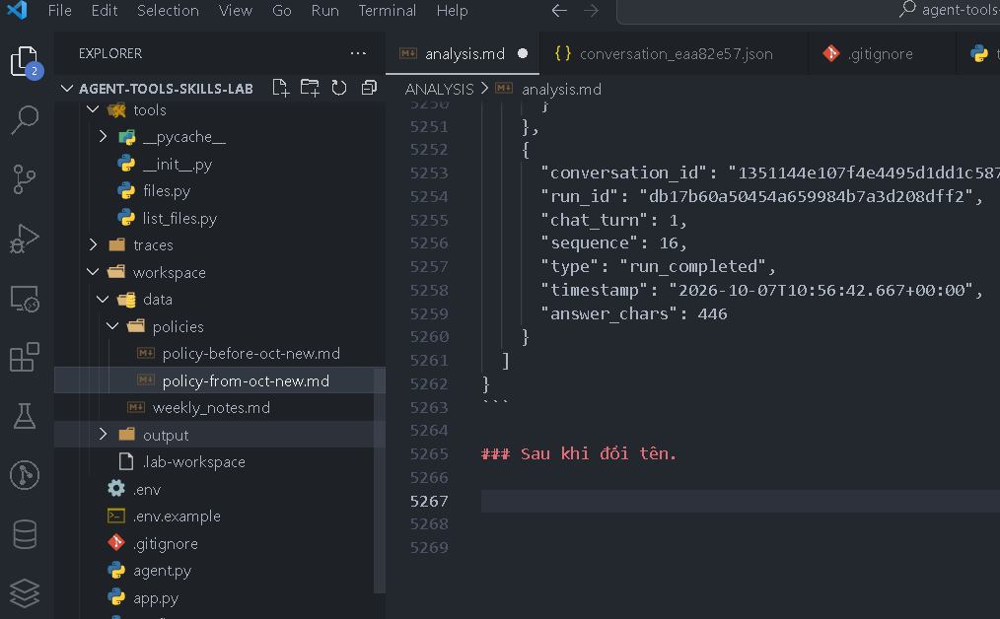

Yêu cầu Agent rằng

    Tôi mua ngày 28/09/2026, yêu cầu hoàn ngày 06/10/2026, chưa kích hoạt. Tôi có được hoàn không?

Kết quả hình ảnh.

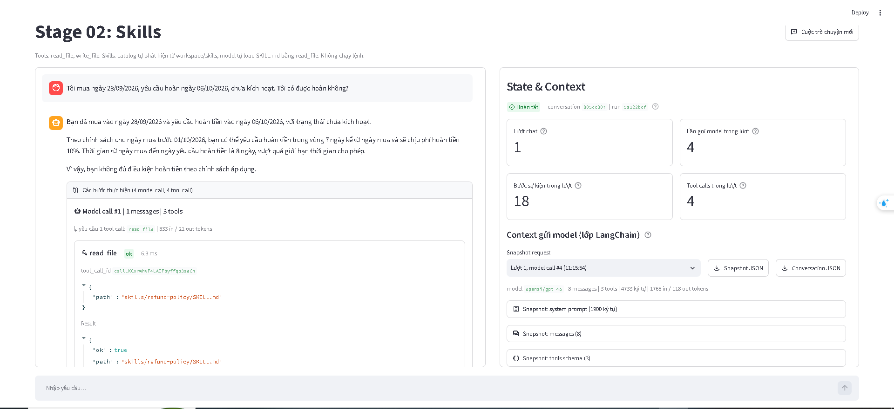
Kết quả conversation.json.

```
{
  "label": "Context gửi model (lớp LangChain), không phải provider wire payload",
  "conversation_id": "805cc307f2cb4c15aed7833930cb143f",
  "counters": {
    "Trạng thái": "Hoàn tất",
    "Lượt chat": 1,
    "Lần gọi model trong lượt": 4,
    "Bước sự kiện trong lượt": 18,
    "Tool calls trong lượt": 4
  },
  "messages": [
    {
      "role": "user",
      "type": "human",
      "content": " Tôi mua ngày 28/09/2026, yêu cầu hoàn ngày 06/10/2026, chưa kích hoạt. Tôi có được hoàn không?",
      "id": "17ef4fa2-a200-46a7-b3c7-8bd10e3c5f5c"
    },
    {
      "role": "assistant",
      "type": "ai",
      "content": "",
      "id": "lc_run--01a11613-9eee-7313-957a-3cce7e5fb9b2-0",
      "tool_calls": [
        {
          "id": "call_KCxrwhvF4LAIFbyffqp3aeCh",
          "name": "read_file",
          "args": {
            "path": "skills/refund-policy/SKILL.md"
          }
        }
      ],
      "usage_metadata": {
        "input_tokens": 833,
        "output_tokens": 21,
        "total_tokens": 854,
        "input_token_details": {
          "audio": 0,
          "cache_read": 0,
          "cache_creation": 0
        },
        "output_token_details": {
          "audio": 0,
          "reasoning": 0
        }
      }
    },
    {
      "role": "tool",
      "type": "tool",
      "content": "{\"ok\": true, \"path\": \"skills/refund-policy/SKILL.md\", \"content\": \"---\\nname: refund-policy\\ndescription: Xử lý, tra cứu chính sách và kiểm tra điều kiện hoàn tiền dựa trên ngày mua hàng của khách hàng. Sử dụng skill này khi người dùng hỏi về điều kiện hoàn tiền, mức phí, khả năng áp dụng hoặc xử lý yêu cầu hoàn tiền cho đơn hàng.\\n---\\n\\n# Quy trình kiểm tra điều kiện hoàn tiền\\n\\n## 1. Kiểm tra thông tin đầu vào\\nTrước khi đưa ra kết luận, kiểm tra xem người dùng đã cung cấp đủ 3 thông tin dưới đây chưa:\\n1. **Ngày mua hàng**\\n2. **Ngày yêu cầu hoàn tiền** (dùng ngày trong câu hỏi của người dùng, không dùng ngày hiện tại)\\n3. **Trạng thái kích hoạt sản phẩm** (Đã kích hoạt / Chưa kích hoạt)\\n\\n⚠️ **LƯU Ý QUAN TRỌNG:** \\nNếu thiếu bất kỳ thông tin nào trong 3 thông tin trên (đặc biệt là trạng thái kích hoạt), **TẬP TRUNG HỎI LẠI NGƯỜI DÙNG ĐỂ BỔ SUNG**, tuyệt đối không tự giả định \\\"chưa kích hoạt\\\" hay đưa ra kết luận sơ bộ.\\n\\n## 2. Tìm kiếm và chọn chính sách\\n1. Dùng tool `list_files` liệt kê tất cả các file trong thư mục `data/policies/`. KHÔNG dùng cố định tên file vì tên file có thể bị thay đổi.\\n2. Dùng tool `read_file` đọc nội dung các file chính sách tìm được để kiểm tra phạm vi hiệu lực theo ngày mua:\\n   - Ngày mua **trước 2026-10-01**: Áp dụng chính sách áp dụng cho ngày mua trước 2026-10-01.\\n   - Ngày mua **từ 2026-10-01 trở đi** (bao gồm cả ngày 2026-10-01): Áp dụng chính sách áp dụng cho ngày mua từ 2026-10-01.\\n\\n## 3. Tính toán số ngày và kiểm tra điều kiện\\n- **Số ngày đã qua** = Ngày yêu cầu hoàn tiền - Ngày mua hàng (tính bằng chênh lệch ngày lịch).\\n- So sánh số ngày đã qua với giới hạn thời gian trong chính sách tương ứng (bằng đúng giới hạn vẫn đủ điều kiện).\\n- Đánh giá điều kiện kích hoạt.\\n\\n## 4. Trả lời theo mẫu\\nTham khảo cấu trúc trình bày chuẩn trong file `references/answer-template.md`.\"}",
      "id": "aab6d6c3-f960-4859-9d9c-beaaf78fabb3",
      "tool_call_id": "call_KCxrwhvF4LAIFbyffqp3aeCh",
      "name": "read_file",
      "status": "success"
    },
    {
      "role": "assistant",
      "type": "ai",
      "content": "",
      "id": "lc_run--01a11613-a80b-7740-a782-c6080d6d38d6-0",
      "tool_calls": [
        {
          "id": "call_gQK1pGA5BiYblWvNm0sP35Md",
          "name": "list_files",
          "args": {
            "path": "data/policies/"
          }
        }
      ],
      "usage_metadata": {
        "input_tokens": 1448,
        "output_tokens": 17,
        "total_tokens": 1465,
        "input_token_details": {
          "audio": 0,
          "cache_read": 0,
          "cache_creation": 0
        },
        "output_token_details": {
          "audio": 0,
          "reasoning": 0
        }
      }
    },
    {
      "role": "tool",
      "type": "tool",
      "content": "- policy-before-oct-new.md (file): data/policies/policy-before-oct-new.md\n- policy-from-oct-new.md (file): data/policies/policy-from-oct-new.md",
      "id": "ffb77882-5cd6-446e-b5cf-9fd0b631a2b9",
      "tool_call_id": "call_gQK1pGA5BiYblWvNm0sP35Md",
      "name": "list_files",
      "status": "success"
    },
    {
      "role": "assistant",
      "type": "ai",
      "content": "",
      "id": "lc_run--01a11613-b099-7860-8d80-47a161970bdb-0",
      "tool_calls": [
        {
          "id": "call_2TJhG6HwyvLTqsEhBbj4Xt3p",
          "name": "read_file",
          "args": {
            "path": "data/policies/policy-before-oct-new.md"
          }
        },
        {
          "id": "call_DLjn0RLhn7FtVa9tdyZL8CXY",
          "name": "read_file",
          "args": {
            "path": "data/policies/policy-from-oct-new.md"
          }
        }
      ],
      "usage_metadata": {
        "input_tokens": 1514,
        "output_tokens": 62,
        "total_tokens": 1576,
        "input_token_details": {
          "audio": 0,
          "cache_read": 1408,
          "cache_creation": 0
        },
        "output_token_details": {
          "audio": 0,
          "reasoning": 0
        }
      }
    },
    {
      "role": "tool",
      "type": "tool",
      "content": "{\"ok\": true, \"path\": \"data/policies/policy-before-oct-new.md\", \"content\": \"# Chính sách hoàn tiền trước tháng 10\\nÁp dụng cho ngày mua trước 2026-10-01.\\nĐược yêu cầu hoàn tiền trong 7 ngày kể từ ngày mua.\\nPhí hoàn tiền: 10% giá trị đơn hàng.\\nKhông hoàn tiền nếu sản phẩm đã kích hoạt.\"}",
      "id": "ee356673-b716-4f53-8f9a-3e77d4bf4bde",
      "tool_call_id": "call_2TJhG6HwyvLTqsEhBbj4Xt3p",
      "name": "read_file",
      "status": "success"
    },
    {
      "role": "tool",
      "type": "tool",
      "content": "{\"ok\": true, \"path\": \"data/policies/policy-from-oct-new.md\", \"content\": \"# Chính sách hoàn tiền từ tháng 10\\nÁp dụng cho ngày mua từ 2026-10-01, bao gồm ngày này.\\nĐược yêu cầu hoàn tiền trong 14 ngày kể từ ngày mua.\\nKhông thu phí hoàn tiền.\\nKhông hoàn tiền nếu sản phẩm đã kích hoạt.\"}",
      "id": "6e918c8d-f82f-4a07-9ced-b3c611f5b870",
      "tool_call_id": "call_DLjn0RLhn7FtVa9tdyZL8CXY",
      "name": "read_file",
      "status": "success"
    },
    {
      "role": "assistant",
      "type": "ai",
      "content": "Bạn đã mua vào ngày 28/09/2026 và yêu cầu hoàn tiền vào ngày 06/10/2026, với trạng thái chưa kích hoạt.\n\nTheo chính sách cho ngày mua trước 01/10/2026, bạn có thể yêu cầu hoàn tiền trong vòng 7 ngày kể từ ngày mua và sẽ chịu phí hoàn tiền 10%. Thời gian từ ngày mua đến ngày yêu cầu hoàn tiền là 8 ngày, vượt quá giới hạn thời gian cho phép.\n\nVì vậy, bạn không đủ điều kiện hoàn tiền theo chính sách áp dụng.",
      "id": "lc_run--01a11613-bbc7-7aa0-a900-cb8d18ca31a0-0",
      "tool_calls": [],
      "usage_metadata": {
        "input_tokens": 1765,
        "output_tokens": 118,
        "total_tokens": 1883,
        "input_token_details": {
          "audio": 0,
          "cache_read": 1408,
          "cache_creation": 0
        },
        "output_token_details": {
          "audio": 0,
          "reasoning": 0
        }
      }
    }
  ],
  "snapshots": [
    {
      "label": "Context gửi model (lớp LangChain)",
      "conversation_id": "805cc307f2cb4c15aed7833930cb143f",
      "run_id": "5a122bcf6abe4995b6bdea3669d317ed",
      "chat_turn": 1,
      "model_call_index": 1,
      "event_sequence": 2,
      "captured_at": "2026-10-07T11:15:47.053+00:00",
      "model_name": "openai/gpt-4o",
      "system_prompt": "Bạn là trợ lý trong lab \"Agent Tools & Skills\". Trả lời bằng tiếng Việt, ngắn gọn, rõ ràng.\n\nQuy tắc:\n- Chỉ dùng các tool được cấp trong request để thao tác dữ liệu. Nếu không có tool phù hợp, nói rõ giới hạn thay vì đoán.\n- Chỉ nói đã đọc, ghi hoặc chạy một thứ khi đã nhận tool result thành công cho đúng thao tác đó.\n- Khi tool trả lỗi, báo lỗi cho người dùng và đề xuất cách xử lý; không bịa kết quả.\n\nWorkspace:\n- Mọi đường dẫn file đều tương đối workspace, ví dụ data/weekly_notes.md.\n- read_file đọc được file trong workspace. write_file chỉ ghi được dưới output/, ví dụ output/summary.md.\n- Bạn không chạy được lệnh shell trong project này.\n\nSkills:\nCác skill dưới đây chứa hướng dẫn chuyên biệt. Danh sách chỉ có metadata; nội dung skill chưa được nạp.\n- Khi task khớp description của một skill, dùng read_file đọc SKILL.md tại <location> trước khi làm, rồi làm theo hướng dẫn trong đó.\n- Đường dẫn tương đối trong SKILL.md được resolve từ thư mục chứa SKILL.md. Ví dụ references/x.md của skill tại skills/abc/SKILL.md là skills/abc/references/x.md.\n- Chỉ đọc tài nguyên cần cho task. Không load skill khi task không liên quan.\n\n<available_skills>\n  <skill>\n    <name>refund-policy</name>\n    <description>Xử lý, tra cứu chính sách và kiểm tra điều kiện hoàn tiền dựa trên ngày mua hàng của khách hàng. Sử dụng skill này khi người dùng hỏi về điều kiện hoàn tiền, mức phí, khả năng áp dụng hoặc xử lý yêu cầu hoàn tiền cho đơn hàng.</description>\n    <location>skills/refund-policy/SKILL.md</location>\n  </skill>\n  <skill>\n    <name>weekly-report</name>\n    <description>Tạo báo cáo tiến độ tuần từ file ghi chú công việc trong workspace (ví dụ data/weekly_notes.md) và lưu thành file Markdown dưới output/. Dùng khi người dùng yêu cầu báo cáo tuần, tổng hợp tiến độ tuần hoặc weekly report.</description>\n    <location>skills/weekly-report/SKILL.md</location>\n  </skill>\n</available_skills>",
      "messages": [
        {
          "role": "user",
          "type": "human",
          "content": " Tôi mua ngày 28/09/2026, yêu cầu hoàn ngày 06/10/2026, chưa kích hoạt. Tôi có được hoàn không?",
          "id": "17ef4fa2-a200-46a7-b3c7-8bd10e3c5f5c"
        }
      ],
      "tools": [
        {
          "name": "read_file",
          "description": "Đọc một file văn bản UTF-8 trong workspace và trả về JSON.\n\npath là đường dẫn tương đối workspace, ví dụ: data/weekly_notes.md, output/summary.md.\nDùng để đọc dữ liệu đầu vào, file SKILL.md của một skill và các file reference trong thư mục skill.\nThành công: {\"ok\": true, \"path\": ..., \"content\": ...}. Lỗi: {\"ok\": false, \"error\": {\"code\": ..., \"message\": ...}}.",
          "parameters": {
            "properties": {
              "path": {
                "type": "string"
              }
            },
            "required": [
              "path"
            ],
            "type": "object"
          }
        },
        {
          "name": "write_file",
          "description": "Ghi nội dung văn bản UTF-8 vào một file dưới output/ của workspace và trả về JSON.\n\npath là đường dẫn tương đối workspace và phải bắt đầu bằng output/, ví dụ output/summary.md.\nTự tạo thư mục con. Ghi đè nếu file đã tồn tại.\nThành công: {\"ok\": true, \"path\": ..., \"bytes\": ..., \"status\": \"created\" | \"updated\"}. Lỗi: {\"ok\": false, \"error\": {...}}.",
          "parameters": {
            "properties": {
              "path": {
                "type": "string"
              },
              "content": {
                "type": "string"
              }
            },
            "required": [
              "path",
              "content"
            ],
            "type": "object"
          }
        },
        {
          "name": "list_files",
          "description": "Liệt kê các file và thư mục con trực tiếp trong một thư mục thuộc workspace.\n\nArgs:\n    path: Đường dẫn thư mục tương đối với workspace (ví dụ: 'data/policies').",
          "parameters": {
            "properties": {
              "path": {
                "type": "string"
              }
            },
            "required": [
              "path"
            ],
            "type": "object"
          }
        }
      ],
      "message_count": 1,
      "system_prompt_chars": 1900,
      "message_chars": 95,
      "usage": {
        "input_tokens": 833,
        "output_tokens": 21,
        "total_tokens": 854,
        "input_token_details": {
          "audio": 0,
          "cache_read": 0,
          "cache_creation": 0
        },
        "output_token_details": {
          "audio": 0,
          "reasoning": 0
        }
      }
    },
    {
      "label": "Context gửi model (lớp LangChain)",
      "conversation_id": "805cc307f2cb4c15aed7833930cb143f",
      "run_id": "5a122bcf6abe4995b6bdea3669d317ed",
      "chat_turn": 1,
      "model_call_index": 2,
      "event_sequence": 6,
      "captured_at": "2026-10-07T11:15:49.386+00:00",
      "model_name": "openai/gpt-4o",
      "system_prompt": "Bạn là trợ lý trong lab \"Agent Tools & Skills\". Trả lời bằng tiếng Việt, ngắn gọn, rõ ràng.\n\nQuy tắc:\n- Chỉ dùng các tool được cấp trong request để thao tác dữ liệu. Nếu không có tool phù hợp, nói rõ giới hạn thay vì đoán.\n- Chỉ nói đã đọc, ghi hoặc chạy một thứ khi đã nhận tool result thành công cho đúng thao tác đó.\n- Khi tool trả lỗi, báo lỗi cho người dùng và đề xuất cách xử lý; không bịa kết quả.\n\nWorkspace:\n- Mọi đường dẫn file đều tương đối workspace, ví dụ data/weekly_notes.md.\n- read_file đọc được file trong workspace. write_file chỉ ghi được dưới output/, ví dụ output/summary.md.\n- Bạn không chạy được lệnh shell trong project này.\n\nSkills:\nCác skill dưới đây chứa hướng dẫn chuyên biệt. Danh sách chỉ có metadata; nội dung skill chưa được nạp.\n- Khi task khớp description của một skill, dùng read_file đọc SKILL.md tại <location> trước khi làm, rồi làm theo hướng dẫn trong đó.\n- Đường dẫn tương đối trong SKILL.md được resolve từ thư mục chứa SKILL.md. Ví dụ references/x.md của skill tại skills/abc/SKILL.md là skills/abc/references/x.md.\n- Chỉ đọc tài nguyên cần cho task. Không load skill khi task không liên quan.\n\n<available_skills>\n  <skill>\n    <name>refund-policy</name>\n    <description>Xử lý, tra cứu chính sách và kiểm tra điều kiện hoàn tiền dựa trên ngày mua hàng của khách hàng. Sử dụng skill này khi người dùng hỏi về điều kiện hoàn tiền, mức phí, khả năng áp dụng hoặc xử lý yêu cầu hoàn tiền cho đơn hàng.</description>\n    <location>skills/refund-policy/SKILL.md</location>\n  </skill>\n  <skill>\n    <name>weekly-report</name>\n    <description>Tạo báo cáo tiến độ tuần từ file ghi chú công việc trong workspace (ví dụ data/weekly_notes.md) và lưu thành file Markdown dưới output/. Dùng khi người dùng yêu cầu báo cáo tuần, tổng hợp tiến độ tuần hoặc weekly report.</description>\n    <location>skills/weekly-report/SKILL.md</location>\n  </skill>\n</available_skills>",
      "messages": [
        {
          "role": "user",
          "type": "human",
          "content": " Tôi mua ngày 28/09/2026, yêu cầu hoàn ngày 06/10/2026, chưa kích hoạt. Tôi có được hoàn không?",
          "id": "17ef4fa2-a200-46a7-b3c7-8bd10e3c5f5c"
        },
        {
          "role": "assistant",
          "type": "ai",
          "content": "",
          "id": "lc_run--01a11613-9eee-7313-957a-3cce7e5fb9b2-0",
          "tool_calls": [
            {
              "id": "call_KCxrwhvF4LAIFbyffqp3aeCh",
              "name": "read_file",
              "args": {
                "path": "skills/refund-policy/SKILL.md"
              }
            }
          ],
          "usage_metadata": {
            "input_tokens": 833,
            "output_tokens": 21,
            "total_tokens": 854,
            "input_token_details": {
              "audio": 0,
              "cache_read": 0,
              "cache_creation": 0
            },
            "output_token_details": {
              "audio": 0,
              "reasoning": 0
            }
          }
        },
        {
          "role": "tool",
          "type": "tool",
          "content": "{\"ok\": true, \"path\": \"skills/refund-policy/SKILL.md\", \"content\": \"---\\nname: refund-policy\\ndescription: Xử lý, tra cứu chính sách và kiểm tra điều kiện hoàn tiền dựa trên ngày mua hàng của khách hàng. Sử dụng skill này khi người dùng hỏi về điều kiện hoàn tiền, mức phí, khả năng áp dụng hoặc xử lý yêu cầu hoàn tiền cho đơn hàng.\\n---\\n\\n# Quy trình kiểm tra điều kiện hoàn tiền\\n\\n## 1. Kiểm tra thông tin đầu vào\\nTrước khi đưa ra kết luận, kiểm tra xem người dùng đã cung cấp đủ 3 thông tin dưới đây chưa:\\n1. **Ngày mua hàng**\\n2. **Ngày yêu cầu hoàn tiền** (dùng ngày trong câu hỏi của người dùng, không dùng ngày hiện tại)\\n3. **Trạng thái kích hoạt sản phẩm** (Đã kích hoạt / Chưa kích hoạt)\\n\\n⚠️ **LƯU Ý QUAN TRỌNG:** \\nNếu thiếu bất kỳ thông tin nào trong 3 thông tin trên (đặc biệt là trạng thái kích hoạt), **TẬP TRUNG HỎI LẠI NGƯỜI DÙNG ĐỂ BỔ SUNG**, tuyệt đối không tự giả định \\\"chưa kích hoạt\\\" hay đưa ra kết luận sơ bộ.\\n\\n## 2. Tìm kiếm và chọn chính sách\\n1. Dùng tool `list_files` liệt kê tất cả các file trong thư mục `data/policies/`. KHÔNG dùng cố định tên file vì tên file có thể bị thay đổi.\\n2. Dùng tool `read_file` đọc nội dung các file chính sách tìm được để kiểm tra phạm vi hiệu lực theo ngày mua:\\n   - Ngày mua **trước 2026-10-01**: Áp dụng chính sách áp dụng cho ngày mua trước 2026-10-01.\\n   - Ngày mua **từ 2026-10-01 trở đi** (bao gồm cả ngày 2026-10-01): Áp dụng chính sách áp dụng cho ngày mua từ 2026-10-01.\\n\\n## 3. Tính toán số ngày và kiểm tra điều kiện\\n- **Số ngày đã qua** = Ngày yêu cầu hoàn tiền - Ngày mua hàng (tính bằng chênh lệch ngày lịch).\\n- So sánh số ngày đã qua với giới hạn thời gian trong chính sách tương ứng (bằng đúng giới hạn vẫn đủ điều kiện).\\n- Đánh giá điều kiện kích hoạt.\\n\\n## 4. Trả lời theo mẫu\\nTham khảo cấu trúc trình bày chuẩn trong file `references/answer-template.md`.\"}",
          "id": "aab6d6c3-f960-4859-9d9c-beaaf78fabb3",
          "tool_call_id": "call_KCxrwhvF4LAIFbyffqp3aeCh",
          "name": "read_file",
          "status": "success"
        }
      ],
      "tools": [
        {
          "name": "read_file",
          "description": "Đọc một file văn bản UTF-8 trong workspace và trả về JSON.\n\npath là đường dẫn tương đối workspace, ví dụ: data/weekly_notes.md, output/summary.md.\nDùng để đọc dữ liệu đầu vào, file SKILL.md của một skill và các file reference trong thư mục skill.\nThành công: {\"ok\": true, \"path\": ..., \"content\": ...}. Lỗi: {\"ok\": false, \"error\": {\"code\": ..., \"message\": ...}}.",
          "parameters": {
            "properties": {
              "path": {
                "type": "string"
              }
            },
            "required": [
              "path"
            ],
            "type": "object"
          }
        },
        {
          "name": "write_file",
          "description": "Ghi nội dung văn bản UTF-8 vào một file dưới output/ của workspace và trả về JSON.\n\npath là đường dẫn tương đối workspace và phải bắt đầu bằng output/, ví dụ output/summary.md.\nTự tạo thư mục con. Ghi đè nếu file đã tồn tại.\nThành công: {\"ok\": true, \"path\": ..., \"bytes\": ..., \"status\": \"created\" | \"updated\"}. Lỗi: {\"ok\": false, \"error\": {...}}.",
          "parameters": {
            "properties": {
              "path": {
                "type": "string"
              },
              "content": {
                "type": "string"
              }
            },
            "required": [
              "path",
              "content"
            ],
            "type": "object"
          }
        },
        {
          "name": "list_files",
          "description": "Liệt kê các file và thư mục con trực tiếp trong một thư mục thuộc workspace.\n\nArgs:\n    path: Đường dẫn thư mục tương đối với workspace (ví dụ: 'data/policies').",
          "parameters": {
            "properties": {
              "path": {
                "type": "string"
              }
            },
            "required": [
              "path"
            ],
            "type": "object"
          }
        }
      ],
      "message_count": 3,
      "system_prompt_chars": 1900,
      "message_chars": 1989,
      "usage": {
        "input_tokens": 1448,
        "output_tokens": 17,
        "total_tokens": 1465,
        "input_token_details": {
          "audio": 0,
          "cache_read": 0,
          "cache_creation": 0
        },
        "output_token_details": {
          "audio": 0,
          "reasoning": 0
        }
      }
    },
    {
      "label": "Context gửi model (lớp LangChain)",
      "conversation_id": "805cc307f2cb4c15aed7833930cb143f",
      "run_id": "5a122bcf6abe4995b6bdea3669d317ed",
      "chat_turn": 1,
      "model_call_index": 3,
      "event_sequence": 10,
      "captured_at": "2026-10-07T11:15:51.576+00:00",
      "model_name": "openai/gpt-4o",
      "system_prompt": "Bạn là trợ lý trong lab \"Agent Tools & Skills\". Trả lời bằng tiếng Việt, ngắn gọn, rõ ràng.\n\nQuy tắc:\n- Chỉ dùng các tool được cấp trong request để thao tác dữ liệu. Nếu không có tool phù hợp, nói rõ giới hạn thay vì đoán.\n- Chỉ nói đã đọc, ghi hoặc chạy một thứ khi đã nhận tool result thành công cho đúng thao tác đó.\n- Khi tool trả lỗi, báo lỗi cho người dùng và đề xuất cách xử lý; không bịa kết quả.\n\nWorkspace:\n- Mọi đường dẫn file đều tương đối workspace, ví dụ data/weekly_notes.md.\n- read_file đọc được file trong workspace. write_file chỉ ghi được dưới output/, ví dụ output/summary.md.\n- Bạn không chạy được lệnh shell trong project này.\n\nSkills:\nCác skill dưới đây chứa hướng dẫn chuyên biệt. Danh sách chỉ có metadata; nội dung skill chưa được nạp.\n- Khi task khớp description của một skill, dùng read_file đọc SKILL.md tại <location> trước khi làm, rồi làm theo hướng dẫn trong đó.\n- Đường dẫn tương đối trong SKILL.md được resolve từ thư mục chứa SKILL.md. Ví dụ references/x.md của skill tại skills/abc/SKILL.md là skills/abc/references/x.md.\n- Chỉ đọc tài nguyên cần cho task. Không load skill khi task không liên quan.\n\n<available_skills>\n  <skill>\n    <name>refund-policy</name>\n    <description>Xử lý, tra cứu chính sách và kiểm tra điều kiện hoàn tiền dựa trên ngày mua hàng của khách hàng. Sử dụng skill này khi người dùng hỏi về điều kiện hoàn tiền, mức phí, khả năng áp dụng hoặc xử lý yêu cầu hoàn tiền cho đơn hàng.</description>\n    <location>skills/refund-policy/SKILL.md</location>\n  </skill>\n  <skill>\n    <name>weekly-report</name>\n    <description>Tạo báo cáo tiến độ tuần từ file ghi chú công việc trong workspace (ví dụ data/weekly_notes.md) và lưu thành file Markdown dưới output/. Dùng khi người dùng yêu cầu báo cáo tuần, tổng hợp tiến độ tuần hoặc weekly report.</description>\n    <location>skills/weekly-report/SKILL.md</location>\n  </skill>\n</available_skills>",
      "messages": [
        {
          "role": "user",
          "type": "human",
          "content": " Tôi mua ngày 28/09/2026, yêu cầu hoàn ngày 06/10/2026, chưa kích hoạt. Tôi có được hoàn không?",
          "id": "17ef4fa2-a200-46a7-b3c7-8bd10e3c5f5c"
        },
        {
          "role": "assistant",
          "type": "ai",
          "content": "",
          "id": "lc_run--01a11613-9eee-7313-957a-3cce7e5fb9b2-0",
          "tool_calls": [
            {
              "id": "call_KCxrwhvF4LAIFbyffqp3aeCh",
              "name": "read_file",
              "args": {
                "path": "skills/refund-policy/SKILL.md"
              }
            }
          ],
          "usage_metadata": {
            "input_tokens": 833,
            "output_tokens": 21,
            "total_tokens": 854,
            "input_token_details": {
              "audio": 0,
              "cache_read": 0,
              "cache_creation": 0
            },
            "output_token_details": {
              "audio": 0,
              "reasoning": 0
            }
          }
        },
        {
          "role": "tool",
          "type": "tool",
          "content": "{\"ok\": true, \"path\": \"skills/refund-policy/SKILL.md\", \"content\": \"---\\nname: refund-policy\\ndescription: Xử lý, tra cứu chính sách và kiểm tra điều kiện hoàn tiền dựa trên ngày mua hàng của khách hàng. Sử dụng skill này khi người dùng hỏi về điều kiện hoàn tiền, mức phí, khả năng áp dụng hoặc xử lý yêu cầu hoàn tiền cho đơn hàng.\\n---\\n\\n# Quy trình kiểm tra điều kiện hoàn tiền\\n\\n## 1. Kiểm tra thông tin đầu vào\\nTrước khi đưa ra kết luận, kiểm tra xem người dùng đã cung cấp đủ 3 thông tin dưới đây chưa:\\n1. **Ngày mua hàng**\\n2. **Ngày yêu cầu hoàn tiền** (dùng ngày trong câu hỏi của người dùng, không dùng ngày hiện tại)\\n3. **Trạng thái kích hoạt sản phẩm** (Đã kích hoạt / Chưa kích hoạt)\\n\\n⚠️ **LƯU Ý QUAN TRỌNG:** \\nNếu thiếu bất kỳ thông tin nào trong 3 thông tin trên (đặc biệt là trạng thái kích hoạt), **TẬP TRUNG HỎI LẠI NGƯỜI DÙNG ĐỂ BỔ SUNG**, tuyệt đối không tự giả định \\\"chưa kích hoạt\\\" hay đưa ra kết luận sơ bộ.\\n\\n## 2. Tìm kiếm và chọn chính sách\\n1. Dùng tool `list_files` liệt kê tất cả các file trong thư mục `data/policies/`. KHÔNG dùng cố định tên file vì tên file có thể bị thay đổi.\\n2. Dùng tool `read_file` đọc nội dung các file chính sách tìm được để kiểm tra phạm vi hiệu lực theo ngày mua:\\n   - Ngày mua **trước 2026-10-01**: Áp dụng chính sách áp dụng cho ngày mua trước 2026-10-01.\\n   - Ngày mua **từ 2026-10-01 trở đi** (bao gồm cả ngày 2026-10-01): Áp dụng chính sách áp dụng cho ngày mua từ 2026-10-01.\\n\\n## 3. Tính toán số ngày và kiểm tra điều kiện\\n- **Số ngày đã qua** = Ngày yêu cầu hoàn tiền - Ngày mua hàng (tính bằng chênh lệch ngày lịch).\\n- So sánh số ngày đã qua với giới hạn thời gian trong chính sách tương ứng (bằng đúng giới hạn vẫn đủ điều kiện).\\n- Đánh giá điều kiện kích hoạt.\\n\\n## 4. Trả lời theo mẫu\\nTham khảo cấu trúc trình bày chuẩn trong file `references/answer-template.md`.\"}",
          "id": "aab6d6c3-f960-4859-9d9c-beaaf78fabb3",
          "tool_call_id": "call_KCxrwhvF4LAIFbyffqp3aeCh",
          "name": "read_file",
          "status": "success"
        },
        {
          "role": "assistant",
          "type": "ai",
          "content": "",
          "id": "lc_run--01a11613-a80b-7740-a782-c6080d6d38d6-0",
          "tool_calls": [
            {
              "id": "call_gQK1pGA5BiYblWvNm0sP35Md",
              "name": "list_files",
              "args": {
                "path": "data/policies/"
              }
            }
          ],
          "usage_metadata": {
            "input_tokens": 1448,
            "output_tokens": 17,
            "total_tokens": 1465,
            "input_token_details": {
              "audio": 0,
              "cache_read": 0,
              "cache_creation": 0
            },
            "output_token_details": {
              "audio": 0,
              "reasoning": 0
            }
          }
        },
        {
          "role": "tool",
          "type": "tool",
          "content": "- policy-before-oct-new.md (file): data/policies/policy-before-oct-new.md\n- policy-from-oct-new.md (file): data/policies/policy-from-oct-new.md",
          "id": "ffb77882-5cd6-446e-b5cf-9fd0b631a2b9",
          "tool_call_id": "call_gQK1pGA5BiYblWvNm0sP35Md",
          "name": "list_files",
          "status": "success"
        }
      ],
      "tools": [
        {
          "name": "read_file",
          "description": "Đọc một file văn bản UTF-8 trong workspace và trả về JSON.\n\npath là đường dẫn tương đối workspace, ví dụ: data/weekly_notes.md, output/summary.md.\nDùng để đọc dữ liệu đầu vào, file SKILL.md của một skill và các file reference trong thư mục skill.\nThành công: {\"ok\": true, \"path\": ..., \"content\": ...}. Lỗi: {\"ok\": false, \"error\": {\"code\": ..., \"message\": ...}}.",
          "parameters": {
            "properties": {
              "path": {
                "type": "string"
              }
            },
            "required": [
              "path"
            ],
            "type": "object"
          }
        },
        {
          "name": "write_file",
          "description": "Ghi nội dung văn bản UTF-8 vào một file dưới output/ của workspace và trả về JSON.\n\npath là đường dẫn tương đối workspace và phải bắt đầu bằng output/, ví dụ output/summary.md.\nTự tạo thư mục con. Ghi đè nếu file đã tồn tại.\nThành công: {\"ok\": true, \"path\": ..., \"bytes\": ..., \"status\": \"created\" | \"updated\"}. Lỗi: {\"ok\": false, \"error\": {...}}.",
          "parameters": {
            "properties": {
              "path": {
                "type": "string"
              },
              "content": {
                "type": "string"
              }
            },
            "required": [
              "path",
              "content"
            ],
            "type": "object"
          }
        },
        {
          "name": "list_files",
          "description": "Liệt kê các file và thư mục con trực tiếp trong một thư mục thuộc workspace.\n\nArgs:\n    path: Đường dẫn thư mục tương đối với workspace (ví dụ: 'data/policies').",
          "parameters": {
            "properties": {
              "path": {
                "type": "string"
              }
            },
            "required": [
              "path"
            ],
            "type": "object"
          }
        }
      ],
      "message_count": 5,
      "system_prompt_chars": 1900,
      "message_chars": 2158,
      "usage": {
        "input_tokens": 1514,
        "output_tokens": 62,
        "total_tokens": 1576,
        "input_token_details": {
          "audio": 0,
          "cache_read": 1408,
          "cache_creation": 0
        },
        "output_token_details": {
          "audio": 0,
          "reasoning": 0
        }
      }
    },
    {
      "label": "Context gửi model (lớp LangChain)",
      "conversation_id": "805cc307f2cb4c15aed7833930cb143f",
      "run_id": "5a122bcf6abe4995b6bdea3669d317ed",
      "chat_turn": 1,
      "model_call_index": 4,
      "event_sequence": 16,
      "captured_at": "2026-10-07T11:15:54.439+00:00",
      "model_name": "openai/gpt-4o",
      "system_prompt": "Bạn là trợ lý trong lab \"Agent Tools & Skills\". Trả lời bằng tiếng Việt, ngắn gọn, rõ ràng.\n\nQuy tắc:\n- Chỉ dùng các tool được cấp trong request để thao tác dữ liệu. Nếu không có tool phù hợp, nói rõ giới hạn thay vì đoán.\n- Chỉ nói đã đọc, ghi hoặc chạy một thứ khi đã nhận tool result thành công cho đúng thao tác đó.\n- Khi tool trả lỗi, báo lỗi cho người dùng và đề xuất cách xử lý; không bịa kết quả.\n\nWorkspace:\n- Mọi đường dẫn file đều tương đối workspace, ví dụ data/weekly_notes.md.\n- read_file đọc được file trong workspace. write_file chỉ ghi được dưới output/, ví dụ output/summary.md.\n- Bạn không chạy được lệnh shell trong project này.\n\nSkills:\nCác skill dưới đây chứa hướng dẫn chuyên biệt. Danh sách chỉ có metadata; nội dung skill chưa được nạp.\n- Khi task khớp description của một skill, dùng read_file đọc SKILL.md tại <location> trước khi làm, rồi làm theo hướng dẫn trong đó.\n- Đường dẫn tương đối trong SKILL.md được resolve từ thư mục chứa SKILL.md. Ví dụ references/x.md của skill tại skills/abc/SKILL.md là skills/abc/references/x.md.\n- Chỉ đọc tài nguyên cần cho task. Không load skill khi task không liên quan.\n\n<available_skills>\n  <skill>\n    <name>refund-policy</name>\n    <description>Xử lý, tra cứu chính sách và kiểm tra điều kiện hoàn tiền dựa trên ngày mua hàng của khách hàng. Sử dụng skill này khi người dùng hỏi về điều kiện hoàn tiền, mức phí, khả năng áp dụng hoặc xử lý yêu cầu hoàn tiền cho đơn hàng.</description>\n    <location>skills/refund-policy/SKILL.md</location>\n  </skill>\n  <skill>\n    <name>weekly-report</name>\n    <description>Tạo báo cáo tiến độ tuần từ file ghi chú công việc trong workspace (ví dụ data/weekly_notes.md) và lưu thành file Markdown dưới output/. Dùng khi người dùng yêu cầu báo cáo tuần, tổng hợp tiến độ tuần hoặc weekly report.</description>\n    <location>skills/weekly-report/SKILL.md</location>\n  </skill>\n</available_skills>",
      "messages": [
        {
          "role": "user",
          "type": "human",
          "content": " Tôi mua ngày 28/09/2026, yêu cầu hoàn ngày 06/10/2026, chưa kích hoạt. Tôi có được hoàn không?",
          "id": "17ef4fa2-a200-46a7-b3c7-8bd10e3c5f5c"
        },
        {
          "role": "assistant",
          "type": "ai",
          "content": "",
          "id": "lc_run--01a11613-9eee-7313-957a-3cce7e5fb9b2-0",
          "tool_calls": [
            {
              "id": "call_KCxrwhvF4LAIFbyffqp3aeCh",
              "name": "read_file",
              "args": {
                "path": "skills/refund-policy/SKILL.md"
              }
            }
          ],
          "usage_metadata": {
            "input_tokens": 833,
            "output_tokens": 21,
            "total_tokens": 854,
            "input_token_details": {
              "audio": 0,
              "cache_read": 0,
              "cache_creation": 0
            },
            "output_token_details": {
              "audio": 0,
              "reasoning": 0
            }
          }
        },
        {
          "role": "tool",
          "type": "tool",
          "content": "{\"ok\": true, \"path\": \"skills/refund-policy/SKILL.md\", \"content\": \"---\\nname: refund-policy\\ndescription: Xử lý, tra cứu chính sách và kiểm tra điều kiện hoàn tiền dựa trên ngày mua hàng của khách hàng. Sử dụng skill này khi người dùng hỏi về điều kiện hoàn tiền, mức phí, khả năng áp dụng hoặc xử lý yêu cầu hoàn tiền cho đơn hàng.\\n---\\n\\n# Quy trình kiểm tra điều kiện hoàn tiền\\n\\n## 1. Kiểm tra thông tin đầu vào\\nTrước khi đưa ra kết luận, kiểm tra xem người dùng đã cung cấp đủ 3 thông tin dưới đây chưa:\\n1. **Ngày mua hàng**\\n2. **Ngày yêu cầu hoàn tiền** (dùng ngày trong câu hỏi của người dùng, không dùng ngày hiện tại)\\n3. **Trạng thái kích hoạt sản phẩm** (Đã kích hoạt / Chưa kích hoạt)\\n\\n⚠️ **LƯU Ý QUAN TRỌNG:** \\nNếu thiếu bất kỳ thông tin nào trong 3 thông tin trên (đặc biệt là trạng thái kích hoạt), **TẬP TRUNG HỎI LẠI NGƯỜI DÙNG ĐỂ BỔ SUNG**, tuyệt đối không tự giả định \\\"chưa kích hoạt\\\" hay đưa ra kết luận sơ bộ.\\n\\n## 2. Tìm kiếm và chọn chính sách\\n1. Dùng tool `list_files` liệt kê tất cả các file trong thư mục `data/policies/`. KHÔNG dùng cố định tên file vì tên file có thể bị thay đổi.\\n2. Dùng tool `read_file` đọc nội dung các file chính sách tìm được để kiểm tra phạm vi hiệu lực theo ngày mua:\\n   - Ngày mua **trước 2026-10-01**: Áp dụng chính sách áp dụng cho ngày mua trước 2026-10-01.\\n   - Ngày mua **từ 2026-10-01 trở đi** (bao gồm cả ngày 2026-10-01): Áp dụng chính sách áp dụng cho ngày mua từ 2026-10-01.\\n\\n## 3. Tính toán số ngày và kiểm tra điều kiện\\n- **Số ngày đã qua** = Ngày yêu cầu hoàn tiền - Ngày mua hàng (tính bằng chênh lệch ngày lịch).\\n- So sánh số ngày đã qua với giới hạn thời gian trong chính sách tương ứng (bằng đúng giới hạn vẫn đủ điều kiện).\\n- Đánh giá điều kiện kích hoạt.\\n\\n## 4. Trả lời theo mẫu\\nTham khảo cấu trúc trình bày chuẩn trong file `references/answer-template.md`.\"}",
          "id": "aab6d6c3-f960-4859-9d9c-beaaf78fabb3",
          "tool_call_id": "call_KCxrwhvF4LAIFbyffqp3aeCh",
          "name": "read_file",
          "status": "success"
        },
        {
          "role": "assistant",
          "type": "ai",
          "content": "",
          "id": "lc_run--01a11613-a80b-7740-a782-c6080d6d38d6-0",
          "tool_calls": [
            {
              "id": "call_gQK1pGA5BiYblWvNm0sP35Md",
              "name": "list_files",
              "args": {
                "path": "data/policies/"
              }
            }
          ],
          "usage_metadata": {
            "input_tokens": 1448,
            "output_tokens": 17,
            "total_tokens": 1465,
            "input_token_details": {
              "audio": 0,
              "cache_read": 0,
              "cache_creation": 0
            },
            "output_token_details": {
              "audio": 0,
              "reasoning": 0
            }
          }
        },
        {
          "role": "tool",
          "type": "tool",
          "content": "- policy-before-oct-new.md (file): data/policies/policy-before-oct-new.md\n- policy-from-oct-new.md (file): data/policies/policy-from-oct-new.md",
          "id": "ffb77882-5cd6-446e-b5cf-9fd0b631a2b9",
          "tool_call_id": "call_gQK1pGA5BiYblWvNm0sP35Md",
          "name": "list_files",
          "status": "success"
        },
        {
          "role": "assistant",
          "type": "ai",
          "content": "",
          "id": "lc_run--01a11613-b099-7860-8d80-47a161970bdb-0",
          "tool_calls": [
            {
              "id": "call_2TJhG6HwyvLTqsEhBbj4Xt3p",
              "name": "read_file",
              "args": {
                "path": "data/policies/policy-before-oct-new.md"
              }
            },
            {
              "id": "call_DLjn0RLhn7FtVa9tdyZL8CXY",
              "name": "read_file",
              "args": {
                "path": "data/policies/policy-from-oct-new.md"
              }
            }
          ],
          "usage_metadata": {
            "input_tokens": 1514,
            "output_tokens": 62,
            "total_tokens": 1576,
            "input_token_details": {
              "audio": 0,
              "cache_read": 1408,
              "cache_creation": 0
            },
            "output_token_details": {
              "audio": 0,
              "reasoning": 0
            }
          }
        },
        {
          "role": "tool",
          "type": "tool",
          "content": "{\"ok\": true, \"path\": \"data/policies/policy-before-oct-new.md\", \"content\": \"# Chính sách hoàn tiền trước tháng 10\\nÁp dụng cho ngày mua trước 2026-10-01.\\nĐược yêu cầu hoàn tiền trong 7 ngày kể từ ngày mua.\\nPhí hoàn tiền: 10% giá trị đơn hàng.\\nKhông hoàn tiền nếu sản phẩm đã kích hoạt.\"}",
          "id": "ee356673-b716-4f53-8f9a-3e77d4bf4bde",
          "tool_call_id": "call_2TJhG6HwyvLTqsEhBbj4Xt3p",
          "name": "read_file",
          "status": "success"
        },
        {
          "role": "tool",
          "type": "tool",
          "content": "{\"ok\": true, \"path\": \"data/policies/policy-from-oct-new.md\", \"content\": \"# Chính sách hoàn tiền từ tháng 10\\nÁp dụng cho ngày mua từ 2026-10-01, bao gồm ngày này.\\nĐược yêu cầu hoàn tiền trong 14 ngày kể từ ngày mua.\\nKhông thu phí hoàn tiền.\\nKhông hoàn tiền nếu sản phẩm đã kích hoạt.\"}",
          "id": "6e918c8d-f82f-4a07-9ced-b3c611f5b870",
          "tool_call_id": "call_DLjn0RLhn7FtVa9tdyZL8CXY",
          "name": "read_file",
          "status": "success"
        }
      ],
      "tools": [
        {
          "name": "read_file",
          "description": "Đọc một file văn bản UTF-8 trong workspace và trả về JSON.\n\npath là đường dẫn tương đối workspace, ví dụ: data/weekly_notes.md, output/summary.md.\nDùng để đọc dữ liệu đầu vào, file SKILL.md của một skill và các file reference trong thư mục skill.\nThành công: {\"ok\": true, \"path\": ..., \"content\": ...}. Lỗi: {\"ok\": false, \"error\": {\"code\": ..., \"message\": ...}}.",
          "parameters": {
            "properties": {
              "path": {
                "type": "string"
              }
            },
            "required": [
              "path"
            ],
            "type": "object"
          }
        },
        {
          "name": "write_file",
          "description": "Ghi nội dung văn bản UTF-8 vào một file dưới output/ của workspace và trả về JSON.\n\npath là đường dẫn tương đối workspace và phải bắt đầu bằng output/, ví dụ output/summary.md.\nTự tạo thư mục con. Ghi đè nếu file đã tồn tại.\nThành công: {\"ok\": true, \"path\": ..., \"bytes\": ..., \"status\": \"created\" | \"updated\"}. Lỗi: {\"ok\": false, \"error\": {...}}.",
          "parameters": {
            "properties": {
              "path": {
                "type": "string"
              },
              "content": {
                "type": "string"
              }
            },
            "required": [
              "path",
              "content"
            ],
            "type": "object"
          }
        },
        {
          "name": "list_files",
          "description": "Liệt kê các file và thư mục con trực tiếp trong một thư mục thuộc workspace.\n\nArgs:\n    path: Đường dẫn thư mục tương đối với workspace (ví dụ: 'data/policies').",
          "parameters": {
            "properties": {
              "path": {
                "type": "string"
              }
            },
            "required": [
              "path"
            ],
            "type": "object"
          }
        }
      ],
      "message_count": 8,
      "system_prompt_chars": 1900,
      "message_chars": 2833,
      "usage": {
        "input_tokens": 1765,
        "output_tokens": 118,
        "total_tokens": 1883,
        "input_token_details": {
          "audio": 0,
          "cache_read": 1408,
          "cache_creation": 0
        },
        "output_token_details": {
          "audio": 0,
          "reasoning": 0
        }
      }
    }
  ],
  "events": [
    {
      "conversation_id": "805cc307f2cb4c15aed7833930cb143f",
      "run_id": "5a122bcf6abe4995b6bdea3669d317ed",
      "chat_turn": 1,
      "sequence": 1,
      "type": "user_submitted",
      "timestamp": "2026-10-07T11:15:46.879+00:00",
      "text": " Tôi mua ngày 28/09/2026, yêu cầu hoàn ngày 06/10/2026, chưa kích hoạt. Tôi có được hoàn không?",
      "tools": [
        "read_file",
        "write_file",
        "list_files"
      ],
      "skills": [
        {
          "name": "refund-policy",
          "description": "Xử lý, tra cứu chính sách và kiểm tra điều kiện hoàn tiền dựa trên ngày mua hàng của khách hàng. Sử dụng skill này khi người dùng hỏi về điều kiện hoàn tiền, mức phí, khả năng áp dụng hoặc xử lý yêu cầu hoàn tiền cho đơn hàng.",
          "location": "skills/refund-policy/SKILL.md"
        },
        {
          "name": "weekly-report",
          "description": "Tạo báo cáo tiến độ tuần từ file ghi chú công việc trong workspace (ví dụ data/weekly_notes.md) và lưu thành file Markdown dưới output/. Dùng khi người dùng yêu cầu báo cáo tuần, tổng hợp tiến độ tuần hoặc weekly report.",
          "location": "skills/weekly-report/SKILL.md"
        }
      ]
    },
    {
      "conversation_id": "805cc307f2cb4c15aed7833930cb143f",
      "run_id": "5a122bcf6abe4995b6bdea3669d317ed",
      "chat_turn": 1,
      "sequence": 2,
      "type": "model_request",
      "timestamp": "2026-10-07T11:15:47.057+00:00",
      "model_call_index": 1,
      "snapshot": {
        "label": "Context gửi model (lớp LangChain)",
        "conversation_id": "805cc307f2cb4c15aed7833930cb143f",
        "run_id": "5a122bcf6abe4995b6bdea3669d317ed",
        "chat_turn": 1,
        "model_call_index": 1,
        "event_sequence": 2,
        "captured_at": "2026-10-07T11:15:47.053+00:00",
        "model_name": "openai/gpt-4o",
        "system_prompt": "Bạn là trợ lý trong lab \"Agent Tools & Skills\". Trả lời bằng tiếng Việt, ngắn gọn, rõ ràng.\n\nQuy tắc:\n- Chỉ dùng các tool được cấp trong request để thao tác dữ liệu. Nếu không có tool phù hợp, nói rõ giới hạn thay vì đoán.\n- Chỉ nói đã đọc, ghi hoặc chạy một thứ khi đã nhận tool result thành công cho đúng thao tác đó.\n- Khi tool trả lỗi, báo lỗi cho người dùng và đề xuất cách xử lý; không bịa kết quả.\n\nWorkspace:\n- Mọi đường dẫn file đều tương đối workspace, ví dụ data/weekly_notes.md.\n- read_file đọc được file trong workspace. write_file chỉ ghi được dưới output/, ví dụ output/summary.md.\n- Bạn không chạy được lệnh shell trong project này.\n\nSkills:\nCác skill dưới đây chứa hướng dẫn chuyên biệt. Danh sách chỉ có metadata; nội dung skill chưa được nạp.\n- Khi task khớp description của một skill, dùng read_file đọc SKILL.md tại <location> trước khi làm, rồi làm theo hướng dẫn trong đó.\n- Đường dẫn tương đối trong SKILL.md được resolve từ thư mục chứa SKILL.md. Ví dụ references/x.md của skill tại skills/abc/SKILL.md là skills/abc/references/x.md.\n- Chỉ đọc tài nguyên cần cho task. Không load skill khi task không liên quan.\n\n<available_skills>\n  <skill>\n    <name>refund-policy</name>\n    <description>Xử lý, tra cứu chính sách và kiểm tra điều kiện hoàn tiền dựa trên ngày mua hàng của khách hàng. Sử dụng skill này khi người dùng hỏi về điều kiện hoàn tiền, mức phí, khả năng áp dụng hoặc xử lý yêu cầu hoàn tiền cho đơn hàng.</description>\n    <location>skills/refund-policy/SKILL.md</location>\n  </skill>\n  <skill>\n    <name>weekly-report</name>\n    <description>Tạo báo cáo tiến độ tuần từ file ghi chú công việc trong workspace (ví dụ data/weekly_notes.md) và lưu thành file Markdown dưới output/. Dùng khi người dùng yêu cầu báo cáo tuần, tổng hợp tiến độ tuần hoặc weekly report.</description>\n    <location>skills/weekly-report/SKILL.md</location>\n  </skill>\n</available_skills>",
        "messages": [
          {
            "role": "user",
            "type": "human",
            "content": " Tôi mua ngày 28/09/2026, yêu cầu hoàn ngày 06/10/2026, chưa kích hoạt. Tôi có được hoàn không?",
            "id": "17ef4fa2-a200-46a7-b3c7-8bd10e3c5f5c"
          }
        ],
        "tools": [
          {
            "name": "read_file",
            "description": "Đọc một file văn bản UTF-8 trong workspace và trả về JSON.\n\npath là đường dẫn tương đối workspace, ví dụ: data/weekly_notes.md, output/summary.md.\nDùng để đọc dữ liệu đầu vào, file SKILL.md của một skill và các file reference trong thư mục skill.\nThành công: {\"ok\": true, \"path\": ..., \"content\": ...}. Lỗi: {\"ok\": false, \"error\": {\"code\": ..., \"message\": ...}}.",
            "parameters": {
              "properties": {
                "path": {
                  "type": "string"
                }
              },
              "required": [
                "path"
              ],
              "type": "object"
            }
          },
          {
            "name": "write_file",
            "description": "Ghi nội dung văn bản UTF-8 vào một file dưới output/ của workspace và trả về JSON.\n\npath là đường dẫn tương đối workspace và phải bắt đầu bằng output/, ví dụ output/summary.md.\nTự tạo thư mục con. Ghi đè nếu file đã tồn tại.\nThành công: {\"ok\": true, \"path\": ..., \"bytes\": ..., \"status\": \"created\" | \"updated\"}. Lỗi: {\"ok\": false, \"error\": {...}}.",
            "parameters": {
              "properties": {
                "path": {
                  "type": "string"
                },
                "content": {
                  "type": "string"
                }
              },
              "required": [
                "path",
                "content"
              ],
              "type": "object"
            }
          },
          {
            "name": "list_files",
            "description": "Liệt kê các file và thư mục con trực tiếp trong một thư mục thuộc workspace.\n\nArgs:\n    path: Đường dẫn thư mục tương đối với workspace (ví dụ: 'data/policies').",
            "parameters": {
              "properties": {
                "path": {
                  "type": "string"
                }
              },
              "required": [
                "path"
              ],
              "type": "object"
            }
          }
        ],
        "message_count": 1,
        "system_prompt_chars": 1900,
        "message_chars": 95,
        "usage": null
      }
    },
    {
      "conversation_id": "805cc307f2cb4c15aed7833930cb143f",
      "run_id": "5a122bcf6abe4995b6bdea3669d317ed",
      "chat_turn": 1,
      "sequence": 3,
      "type": "model_response",
      "timestamp": "2026-10-07T11:15:49.069+00:00",
      "model_call_index": 1,
      "elapsed_ms": 2015.4,
      "tool_calls_requested": [
        {
          "id": "call_KCxrwhvF4LAIFbyffqp3aeCh",
          "name": "read_file"
        }
      ],
      "usage": {
        "input_tokens": 833,
        "output_tokens": 21,
        "total_tokens": 854,
        "input_token_details": {
          "audio": 0,
          "cache_read": 0,
          "cache_creation": 0
        },
        "output_token_details": {
          "audio": 0,
          "reasoning": 0
        }
      }
    },
    {
      "conversation_id": "805cc307f2cb4c15aed7833930cb143f",
      "run_id": "5a122bcf6abe4995b6bdea3669d317ed",
      "chat_turn": 1,
      "sequence": 4,
      "type": "tool_started",
      "timestamp": "2026-10-07T11:15:49.228+00:00",
      "tool_call_id": "call_KCxrwhvF4LAIFbyffqp3aeCh",
      "tool_name": "read_file",
      "arguments": {
        "path": "skills/refund-policy/SKILL.md"
      }
    },
    {
      "conversation_id": "805cc307f2cb4c15aed7833930cb143f",
      "run_id": "5a122bcf6abe4995b6bdea3669d317ed",
      "chat_turn": 1,
      "sequence": 5,
      "type": "tool_finished",
      "timestamp": "2026-10-07T11:15:49.271+00:00",
      "tool_call_id": "call_KCxrwhvF4LAIFbyffqp3aeCh",
      "tool_name": "read_file",
      "elapsed_ms": 6.8,
      "status": "success",
      "result": {
        "ok": true,
        "path": "skills/refund-policy/SKILL.md",
        "content": "---\nname: refund-policy\ndescription: Xử lý, tra cứu chính sách và kiểm tra điều kiện hoàn tiền dựa trên ngày mua hàng của khách hàng. Sử dụng skill này khi người dùng hỏi về điều kiện hoàn tiền, mức phí, khả năng áp dụng hoặc xử lý yêu cầu hoàn tiền cho đơn hàng.\n---\n\n# Quy trình kiểm tra điều kiện hoàn tiền\n\n## 1. Kiểm tra thông tin đầu vào\nTrước khi đưa ra kết luận, kiểm tra xem người dùng đã cung cấp đủ 3 thông tin dưới đây chưa:\n1. **Ngày mua hàng**\n2. **Ngày yêu cầu hoàn tiền** (dùng ngày trong câu hỏi của người dùng, không dùng ngày hiện tại)\n3. **Trạng thái kích hoạt sản phẩm** (Đã kích hoạt / Chưa kích hoạt)\n\n⚠️ **LƯU Ý QUAN TRỌNG:** \nNếu thiếu bất kỳ thông tin nào trong 3 thông tin trên (đặc biệt là trạng thái kích hoạt), **TẬP TRUNG HỎI LẠI NGƯỜI DÙNG ĐỂ BỔ SUNG**, tuyệt đối không tự giả định \"chưa kích hoạt\" hay đưa ra kết luận sơ bộ.\n\n## 2. Tìm kiếm và chọn chính sách\n1. Dùng tool `list_files` liệt kê tất cả các file trong thư mục `data/policies/`. KHÔNG dùng cố định tên file vì tên file có thể bị thay đổi.\n2. Dùng tool `read_file` đọc nội dung các file chính sách tìm được để kiểm tra phạm vi hiệu lực theo ngày mua:\n   - Ngày mua **trước 2026-10-01**: Áp dụng chính sách áp dụng cho ngày mua trước 2026-10-01.\n   - Ngày mua **từ 2026-10-01 trở đi** (bao gồm cả ngày 2026-10-01): Áp dụng chính sách áp dụng cho ngày mua từ 2026-10-01.\n\n## 3. Tính toán số ngày và kiểm tra điều kiện\n- **Số ngày đã qua** = Ngày yêu cầu hoàn tiền - Ngày mua hàng (tính bằng chênh lệch ngày lịch).\n- So sánh số ngày đã qua với giới hạn thời gian trong chính sách tương ứng (bằng đúng giới hạn vẫn đủ điều kiện).\n- Đánh giá điều kiện kích hoạt.\n\n## 4. Trả lời theo mẫu\nTham khảo cấu trúc trình bày chuẩn trong file `references/answer-template.md`."
      }
    },
    {
      "conversation_id": "805cc307f2cb4c15aed7833930cb143f",
      "run_id": "5a122bcf6abe4995b6bdea3669d317ed",
      "chat_turn": 1,
      "sequence": 6,
      "type": "model_request",
      "timestamp": "2026-10-07T11:15:49.393+00:00",
      "model_call_index": 2,
      "snapshot": {
        "label": "Context gửi model (lớp LangChain)",
        "conversation_id": "805cc307f2cb4c15aed7833930cb143f",
        "run_id": "5a122bcf6abe4995b6bdea3669d317ed",
        "chat_turn": 1,
        "model_call_index": 2,
        "event_sequence": 6,
        "captured_at": "2026-10-07T11:15:49.386+00:00",
        "model_name": "openai/gpt-4o",
        "system_prompt": "Bạn là trợ lý trong lab \"Agent Tools & Skills\". Trả lời bằng tiếng Việt, ngắn gọn, rõ ràng.\n\nQuy tắc:\n- Chỉ dùng các tool được cấp trong request để thao tác dữ liệu. Nếu không có tool phù hợp, nói rõ giới hạn thay vì đoán.\n- Chỉ nói đã đọc, ghi hoặc chạy một thứ khi đã nhận tool result thành công cho đúng thao tác đó.\n- Khi tool trả lỗi, báo lỗi cho người dùng và đề xuất cách xử lý; không bịa kết quả.\n\nWorkspace:\n- Mọi đường dẫn file đều tương đối workspace, ví dụ data/weekly_notes.md.\n- read_file đọc được file trong workspace. write_file chỉ ghi được dưới output/, ví dụ output/summary.md.\n- Bạn không chạy được lệnh shell trong project này.\n\nSkills:\nCác skill dưới đây chứa hướng dẫn chuyên biệt. Danh sách chỉ có metadata; nội dung skill chưa được nạp.\n- Khi task khớp description của một skill, dùng read_file đọc SKILL.md tại <location> trước khi làm, rồi làm theo hướng dẫn trong đó.\n- Đường dẫn tương đối trong SKILL.md được resolve từ thư mục chứa SKILL.md. Ví dụ references/x.md của skill tại skills/abc/SKILL.md là skills/abc/references/x.md.\n- Chỉ đọc tài nguyên cần cho task. Không load skill khi task không liên quan.\n\n<available_skills>\n  <skill>\n    <name>refund-policy</name>\n    <description>Xử lý, tra cứu chính sách và kiểm tra điều kiện hoàn tiền dựa trên ngày mua hàng của khách hàng. Sử dụng skill này khi người dùng hỏi về điều kiện hoàn tiền, mức phí, khả năng áp dụng hoặc xử lý yêu cầu hoàn tiền cho đơn hàng.</description>\n    <location>skills/refund-policy/SKILL.md</location>\n  </skill>\n  <skill>\n    <name>weekly-report</name>\n    <description>Tạo báo cáo tiến độ tuần từ file ghi chú công việc trong workspace (ví dụ data/weekly_notes.md) và lưu thành file Markdown dưới output/. Dùng khi người dùng yêu cầu báo cáo tuần, tổng hợp tiến độ tuần hoặc weekly report.</description>\n    <location>skills/weekly-report/SKILL.md</location>\n  </skill>\n</available_skills>",
        "messages": [
          {
            "role": "user",
            "type": "human",
            "content": " Tôi mua ngày 28/09/2026, yêu cầu hoàn ngày 06/10/2026, chưa kích hoạt. Tôi có được hoàn không?",
            "id": "17ef4fa2-a200-46a7-b3c7-8bd10e3c5f5c"
          },
          {
            "role": "assistant",
            "type": "ai",
            "content": "",
            "id": "lc_run--01a11613-9eee-7313-957a-3cce7e5fb9b2-0",
            "tool_calls": [
              {
                "id": "call_KCxrwhvF4LAIFbyffqp3aeCh",
                "name": "read_file",
                "args": {
                  "path": "skills/refund-policy/SKILL.md"
                }
              }
            ],
            "usage_metadata": {
              "input_tokens": 833,
              "output_tokens": 21,
              "total_tokens": 854,
              "input_token_details": {
                "audio": 0,
                "cache_read": 0,
                "cache_creation": 0
              },
              "output_token_details": {
                "audio": 0,
                "reasoning": 0
              }
            }
          },
          {
            "role": "tool",
            "type": "tool",
            "content": "{\"ok\": true, \"path\": \"skills/refund-policy/SKILL.md\", \"content\": \"---\\nname: refund-policy\\ndescription: Xử lý, tra cứu chính sách và kiểm tra điều kiện hoàn tiền dựa trên ngày mua hàng của khách hàng. Sử dụng skill này khi người dùng hỏi về điều kiện hoàn tiền, mức phí, khả năng áp dụng hoặc xử lý yêu cầu hoàn tiền cho đơn hàng.\\n---\\n\\n# Quy trình kiểm tra điều kiện hoàn tiền\\n\\n## 1. Kiểm tra thông tin đầu vào\\nTrước khi đưa ra kết luận, kiểm tra xem người dùng đã cung cấp đủ 3 thông tin dưới đây chưa:\\n1. **Ngày mua hàng**\\n2. **Ngày yêu cầu hoàn tiền** (dùng ngày trong câu hỏi của người dùng, không dùng ngày hiện tại)\\n3. **Trạng thái kích hoạt sản phẩm** (Đã kích hoạt / Chưa kích hoạt)\\n\\n⚠️ **LƯU Ý QUAN TRỌNG:** \\nNếu thiếu bất kỳ thông tin nào trong 3 thông tin trên (đặc biệt là trạng thái kích hoạt), **TẬP TRUNG HỎI LẠI NGƯỜI DÙNG ĐỂ BỔ SUNG**, tuyệt đối không tự giả định \\\"chưa kích hoạt\\\" hay đưa ra kết luận sơ bộ.\\n\\n## 2. Tìm kiếm và chọn chính sách\\n1. Dùng tool `list_files` liệt kê tất cả các file trong thư mục `data/policies/`. KHÔNG dùng cố định tên file vì tên file có thể bị thay đổi.\\n2. Dùng tool `read_file` đọc nội dung các file chính sách tìm được để kiểm tra phạm vi hiệu lực theo ngày mua:\\n   - Ngày mua **trước 2026-10-01**: Áp dụng chính sách áp dụng cho ngày mua trước 2026-10-01.\\n   - Ngày mua **từ 2026-10-01 trở đi** (bao gồm cả ngày 2026-10-01): Áp dụng chính sách áp dụng cho ngày mua từ 2026-10-01.\\n\\n## 3. Tính toán số ngày và kiểm tra điều kiện\\n- **Số ngày đã qua** = Ngày yêu cầu hoàn tiền - Ngày mua hàng (tính bằng chênh lệch ngày lịch).\\n- So sánh số ngày đã qua với giới hạn thời gian trong chính sách tương ứng (bằng đúng giới hạn vẫn đủ điều kiện).\\n- Đánh giá điều kiện kích hoạt.\\n\\n## 4. Trả lời theo mẫu\\nTham khảo cấu trúc trình bày chuẩn trong file `references/answer-template.md`.\"}",
            "id": "aab6d6c3-f960-4859-9d9c-beaaf78fabb3",
            "tool_call_id": "call_KCxrwhvF4LAIFbyffqp3aeCh",
            "name": "read_file",
            "status": "success"
          }
        ],
        "tools": [
          {
            "name": "read_file",
            "description": "Đọc một file văn bản UTF-8 trong workspace và trả về JSON.\n\npath là đường dẫn tương đối workspace, ví dụ: data/weekly_notes.md, output/summary.md.\nDùng để đọc dữ liệu đầu vào, file SKILL.md của một skill và các file reference trong thư mục skill.\nThành công: {\"ok\": true, \"path\": ..., \"content\": ...}. Lỗi: {\"ok\": false, \"error\": {\"code\": ..., \"message\": ...}}.",
            "parameters": {
              "properties": {
                "path": {
                  "type": "string"
                }
              },
              "required": [
                "path"
              ],
              "type": "object"
            }
          },
          {
            "name": "write_file",
            "description": "Ghi nội dung văn bản UTF-8 vào một file dưới output/ của workspace và trả về JSON.\n\npath là đường dẫn tương đối workspace và phải bắt đầu bằng output/, ví dụ output/summary.md.\nTự tạo thư mục con. Ghi đè nếu file đã tồn tại.\nThành công: {\"ok\": true, \"path\": ..., \"bytes\": ..., \"status\": \"created\" | \"updated\"}. Lỗi: {\"ok\": false, \"error\": {...}}.",
            "parameters": {
              "properties": {
                "path": {
                  "type": "string"
                },
                "content": {
                  "type": "string"
                }
              },
              "required": [
                "path",
                "content"
              ],
              "type": "object"
            }
          },
          {
            "name": "list_files",
            "description": "Liệt kê các file và thư mục con trực tiếp trong một thư mục thuộc workspace.\n\nArgs:\n    path: Đường dẫn thư mục tương đối với workspace (ví dụ: 'data/policies').",
            "parameters": {
              "properties": {
                "path": {
                  "type": "string"
                }
              },
              "required": [
                "path"
              ],
              "type": "object"
            }
          }
        ],
        "message_count": 3,
        "system_prompt_chars": 1900,
        "message_chars": 1989,
        "usage": null
      }
    },
    {
      "conversation_id": "805cc307f2cb4c15aed7833930cb143f",
      "run_id": "5a122bcf6abe4995b6bdea3669d317ed",
      "chat_turn": 1,
      "sequence": 7,
      "type": "model_response",
      "timestamp": "2026-10-07T11:15:51.258+00:00",
      "model_call_index": 2,
      "elapsed_ms": 1871.6,
      "tool_calls_requested": [
        {
          "id": "call_gQK1pGA5BiYblWvNm0sP35Md",
          "name": "list_files"
        }
      ],
      "usage": {
        "input_tokens": 1448,
        "output_tokens": 17,
        "total_tokens": 1465,
        "input_token_details": {
          "audio": 0,
          "cache_read": 0,
          "cache_creation": 0
        },
        "output_token_details": {
          "audio": 0,
          "reasoning": 0
        }
      }
    },
    {
      "conversation_id": "805cc307f2cb4c15aed7833930cb143f",
      "run_id": "5a122bcf6abe4995b6bdea3669d317ed",
      "chat_turn": 1,
      "sequence": 8,
      "type": "tool_started",
      "timestamp": "2026-10-07T11:15:51.429+00:00",
      "tool_call_id": "call_gQK1pGA5BiYblWvNm0sP35Md",
      "tool_name": "list_files",
      "arguments": {
        "path": "data/policies/"
      }
    },
    {
      "conversation_id": "805cc307f2cb4c15aed7833930cb143f",
      "run_id": "5a122bcf6abe4995b6bdea3669d317ed",
      "chat_turn": 1,
      "sequence": 9,
      "type": "tool_finished",
      "timestamp": "2026-10-07T11:15:51.463+00:00",
      "tool_call_id": "call_gQK1pGA5BiYblWvNm0sP35Md",
      "tool_name": "list_files",
      "elapsed_ms": 7.4,
      "status": "success",
      "result": "- policy-before-oct-new.md (file): data/policies/policy-before-oct-new.md\n- policy-from-oct-new.md (file): data/policies/policy-from-oct-new.md"
    },
    {
      "conversation_id": "805cc307f2cb4c15aed7833930cb143f",
      "run_id": "5a122bcf6abe4995b6bdea3669d317ed",
      "chat_turn": 1,
      "sequence": 10,
      "type": "model_request",
      "timestamp": "2026-10-07T11:15:51.582+00:00",
      "model_call_index": 3,
      "snapshot": {
        "label": "Context gửi model (lớp LangChain)",
        "conversation_id": "805cc307f2cb4c15aed7833930cb143f",
        "run_id": "5a122bcf6abe4995b6bdea3669d317ed",
        "chat_turn": 1,
        "model_call_index": 3,
        "event_sequence": 10,
        "captured_at": "2026-10-07T11:15:51.576+00:00",
        "model_name": "openai/gpt-4o",
        "system_prompt": "Bạn là trợ lý trong lab \"Agent Tools & Skills\". Trả lời bằng tiếng Việt, ngắn gọn, rõ ràng.\n\nQuy tắc:\n- Chỉ dùng các tool được cấp trong request để thao tác dữ liệu. Nếu không có tool phù hợp, nói rõ giới hạn thay vì đoán.\n- Chỉ nói đã đọc, ghi hoặc chạy một thứ khi đã nhận tool result thành công cho đúng thao tác đó.\n- Khi tool trả lỗi, báo lỗi cho người dùng và đề xuất cách xử lý; không bịa kết quả.\n\nWorkspace:\n- Mọi đường dẫn file đều tương đối workspace, ví dụ data/weekly_notes.md.\n- read_file đọc được file trong workspace. write_file chỉ ghi được dưới output/, ví dụ output/summary.md.\n- Bạn không chạy được lệnh shell trong project này.\n\nSkills:\nCác skill dưới đây chứa hướng dẫn chuyên biệt. Danh sách chỉ có metadata; nội dung skill chưa được nạp.\n- Khi task khớp description của một skill, dùng read_file đọc SKILL.md tại <location> trước khi làm, rồi làm theo hướng dẫn trong đó.\n- Đường dẫn tương đối trong SKILL.md được resolve từ thư mục chứa SKILL.md. Ví dụ references/x.md của skill tại skills/abc/SKILL.md là skills/abc/references/x.md.\n- Chỉ đọc tài nguyên cần cho task. Không load skill khi task không liên quan.\n\n<available_skills>\n  <skill>\n    <name>refund-policy</name>\n    <description>Xử lý, tra cứu chính sách và kiểm tra điều kiện hoàn tiền dựa trên ngày mua hàng của khách hàng. Sử dụng skill này khi người dùng hỏi về điều kiện hoàn tiền, mức phí, khả năng áp dụng hoặc xử lý yêu cầu hoàn tiền cho đơn hàng.</description>\n    <location>skills/refund-policy/SKILL.md</location>\n  </skill>\n  <skill>\n    <name>weekly-report</name>\n    <description>Tạo báo cáo tiến độ tuần từ file ghi chú công việc trong workspace (ví dụ data/weekly_notes.md) và lưu thành file Markdown dưới output/. Dùng khi người dùng yêu cầu báo cáo tuần, tổng hợp tiến độ tuần hoặc weekly report.</description>\n    <location>skills/weekly-report/SKILL.md</location>\n  </skill>\n</available_skills>",
        "messages": [
          {
            "role": "user",
            "type": "human",
            "content": " Tôi mua ngày 28/09/2026, yêu cầu hoàn ngày 06/10/2026, chưa kích hoạt. Tôi có được hoàn không?",
            "id": "17ef4fa2-a200-46a7-b3c7-8bd10e3c5f5c"
          },
          {
            "role": "assistant",
            "type": "ai",
            "content": "",
            "id": "lc_run--01a11613-9eee-7313-957a-3cce7e5fb9b2-0",
            "tool_calls": [
              {
                "id": "call_KCxrwhvF4LAIFbyffqp3aeCh",
                "name": "read_file",
                "args": {
                  "path": "skills/refund-policy/SKILL.md"
                }
              }
            ],
            "usage_metadata": {
              "input_tokens": 833,
              "output_tokens": 21,
              "total_tokens": 854,
              "input_token_details": {
                "audio": 0,
                "cache_read": 0,
                "cache_creation": 0
              },
              "output_token_details": {
                "audio": 0,
                "reasoning": 0
              }
            }
          },
          {
            "role": "tool",
            "type": "tool",
            "content": "{\"ok\": true, \"path\": \"skills/refund-policy/SKILL.md\", \"content\": \"---\\nname: refund-policy\\ndescription: Xử lý, tra cứu chính sách và kiểm tra điều kiện hoàn tiền dựa trên ngày mua hàng của khách hàng. Sử dụng skill này khi người dùng hỏi về điều kiện hoàn tiền, mức phí, khả năng áp dụng hoặc xử lý yêu cầu hoàn tiền cho đơn hàng.\\n---\\n\\n# Quy trình kiểm tra điều kiện hoàn tiền\\n\\n## 1. Kiểm tra thông tin đầu vào\\nTrước khi đưa ra kết luận, kiểm tra xem người dùng đã cung cấp đủ 3 thông tin dưới đây chưa:\\n1. **Ngày mua hàng**\\n2. **Ngày yêu cầu hoàn tiền** (dùng ngày trong câu hỏi của người dùng, không dùng ngày hiện tại)\\n3. **Trạng thái kích hoạt sản phẩm** (Đã kích hoạt / Chưa kích hoạt)\\n\\n⚠️ **LƯU Ý QUAN TRỌNG:** \\nNếu thiếu bất kỳ thông tin nào trong 3 thông tin trên (đặc biệt là trạng thái kích hoạt), **TẬP TRUNG HỎI LẠI NGƯỜI DÙNG ĐỂ BỔ SUNG**, tuyệt đối không tự giả định \\\"chưa kích hoạt\\\" hay đưa ra kết luận sơ bộ.\\n\\n## 2. Tìm kiếm và chọn chính sách\\n1. Dùng tool `list_files` liệt kê tất cả các file trong thư mục `data/policies/`. KHÔNG dùng cố định tên file vì tên file có thể bị thay đổi.\\n2. Dùng tool `read_file` đọc nội dung các file chính sách tìm được để kiểm tra phạm vi hiệu lực theo ngày mua:\\n   - Ngày mua **trước 2026-10-01**: Áp dụng chính sách áp dụng cho ngày mua trước 2026-10-01.\\n   - Ngày mua **từ 2026-10-01 trở đi** (bao gồm cả ngày 2026-10-01): Áp dụng chính sách áp dụng cho ngày mua từ 2026-10-01.\\n\\n## 3. Tính toán số ngày và kiểm tra điều kiện\\n- **Số ngày đã qua** = Ngày yêu cầu hoàn tiền - Ngày mua hàng (tính bằng chênh lệch ngày lịch).\\n- So sánh số ngày đã qua với giới hạn thời gian trong chính sách tương ứng (bằng đúng giới hạn vẫn đủ điều kiện).\\n- Đánh giá điều kiện kích hoạt.\\n\\n## 4. Trả lời theo mẫu\\nTham khảo cấu trúc trình bày chuẩn trong file `references/answer-template.md`.\"}",
            "id": "aab6d6c3-f960-4859-9d9c-beaaf78fabb3",
            "tool_call_id": "call_KCxrwhvF4LAIFbyffqp3aeCh",
            "name": "read_file",
            "status": "success"
          },
          {
            "role": "assistant",
            "type": "ai",
            "content": "",
            "id": "lc_run--01a11613-a80b-7740-a782-c6080d6d38d6-0",
            "tool_calls": [
              {
                "id": "call_gQK1pGA5BiYblWvNm0sP35Md",
                "name": "list_files",
                "args": {
                  "path": "data/policies/"
                }
              }
            ],
            "usage_metadata": {
              "input_tokens": 1448,
              "output_tokens": 17,
              "total_tokens": 1465,
              "input_token_details": {
                "audio": 0,
                "cache_read": 0,
                "cache_creation": 0
              },
              "output_token_details": {
                "audio": 0,
                "reasoning": 0
              }
            }
          },
          {
            "role": "tool",
            "type": "tool",
            "content": "- policy-before-oct-new.md (file): data/policies/policy-before-oct-new.md\n- policy-from-oct-new.md (file): data/policies/policy-from-oct-new.md",
            "id": "ffb77882-5cd6-446e-b5cf-9fd0b631a2b9",
            "tool_call_id": "call_gQK1pGA5BiYblWvNm0sP35Md",
            "name": "list_files",
            "status": "success"
          }
        ],
        "tools": [
          {
            "name": "read_file",
            "description": "Đọc một file văn bản UTF-8 trong workspace và trả về JSON.\n\npath là đường dẫn tương đối workspace, ví dụ: data/weekly_notes.md, output/summary.md.\nDùng để đọc dữ liệu đầu vào, file SKILL.md của một skill và các file reference trong thư mục skill.\nThành công: {\"ok\": true, \"path\": ..., \"content\": ...}. Lỗi: {\"ok\": false, \"error\": {\"code\": ..., \"message\": ...}}.",
            "parameters": {
              "properties": {
                "path": {
                  "type": "string"
                }
              },
              "required": [
                "path"
              ],
              "type": "object"
            }
          },
          {
            "name": "write_file",
            "description": "Ghi nội dung văn bản UTF-8 vào một file dưới output/ của workspace và trả về JSON.\n\npath là đường dẫn tương đối workspace và phải bắt đầu bằng output/, ví dụ output/summary.md.\nTự tạo thư mục con. Ghi đè nếu file đã tồn tại.\nThành công: {\"ok\": true, \"path\": ..., \"bytes\": ..., \"status\": \"created\" | \"updated\"}. Lỗi: {\"ok\": false, \"error\": {...}}.",
            "parameters": {
              "properties": {
                "path": {
                  "type": "string"
                },
                "content": {
                  "type": "string"
                }
              },
              "required": [
                "path",
                "content"
              ],
              "type": "object"
            }
          },
          {
            "name": "list_files",
            "description": "Liệt kê các file và thư mục con trực tiếp trong một thư mục thuộc workspace.\n\nArgs:\n    path: Đường dẫn thư mục tương đối với workspace (ví dụ: 'data/policies').",
            "parameters": {
              "properties": {
                "path": {
                  "type": "string"
                }
              },
              "required": [
                "path"
              ],
              "type": "object"
            }
          }
        ],
        "message_count": 5,
        "system_prompt_chars": 1900,
        "message_chars": 2158,
        "usage": null
      }
    },
    {
      "conversation_id": "805cc307f2cb4c15aed7833930cb143f",
      "run_id": "5a122bcf6abe4995b6bdea3669d317ed",
      "chat_turn": 1,
      "sequence": 11,
      "type": "model_response",
      "timestamp": "2026-10-07T11:15:53.871+00:00",
      "model_call_index": 3,
      "elapsed_ms": 2293.4,
      "tool_calls_requested": [
        {
          "id": "call_2TJhG6HwyvLTqsEhBbj4Xt3p",
          "name": "read_file"
        },
        {
          "id": "call_DLjn0RLhn7FtVa9tdyZL8CXY",
          "name": "read_file"
        }
      ],
      "usage": {
        "input_tokens": 1514,
        "output_tokens": 62,
        "total_tokens": 1576,
        "input_token_details": {
          "audio": 0,
          "cache_read": 1408,
          "cache_creation": 0
        },
        "output_token_details": {
          "audio": 0,
          "reasoning": 0
        }
      }
    },
    {
      "conversation_id": "805cc307f2cb4c15aed7833930cb143f",
      "run_id": "5a122bcf6abe4995b6bdea3669d317ed",
      "chat_turn": 1,
      "sequence": 12,
      "type": "tool_started",
      "timestamp": "2026-10-07T11:15:54.066+00:00",
      "tool_call_id": "call_2TJhG6HwyvLTqsEhBbj4Xt3p",
      "tool_name": "read_file",
      "arguments": {
        "path": "data/policies/policy-before-oct-new.md"
      }
    },
    {
      "conversation_id": "805cc307f2cb4c15aed7833930cb143f",
      "run_id": "5a122bcf6abe4995b6bdea3669d317ed",
      "chat_turn": 1,
      "sequence": 13,
      "type": "tool_finished",
      "timestamp": "2026-10-07T11:15:54.108+00:00",
      "tool_call_id": "call_2TJhG6HwyvLTqsEhBbj4Xt3p",
      "tool_name": "read_file",
      "elapsed_ms": 3.6,
      "status": "success",
      "result": {
        "ok": true,
        "path": "data/policies/policy-before-oct-new.md",
        "content": "# Chính sách hoàn tiền trước tháng 10\nÁp dụng cho ngày mua trước 2026-10-01.\nĐược yêu cầu hoàn tiền trong 7 ngày kể từ ngày mua.\nPhí hoàn tiền: 10% giá trị đơn hàng.\nKhông hoàn tiền nếu sản phẩm đã kích hoạt."
      }
    },
    {
      "conversation_id": "805cc307f2cb4c15aed7833930cb143f",
      "run_id": "5a122bcf6abe4995b6bdea3669d317ed",
      "chat_turn": 1,
      "sequence": 14,
      "type": "tool_started",
      "timestamp": "2026-10-07T11:15:54.200+00:00",
      "tool_call_id": "call_DLjn0RLhn7FtVa9tdyZL8CXY",
      "tool_name": "read_file",
      "arguments": {
        "path": "data/policies/policy-from-oct-new.md"
      }
    },
    {
      "conversation_id": "805cc307f2cb4c15aed7833930cb143f",
      "run_id": "5a122bcf6abe4995b6bdea3669d317ed",
      "chat_turn": 1,
      "sequence": 15,
      "type": "tool_finished",
      "timestamp": "2026-10-07T11:15:54.266+00:00",
      "tool_call_id": "call_DLjn0RLhn7FtVa9tdyZL8CXY",
      "tool_name": "read_file",
      "elapsed_ms": 8.7,
      "status": "success",
      "result": {
        "ok": true,
        "path": "data/policies/policy-from-oct-new.md",
        "content": "# Chính sách hoàn tiền từ tháng 10\nÁp dụng cho ngày mua từ 2026-10-01, bao gồm ngày này.\nĐược yêu cầu hoàn tiền trong 14 ngày kể từ ngày mua.\nKhông thu phí hoàn tiền.\nKhông hoàn tiền nếu sản phẩm đã kích hoạt."
      }
    },
    {
      "conversation_id": "805cc307f2cb4c15aed7833930cb143f",
      "run_id": "5a122bcf6abe4995b6bdea3669d317ed",
      "chat_turn": 1,
      "sequence": 16,
      "type": "model_request",
      "timestamp": "2026-10-07T11:15:54.446+00:00",
      "model_call_index": 4,
      "snapshot": {
        "label": "Context gửi model (lớp LangChain)",
        "conversation_id": "805cc307f2cb4c15aed7833930cb143f",
        "run_id": "5a122bcf6abe4995b6bdea3669d317ed",
        "chat_turn": 1,
        "model_call_index": 4,
        "event_sequence": 16,
        "captured_at": "2026-10-07T11:15:54.439+00:00",
        "model_name": "openai/gpt-4o",
        "system_prompt": "Bạn là trợ lý trong lab \"Agent Tools & Skills\". Trả lời bằng tiếng Việt, ngắn gọn, rõ ràng.\n\nQuy tắc:\n- Chỉ dùng các tool được cấp trong request để thao tác dữ liệu. Nếu không có tool phù hợp, nói rõ giới hạn thay vì đoán.\n- Chỉ nói đã đọc, ghi hoặc chạy một thứ khi đã nhận tool result thành công cho đúng thao tác đó.\n- Khi tool trả lỗi, báo lỗi cho người dùng và đề xuất cách xử lý; không bịa kết quả.\n\nWorkspace:\n- Mọi đường dẫn file đều tương đối workspace, ví dụ data/weekly_notes.md.\n- read_file đọc được file trong workspace. write_file chỉ ghi được dưới output/, ví dụ output/summary.md.\n- Bạn không chạy được lệnh shell trong project này.\n\nSkills:\nCác skill dưới đây chứa hướng dẫn chuyên biệt. Danh sách chỉ có metadata; nội dung skill chưa được nạp.\n- Khi task khớp description của một skill, dùng read_file đọc SKILL.md tại <location> trước khi làm, rồi làm theo hướng dẫn trong đó.\n- Đường dẫn tương đối trong SKILL.md được resolve từ thư mục chứa SKILL.md. Ví dụ references/x.md của skill tại skills/abc/SKILL.md là skills/abc/references/x.md.\n- Chỉ đọc tài nguyên cần cho task. Không load skill khi task không liên quan.\n\n<available_skills>\n  <skill>\n    <name>refund-policy</name>\n    <description>Xử lý, tra cứu chính sách và kiểm tra điều kiện hoàn tiền dựa trên ngày mua hàng của khách hàng. Sử dụng skill này khi người dùng hỏi về điều kiện hoàn tiền, mức phí, khả năng áp dụng hoặc xử lý yêu cầu hoàn tiền cho đơn hàng.</description>\n    <location>skills/refund-policy/SKILL.md</location>\n  </skill>\n  <skill>\n    <name>weekly-report</name>\n    <description>Tạo báo cáo tiến độ tuần từ file ghi chú công việc trong workspace (ví dụ data/weekly_notes.md) và lưu thành file Markdown dưới output/. Dùng khi người dùng yêu cầu báo cáo tuần, tổng hợp tiến độ tuần hoặc weekly report.</description>\n    <location>skills/weekly-report/SKILL.md</location>\n  </skill>\n</available_skills>",
        "messages": [
          {
            "role": "user",
            "type": "human",
            "content": " Tôi mua ngày 28/09/2026, yêu cầu hoàn ngày 06/10/2026, chưa kích hoạt. Tôi có được hoàn không?",
            "id": "17ef4fa2-a200-46a7-b3c7-8bd10e3c5f5c"
          },
          {
            "role": "assistant",
            "type": "ai",
            "content": "",
            "id": "lc_run--01a11613-9eee-7313-957a-3cce7e5fb9b2-0",
            "tool_calls": [
              {
                "id": "call_KCxrwhvF4LAIFbyffqp3aeCh",
                "name": "read_file",
                "args": {
                  "path": "skills/refund-policy/SKILL.md"
                }
              }
            ],
            "usage_metadata": {
              "input_tokens": 833,
              "output_tokens": 21,
              "total_tokens": 854,
              "input_token_details": {
                "audio": 0,
                "cache_read": 0,
                "cache_creation": 0
              },
              "output_token_details": {
                "audio": 0,
                "reasoning": 0
              }
            }
          },
          {
            "role": "tool",
            "type": "tool",
            "content": "{\"ok\": true, \"path\": \"skills/refund-policy/SKILL.md\", \"content\": \"---\\nname: refund-policy\\ndescription: Xử lý, tra cứu chính sách và kiểm tra điều kiện hoàn tiền dựa trên ngày mua hàng của khách hàng. Sử dụng skill này khi người dùng hỏi về điều kiện hoàn tiền, mức phí, khả năng áp dụng hoặc xử lý yêu cầu hoàn tiền cho đơn hàng.\\n---\\n\\n# Quy trình kiểm tra điều kiện hoàn tiền\\n\\n## 1. Kiểm tra thông tin đầu vào\\nTrước khi đưa ra kết luận, kiểm tra xem người dùng đã cung cấp đủ 3 thông tin dưới đây chưa:\\n1. **Ngày mua hàng**\\n2. **Ngày yêu cầu hoàn tiền** (dùng ngày trong câu hỏi của người dùng, không dùng ngày hiện tại)\\n3. **Trạng thái kích hoạt sản phẩm** (Đã kích hoạt / Chưa kích hoạt)\\n\\n⚠️ **LƯU Ý QUAN TRỌNG:** \\nNếu thiếu bất kỳ thông tin nào trong 3 thông tin trên (đặc biệt là trạng thái kích hoạt), **TẬP TRUNG HỎI LẠI NGƯỜI DÙNG ĐỂ BỔ SUNG**, tuyệt đối không tự giả định \\\"chưa kích hoạt\\\" hay đưa ra kết luận sơ bộ.\\n\\n## 2. Tìm kiếm và chọn chính sách\\n1. Dùng tool `list_files` liệt kê tất cả các file trong thư mục `data/policies/`. KHÔNG dùng cố định tên file vì tên file có thể bị thay đổi.\\n2. Dùng tool `read_file` đọc nội dung các file chính sách tìm được để kiểm tra phạm vi hiệu lực theo ngày mua:\\n   - Ngày mua **trước 2026-10-01**: Áp dụng chính sách áp dụng cho ngày mua trước 2026-10-01.\\n   - Ngày mua **từ 2026-10-01 trở đi** (bao gồm cả ngày 2026-10-01): Áp dụng chính sách áp dụng cho ngày mua từ 2026-10-01.\\n\\n## 3. Tính toán số ngày và kiểm tra điều kiện\\n- **Số ngày đã qua** = Ngày yêu cầu hoàn tiền - Ngày mua hàng (tính bằng chênh lệch ngày lịch).\\n- So sánh số ngày đã qua với giới hạn thời gian trong chính sách tương ứng (bằng đúng giới hạn vẫn đủ điều kiện).\\n- Đánh giá điều kiện kích hoạt.\\n\\n## 4. Trả lời theo mẫu\\nTham khảo cấu trúc trình bày chuẩn trong file `references/answer-template.md`.\"}",
            "id": "aab6d6c3-f960-4859-9d9c-beaaf78fabb3",
            "tool_call_id": "call_KCxrwhvF4LAIFbyffqp3aeCh",
            "name": "read_file",
            "status": "success"
          },
          {
            "role": "assistant",
            "type": "ai",
            "content": "",
            "id": "lc_run--01a11613-a80b-7740-a782-c6080d6d38d6-0",
            "tool_calls": [
              {
                "id": "call_gQK1pGA5BiYblWvNm0sP35Md",
                "name": "list_files",
                "args": {
                  "path": "data/policies/"
                }
              }
            ],
            "usage_metadata": {
              "input_tokens": 1448,
              "output_tokens": 17,
              "total_tokens": 1465,
              "input_token_details": {
                "audio": 0,
                "cache_read": 0,
                "cache_creation": 0
              },
              "output_token_details": {
                "audio": 0,
                "reasoning": 0
              }
            }
          },
          {
            "role": "tool",
            "type": "tool",
            "content": "- policy-before-oct-new.md (file): data/policies/policy-before-oct-new.md\n- policy-from-oct-new.md (file): data/policies/policy-from-oct-new.md",
            "id": "ffb77882-5cd6-446e-b5cf-9fd0b631a2b9",
            "tool_call_id": "call_gQK1pGA5BiYblWvNm0sP35Md",
            "name": "list_files",
            "status": "success"
          },
          {
            "role": "assistant",
            "type": "ai",
            "content": "",
            "id": "lc_run--01a11613-b099-7860-8d80-47a161970bdb-0",
            "tool_calls": [
              {
                "id": "call_2TJhG6HwyvLTqsEhBbj4Xt3p",
                "name": "read_file",
                "args": {
                  "path": "data/policies/policy-before-oct-new.md"
                }
              },
              {
                "id": "call_DLjn0RLhn7FtVa9tdyZL8CXY",
                "name": "read_file",
                "args": {
                  "path": "data/policies/policy-from-oct-new.md"
                }
              }
            ],
            "usage_metadata": {
              "input_tokens": 1514,
              "output_tokens": 62,
              "total_tokens": 1576,
              "input_token_details": {
                "audio": 0,
                "cache_read": 1408,
                "cache_creation": 0
              },
              "output_token_details": {
                "audio": 0,
                "reasoning": 0
              }
            }
          },
          {
            "role": "tool",
            "type": "tool",
            "content": "{\"ok\": true, \"path\": \"data/policies/policy-before-oct-new.md\", \"content\": \"# Chính sách hoàn tiền trước tháng 10\\nÁp dụng cho ngày mua trước 2026-10-01.\\nĐược yêu cầu hoàn tiền trong 7 ngày kể từ ngày mua.\\nPhí hoàn tiền: 10% giá trị đơn hàng.\\nKhông hoàn tiền nếu sản phẩm đã kích hoạt.\"}",
            "id": "ee356673-b716-4f53-8f9a-3e77d4bf4bde",
            "tool_call_id": "call_2TJhG6HwyvLTqsEhBbj4Xt3p",
            "name": "read_file",
            "status": "success"
          },
          {
            "role": "tool",
            "type": "tool",
            "content": "{\"ok\": true, \"path\": \"data/policies/policy-from-oct-new.md\", \"content\": \"# Chính sách hoàn tiền từ tháng 10\\nÁp dụng cho ngày mua từ 2026-10-01, bao gồm ngày này.\\nĐược yêu cầu hoàn tiền trong 14 ngày kể từ ngày mua.\\nKhông thu phí hoàn tiền.\\nKhông hoàn tiền nếu sản phẩm đã kích hoạt.\"}",
            "id": "6e918c8d-f82f-4a07-9ced-b3c611f5b870",
            "tool_call_id": "call_DLjn0RLhn7FtVa9tdyZL8CXY",
            "name": "read_file",
            "status": "success"
          }
        ],
        "tools": [
          {
            "name": "read_file",
            "description": "Đọc một file văn bản UTF-8 trong workspace và trả về JSON.\n\npath là đường dẫn tương đối workspace, ví dụ: data/weekly_notes.md, output/summary.md.\nDùng để đọc dữ liệu đầu vào, file SKILL.md của một skill và các file reference trong thư mục skill.\nThành công: {\"ok\": true, \"path\": ..., \"content\": ...}. Lỗi: {\"ok\": false, \"error\": {\"code\": ..., \"message\": ...}}.",
            "parameters": {
              "properties": {
                "path": {
                  "type": "string"
                }
              },
              "required": [
                "path"
              ],
              "type": "object"
            }
          },
          {
            "name": "write_file",
            "description": "Ghi nội dung văn bản UTF-8 vào một file dưới output/ của workspace và trả về JSON.\n\npath là đường dẫn tương đối workspace và phải bắt đầu bằng output/, ví dụ output/summary.md.\nTự tạo thư mục con. Ghi đè nếu file đã tồn tại.\nThành công: {\"ok\": true, \"path\": ..., \"bytes\": ..., \"status\": \"created\" | \"updated\"}. Lỗi: {\"ok\": false, \"error\": {...}}.",
            "parameters": {
              "properties": {
                "path": {
                  "type": "string"
                },
                "content": {
                  "type": "string"
                }
              },
              "required": [
                "path",
                "content"
              ],
              "type": "object"
            }
          },
          {
            "name": "list_files",
            "description": "Liệt kê các file và thư mục con trực tiếp trong một thư mục thuộc workspace.\n\nArgs:\n    path: Đường dẫn thư mục tương đối với workspace (ví dụ: 'data/policies').",
            "parameters": {
              "properties": {
                "path": {
                  "type": "string"
                }
              },
              "required": [
                "path"
              ],
              "type": "object"
            }
          }
        ],
        "message_count": 8,
        "system_prompt_chars": 1900,
        "message_chars": 2833,
        "usage": null
      }
    },
    {
      "conversation_id": "805cc307f2cb4c15aed7833930cb143f",
      "run_id": "5a122bcf6abe4995b6bdea3669d317ed",
      "chat_turn": 1,
      "sequence": 17,
      "type": "model_response",
      "timestamp": "2026-10-07T11:15:56.743+00:00",
      "model_call_index": 4,
      "elapsed_ms": 2303.9,
      "tool_calls_requested": [],
      "usage": {
        "input_tokens": 1765,
        "output_tokens": 118,
        "total_tokens": 1883,
        "input_token_details": {
          "audio": 0,
          "cache_read": 1408,
          "cache_creation": 0
        },
        "output_token_details": {
          "audio": 0,
          "reasoning": 0
        }
      }
    },
    {
      "conversation_id": "805cc307f2cb4c15aed7833930cb143f",
      "run_id": "5a122bcf6abe4995b6bdea3669d317ed",
      "chat_turn": 1,
      "sequence": 18,
      "type": "run_completed",
      "timestamp": "2026-10-07T11:15:56.926+00:00",
      "answer_chars": 408
    }
  ]
}
```

Yêu cầu agent rằng.

    Tôi mua ngày 02/10/2026, yêu cầu hoàn ngày 12/10/2026, chưa kích hoạt. Tôi có được hoàn không?

Kết quả hình ảnh.
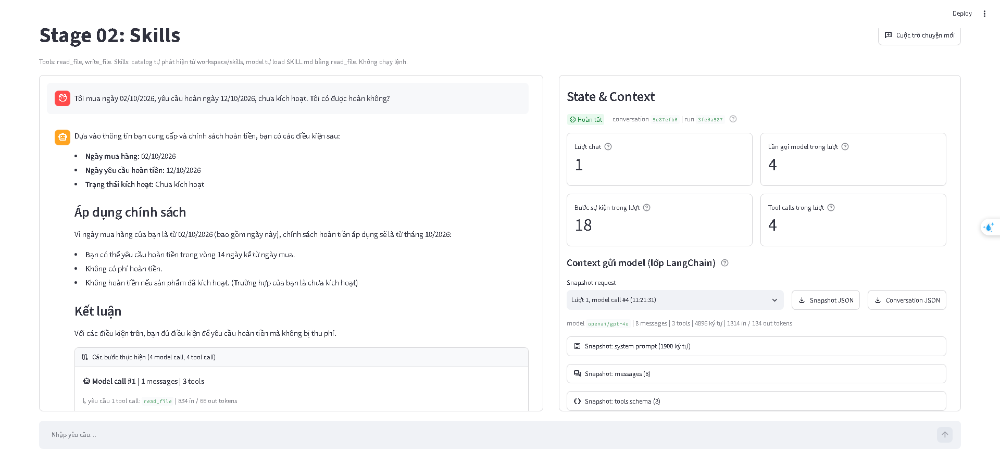
Kêt quả conversation.json.

```
{
  "label": "Context gửi model (lớp LangChain), không phải provider wire payload",
  "conversation_id": "5e87efb00d3b4593957fdc51a13f9d64",
  "counters": {
    "Trạng thái": "Hoàn tất",
    "Lượt chat": 1,
    "Lần gọi model trong lượt": 4,
    "Bước sự kiện trong lượt": 18,
    "Tool calls trong lượt": 4
  },
  "messages": [
    {
      "role": "user",
      "type": "human",
      "content": "Tôi mua ngày 02/10/2026, yêu cầu hoàn ngày 12/10/2026, chưa kích hoạt. Tôi có được hoàn không?",
      "id": "b0999dc0-ad00-4229-ad42-6282fd826cfb"
    },
    {
      "role": "assistant",
      "type": "ai",
      "content": "Để trả lời chính xác cho câu hỏi của bạn, tôi cần xem thông tin từ skill về chính sách hoàn tiền. Tôi sẽ kiểm tra và lấy thông tin cần thiết. Vui lòng chờ một chút.",
      "id": "lc_run--01a11618-c701-7d02-8ffd-4b799a6a68ca-0",
      "tool_calls": [
        {
          "id": "call_ptqwnau2EGe5P9h0WAvGbJsE",
          "name": "read_file",
          "args": {
            "path": "skills/refund-policy/SKILL.md"
          }
        }
      ],
      "usage_metadata": {
        "input_tokens": 834,
        "output_tokens": 66,
        "total_tokens": 900,
        "input_token_details": {
          "audio": 0,
          "cache_read": 0,
          "cache_creation": 0
        },
        "output_token_details": {
          "audio": 0,
          "reasoning": 0
        }
      }
    },
    {
      "role": "tool",
      "type": "tool",
      "content": "{\"ok\": true, \"path\": \"skills/refund-policy/SKILL.md\", \"content\": \"---\\nname: refund-policy\\ndescription: Xử lý, tra cứu chính sách và kiểm tra điều kiện hoàn tiền dựa trên ngày mua hàng của khách hàng. Sử dụng skill này khi người dùng hỏi về điều kiện hoàn tiền, mức phí, khả năng áp dụng hoặc xử lý yêu cầu hoàn tiền cho đơn hàng.\\n---\\n\\n# Quy trình kiểm tra điều kiện hoàn tiền\\n\\n## 1. Kiểm tra thông tin đầu vào\\nTrước khi đưa ra kết luận, kiểm tra xem người dùng đã cung cấp đủ 3 thông tin dưới đây chưa:\\n1. **Ngày mua hàng**\\n2. **Ngày yêu cầu hoàn tiền** (dùng ngày trong câu hỏi của người dùng, không dùng ngày hiện tại)\\n3. **Trạng thái kích hoạt sản phẩm** (Đã kích hoạt / Chưa kích hoạt)\\n\\n⚠️ **LƯU Ý QUAN TRỌNG:** \\nNếu thiếu bất kỳ thông tin nào trong 3 thông tin trên (đặc biệt là trạng thái kích hoạt), **TẬP TRUNG HỎI LẠI NGƯỜI DÙNG ĐỂ BỔ SUNG**, tuyệt đối không tự giả định \\\"chưa kích hoạt\\\" hay đưa ra kết luận sơ bộ.\\n\\n## 2. Tìm kiếm và chọn chính sách\\n1. Dùng tool `list_files` liệt kê tất cả các file trong thư mục `data/policies/`. KHÔNG dùng cố định tên file vì tên file có thể bị thay đổi.\\n2. Dùng tool `read_file` đọc nội dung các file chính sách tìm được để kiểm tra phạm vi hiệu lực theo ngày mua:\\n   - Ngày mua **trước 2026-10-01**: Áp dụng chính sách áp dụng cho ngày mua trước 2026-10-01.\\n   - Ngày mua **từ 2026-10-01 trở đi** (bao gồm cả ngày 2026-10-01): Áp dụng chính sách áp dụng cho ngày mua từ 2026-10-01.\\n\\n## 3. Tính toán số ngày và kiểm tra điều kiện\\n- **Số ngày đã qua** = Ngày yêu cầu hoàn tiền - Ngày mua hàng (tính bằng chênh lệch ngày lịch).\\n- So sánh số ngày đã qua với giới hạn thời gian trong chính sách tương ứng (bằng đúng giới hạn vẫn đủ điều kiện).\\n- Đánh giá điều kiện kích hoạt.\\n\\n## 4. Trả lời theo mẫu\\nTham khảo cấu trúc trình bày chuẩn trong file `references/answer-template.md`.\"}",
      "id": "4dab66b8-b0b6-4137-8102-d45b010456c3",
      "tool_call_id": "call_ptqwnau2EGe5P9h0WAvGbJsE",
      "name": "read_file",
      "status": "success"
    },
    {
      "role": "assistant",
      "type": "ai",
      "content": "",
      "id": "lc_run--01a11618-d2d2-7f92-9c6d-375859cf0775-0",
      "tool_calls": [
        {
          "id": "call_CambJTlVPdXvLYzi0WojMMW2",
          "name": "list_files",
          "args": {
            "path": "data/policies/"
          }
        }
      ],
      "usage_metadata": {
        "input_tokens": 1497,
        "output_tokens": 17,
        "total_tokens": 1514,
        "input_token_details": {
          "audio": 0,
          "cache_read": 0,
          "cache_creation": 0
        },
        "output_token_details": {
          "audio": 0,
          "reasoning": 0
        }
      }
    },
    {
      "role": "tool",
      "type": "tool",
      "content": "- policy-before-oct-new.md (file): data/policies/policy-before-oct-new.md\n- policy-from-oct-new.md (file): data/policies/policy-from-oct-new.md",
      "id": "37c3610c-d09e-415d-8c88-23dca0a7145f",
      "tool_call_id": "call_CambJTlVPdXvLYzi0WojMMW2",
      "name": "list_files",
      "status": "success"
    },
    {
      "role": "assistant",
      "type": "ai",
      "content": "",
      "id": "lc_run--01a11618-d8a3-7512-9cec-911658a656e1-0",
      "tool_calls": [
        {
          "id": "call_Ak0yztgDNv6HFG1KAKUkKmev",
          "name": "read_file",
          "args": {
            "path": "data/policies/policy-before-oct-new.md"
          }
        },
        {
          "id": "call_Ntx6I1rTnV4i0gF3ojoCX1Qc",
          "name": "read_file",
          "args": {
            "path": "data/policies/policy-from-oct-new.md"
          }
        }
      ],
      "usage_metadata": {
        "input_tokens": 1563,
        "output_tokens": 62,
        "total_tokens": 1625,
        "input_token_details": {
          "audio": 0,
          "cache_read": 1408,
          "cache_creation": 0
        },
        "output_token_details": {
          "audio": 0,
          "reasoning": 0
        }
      }
    },
    {
      "role": "tool",
      "type": "tool",
      "content": "{\"ok\": true, \"path\": \"data/policies/policy-before-oct-new.md\", \"content\": \"# Chính sách hoàn tiền trước tháng 10\\nÁp dụng cho ngày mua trước 2026-10-01.\\nĐược yêu cầu hoàn tiền trong 7 ngày kể từ ngày mua.\\nPhí hoàn tiền: 10% giá trị đơn hàng.\\nKhông hoàn tiền nếu sản phẩm đã kích hoạt.\"}",
      "id": "e9043a85-a771-44f2-b671-9a6dbc7c3162",
      "tool_call_id": "call_Ak0yztgDNv6HFG1KAKUkKmev",
      "name": "read_file",
      "status": "success"
    },
    {
      "role": "tool",
      "type": "tool",
      "content": "{\"ok\": true, \"path\": \"data/policies/policy-from-oct-new.md\", \"content\": \"# Chính sách hoàn tiền từ tháng 10\\nÁp dụng cho ngày mua từ 2026-10-01, bao gồm ngày này.\\nĐược yêu cầu hoàn tiền trong 14 ngày kể từ ngày mua.\\nKhông thu phí hoàn tiền.\\nKhông hoàn tiền nếu sản phẩm đã kích hoạt.\"}",
      "id": "1c932184-b5ca-4809-9111-93dc647b4828",
      "tool_call_id": "call_Ntx6I1rTnV4i0gF3ojoCX1Qc",
      "name": "read_file",
      "status": "success"
    },
    {
      "role": "assistant",
      "type": "ai",
      "content": "Dựa vào thông tin bạn cung cấp và chính sách hoàn tiền, bạn có các điều kiện sau:\n\n- **Ngày mua hàng:** 02/10/2026\n- **Ngày yêu cầu hoàn tiền:** 12/10/2026\n- **Trạng thái kích hoạt:** Chưa kích hoạt\n\n### Áp dụng chính sách\nVì ngày mua hàng của bạn là từ 02/10/2026 (bao gồm ngày này), chính sách hoàn tiền áp dụng sẽ là từ tháng 10/2026:\n- Bạn có thể yêu cầu hoàn tiền trong vòng 14 ngày kể từ ngày mua.\n- Không có phí hoàn tiền.\n- Không hoàn tiền nếu sản phẩm đã kích hoạt. (Trường hợp của bạn là chưa kích hoạt)\n\n### Kết luận\nVới các điều kiện trên, bạn đủ điều kiện để yêu cầu hoàn tiền mà không bị thu phí.",
      "id": "lc_run--01a11618-e069-7991-8d32-a651fdbde2c3-0",
      "tool_calls": [],
      "usage_metadata": {
        "input_tokens": 1814,
        "output_tokens": 184,
        "total_tokens": 1998,
        "input_token_details": {
          "audio": 0,
          "cache_read": 1536,
          "cache_creation": 0
        },
        "output_token_details": {
          "audio": 0,
          "reasoning": 0
        }
      }
    }
  ],
  "snapshots": [
    {
      "label": "Context gửi model (lớp LangChain)",
      "conversation_id": "5e87efb00d3b4593957fdc51a13f9d64",
      "run_id": "3fe0a58761614d568cd2cc586ba55ac5",
      "chat_turn": 1,
      "model_call_index": 1,
      "event_sequence": 2,
      "captured_at": "2026-10-07T11:21:24.992+00:00",
      "model_name": "openai/gpt-4o",
      "system_prompt": "Bạn là trợ lý trong lab \"Agent Tools & Skills\". Trả lời bằng tiếng Việt, ngắn gọn, rõ ràng.\n\nQuy tắc:\n- Chỉ dùng các tool được cấp trong request để thao tác dữ liệu. Nếu không có tool phù hợp, nói rõ giới hạn thay vì đoán.\n- Chỉ nói đã đọc, ghi hoặc chạy một thứ khi đã nhận tool result thành công cho đúng thao tác đó.\n- Khi tool trả lỗi, báo lỗi cho người dùng và đề xuất cách xử lý; không bịa kết quả.\n\nWorkspace:\n- Mọi đường dẫn file đều tương đối workspace, ví dụ data/weekly_notes.md.\n- read_file đọc được file trong workspace. write_file chỉ ghi được dưới output/, ví dụ output/summary.md.\n- Bạn không chạy được lệnh shell trong project này.\n\nSkills:\nCác skill dưới đây chứa hướng dẫn chuyên biệt. Danh sách chỉ có metadata; nội dung skill chưa được nạp.\n- Khi task khớp description của một skill, dùng read_file đọc SKILL.md tại <location> trước khi làm, rồi làm theo hướng dẫn trong đó.\n- Đường dẫn tương đối trong SKILL.md được resolve từ thư mục chứa SKILL.md. Ví dụ references/x.md của skill tại skills/abc/SKILL.md là skills/abc/references/x.md.\n- Chỉ đọc tài nguyên cần cho task. Không load skill khi task không liên quan.\n\n<available_skills>\n  <skill>\n    <name>refund-policy</name>\n    <description>Xử lý, tra cứu chính sách và kiểm tra điều kiện hoàn tiền dựa trên ngày mua hàng của khách hàng. Sử dụng skill này khi người dùng hỏi về điều kiện hoàn tiền, mức phí, khả năng áp dụng hoặc xử lý yêu cầu hoàn tiền cho đơn hàng.</description>\n    <location>skills/refund-policy/SKILL.md</location>\n  </skill>\n  <skill>\n    <name>weekly-report</name>\n    <description>Tạo báo cáo tiến độ tuần từ file ghi chú công việc trong workspace (ví dụ data/weekly_notes.md) và lưu thành file Markdown dưới output/. Dùng khi người dùng yêu cầu báo cáo tuần, tổng hợp tiến độ tuần hoặc weekly report.</description>\n    <location>skills/weekly-report/SKILL.md</location>\n  </skill>\n</available_skills>",
      "messages": [
        {
          "role": "user",
          "type": "human",
          "content": "Tôi mua ngày 02/10/2026, yêu cầu hoàn ngày 12/10/2026, chưa kích hoạt. Tôi có được hoàn không?",
          "id": "b0999dc0-ad00-4229-ad42-6282fd826cfb"
        }
      ],
      "tools": [
        {
          "name": "read_file",
          "description": "Đọc một file văn bản UTF-8 trong workspace và trả về JSON.\n\npath là đường dẫn tương đối workspace, ví dụ: data/weekly_notes.md, output/summary.md.\nDùng để đọc dữ liệu đầu vào, file SKILL.md của một skill và các file reference trong thư mục skill.\nThành công: {\"ok\": true, \"path\": ..., \"content\": ...}. Lỗi: {\"ok\": false, \"error\": {\"code\": ..., \"message\": ...}}.",
          "parameters": {
            "properties": {
              "path": {
                "type": "string"
              }
            },
            "required": [
              "path"
            ],
            "type": "object"
          }
        },
        {
          "name": "write_file",
          "description": "Ghi nội dung văn bản UTF-8 vào một file dưới output/ của workspace và trả về JSON.\n\npath là đường dẫn tương đối workspace và phải bắt đầu bằng output/, ví dụ output/summary.md.\nTự tạo thư mục con. Ghi đè nếu file đã tồn tại.\nThành công: {\"ok\": true, \"path\": ..., \"bytes\": ..., \"status\": \"created\" | \"updated\"}. Lỗi: {\"ok\": false, \"error\": {...}}.",
          "parameters": {
            "properties": {
              "path": {
                "type": "string"
              },
              "content": {
                "type": "string"
              }
            },
            "required": [
              "path",
              "content"
            ],
            "type": "object"
          }
        },
        {
          "name": "list_files",
          "description": "Liệt kê các file và thư mục con trực tiếp trong một thư mục thuộc workspace.\n\nArgs:\n    path: Đường dẫn thư mục tương đối với workspace (ví dụ: 'data/policies').",
          "parameters": {
            "properties": {
              "path": {
                "type": "string"
              }
            },
            "required": [
              "path"
            ],
            "type": "object"
          }
        }
      ],
      "message_count": 1,
      "system_prompt_chars": 1900,
      "message_chars": 94,
      "usage": {
        "input_tokens": 834,
        "output_tokens": 66,
        "total_tokens": 900,
        "input_token_details": {
          "audio": 0,
          "cache_read": 0,
          "cache_creation": 0
        },
        "output_token_details": {
          "audio": 0,
          "reasoning": 0
        }
      }
    },
    {
      "label": "Context gửi model (lớp LangChain)",
      "conversation_id": "5e87efb00d3b4593957fdc51a13f9d64",
      "run_id": "3fe0a58761614d568cd2cc586ba55ac5",
      "chat_turn": 1,
      "model_call_index": 2,
      "event_sequence": 6,
      "captured_at": "2026-10-07T11:21:28.017+00:00",
      "model_name": "openai/gpt-4o",
      "system_prompt": "Bạn là trợ lý trong lab \"Agent Tools & Skills\". Trả lời bằng tiếng Việt, ngắn gọn, rõ ràng.\n\nQuy tắc:\n- Chỉ dùng các tool được cấp trong request để thao tác dữ liệu. Nếu không có tool phù hợp, nói rõ giới hạn thay vì đoán.\n- Chỉ nói đã đọc, ghi hoặc chạy một thứ khi đã nhận tool result thành công cho đúng thao tác đó.\n- Khi tool trả lỗi, báo lỗi cho người dùng và đề xuất cách xử lý; không bịa kết quả.\n\nWorkspace:\n- Mọi đường dẫn file đều tương đối workspace, ví dụ data/weekly_notes.md.\n- read_file đọc được file trong workspace. write_file chỉ ghi được dưới output/, ví dụ output/summary.md.\n- Bạn không chạy được lệnh shell trong project này.\n\nSkills:\nCác skill dưới đây chứa hướng dẫn chuyên biệt. Danh sách chỉ có metadata; nội dung skill chưa được nạp.\n- Khi task khớp description của một skill, dùng read_file đọc SKILL.md tại <location> trước khi làm, rồi làm theo hướng dẫn trong đó.\n- Đường dẫn tương đối trong SKILL.md được resolve từ thư mục chứa SKILL.md. Ví dụ references/x.md của skill tại skills/abc/SKILL.md là skills/abc/references/x.md.\n- Chỉ đọc tài nguyên cần cho task. Không load skill khi task không liên quan.\n\n<available_skills>\n  <skill>\n    <name>refund-policy</name>\n    <description>Xử lý, tra cứu chính sách và kiểm tra điều kiện hoàn tiền dựa trên ngày mua hàng của khách hàng. Sử dụng skill này khi người dùng hỏi về điều kiện hoàn tiền, mức phí, khả năng áp dụng hoặc xử lý yêu cầu hoàn tiền cho đơn hàng.</description>\n    <location>skills/refund-policy/SKILL.md</location>\n  </skill>\n  <skill>\n    <name>weekly-report</name>\n    <description>Tạo báo cáo tiến độ tuần từ file ghi chú công việc trong workspace (ví dụ data/weekly_notes.md) và lưu thành file Markdown dưới output/. Dùng khi người dùng yêu cầu báo cáo tuần, tổng hợp tiến độ tuần hoặc weekly report.</description>\n    <location>skills/weekly-report/SKILL.md</location>\n  </skill>\n</available_skills>",
      "messages": [
        {
          "role": "user",
          "type": "human",
          "content": "Tôi mua ngày 02/10/2026, yêu cầu hoàn ngày 12/10/2026, chưa kích hoạt. Tôi có được hoàn không?",
          "id": "b0999dc0-ad00-4229-ad42-6282fd826cfb"
        },
        {
          "role": "assistant",
          "type": "ai",
          "content": "Để trả lời chính xác cho câu hỏi của bạn, tôi cần xem thông tin từ skill về chính sách hoàn tiền. Tôi sẽ kiểm tra và lấy thông tin cần thiết. Vui lòng chờ một chút.",
          "id": "lc_run--01a11618-c701-7d02-8ffd-4b799a6a68ca-0",
          "tool_calls": [
            {
              "id": "call_ptqwnau2EGe5P9h0WAvGbJsE",
              "name": "read_file",
              "args": {
                "path": "skills/refund-policy/SKILL.md"
              }
            }
          ],
          "usage_metadata": {
            "input_tokens": 834,
            "output_tokens": 66,
            "total_tokens": 900,
            "input_token_details": {
              "audio": 0,
              "cache_read": 0,
              "cache_creation": 0
            },
            "output_token_details": {
              "audio": 0,
              "reasoning": 0
            }
          }
        },
        {
          "role": "tool",
          "type": "tool",
          "content": "{\"ok\": true, \"path\": \"skills/refund-policy/SKILL.md\", \"content\": \"---\\nname: refund-policy\\ndescription: Xử lý, tra cứu chính sách và kiểm tra điều kiện hoàn tiền dựa trên ngày mua hàng của khách hàng. Sử dụng skill này khi người dùng hỏi về điều kiện hoàn tiền, mức phí, khả năng áp dụng hoặc xử lý yêu cầu hoàn tiền cho đơn hàng.\\n---\\n\\n# Quy trình kiểm tra điều kiện hoàn tiền\\n\\n## 1. Kiểm tra thông tin đầu vào\\nTrước khi đưa ra kết luận, kiểm tra xem người dùng đã cung cấp đủ 3 thông tin dưới đây chưa:\\n1. **Ngày mua hàng**\\n2. **Ngày yêu cầu hoàn tiền** (dùng ngày trong câu hỏi của người dùng, không dùng ngày hiện tại)\\n3. **Trạng thái kích hoạt sản phẩm** (Đã kích hoạt / Chưa kích hoạt)\\n\\n⚠️ **LƯU Ý QUAN TRỌNG:** \\nNếu thiếu bất kỳ thông tin nào trong 3 thông tin trên (đặc biệt là trạng thái kích hoạt), **TẬP TRUNG HỎI LẠI NGƯỜI DÙNG ĐỂ BỔ SUNG**, tuyệt đối không tự giả định \\\"chưa kích hoạt\\\" hay đưa ra kết luận sơ bộ.\\n\\n## 2. Tìm kiếm và chọn chính sách\\n1. Dùng tool `list_files` liệt kê tất cả các file trong thư mục `data/policies/`. KHÔNG dùng cố định tên file vì tên file có thể bị thay đổi.\\n2. Dùng tool `read_file` đọc nội dung các file chính sách tìm được để kiểm tra phạm vi hiệu lực theo ngày mua:\\n   - Ngày mua **trước 2026-10-01**: Áp dụng chính sách áp dụng cho ngày mua trước 2026-10-01.\\n   - Ngày mua **từ 2026-10-01 trở đi** (bao gồm cả ngày 2026-10-01): Áp dụng chính sách áp dụng cho ngày mua từ 2026-10-01.\\n\\n## 3. Tính toán số ngày và kiểm tra điều kiện\\n- **Số ngày đã qua** = Ngày yêu cầu hoàn tiền - Ngày mua hàng (tính bằng chênh lệch ngày lịch).\\n- So sánh số ngày đã qua với giới hạn thời gian trong chính sách tương ứng (bằng đúng giới hạn vẫn đủ điều kiện).\\n- Đánh giá điều kiện kích hoạt.\\n\\n## 4. Trả lời theo mẫu\\nTham khảo cấu trúc trình bày chuẩn trong file `references/answer-template.md`.\"}",
          "id": "4dab66b8-b0b6-4137-8102-d45b010456c3",
          "tool_call_id": "call_ptqwnau2EGe5P9h0WAvGbJsE",
          "name": "read_file",
          "status": "success"
        }
      ],
      "tools": [
        {
          "name": "read_file",
          "description": "Đọc một file văn bản UTF-8 trong workspace và trả về JSON.\n\npath là đường dẫn tương đối workspace, ví dụ: data/weekly_notes.md, output/summary.md.\nDùng để đọc dữ liệu đầu vào, file SKILL.md của một skill và các file reference trong thư mục skill.\nThành công: {\"ok\": true, \"path\": ..., \"content\": ...}. Lỗi: {\"ok\": false, \"error\": {\"code\": ..., \"message\": ...}}.",
          "parameters": {
            "properties": {
              "path": {
                "type": "string"
              }
            },
            "required": [
              "path"
            ],
            "type": "object"
          }
        },
        {
          "name": "write_file",
          "description": "Ghi nội dung văn bản UTF-8 vào một file dưới output/ của workspace và trả về JSON.\n\npath là đường dẫn tương đối workspace và phải bắt đầu bằng output/, ví dụ output/summary.md.\nTự tạo thư mục con. Ghi đè nếu file đã tồn tại.\nThành công: {\"ok\": true, \"path\": ..., \"bytes\": ..., \"status\": \"created\" | \"updated\"}. Lỗi: {\"ok\": false, \"error\": {...}}.",
          "parameters": {
            "properties": {
              "path": {
                "type": "string"
              },
              "content": {
                "type": "string"
              }
            },
            "required": [
              "path",
              "content"
            ],
            "type": "object"
          }
        },
        {
          "name": "list_files",
          "description": "Liệt kê các file và thư mục con trực tiếp trong một thư mục thuộc workspace.\n\nArgs:\n    path: Đường dẫn thư mục tương đối với workspace (ví dụ: 'data/policies').",
          "parameters": {
            "properties": {
              "path": {
                "type": "string"
              }
            },
            "required": [
              "path"
            ],
            "type": "object"
          }
        }
      ],
      "message_count": 3,
      "system_prompt_chars": 1900,
      "message_chars": 2152,
      "usage": {
        "input_tokens": 1497,
        "output_tokens": 17,
        "total_tokens": 1514,
        "input_token_details": {
          "audio": 0,
          "cache_read": 0,
          "cache_creation": 0
        },
        "output_token_details": {
          "audio": 0,
          "reasoning": 0
        }
      }
    },
    {
      "label": "Context gửi model (lớp LangChain)",
      "conversation_id": "5e87efb00d3b4593957fdc51a13f9d64",
      "run_id": "3fe0a58761614d568cd2cc586ba55ac5",
      "chat_turn": 1,
      "model_call_index": 3,
      "event_sequence": 10,
      "captured_at": "2026-10-07T11:21:29.506+00:00",
      "model_name": "openai/gpt-4o",
      "system_prompt": "Bạn là trợ lý trong lab \"Agent Tools & Skills\". Trả lời bằng tiếng Việt, ngắn gọn, rõ ràng.\n\nQuy tắc:\n- Chỉ dùng các tool được cấp trong request để thao tác dữ liệu. Nếu không có tool phù hợp, nói rõ giới hạn thay vì đoán.\n- Chỉ nói đã đọc, ghi hoặc chạy một thứ khi đã nhận tool result thành công cho đúng thao tác đó.\n- Khi tool trả lỗi, báo lỗi cho người dùng và đề xuất cách xử lý; không bịa kết quả.\n\nWorkspace:\n- Mọi đường dẫn file đều tương đối workspace, ví dụ data/weekly_notes.md.\n- read_file đọc được file trong workspace. write_file chỉ ghi được dưới output/, ví dụ output/summary.md.\n- Bạn không chạy được lệnh shell trong project này.\n\nSkills:\nCác skill dưới đây chứa hướng dẫn chuyên biệt. Danh sách chỉ có metadata; nội dung skill chưa được nạp.\n- Khi task khớp description của một skill, dùng read_file đọc SKILL.md tại <location> trước khi làm, rồi làm theo hướng dẫn trong đó.\n- Đường dẫn tương đối trong SKILL.md được resolve từ thư mục chứa SKILL.md. Ví dụ references/x.md của skill tại skills/abc/SKILL.md là skills/abc/references/x.md.\n- Chỉ đọc tài nguyên cần cho task. Không load skill khi task không liên quan.\n\n<available_skills>\n  <skill>\n    <name>refund-policy</name>\n    <description>Xử lý, tra cứu chính sách và kiểm tra điều kiện hoàn tiền dựa trên ngày mua hàng của khách hàng. Sử dụng skill này khi người dùng hỏi về điều kiện hoàn tiền, mức phí, khả năng áp dụng hoặc xử lý yêu cầu hoàn tiền cho đơn hàng.</description>\n    <location>skills/refund-policy/SKILL.md</location>\n  </skill>\n  <skill>\n    <name>weekly-report</name>\n    <description>Tạo báo cáo tiến độ tuần từ file ghi chú công việc trong workspace (ví dụ data/weekly_notes.md) và lưu thành file Markdown dưới output/. Dùng khi người dùng yêu cầu báo cáo tuần, tổng hợp tiến độ tuần hoặc weekly report.</description>\n    <location>skills/weekly-report/SKILL.md</location>\n  </skill>\n</available_skills>",
      "messages": [
        {
          "role": "user",
          "type": "human",
          "content": "Tôi mua ngày 02/10/2026, yêu cầu hoàn ngày 12/10/2026, chưa kích hoạt. Tôi có được hoàn không?",
          "id": "b0999dc0-ad00-4229-ad42-6282fd826cfb"
        },
        {
          "role": "assistant",
          "type": "ai",
          "content": "Để trả lời chính xác cho câu hỏi của bạn, tôi cần xem thông tin từ skill về chính sách hoàn tiền. Tôi sẽ kiểm tra và lấy thông tin cần thiết. Vui lòng chờ một chút.",
          "id": "lc_run--01a11618-c701-7d02-8ffd-4b799a6a68ca-0",
          "tool_calls": [
            {
              "id": "call_ptqwnau2EGe5P9h0WAvGbJsE",
              "name": "read_file",
              "args": {
                "path": "skills/refund-policy/SKILL.md"
              }
            }
          ],
          "usage_metadata": {
            "input_tokens": 834,
            "output_tokens": 66,
            "total_tokens": 900,
            "input_token_details": {
              "audio": 0,
              "cache_read": 0,
              "cache_creation": 0
            },
            "output_token_details": {
              "audio": 0,
              "reasoning": 0
            }
          }
        },
        {
          "role": "tool",
          "type": "tool",
          "content": "{\"ok\": true, \"path\": \"skills/refund-policy/SKILL.md\", \"content\": \"---\\nname: refund-policy\\ndescription: Xử lý, tra cứu chính sách và kiểm tra điều kiện hoàn tiền dựa trên ngày mua hàng của khách hàng. Sử dụng skill này khi người dùng hỏi về điều kiện hoàn tiền, mức phí, khả năng áp dụng hoặc xử lý yêu cầu hoàn tiền cho đơn hàng.\\n---\\n\\n# Quy trình kiểm tra điều kiện hoàn tiền\\n\\n## 1. Kiểm tra thông tin đầu vào\\nTrước khi đưa ra kết luận, kiểm tra xem người dùng đã cung cấp đủ 3 thông tin dưới đây chưa:\\n1. **Ngày mua hàng**\\n2. **Ngày yêu cầu hoàn tiền** (dùng ngày trong câu hỏi của người dùng, không dùng ngày hiện tại)\\n3. **Trạng thái kích hoạt sản phẩm** (Đã kích hoạt / Chưa kích hoạt)\\n\\n⚠️ **LƯU Ý QUAN TRỌNG:** \\nNếu thiếu bất kỳ thông tin nào trong 3 thông tin trên (đặc biệt là trạng thái kích hoạt), **TẬP TRUNG HỎI LẠI NGƯỜI DÙNG ĐỂ BỔ SUNG**, tuyệt đối không tự giả định \\\"chưa kích hoạt\\\" hay đưa ra kết luận sơ bộ.\\n\\n## 2. Tìm kiếm và chọn chính sách\\n1. Dùng tool `list_files` liệt kê tất cả các file trong thư mục `data/policies/`. KHÔNG dùng cố định tên file vì tên file có thể bị thay đổi.\\n2. Dùng tool `read_file` đọc nội dung các file chính sách tìm được để kiểm tra phạm vi hiệu lực theo ngày mua:\\n   - Ngày mua **trước 2026-10-01**: Áp dụng chính sách áp dụng cho ngày mua trước 2026-10-01.\\n   - Ngày mua **từ 2026-10-01 trở đi** (bao gồm cả ngày 2026-10-01): Áp dụng chính sách áp dụng cho ngày mua từ 2026-10-01.\\n\\n## 3. Tính toán số ngày và kiểm tra điều kiện\\n- **Số ngày đã qua** = Ngày yêu cầu hoàn tiền - Ngày mua hàng (tính bằng chênh lệch ngày lịch).\\n- So sánh số ngày đã qua với giới hạn thời gian trong chính sách tương ứng (bằng đúng giới hạn vẫn đủ điều kiện).\\n- Đánh giá điều kiện kích hoạt.\\n\\n## 4. Trả lời theo mẫu\\nTham khảo cấu trúc trình bày chuẩn trong file `references/answer-template.md`.\"}",
          "id": "4dab66b8-b0b6-4137-8102-d45b010456c3",
          "tool_call_id": "call_ptqwnau2EGe5P9h0WAvGbJsE",
          "name": "read_file",
          "status": "success"
        },
        {
          "role": "assistant",
          "type": "ai",
          "content": "",
          "id": "lc_run--01a11618-d2d2-7f92-9c6d-375859cf0775-0",
          "tool_calls": [
            {
              "id": "call_CambJTlVPdXvLYzi0WojMMW2",
              "name": "list_files",
              "args": {
                "path": "data/policies/"
              }
            }
          ],
          "usage_metadata": {
            "input_tokens": 1497,
            "output_tokens": 17,
            "total_tokens": 1514,
            "input_token_details": {
              "audio": 0,
              "cache_read": 0,
              "cache_creation": 0
            },
            "output_token_details": {
              "audio": 0,
              "reasoning": 0
            }
          }
        },
        {
          "role": "tool",
          "type": "tool",
          "content": "- policy-before-oct-new.md (file): data/policies/policy-before-oct-new.md\n- policy-from-oct-new.md (file): data/policies/policy-from-oct-new.md",
          "id": "37c3610c-d09e-415d-8c88-23dca0a7145f",
          "tool_call_id": "call_CambJTlVPdXvLYzi0WojMMW2",
          "name": "list_files",
          "status": "success"
        }
      ],
      "tools": [
        {
          "name": "read_file",
          "description": "Đọc một file văn bản UTF-8 trong workspace và trả về JSON.\n\npath là đường dẫn tương đối workspace, ví dụ: data/weekly_notes.md, output/summary.md.\nDùng để đọc dữ liệu đầu vào, file SKILL.md của một skill và các file reference trong thư mục skill.\nThành công: {\"ok\": true, \"path\": ..., \"content\": ...}. Lỗi: {\"ok\": false, \"error\": {\"code\": ..., \"message\": ...}}.",
          "parameters": {
            "properties": {
              "path": {
                "type": "string"
              }
            },
            "required": [
              "path"
            ],
            "type": "object"
          }
        },
        {
          "name": "write_file",
          "description": "Ghi nội dung văn bản UTF-8 vào một file dưới output/ của workspace và trả về JSON.\n\npath là đường dẫn tương đối workspace và phải bắt đầu bằng output/, ví dụ output/summary.md.\nTự tạo thư mục con. Ghi đè nếu file đã tồn tại.\nThành công: {\"ok\": true, \"path\": ..., \"bytes\": ..., \"status\": \"created\" | \"updated\"}. Lỗi: {\"ok\": false, \"error\": {...}}.",
          "parameters": {
            "properties": {
              "path": {
                "type": "string"
              },
              "content": {
                "type": "string"
              }
            },
            "required": [
              "path",
              "content"
            ],
            "type": "object"
          }
        },
        {
          "name": "list_files",
          "description": "Liệt kê các file và thư mục con trực tiếp trong một thư mục thuộc workspace.\n\nArgs:\n    path: Đường dẫn thư mục tương đối với workspace (ví dụ: 'data/policies').",
          "parameters": {
            "properties": {
              "path": {
                "type": "string"
              }
            },
            "required": [
              "path"
            ],
            "type": "object"
          }
        }
      ],
      "message_count": 5,
      "system_prompt_chars": 1900,
      "message_chars": 2321,
      "usage": {
        "input_tokens": 1563,
        "output_tokens": 62,
        "total_tokens": 1625,
        "input_token_details": {
          "audio": 0,
          "cache_read": 1408,
          "cache_creation": 0
        },
        "output_token_details": {
          "audio": 0,
          "reasoning": 0
        }
      }
    },
    {
      "label": "Context gửi model (lớp LangChain)",
      "conversation_id": "5e87efb00d3b4593957fdc51a13f9d64",
      "run_id": "3fe0a58761614d568cd2cc586ba55ac5",
      "chat_turn": 1,
      "model_call_index": 4,
      "event_sequence": 16,
      "captured_at": "2026-10-07T11:21:31.496+00:00",
      "model_name": "openai/gpt-4o",
      "system_prompt": "Bạn là trợ lý trong lab \"Agent Tools & Skills\". Trả lời bằng tiếng Việt, ngắn gọn, rõ ràng.\n\nQuy tắc:\n- Chỉ dùng các tool được cấp trong request để thao tác dữ liệu. Nếu không có tool phù hợp, nói rõ giới hạn thay vì đoán.\n- Chỉ nói đã đọc, ghi hoặc chạy một thứ khi đã nhận tool result thành công cho đúng thao tác đó.\n- Khi tool trả lỗi, báo lỗi cho người dùng và đề xuất cách xử lý; không bịa kết quả.\n\nWorkspace:\n- Mọi đường dẫn file đều tương đối workspace, ví dụ data/weekly_notes.md.\n- read_file đọc được file trong workspace. write_file chỉ ghi được dưới output/, ví dụ output/summary.md.\n- Bạn không chạy được lệnh shell trong project này.\n\nSkills:\nCác skill dưới đây chứa hướng dẫn chuyên biệt. Danh sách chỉ có metadata; nội dung skill chưa được nạp.\n- Khi task khớp description của một skill, dùng read_file đọc SKILL.md tại <location> trước khi làm, rồi làm theo hướng dẫn trong đó.\n- Đường dẫn tương đối trong SKILL.md được resolve từ thư mục chứa SKILL.md. Ví dụ references/x.md của skill tại skills/abc/SKILL.md là skills/abc/references/x.md.\n- Chỉ đọc tài nguyên cần cho task. Không load skill khi task không liên quan.\n\n<available_skills>\n  <skill>\n    <name>refund-policy</name>\n    <description>Xử lý, tra cứu chính sách và kiểm tra điều kiện hoàn tiền dựa trên ngày mua hàng của khách hàng. Sử dụng skill này khi người dùng hỏi về điều kiện hoàn tiền, mức phí, khả năng áp dụng hoặc xử lý yêu cầu hoàn tiền cho đơn hàng.</description>\n    <location>skills/refund-policy/SKILL.md</location>\n  </skill>\n  <skill>\n    <name>weekly-report</name>\n    <description>Tạo báo cáo tiến độ tuần từ file ghi chú công việc trong workspace (ví dụ data/weekly_notes.md) và lưu thành file Markdown dưới output/. Dùng khi người dùng yêu cầu báo cáo tuần, tổng hợp tiến độ tuần hoặc weekly report.</description>\n    <location>skills/weekly-report/SKILL.md</location>\n  </skill>\n</available_skills>",
      "messages": [
        {
          "role": "user",
          "type": "human",
          "content": "Tôi mua ngày 02/10/2026, yêu cầu hoàn ngày 12/10/2026, chưa kích hoạt. Tôi có được hoàn không?",
          "id": "b0999dc0-ad00-4229-ad42-6282fd826cfb"
        },
        {
          "role": "assistant",
          "type": "ai",
          "content": "Để trả lời chính xác cho câu hỏi của bạn, tôi cần xem thông tin từ skill về chính sách hoàn tiền. Tôi sẽ kiểm tra và lấy thông tin cần thiết. Vui lòng chờ một chút.",
          "id": "lc_run--01a11618-c701-7d02-8ffd-4b799a6a68ca-0",
          "tool_calls": [
            {
              "id": "call_ptqwnau2EGe5P9h0WAvGbJsE",
              "name": "read_file",
              "args": {
                "path": "skills/refund-policy/SKILL.md"
              }
            }
          ],
          "usage_metadata": {
            "input_tokens": 834,
            "output_tokens": 66,
            "total_tokens": 900,
            "input_token_details": {
              "audio": 0,
              "cache_read": 0,
              "cache_creation": 0
            },
            "output_token_details": {
              "audio": 0,
              "reasoning": 0
            }
          }
        },
        {
          "role": "tool",
          "type": "tool",
          "content": "{\"ok\": true, \"path\": \"skills/refund-policy/SKILL.md\", \"content\": \"---\\nname: refund-policy\\ndescription: Xử lý, tra cứu chính sách và kiểm tra điều kiện hoàn tiền dựa trên ngày mua hàng của khách hàng. Sử dụng skill này khi người dùng hỏi về điều kiện hoàn tiền, mức phí, khả năng áp dụng hoặc xử lý yêu cầu hoàn tiền cho đơn hàng.\\n---\\n\\n# Quy trình kiểm tra điều kiện hoàn tiền\\n\\n## 1. Kiểm tra thông tin đầu vào\\nTrước khi đưa ra kết luận, kiểm tra xem người dùng đã cung cấp đủ 3 thông tin dưới đây chưa:\\n1. **Ngày mua hàng**\\n2. **Ngày yêu cầu hoàn tiền** (dùng ngày trong câu hỏi của người dùng, không dùng ngày hiện tại)\\n3. **Trạng thái kích hoạt sản phẩm** (Đã kích hoạt / Chưa kích hoạt)\\n\\n⚠️ **LƯU Ý QUAN TRỌNG:** \\nNếu thiếu bất kỳ thông tin nào trong 3 thông tin trên (đặc biệt là trạng thái kích hoạt), **TẬP TRUNG HỎI LẠI NGƯỜI DÙNG ĐỂ BỔ SUNG**, tuyệt đối không tự giả định \\\"chưa kích hoạt\\\" hay đưa ra kết luận sơ bộ.\\n\\n## 2. Tìm kiếm và chọn chính sách\\n1. Dùng tool `list_files` liệt kê tất cả các file trong thư mục `data/policies/`. KHÔNG dùng cố định tên file vì tên file có thể bị thay đổi.\\n2. Dùng tool `read_file` đọc nội dung các file chính sách tìm được để kiểm tra phạm vi hiệu lực theo ngày mua:\\n   - Ngày mua **trước 2026-10-01**: Áp dụng chính sách áp dụng cho ngày mua trước 2026-10-01.\\n   - Ngày mua **từ 2026-10-01 trở đi** (bao gồm cả ngày 2026-10-01): Áp dụng chính sách áp dụng cho ngày mua từ 2026-10-01.\\n\\n## 3. Tính toán số ngày và kiểm tra điều kiện\\n- **Số ngày đã qua** = Ngày yêu cầu hoàn tiền - Ngày mua hàng (tính bằng chênh lệch ngày lịch).\\n- So sánh số ngày đã qua với giới hạn thời gian trong chính sách tương ứng (bằng đúng giới hạn vẫn đủ điều kiện).\\n- Đánh giá điều kiện kích hoạt.\\n\\n## 4. Trả lời theo mẫu\\nTham khảo cấu trúc trình bày chuẩn trong file `references/answer-template.md`.\"}",
          "id": "4dab66b8-b0b6-4137-8102-d45b010456c3",
          "tool_call_id": "call_ptqwnau2EGe5P9h0WAvGbJsE",
          "name": "read_file",
          "status": "success"
        },
        {
          "role": "assistant",
          "type": "ai",
          "content": "",
          "id": "lc_run--01a11618-d2d2-7f92-9c6d-375859cf0775-0",
          "tool_calls": [
            {
              "id": "call_CambJTlVPdXvLYzi0WojMMW2",
              "name": "list_files",
              "args": {
                "path": "data/policies/"
              }
            }
          ],
          "usage_metadata": {
            "input_tokens": 1497,
            "output_tokens": 17,
            "total_tokens": 1514,
            "input_token_details": {
              "audio": 0,
              "cache_read": 0,
              "cache_creation": 0
            },
            "output_token_details": {
              "audio": 0,
              "reasoning": 0
            }
          }
        },
        {
          "role": "tool",
          "type": "tool",
          "content": "- policy-before-oct-new.md (file): data/policies/policy-before-oct-new.md\n- policy-from-oct-new.md (file): data/policies/policy-from-oct-new.md",
          "id": "37c3610c-d09e-415d-8c88-23dca0a7145f",
          "tool_call_id": "call_CambJTlVPdXvLYzi0WojMMW2",
          "name": "list_files",
          "status": "success"
        },
        {
          "role": "assistant",
          "type": "ai",
          "content": "",
          "id": "lc_run--01a11618-d8a3-7512-9cec-911658a656e1-0",
          "tool_calls": [
            {
              "id": "call_Ak0yztgDNv6HFG1KAKUkKmev",
              "name": "read_file",
              "args": {
                "path": "data/policies/policy-before-oct-new.md"
              }
            },
            {
              "id": "call_Ntx6I1rTnV4i0gF3ojoCX1Qc",
              "name": "read_file",
              "args": {
                "path": "data/policies/policy-from-oct-new.md"
              }
            }
          ],
          "usage_metadata": {
            "input_tokens": 1563,
            "output_tokens": 62,
            "total_tokens": 1625,
            "input_token_details": {
              "audio": 0,
              "cache_read": 1408,
              "cache_creation": 0
            },
            "output_token_details": {
              "audio": 0,
              "reasoning": 0
            }
          }
        },
        {
          "role": "tool",
          "type": "tool",
          "content": "{\"ok\": true, \"path\": \"data/policies/policy-before-oct-new.md\", \"content\": \"# Chính sách hoàn tiền trước tháng 10\\nÁp dụng cho ngày mua trước 2026-10-01.\\nĐược yêu cầu hoàn tiền trong 7 ngày kể từ ngày mua.\\nPhí hoàn tiền: 10% giá trị đơn hàng.\\nKhông hoàn tiền nếu sản phẩm đã kích hoạt.\"}",
          "id": "e9043a85-a771-44f2-b671-9a6dbc7c3162",
          "tool_call_id": "call_Ak0yztgDNv6HFG1KAKUkKmev",
          "name": "read_file",
          "status": "success"
        },
        {
          "role": "tool",
          "type": "tool",
          "content": "{\"ok\": true, \"path\": \"data/policies/policy-from-oct-new.md\", \"content\": \"# Chính sách hoàn tiền từ tháng 10\\nÁp dụng cho ngày mua từ 2026-10-01, bao gồm ngày này.\\nĐược yêu cầu hoàn tiền trong 14 ngày kể từ ngày mua.\\nKhông thu phí hoàn tiền.\\nKhông hoàn tiền nếu sản phẩm đã kích hoạt.\"}",
          "id": "1c932184-b5ca-4809-9111-93dc647b4828",
          "tool_call_id": "call_Ntx6I1rTnV4i0gF3ojoCX1Qc",
          "name": "read_file",
          "status": "success"
        }
      ],
      "tools": [
        {
          "name": "read_file",
          "description": "Đọc một file văn bản UTF-8 trong workspace và trả về JSON.\n\npath là đường dẫn tương đối workspace, ví dụ: data/weekly_notes.md, output/summary.md.\nDùng để đọc dữ liệu đầu vào, file SKILL.md của một skill và các file reference trong thư mục skill.\nThành công: {\"ok\": true, \"path\": ..., \"content\": ...}. Lỗi: {\"ok\": false, \"error\": {\"code\": ..., \"message\": ...}}.",
          "parameters": {
            "properties": {
              "path": {
                "type": "string"
              }
            },
            "required": [
              "path"
            ],
            "type": "object"
          }
        },
        {
          "name": "write_file",
          "description": "Ghi nội dung văn bản UTF-8 vào một file dưới output/ của workspace và trả về JSON.\n\npath là đường dẫn tương đối workspace và phải bắt đầu bằng output/, ví dụ output/summary.md.\nTự tạo thư mục con. Ghi đè nếu file đã tồn tại.\nThành công: {\"ok\": true, \"path\": ..., \"bytes\": ..., \"status\": \"created\" | \"updated\"}. Lỗi: {\"ok\": false, \"error\": {...}}.",
          "parameters": {
            "properties": {
              "path": {
                "type": "string"
              },
              "content": {
                "type": "string"
              }
            },
            "required": [
              "path",
              "content"
            ],
            "type": "object"
          }
        },
        {
          "name": "list_files",
          "description": "Liệt kê các file và thư mục con trực tiếp trong một thư mục thuộc workspace.\n\nArgs:\n    path: Đường dẫn thư mục tương đối với workspace (ví dụ: 'data/policies').",
          "parameters": {
            "properties": {
              "path": {
                "type": "string"
              }
            },
            "required": [
              "path"
            ],
            "type": "object"
          }
        }
      ],
      "message_count": 8,
      "system_prompt_chars": 1900,
      "message_chars": 2996,
      "usage": {
        "input_tokens": 1814,
        "output_tokens": 184,
        "total_tokens": 1998,
        "input_token_details": {
          "audio": 0,
          "cache_read": 1536,
          "cache_creation": 0
        },
        "output_token_details": {
          "audio": 0,
          "reasoning": 0
        }
      }
    }
  ],
  "events": [
    {
      "conversation_id": "5e87efb00d3b4593957fdc51a13f9d64",
      "run_id": "3fe0a58761614d568cd2cc586ba55ac5",
      "chat_turn": 1,
      "sequence": 1,
      "type": "user_submitted",
      "timestamp": "2026-10-07T11:21:23.703+00:00",
      "text": "Tôi mua ngày 02/10/2026, yêu cầu hoàn ngày 12/10/2026, chưa kích hoạt. Tôi có được hoàn không?",
      "tools": [
        "read_file",
        "write_file",
        "list_files"
      ],
      "skills": [
        {
          "name": "refund-policy",
          "description": "Xử lý, tra cứu chính sách và kiểm tra điều kiện hoàn tiền dựa trên ngày mua hàng của khách hàng. Sử dụng skill này khi người dùng hỏi về điều kiện hoàn tiền, mức phí, khả năng áp dụng hoặc xử lý yêu cầu hoàn tiền cho đơn hàng.",
          "location": "skills/refund-policy/SKILL.md"
        },
        {
          "name": "weekly-report",
          "description": "Tạo báo cáo tiến độ tuần từ file ghi chú công việc trong workspace (ví dụ data/weekly_notes.md) và lưu thành file Markdown dưới output/. Dùng khi người dùng yêu cầu báo cáo tuần, tổng hợp tiến độ tuần hoặc weekly report.",
          "location": "skills/weekly-report/SKILL.md"
        }
      ]
    },
    {
      "conversation_id": "5e87efb00d3b4593957fdc51a13f9d64",
      "run_id": "3fe0a58761614d568cd2cc586ba55ac5",
      "chat_turn": 1,
      "sequence": 2,
      "type": "model_request",
      "timestamp": "2026-10-07T11:21:24.994+00:00",
      "model_call_index": 1,
      "snapshot": {
        "label": "Context gửi model (lớp LangChain)",
        "conversation_id": "5e87efb00d3b4593957fdc51a13f9d64",
        "run_id": "3fe0a58761614d568cd2cc586ba55ac5",
        "chat_turn": 1,
        "model_call_index": 1,
        "event_sequence": 2,
        "captured_at": "2026-10-07T11:21:24.992+00:00",
        "model_name": "openai/gpt-4o",
        "system_prompt": "Bạn là trợ lý trong lab \"Agent Tools & Skills\". Trả lời bằng tiếng Việt, ngắn gọn, rõ ràng.\n\nQuy tắc:\n- Chỉ dùng các tool được cấp trong request để thao tác dữ liệu. Nếu không có tool phù hợp, nói rõ giới hạn thay vì đoán.\n- Chỉ nói đã đọc, ghi hoặc chạy một thứ khi đã nhận tool result thành công cho đúng thao tác đó.\n- Khi tool trả lỗi, báo lỗi cho người dùng và đề xuất cách xử lý; không bịa kết quả.\n\nWorkspace:\n- Mọi đường dẫn file đều tương đối workspace, ví dụ data/weekly_notes.md.\n- read_file đọc được file trong workspace. write_file chỉ ghi được dưới output/, ví dụ output/summary.md.\n- Bạn không chạy được lệnh shell trong project này.\n\nSkills:\nCác skill dưới đây chứa hướng dẫn chuyên biệt. Danh sách chỉ có metadata; nội dung skill chưa được nạp.\n- Khi task khớp description của một skill, dùng read_file đọc SKILL.md tại <location> trước khi làm, rồi làm theo hướng dẫn trong đó.\n- Đường dẫn tương đối trong SKILL.md được resolve từ thư mục chứa SKILL.md. Ví dụ references/x.md của skill tại skills/abc/SKILL.md là skills/abc/references/x.md.\n- Chỉ đọc tài nguyên cần cho task. Không load skill khi task không liên quan.\n\n<available_skills>\n  <skill>\n    <name>refund-policy</name>\n    <description>Xử lý, tra cứu chính sách và kiểm tra điều kiện hoàn tiền dựa trên ngày mua hàng của khách hàng. Sử dụng skill này khi người dùng hỏi về điều kiện hoàn tiền, mức phí, khả năng áp dụng hoặc xử lý yêu cầu hoàn tiền cho đơn hàng.</description>\n    <location>skills/refund-policy/SKILL.md</location>\n  </skill>\n  <skill>\n    <name>weekly-report</name>\n    <description>Tạo báo cáo tiến độ tuần từ file ghi chú công việc trong workspace (ví dụ data/weekly_notes.md) và lưu thành file Markdown dưới output/. Dùng khi người dùng yêu cầu báo cáo tuần, tổng hợp tiến độ tuần hoặc weekly report.</description>\n    <location>skills/weekly-report/SKILL.md</location>\n  </skill>\n</available_skills>",
        "messages": [
          {
            "role": "user",
            "type": "human",
            "content": "Tôi mua ngày 02/10/2026, yêu cầu hoàn ngày 12/10/2026, chưa kích hoạt. Tôi có được hoàn không?",
            "id": "b0999dc0-ad00-4229-ad42-6282fd826cfb"
          }
        ],
        "tools": [
          {
            "name": "read_file",
            "description": "Đọc một file văn bản UTF-8 trong workspace và trả về JSON.\n\npath là đường dẫn tương đối workspace, ví dụ: data/weekly_notes.md, output/summary.md.\nDùng để đọc dữ liệu đầu vào, file SKILL.md của một skill và các file reference trong thư mục skill.\nThành công: {\"ok\": true, \"path\": ..., \"content\": ...}. Lỗi: {\"ok\": false, \"error\": {\"code\": ..., \"message\": ...}}.",
            "parameters": {
              "properties": {
                "path": {
                  "type": "string"
                }
              },
              "required": [
                "path"
              ],
              "type": "object"
            }
          },
          {
            "name": "write_file",
            "description": "Ghi nội dung văn bản UTF-8 vào một file dưới output/ của workspace và trả về JSON.\n\npath là đường dẫn tương đối workspace và phải bắt đầu bằng output/, ví dụ output/summary.md.\nTự tạo thư mục con. Ghi đè nếu file đã tồn tại.\nThành công: {\"ok\": true, \"path\": ..., \"bytes\": ..., \"status\": \"created\" | \"updated\"}. Lỗi: {\"ok\": false, \"error\": {...}}.",
            "parameters": {
              "properties": {
                "path": {
                  "type": "string"
                },
                "content": {
                  "type": "string"
                }
              },
              "required": [
                "path",
                "content"
              ],
              "type": "object"
            }
          },
          {
            "name": "list_files",
            "description": "Liệt kê các file và thư mục con trực tiếp trong một thư mục thuộc workspace.\n\nArgs:\n    path: Đường dẫn thư mục tương đối với workspace (ví dụ: 'data/policies').",
            "parameters": {
              "properties": {
                "path": {
                  "type": "string"
                }
              },
              "required": [
                "path"
              ],
              "type": "object"
            }
          }
        ],
        "message_count": 1,
        "system_prompt_chars": 1900,
        "message_chars": 94,
        "usage": null
      }
    },
    {
      "conversation_id": "5e87efb00d3b4593957fdc51a13f9d64",
      "run_id": "3fe0a58761614d568cd2cc586ba55ac5",
      "chat_turn": 1,
      "sequence": 3,
      "type": "model_response",
      "timestamp": "2026-10-07T11:21:27.717+00:00",
      "model_call_index": 1,
      "elapsed_ms": 2723.9,
      "tool_calls_requested": [
        {
          "id": "call_ptqwnau2EGe5P9h0WAvGbJsE",
          "name": "read_file"
        }
      ],
      "usage": {
        "input_tokens": 834,
        "output_tokens": 66,
        "total_tokens": 900,
        "input_token_details": {
          "audio": 0,
          "cache_read": 0,
          "cache_creation": 0
        },
        "output_token_details": {
          "audio": 0,
          "reasoning": 0
        }
      }
    },
    {
      "conversation_id": "5e87efb00d3b4593957fdc51a13f9d64",
      "run_id": "3fe0a58761614d568cd2cc586ba55ac5",
      "chat_turn": 1,
      "sequence": 4,
      "type": "tool_started",
      "timestamp": "2026-10-07T11:21:27.859+00:00",
      "tool_call_id": "call_ptqwnau2EGe5P9h0WAvGbJsE",
      "tool_name": "read_file",
      "arguments": {
        "path": "skills/refund-policy/SKILL.md"
      }
    },
    {
      "conversation_id": "5e87efb00d3b4593957fdc51a13f9d64",
      "run_id": "3fe0a58761614d568cd2cc586ba55ac5",
      "chat_turn": 1,
      "sequence": 5,
      "type": "tool_finished",
      "timestamp": "2026-10-07T11:21:27.903+00:00",
      "tool_call_id": "call_ptqwnau2EGe5P9h0WAvGbJsE",
      "tool_name": "read_file",
      "elapsed_ms": 8.7,
      "status": "success",
      "result": {
        "ok": true,
        "path": "skills/refund-policy/SKILL.md",
        "content": "---\nname: refund-policy\ndescription: Xử lý, tra cứu chính sách và kiểm tra điều kiện hoàn tiền dựa trên ngày mua hàng của khách hàng. Sử dụng skill này khi người dùng hỏi về điều kiện hoàn tiền, mức phí, khả năng áp dụng hoặc xử lý yêu cầu hoàn tiền cho đơn hàng.\n---\n\n# Quy trình kiểm tra điều kiện hoàn tiền\n\n## 1. Kiểm tra thông tin đầu vào\nTrước khi đưa ra kết luận, kiểm tra xem người dùng đã cung cấp đủ 3 thông tin dưới đây chưa:\n1. **Ngày mua hàng**\n2. **Ngày yêu cầu hoàn tiền** (dùng ngày trong câu hỏi của người dùng, không dùng ngày hiện tại)\n3. **Trạng thái kích hoạt sản phẩm** (Đã kích hoạt / Chưa kích hoạt)\n\n⚠️ **LƯU Ý QUAN TRỌNG:** \nNếu thiếu bất kỳ thông tin nào trong 3 thông tin trên (đặc biệt là trạng thái kích hoạt), **TẬP TRUNG HỎI LẠI NGƯỜI DÙNG ĐỂ BỔ SUNG**, tuyệt đối không tự giả định \"chưa kích hoạt\" hay đưa ra kết luận sơ bộ.\n\n## 2. Tìm kiếm và chọn chính sách\n1. Dùng tool `list_files` liệt kê tất cả các file trong thư mục `data/policies/`. KHÔNG dùng cố định tên file vì tên file có thể bị thay đổi.\n2. Dùng tool `read_file` đọc nội dung các file chính sách tìm được để kiểm tra phạm vi hiệu lực theo ngày mua:\n   - Ngày mua **trước 2026-10-01**: Áp dụng chính sách áp dụng cho ngày mua trước 2026-10-01.\n   - Ngày mua **từ 2026-10-01 trở đi** (bao gồm cả ngày 2026-10-01): Áp dụng chính sách áp dụng cho ngày mua từ 2026-10-01.\n\n## 3. Tính toán số ngày và kiểm tra điều kiện\n- **Số ngày đã qua** = Ngày yêu cầu hoàn tiền - Ngày mua hàng (tính bằng chênh lệch ngày lịch).\n- So sánh số ngày đã qua với giới hạn thời gian trong chính sách tương ứng (bằng đúng giới hạn vẫn đủ điều kiện).\n- Đánh giá điều kiện kích hoạt.\n\n## 4. Trả lời theo mẫu\nTham khảo cấu trúc trình bày chuẩn trong file `references/answer-template.md`."
      }
    },
    {
      "conversation_id": "5e87efb00d3b4593957fdc51a13f9d64",
      "run_id": "3fe0a58761614d568cd2cc586ba55ac5",
      "chat_turn": 1,
      "sequence": 6,
      "type": "model_request",
      "timestamp": "2026-10-07T11:21:28.022+00:00",
      "model_call_index": 2,
      "snapshot": {
        "label": "Context gửi model (lớp LangChain)",
        "conversation_id": "5e87efb00d3b4593957fdc51a13f9d64",
        "run_id": "3fe0a58761614d568cd2cc586ba55ac5",
        "chat_turn": 1,
        "model_call_index": 2,
        "event_sequence": 6,
        "captured_at": "2026-10-07T11:21:28.017+00:00",
        "model_name": "openai/gpt-4o",
        "system_prompt": "Bạn là trợ lý trong lab \"Agent Tools & Skills\". Trả lời bằng tiếng Việt, ngắn gọn, rõ ràng.\n\nQuy tắc:\n- Chỉ dùng các tool được cấp trong request để thao tác dữ liệu. Nếu không có tool phù hợp, nói rõ giới hạn thay vì đoán.\n- Chỉ nói đã đọc, ghi hoặc chạy một thứ khi đã nhận tool result thành công cho đúng thao tác đó.\n- Khi tool trả lỗi, báo lỗi cho người dùng và đề xuất cách xử lý; không bịa kết quả.\n\nWorkspace:\n- Mọi đường dẫn file đều tương đối workspace, ví dụ data/weekly_notes.md.\n- read_file đọc được file trong workspace. write_file chỉ ghi được dưới output/, ví dụ output/summary.md.\n- Bạn không chạy được lệnh shell trong project này.\n\nSkills:\nCác skill dưới đây chứa hướng dẫn chuyên biệt. Danh sách chỉ có metadata; nội dung skill chưa được nạp.\n- Khi task khớp description của một skill, dùng read_file đọc SKILL.md tại <location> trước khi làm, rồi làm theo hướng dẫn trong đó.\n- Đường dẫn tương đối trong SKILL.md được resolve từ thư mục chứa SKILL.md. Ví dụ references/x.md của skill tại skills/abc/SKILL.md là skills/abc/references/x.md.\n- Chỉ đọc tài nguyên cần cho task. Không load skill khi task không liên quan.\n\n<available_skills>\n  <skill>\n    <name>refund-policy</name>\n    <description>Xử lý, tra cứu chính sách và kiểm tra điều kiện hoàn tiền dựa trên ngày mua hàng của khách hàng. Sử dụng skill này khi người dùng hỏi về điều kiện hoàn tiền, mức phí, khả năng áp dụng hoặc xử lý yêu cầu hoàn tiền cho đơn hàng.</description>\n    <location>skills/refund-policy/SKILL.md</location>\n  </skill>\n  <skill>\n    <name>weekly-report</name>\n    <description>Tạo báo cáo tiến độ tuần từ file ghi chú công việc trong workspace (ví dụ data/weekly_notes.md) và lưu thành file Markdown dưới output/. Dùng khi người dùng yêu cầu báo cáo tuần, tổng hợp tiến độ tuần hoặc weekly report.</description>\n    <location>skills/weekly-report/SKILL.md</location>\n  </skill>\n</available_skills>",
        "messages": [
          {
            "role": "user",
            "type": "human",
            "content": "Tôi mua ngày 02/10/2026, yêu cầu hoàn ngày 12/10/2026, chưa kích hoạt. Tôi có được hoàn không?",
            "id": "b0999dc0-ad00-4229-ad42-6282fd826cfb"
          },
          {
            "role": "assistant",
            "type": "ai",
            "content": "Để trả lời chính xác cho câu hỏi của bạn, tôi cần xem thông tin từ skill về chính sách hoàn tiền. Tôi sẽ kiểm tra và lấy thông tin cần thiết. Vui lòng chờ một chút.",
            "id": "lc_run--01a11618-c701-7d02-8ffd-4b799a6a68ca-0",
            "tool_calls": [
              {
                "id": "call_ptqwnau2EGe5P9h0WAvGbJsE",
                "name": "read_file",
                "args": {
                  "path": "skills/refund-policy/SKILL.md"
                }
              }
            ],
            "usage_metadata": {
              "input_tokens": 834,
              "output_tokens": 66,
              "total_tokens": 900,
              "input_token_details": {
                "audio": 0,
                "cache_read": 0,
                "cache_creation": 0
              },
              "output_token_details": {
                "audio": 0,
                "reasoning": 0
              }
            }
          },
          {
            "role": "tool",
            "type": "tool",
            "content": "{\"ok\": true, \"path\": \"skills/refund-policy/SKILL.md\", \"content\": \"---\\nname: refund-policy\\ndescription: Xử lý, tra cứu chính sách và kiểm tra điều kiện hoàn tiền dựa trên ngày mua hàng của khách hàng. Sử dụng skill này khi người dùng hỏi về điều kiện hoàn tiền, mức phí, khả năng áp dụng hoặc xử lý yêu cầu hoàn tiền cho đơn hàng.\\n---\\n\\n# Quy trình kiểm tra điều kiện hoàn tiền\\n\\n## 1. Kiểm tra thông tin đầu vào\\nTrước khi đưa ra kết luận, kiểm tra xem người dùng đã cung cấp đủ 3 thông tin dưới đây chưa:\\n1. **Ngày mua hàng**\\n2. **Ngày yêu cầu hoàn tiền** (dùng ngày trong câu hỏi của người dùng, không dùng ngày hiện tại)\\n3. **Trạng thái kích hoạt sản phẩm** (Đã kích hoạt / Chưa kích hoạt)\\n\\n⚠️ **LƯU Ý QUAN TRỌNG:** \\nNếu thiếu bất kỳ thông tin nào trong 3 thông tin trên (đặc biệt là trạng thái kích hoạt), **TẬP TRUNG HỎI LẠI NGƯỜI DÙNG ĐỂ BỔ SUNG**, tuyệt đối không tự giả định \\\"chưa kích hoạt\\\" hay đưa ra kết luận sơ bộ.\\n\\n## 2. Tìm kiếm và chọn chính sách\\n1. Dùng tool `list_files` liệt kê tất cả các file trong thư mục `data/policies/`. KHÔNG dùng cố định tên file vì tên file có thể bị thay đổi.\\n2. Dùng tool `read_file` đọc nội dung các file chính sách tìm được để kiểm tra phạm vi hiệu lực theo ngày mua:\\n   - Ngày mua **trước 2026-10-01**: Áp dụng chính sách áp dụng cho ngày mua trước 2026-10-01.\\n   - Ngày mua **từ 2026-10-01 trở đi** (bao gồm cả ngày 2026-10-01): Áp dụng chính sách áp dụng cho ngày mua từ 2026-10-01.\\n\\n## 3. Tính toán số ngày và kiểm tra điều kiện\\n- **Số ngày đã qua** = Ngày yêu cầu hoàn tiền - Ngày mua hàng (tính bằng chênh lệch ngày lịch).\\n- So sánh số ngày đã qua với giới hạn thời gian trong chính sách tương ứng (bằng đúng giới hạn vẫn đủ điều kiện).\\n- Đánh giá điều kiện kích hoạt.\\n\\n## 4. Trả lời theo mẫu\\nTham khảo cấu trúc trình bày chuẩn trong file `references/answer-template.md`.\"}",
            "id": "4dab66b8-b0b6-4137-8102-d45b010456c3",
            "tool_call_id": "call_ptqwnau2EGe5P9h0WAvGbJsE",
            "name": "read_file",
            "status": "success"
          }
        ],
        "tools": [
          {
            "name": "read_file",
            "description": "Đọc một file văn bản UTF-8 trong workspace và trả về JSON.\n\npath là đường dẫn tương đối workspace, ví dụ: data/weekly_notes.md, output/summary.md.\nDùng để đọc dữ liệu đầu vào, file SKILL.md của một skill và các file reference trong thư mục skill.\nThành công: {\"ok\": true, \"path\": ..., \"content\": ...}. Lỗi: {\"ok\": false, \"error\": {\"code\": ..., \"message\": ...}}.",
            "parameters": {
              "properties": {
                "path": {
                  "type": "string"
                }
              },
              "required": [
                "path"
              ],
              "type": "object"
            }
          },
          {
            "name": "write_file",
            "description": "Ghi nội dung văn bản UTF-8 vào một file dưới output/ của workspace và trả về JSON.\n\npath là đường dẫn tương đối workspace và phải bắt đầu bằng output/, ví dụ output/summary.md.\nTự tạo thư mục con. Ghi đè nếu file đã tồn tại.\nThành công: {\"ok\": true, \"path\": ..., \"bytes\": ..., \"status\": \"created\" | \"updated\"}. Lỗi: {\"ok\": false, \"error\": {...}}.",
            "parameters": {
              "properties": {
                "path": {
                  "type": "string"
                },
                "content": {
                  "type": "string"
                }
              },
              "required": [
                "path",
                "content"
              ],
              "type": "object"
            }
          },
          {
            "name": "list_files",
            "description": "Liệt kê các file và thư mục con trực tiếp trong một thư mục thuộc workspace.\n\nArgs:\n    path: Đường dẫn thư mục tương đối với workspace (ví dụ: 'data/policies').",
            "parameters": {
              "properties": {
                "path": {
                  "type": "string"
                }
              },
              "required": [
                "path"
              ],
              "type": "object"
            }
          }
        ],
        "message_count": 3,
        "system_prompt_chars": 1900,
        "message_chars": 2152,
        "usage": null
      }
    },
    {
      "conversation_id": "5e87efb00d3b4593957fdc51a13f9d64",
      "run_id": "3fe0a58761614d568cd2cc586ba55ac5",
      "chat_turn": 1,
      "sequence": 7,
      "type": "model_response",
      "timestamp": "2026-10-07T11:21:29.172+00:00",
      "model_call_index": 2,
      "elapsed_ms": 1153.9,
      "tool_calls_requested": [
        {
          "id": "call_CambJTlVPdXvLYzi0WojMMW2",
          "name": "list_files"
        }
      ],
      "usage": {
        "input_tokens": 1497,
        "output_tokens": 17,
        "total_tokens": 1514,
        "input_token_details": {
          "audio": 0,
          "cache_read": 0,
          "cache_creation": 0
        },
        "output_token_details": {
          "audio": 0,
          "reasoning": 0
        }
      }
    },
    {
      "conversation_id": "5e87efb00d3b4593957fdc51a13f9d64",
      "run_id": "3fe0a58761614d568cd2cc586ba55ac5",
      "chat_turn": 1,
      "sequence": 8,
      "type": "tool_started",
      "timestamp": "2026-10-07T11:21:29.340+00:00",
      "tool_call_id": "call_CambJTlVPdXvLYzi0WojMMW2",
      "tool_name": "list_files",
      "arguments": {
        "path": "data/policies/"
      }
    },
    {
      "conversation_id": "5e87efb00d3b4593957fdc51a13f9d64",
      "run_id": "3fe0a58761614d568cd2cc586ba55ac5",
      "chat_turn": 1,
      "sequence": 9,
      "type": "tool_finished",
      "timestamp": "2026-10-07T11:21:29.383+00:00",
      "tool_call_id": "call_CambJTlVPdXvLYzi0WojMMW2",
      "tool_name": "list_files",
      "elapsed_ms": 8.0,
      "status": "success",
      "result": "- policy-before-oct-new.md (file): data/policies/policy-before-oct-new.md\n- policy-from-oct-new.md (file): data/policies/policy-from-oct-new.md"
    },
    {
      "conversation_id": "5e87efb00d3b4593957fdc51a13f9d64",
      "run_id": "3fe0a58761614d568cd2cc586ba55ac5",
      "chat_turn": 1,
      "sequence": 10,
      "type": "model_request",
      "timestamp": "2026-10-07T11:21:29.511+00:00",
      "model_call_index": 3,
      "snapshot": {
        "label": "Context gửi model (lớp LangChain)",
        "conversation_id": "5e87efb00d3b4593957fdc51a13f9d64",
        "run_id": "3fe0a58761614d568cd2cc586ba55ac5",
        "chat_turn": 1,
        "model_call_index": 3,
        "event_sequence": 10,
        "captured_at": "2026-10-07T11:21:29.506+00:00",
        "model_name": "openai/gpt-4o",
        "system_prompt": "Bạn là trợ lý trong lab \"Agent Tools & Skills\". Trả lời bằng tiếng Việt, ngắn gọn, rõ ràng.\n\nQuy tắc:\n- Chỉ dùng các tool được cấp trong request để thao tác dữ liệu. Nếu không có tool phù hợp, nói rõ giới hạn thay vì đoán.\n- Chỉ nói đã đọc, ghi hoặc chạy một thứ khi đã nhận tool result thành công cho đúng thao tác đó.\n- Khi tool trả lỗi, báo lỗi cho người dùng và đề xuất cách xử lý; không bịa kết quả.\n\nWorkspace:\n- Mọi đường dẫn file đều tương đối workspace, ví dụ data/weekly_notes.md.\n- read_file đọc được file trong workspace. write_file chỉ ghi được dưới output/, ví dụ output/summary.md.\n- Bạn không chạy được lệnh shell trong project này.\n\nSkills:\nCác skill dưới đây chứa hướng dẫn chuyên biệt. Danh sách chỉ có metadata; nội dung skill chưa được nạp.\n- Khi task khớp description của một skill, dùng read_file đọc SKILL.md tại <location> trước khi làm, rồi làm theo hướng dẫn trong đó.\n- Đường dẫn tương đối trong SKILL.md được resolve từ thư mục chứa SKILL.md. Ví dụ references/x.md của skill tại skills/abc/SKILL.md là skills/abc/references/x.md.\n- Chỉ đọc tài nguyên cần cho task. Không load skill khi task không liên quan.\n\n<available_skills>\n  <skill>\n    <name>refund-policy</name>\n    <description>Xử lý, tra cứu chính sách và kiểm tra điều kiện hoàn tiền dựa trên ngày mua hàng của khách hàng. Sử dụng skill này khi người dùng hỏi về điều kiện hoàn tiền, mức phí, khả năng áp dụng hoặc xử lý yêu cầu hoàn tiền cho đơn hàng.</description>\n    <location>skills/refund-policy/SKILL.md</location>\n  </skill>\n  <skill>\n    <name>weekly-report</name>\n    <description>Tạo báo cáo tiến độ tuần từ file ghi chú công việc trong workspace (ví dụ data/weekly_notes.md) và lưu thành file Markdown dưới output/. Dùng khi người dùng yêu cầu báo cáo tuần, tổng hợp tiến độ tuần hoặc weekly report.</description>\n    <location>skills/weekly-report/SKILL.md</location>\n  </skill>\n</available_skills>",
        "messages": [
          {
            "role": "user",
            "type": "human",
            "content": "Tôi mua ngày 02/10/2026, yêu cầu hoàn ngày 12/10/2026, chưa kích hoạt. Tôi có được hoàn không?",
            "id": "b0999dc0-ad00-4229-ad42-6282fd826cfb"
          },
          {
            "role": "assistant",
            "type": "ai",
            "content": "Để trả lời chính xác cho câu hỏi của bạn, tôi cần xem thông tin từ skill về chính sách hoàn tiền. Tôi sẽ kiểm tra và lấy thông tin cần thiết. Vui lòng chờ một chút.",
            "id": "lc_run--01a11618-c701-7d02-8ffd-4b799a6a68ca-0",
            "tool_calls": [
              {
                "id": "call_ptqwnau2EGe5P9h0WAvGbJsE",
                "name": "read_file",
                "args": {
                  "path": "skills/refund-policy/SKILL.md"
                }
              }
            ],
            "usage_metadata": {
              "input_tokens": 834,
              "output_tokens": 66,
              "total_tokens": 900,
              "input_token_details": {
                "audio": 0,
                "cache_read": 0,
                "cache_creation": 0
              },
              "output_token_details": {
                "audio": 0,
                "reasoning": 0
              }
            }
          },
          {
            "role": "tool",
            "type": "tool",
            "content": "{\"ok\": true, \"path\": \"skills/refund-policy/SKILL.md\", \"content\": \"---\\nname: refund-policy\\ndescription: Xử lý, tra cứu chính sách và kiểm tra điều kiện hoàn tiền dựa trên ngày mua hàng của khách hàng. Sử dụng skill này khi người dùng hỏi về điều kiện hoàn tiền, mức phí, khả năng áp dụng hoặc xử lý yêu cầu hoàn tiền cho đơn hàng.\\n---\\n\\n# Quy trình kiểm tra điều kiện hoàn tiền\\n\\n## 1. Kiểm tra thông tin đầu vào\\nTrước khi đưa ra kết luận, kiểm tra xem người dùng đã cung cấp đủ 3 thông tin dưới đây chưa:\\n1. **Ngày mua hàng**\\n2. **Ngày yêu cầu hoàn tiền** (dùng ngày trong câu hỏi của người dùng, không dùng ngày hiện tại)\\n3. **Trạng thái kích hoạt sản phẩm** (Đã kích hoạt / Chưa kích hoạt)\\n\\n⚠️ **LƯU Ý QUAN TRỌNG:** \\nNếu thiếu bất kỳ thông tin nào trong 3 thông tin trên (đặc biệt là trạng thái kích hoạt), **TẬP TRUNG HỎI LẠI NGƯỜI DÙNG ĐỂ BỔ SUNG**, tuyệt đối không tự giả định \\\"chưa kích hoạt\\\" hay đưa ra kết luận sơ bộ.\\n\\n## 2. Tìm kiếm và chọn chính sách\\n1. Dùng tool `list_files` liệt kê tất cả các file trong thư mục `data/policies/`. KHÔNG dùng cố định tên file vì tên file có thể bị thay đổi.\\n2. Dùng tool `read_file` đọc nội dung các file chính sách tìm được để kiểm tra phạm vi hiệu lực theo ngày mua:\\n   - Ngày mua **trước 2026-10-01**: Áp dụng chính sách áp dụng cho ngày mua trước 2026-10-01.\\n   - Ngày mua **từ 2026-10-01 trở đi** (bao gồm cả ngày 2026-10-01): Áp dụng chính sách áp dụng cho ngày mua từ 2026-10-01.\\n\\n## 3. Tính toán số ngày và kiểm tra điều kiện\\n- **Số ngày đã qua** = Ngày yêu cầu hoàn tiền - Ngày mua hàng (tính bằng chênh lệch ngày lịch).\\n- So sánh số ngày đã qua với giới hạn thời gian trong chính sách tương ứng (bằng đúng giới hạn vẫn đủ điều kiện).\\n- Đánh giá điều kiện kích hoạt.\\n\\n## 4. Trả lời theo mẫu\\nTham khảo cấu trúc trình bày chuẩn trong file `references/answer-template.md`.\"}",
            "id": "4dab66b8-b0b6-4137-8102-d45b010456c3",
            "tool_call_id": "call_ptqwnau2EGe5P9h0WAvGbJsE",
            "name": "read_file",
            "status": "success"
          },
          {
            "role": "assistant",
            "type": "ai",
            "content": "",
            "id": "lc_run--01a11618-d2d2-7f92-9c6d-375859cf0775-0",
            "tool_calls": [
              {
                "id": "call_CambJTlVPdXvLYzi0WojMMW2",
                "name": "list_files",
                "args": {
                  "path": "data/policies/"
                }
              }
            ],
            "usage_metadata": {
              "input_tokens": 1497,
              "output_tokens": 17,
              "total_tokens": 1514,
              "input_token_details": {
                "audio": 0,
                "cache_read": 0,
                "cache_creation": 0
              },
              "output_token_details": {
                "audio": 0,
                "reasoning": 0
              }
            }
          },
          {
            "role": "tool",
            "type": "tool",
            "content": "- policy-before-oct-new.md (file): data/policies/policy-before-oct-new.md\n- policy-from-oct-new.md (file): data/policies/policy-from-oct-new.md",
            "id": "37c3610c-d09e-415d-8c88-23dca0a7145f",
            "tool_call_id": "call_CambJTlVPdXvLYzi0WojMMW2",
            "name": "list_files",
            "status": "success"
          }
        ],
        "tools": [
          {
            "name": "read_file",
            "description": "Đọc một file văn bản UTF-8 trong workspace và trả về JSON.\n\npath là đường dẫn tương đối workspace, ví dụ: data/weekly_notes.md, output/summary.md.\nDùng để đọc dữ liệu đầu vào, file SKILL.md của một skill và các file reference trong thư mục skill.\nThành công: {\"ok\": true, \"path\": ..., \"content\": ...}. Lỗi: {\"ok\": false, \"error\": {\"code\": ..., \"message\": ...}}.",
            "parameters": {
              "properties": {
                "path": {
                  "type": "string"
                }
              },
              "required": [
                "path"
              ],
              "type": "object"
            }
          },
          {
            "name": "write_file",
            "description": "Ghi nội dung văn bản UTF-8 vào một file dưới output/ của workspace và trả về JSON.\n\npath là đường dẫn tương đối workspace và phải bắt đầu bằng output/, ví dụ output/summary.md.\nTự tạo thư mục con. Ghi đè nếu file đã tồn tại.\nThành công: {\"ok\": true, \"path\": ..., \"bytes\": ..., \"status\": \"created\" | \"updated\"}. Lỗi: {\"ok\": false, \"error\": {...}}.",
            "parameters": {
              "properties": {
                "path": {
                  "type": "string"
                },
                "content": {
                  "type": "string"
                }
              },
              "required": [
                "path",
                "content"
              ],
              "type": "object"
            }
          },
          {
            "name": "list_files",
            "description": "Liệt kê các file và thư mục con trực tiếp trong một thư mục thuộc workspace.\n\nArgs:\n    path: Đường dẫn thư mục tương đối với workspace (ví dụ: 'data/policies').",
            "parameters": {
              "properties": {
                "path": {
                  "type": "string"
                }
              },
              "required": [
                "path"
              ],
              "type": "object"
            }
          }
        ],
        "message_count": 5,
        "system_prompt_chars": 1900,
        "message_chars": 2321,
        "usage": null
      }
    },
    {
      "conversation_id": "5e87efb00d3b4593957fdc51a13f9d64",
      "run_id": "3fe0a58761614d568cd2cc586ba55ac5",
      "chat_turn": 1,
      "sequence": 11,
      "type": "model_response",
      "timestamp": "2026-10-07T11:21:30.978+00:00",
      "model_call_index": 3,
      "elapsed_ms": 1470.6,
      "tool_calls_requested": [
        {
          "id": "call_Ak0yztgDNv6HFG1KAKUkKmev",
          "name": "read_file"
        },
        {
          "id": "call_Ntx6I1rTnV4i0gF3ojoCX1Qc",
          "name": "read_file"
        }
      ],
      "usage": {
        "input_tokens": 1563,
        "output_tokens": 62,
        "total_tokens": 1625,
        "input_token_details": {
          "audio": 0,
          "cache_read": 1408,
          "cache_creation": 0
        },
        "output_token_details": {
          "audio": 0,
          "reasoning": 0
        }
      }
    },
    {
      "conversation_id": "5e87efb00d3b4593957fdc51a13f9d64",
      "run_id": "3fe0a58761614d568cd2cc586ba55ac5",
      "chat_turn": 1,
      "sequence": 12,
      "type": "tool_started",
      "timestamp": "2026-10-07T11:21:31.155+00:00",
      "tool_call_id": "call_Ak0yztgDNv6HFG1KAKUkKmev",
      "tool_name": "read_file",
      "arguments": {
        "path": "data/policies/policy-before-oct-new.md"
      }
    },
    {
      "conversation_id": "5e87efb00d3b4593957fdc51a13f9d64",
      "run_id": "3fe0a58761614d568cd2cc586ba55ac5",
      "chat_turn": 1,
      "sequence": 13,
      "type": "tool_finished",
      "timestamp": "2026-10-07T11:21:31.206+00:00",
      "tool_call_id": "call_Ak0yztgDNv6HFG1KAKUkKmev",
      "tool_name": "read_file",
      "elapsed_ms": 3.3,
      "status": "success",
      "result": {
        "ok": true,
        "path": "data/policies/policy-before-oct-new.md",
        "content": "# Chính sách hoàn tiền trước tháng 10\nÁp dụng cho ngày mua trước 2026-10-01.\nĐược yêu cầu hoàn tiền trong 7 ngày kể từ ngày mua.\nPhí hoàn tiền: 10% giá trị đơn hàng.\nKhông hoàn tiền nếu sản phẩm đã kích hoạt."
      }
    },
    {
      "conversation_id": "5e87efb00d3b4593957fdc51a13f9d64",
      "run_id": "3fe0a58761614d568cd2cc586ba55ac5",
      "chat_turn": 1,
      "sequence": 14,
      "type": "tool_started",
      "timestamp": "2026-10-07T11:21:31.245+00:00",
      "tool_call_id": "call_Ntx6I1rTnV4i0gF3ojoCX1Qc",
      "tool_name": "read_file",
      "arguments": {
        "path": "data/policies/policy-from-oct-new.md"
      }
    },
    {
      "conversation_id": "5e87efb00d3b4593957fdc51a13f9d64",
      "run_id": "3fe0a58761614d568cd2cc586ba55ac5",
      "chat_turn": 1,
      "sequence": 15,
      "type": "tool_finished",
      "timestamp": "2026-10-07T11:21:31.335+00:00",
      "tool_call_id": "call_Ntx6I1rTnV4i0gF3ojoCX1Qc",
      "tool_name": "read_file",
      "elapsed_ms": 18.5,
      "status": "success",
      "result": {
        "ok": true,
        "path": "data/policies/policy-from-oct-new.md",
        "content": "# Chính sách hoàn tiền từ tháng 10\nÁp dụng cho ngày mua từ 2026-10-01, bao gồm ngày này.\nĐược yêu cầu hoàn tiền trong 14 ngày kể từ ngày mua.\nKhông thu phí hoàn tiền.\nKhông hoàn tiền nếu sản phẩm đã kích hoạt."
      }
    },
    {
      "conversation_id": "5e87efb00d3b4593957fdc51a13f9d64",
      "run_id": "3fe0a58761614d568cd2cc586ba55ac5",
      "chat_turn": 1,
      "sequence": 16,
      "type": "model_request",
      "timestamp": "2026-10-07T11:21:31.501+00:00",
      "model_call_index": 4,
      "snapshot": {
        "label": "Context gửi model (lớp LangChain)",
        "conversation_id": "5e87efb00d3b4593957fdc51a13f9d64",
        "run_id": "3fe0a58761614d568cd2cc586ba55ac5",
        "chat_turn": 1,
        "model_call_index": 4,
        "event_sequence": 16,
        "captured_at": "2026-10-07T11:21:31.496+00:00",
        "model_name": "openai/gpt-4o",
        "system_prompt": "Bạn là trợ lý trong lab \"Agent Tools & Skills\". Trả lời bằng tiếng Việt, ngắn gọn, rõ ràng.\n\nQuy tắc:\n- Chỉ dùng các tool được cấp trong request để thao tác dữ liệu. Nếu không có tool phù hợp, nói rõ giới hạn thay vì đoán.\n- Chỉ nói đã đọc, ghi hoặc chạy một thứ khi đã nhận tool result thành công cho đúng thao tác đó.\n- Khi tool trả lỗi, báo lỗi cho người dùng và đề xuất cách xử lý; không bịa kết quả.\n\nWorkspace:\n- Mọi đường dẫn file đều tương đối workspace, ví dụ data/weekly_notes.md.\n- read_file đọc được file trong workspace. write_file chỉ ghi được dưới output/, ví dụ output/summary.md.\n- Bạn không chạy được lệnh shell trong project này.\n\nSkills:\nCác skill dưới đây chứa hướng dẫn chuyên biệt. Danh sách chỉ có metadata; nội dung skill chưa được nạp.\n- Khi task khớp description của một skill, dùng read_file đọc SKILL.md tại <location> trước khi làm, rồi làm theo hướng dẫn trong đó.\n- Đường dẫn tương đối trong SKILL.md được resolve từ thư mục chứa SKILL.md. Ví dụ references/x.md của skill tại skills/abc/SKILL.md là skills/abc/references/x.md.\n- Chỉ đọc tài nguyên cần cho task. Không load skill khi task không liên quan.\n\n<available_skills>\n  <skill>\n    <name>refund-policy</name>\n    <description>Xử lý, tra cứu chính sách và kiểm tra điều kiện hoàn tiền dựa trên ngày mua hàng của khách hàng. Sử dụng skill này khi người dùng hỏi về điều kiện hoàn tiền, mức phí, khả năng áp dụng hoặc xử lý yêu cầu hoàn tiền cho đơn hàng.</description>\n    <location>skills/refund-policy/SKILL.md</location>\n  </skill>\n  <skill>\n    <name>weekly-report</name>\n    <description>Tạo báo cáo tiến độ tuần từ file ghi chú công việc trong workspace (ví dụ data/weekly_notes.md) và lưu thành file Markdown dưới output/. Dùng khi người dùng yêu cầu báo cáo tuần, tổng hợp tiến độ tuần hoặc weekly report.</description>\n    <location>skills/weekly-report/SKILL.md</location>\n  </skill>\n</available_skills>",
        "messages": [
          {
            "role": "user",
            "type": "human",
            "content": "Tôi mua ngày 02/10/2026, yêu cầu hoàn ngày 12/10/2026, chưa kích hoạt. Tôi có được hoàn không?",
            "id": "b0999dc0-ad00-4229-ad42-6282fd826cfb"
          },
          {
            "role": "assistant",
            "type": "ai",
            "content": "Để trả lời chính xác cho câu hỏi của bạn, tôi cần xem thông tin từ skill về chính sách hoàn tiền. Tôi sẽ kiểm tra và lấy thông tin cần thiết. Vui lòng chờ một chút.",
            "id": "lc_run--01a11618-c701-7d02-8ffd-4b799a6a68ca-0",
            "tool_calls": [
              {
                "id": "call_ptqwnau2EGe5P9h0WAvGbJsE",
                "name": "read_file",
                "args": {
                  "path": "skills/refund-policy/SKILL.md"
                }
              }
            ],
            "usage_metadata": {
              "input_tokens": 834,
              "output_tokens": 66,
              "total_tokens": 900,
              "input_token_details": {
                "audio": 0,
                "cache_read": 0,
                "cache_creation": 0
              },
              "output_token_details": {
                "audio": 0,
                "reasoning": 0
              }
            }
          },
          {
            "role": "tool",
            "type": "tool",
            "content": "{\"ok\": true, \"path\": \"skills/refund-policy/SKILL.md\", \"content\": \"---\\nname: refund-policy\\ndescription: Xử lý, tra cứu chính sách và kiểm tra điều kiện hoàn tiền dựa trên ngày mua hàng của khách hàng. Sử dụng skill này khi người dùng hỏi về điều kiện hoàn tiền, mức phí, khả năng áp dụng hoặc xử lý yêu cầu hoàn tiền cho đơn hàng.\\n---\\n\\n# Quy trình kiểm tra điều kiện hoàn tiền\\n\\n## 1. Kiểm tra thông tin đầu vào\\nTrước khi đưa ra kết luận, kiểm tra xem người dùng đã cung cấp đủ 3 thông tin dưới đây chưa:\\n1. **Ngày mua hàng**\\n2. **Ngày yêu cầu hoàn tiền** (dùng ngày trong câu hỏi của người dùng, không dùng ngày hiện tại)\\n3. **Trạng thái kích hoạt sản phẩm** (Đã kích hoạt / Chưa kích hoạt)\\n\\n⚠️ **LƯU Ý QUAN TRỌNG:** \\nNếu thiếu bất kỳ thông tin nào trong 3 thông tin trên (đặc biệt là trạng thái kích hoạt), **TẬP TRUNG HỎI LẠI NGƯỜI DÙNG ĐỂ BỔ SUNG**, tuyệt đối không tự giả định \\\"chưa kích hoạt\\\" hay đưa ra kết luận sơ bộ.\\n\\n## 2. Tìm kiếm và chọn chính sách\\n1. Dùng tool `list_files` liệt kê tất cả các file trong thư mục `data/policies/`. KHÔNG dùng cố định tên file vì tên file có thể bị thay đổi.\\n2. Dùng tool `read_file` đọc nội dung các file chính sách tìm được để kiểm tra phạm vi hiệu lực theo ngày mua:\\n   - Ngày mua **trước 2026-10-01**: Áp dụng chính sách áp dụng cho ngày mua trước 2026-10-01.\\n   - Ngày mua **từ 2026-10-01 trở đi** (bao gồm cả ngày 2026-10-01): Áp dụng chính sách áp dụng cho ngày mua từ 2026-10-01.\\n\\n## 3. Tính toán số ngày và kiểm tra điều kiện\\n- **Số ngày đã qua** = Ngày yêu cầu hoàn tiền - Ngày mua hàng (tính bằng chênh lệch ngày lịch).\\n- So sánh số ngày đã qua với giới hạn thời gian trong chính sách tương ứng (bằng đúng giới hạn vẫn đủ điều kiện).\\n- Đánh giá điều kiện kích hoạt.\\n\\n## 4. Trả lời theo mẫu\\nTham khảo cấu trúc trình bày chuẩn trong file `references/answer-template.md`.\"}",
            "id": "4dab66b8-b0b6-4137-8102-d45b010456c3",
            "tool_call_id": "call_ptqwnau2EGe5P9h0WAvGbJsE",
            "name": "read_file",
            "status": "success"
          },
          {
            "role": "assistant",
            "type": "ai",
            "content": "",
            "id": "lc_run--01a11618-d2d2-7f92-9c6d-375859cf0775-0",
            "tool_calls": [
              {
                "id": "call_CambJTlVPdXvLYzi0WojMMW2",
                "name": "list_files",
                "args": {
                  "path": "data/policies/"
                }
              }
            ],
            "usage_metadata": {
              "input_tokens": 1497,
              "output_tokens": 17,
              "total_tokens": 1514,
              "input_token_details": {
                "audio": 0,
                "cache_read": 0,
                "cache_creation": 0
              },
              "output_token_details": {
                "audio": 0,
                "reasoning": 0
              }
            }
          },
          {
            "role": "tool",
            "type": "tool",
            "content": "- policy-before-oct-new.md (file): data/policies/policy-before-oct-new.md\n- policy-from-oct-new.md (file): data/policies/policy-from-oct-new.md",
            "id": "37c3610c-d09e-415d-8c88-23dca0a7145f",
            "tool_call_id": "call_CambJTlVPdXvLYzi0WojMMW2",
            "name": "list_files",
            "status": "success"
          },
          {
            "role": "assistant",
            "type": "ai",
            "content": "",
            "id": "lc_run--01a11618-d8a3-7512-9cec-911658a656e1-0",
            "tool_calls": [
              {
                "id": "call_Ak0yztgDNv6HFG1KAKUkKmev",
                "name": "read_file",
                "args": {
                  "path": "data/policies/policy-before-oct-new.md"
                }
              },
              {
                "id": "call_Ntx6I1rTnV4i0gF3ojoCX1Qc",
                "name": "read_file",
                "args": {
                  "path": "data/policies/policy-from-oct-new.md"
                }
              }
            ],
            "usage_metadata": {
              "input_tokens": 1563,
              "output_tokens": 62,
              "total_tokens": 1625,
              "input_token_details": {
                "audio": 0,
                "cache_read": 1408,
                "cache_creation": 0
              },
              "output_token_details": {
                "audio": 0,
                "reasoning": 0
              }
            }
          },
          {
            "role": "tool",
            "type": "tool",
            "content": "{\"ok\": true, \"path\": \"data/policies/policy-before-oct-new.md\", \"content\": \"# Chính sách hoàn tiền trước tháng 10\\nÁp dụng cho ngày mua trước 2026-10-01.\\nĐược yêu cầu hoàn tiền trong 7 ngày kể từ ngày mua.\\nPhí hoàn tiền: 10% giá trị đơn hàng.\\nKhông hoàn tiền nếu sản phẩm đã kích hoạt.\"}",
            "id": "e9043a85-a771-44f2-b671-9a6dbc7c3162",
            "tool_call_id": "call_Ak0yztgDNv6HFG1KAKUkKmev",
            "name": "read_file",
            "status": "success"
          },
          {
            "role": "tool",
            "type": "tool",
            "content": "{\"ok\": true, \"path\": \"data/policies/policy-from-oct-new.md\", \"content\": \"# Chính sách hoàn tiền từ tháng 10\\nÁp dụng cho ngày mua từ 2026-10-01, bao gồm ngày này.\\nĐược yêu cầu hoàn tiền trong 14 ngày kể từ ngày mua.\\nKhông thu phí hoàn tiền.\\nKhông hoàn tiền nếu sản phẩm đã kích hoạt.\"}",
            "id": "1c932184-b5ca-4809-9111-93dc647b4828",
            "tool_call_id": "call_Ntx6I1rTnV4i0gF3ojoCX1Qc",
            "name": "read_file",
            "status": "success"
          }
        ],
        "tools": [
          {
            "name": "read_file",
            "description": "Đọc một file văn bản UTF-8 trong workspace và trả về JSON.\n\npath là đường dẫn tương đối workspace, ví dụ: data/weekly_notes.md, output/summary.md.\nDùng để đọc dữ liệu đầu vào, file SKILL.md của một skill và các file reference trong thư mục skill.\nThành công: {\"ok\": true, \"path\": ..., \"content\": ...}. Lỗi: {\"ok\": false, \"error\": {\"code\": ..., \"message\": ...}}.",
            "parameters": {
              "properties": {
                "path": {
                  "type": "string"
                }
              },
              "required": [
                "path"
              ],
              "type": "object"
            }
          },
          {
            "name": "write_file",
            "description": "Ghi nội dung văn bản UTF-8 vào một file dưới output/ của workspace và trả về JSON.\n\npath là đường dẫn tương đối workspace và phải bắt đầu bằng output/, ví dụ output/summary.md.\nTự tạo thư mục con. Ghi đè nếu file đã tồn tại.\nThành công: {\"ok\": true, \"path\": ..., \"bytes\": ..., \"status\": \"created\" | \"updated\"}. Lỗi: {\"ok\": false, \"error\": {...}}.",
            "parameters": {
              "properties": {
                "path": {
                  "type": "string"
                },
                "content": {
                  "type": "string"
                }
              },
              "required": [
                "path",
                "content"
              ],
              "type": "object"
            }
          },
          {
            "name": "list_files",
            "description": "Liệt kê các file và thư mục con trực tiếp trong một thư mục thuộc workspace.\n\nArgs:\n    path: Đường dẫn thư mục tương đối với workspace (ví dụ: 'data/policies').",
            "parameters": {
              "properties": {
                "path": {
                  "type": "string"
                }
              },
              "required": [
                "path"
              ],
              "type": "object"
            }
          }
        ],
        "message_count": 8,
        "system_prompt_chars": 1900,
        "message_chars": 2996,
        "usage": null
      }
    },
    {
      "conversation_id": "5e87efb00d3b4593957fdc51a13f9d64",
      "run_id": "3fe0a58761614d568cd2cc586ba55ac5",
      "chat_turn": 1,
      "sequence": 17,
      "type": "model_response",
      "timestamp": "2026-10-07T11:21:33.941+00:00",
      "model_call_index": 4,
      "elapsed_ms": 2444.1,
      "tool_calls_requested": [],
      "usage": {
        "input_tokens": 1814,
        "output_tokens": 184,
        "total_tokens": 1998,
        "input_token_details": {
          "audio": 0,
          "cache_read": 1536,
          "cache_creation": 0
        },
        "output_token_details": {
          "audio": 0,
          "reasoning": 0
        }
      }
    },
    {
      "conversation_id": "5e87efb00d3b4593957fdc51a13f9d64",
      "run_id": "3fe0a58761614d568cd2cc586ba55ac5",
      "chat_turn": 1,
      "sequence": 18,
      "type": "run_completed",
      "timestamp": "2026-10-07T11:21:34.131+00:00",
      "answer_chars": 610
    }
  ]
}
```

# BÁO CÁO PHÂN TÍCH VÀ ĐÁNH GIÁ THỰC NGHIỆM LAB
**Chủ đề:** Agentic AI Engineering - Tra cứu chính sách đúng phiên bản (Tool & Skill)

---

## 1. Bảng tổng hợp và giải thích kết quả chạy qua các Stage

| Stage | Yêu cầu kiểm tra | Hành vi của Agent (Tools & Events) | Kết quả trả về | Giải thích & Đánh giá |
| :--- | :--- | :--- | :--- | :--- |
| **Stage 00** | Mua 28/09/2026, hoàn 06/10/2026 (TH A) | • `tools: []` (không có tool nào được đăng ký)[cite: 1].<br>• Model gọi 1 lần, 0 tool call[cite: 1]. | Trả lời chung chung dựa vào kiến thức huấn luyện sẵn có (thường 30 ngày, khuyên hỏi bên bán)[cite: 1]. | **Chưa đạt**: Agent thiếu hoàn toàn công cụ truy xuất tệp trong workspace; không thể tiếp cận dữ liệu thực tế[cite: 1]. |
| **Stage 00** | Mua 02/10/2026, hoàn 12/10/2026 (TH B) | • `tools: []` (không có tool nào được đăng ký)[cite: 1].<br>• Model gọi 1 lần, 0 tool call[cite: 1]. | Báo không thể tra cứu chính sách cụ thể, khuyên liên hệ nơi bán[cite: 1]. | **Chưa đạt**: Xác nhận giới hạn cơ bản của LLM thuần túy khi chưa được tích hợp công cụ (Tools)[cite: 1]. |
| **Stage 01** *(Kiểm tra tool trực tiếp)* | Chạy kịch bản test bằng file `test_tools.py`[cite: 1] | Gọi hàm `list_files.invoke(...)` kiểm tra: thư mục hợp lệ, đường dẫn file, thư mục không tồn tại, đường dẫn vượt workspace[cite: 1]. | • TH hợp lệ: liệt kê danh sách file kèm đường dẫn[cite: 1].<br>• 3 TH lỗi: trả thông báo lỗi chi tiết, rõ ràng[cite: 1]. | **Đạt**: Tool hoạt động chuẩn xác; xử lý an toàn sandbox (chặn path traversal `../`), phân biệt file/folder[cite: 1]. |
| **Stage 01** | Yêu cầu liệt kê thư mục `data/policies`[cite: 1] | Agent gọi tool `list_files(path="data/policies")` thành công[cite: 1]. | Liệt kê chính xác 2 file: `policy-before-oct.md` và `policy-from-oct.md`[cite: 1]. | **Đạt**: Đăng ký schema tool thành công; Agent nhận diện và gọi đúng tool khi có lệnh trực tiếp[cite: 1]. |
| **Stage 01** | Liệt kê thư mục ngoài (`F:\class`) và không tồn tại (`data/policies-new`)[cite: 1] | Gọi tool `list_files`, nhận kết quả thông báo lỗi từ sandbox[cite: 1]. | Báo lại lỗi rõ ràng cho người dùng, không bịa đặt kết quả[cite: 1]. | **Đạt**: Tuân thủ đúng system prompt về xử lý và phản hồi lỗi tool[cite: 1]. |
| **Stage 01** | Kiểm tra lại trường hợp A & B (chưa có Skill)[cite: 1] | Đã có sẵn các tool (`read_file`, `write_file`, `list_files`) nhưng agent **không gọi tool nào** (`tool_calls: 0`)[cite: 1]. | Đưa ra nhận định phỏng đoán chung (7-14 ngày, hoặc từ chối do mốc thời gian năm 2026)[cite: 1]. | **Chưa đạt**: Agent có công cụ nhưng thiếu quy trình nghiệp vụ (Workflow/Skill) nên không tự ý thức việc cần tra cứu tệp[cite: 1]. |
| **Stage 02** *(Trước đổi tên)* | Trường hợp A (Mua 28/09/2026, hoàn 06/10/2026)[cite: 1] | 1. Đọc `skills/refund-policy/SKILL.md`[cite: 1].<br>2. Gọi `list_files("data/policies/")`[cite: 1].<br>3. Gọi `read_file` đọc `policy-before-oct.md`[cite: 1]. | Tính ra 8 ngày > 7 ngày; kết luận **không đủ điều kiện hoàn tiền**[cite: 1]. | **Đạt**: Skill kích hoạt chuẩn xác; tự định hướng tìm kiếm, phân loại mốc thời gian và đọc đúng tài liệu[cite: 1]. |
| **Stage 02** *(Trước đổi tên)* | Trường hợp B (Mua 02/10/2026, hoàn 12/10/2026)[cite: 1] | 1. Đọc `skills/refund-policy/SKILL.md`[cite: 1].<br>2. Gọi `list_files("data/policies/")`[cite: 1].<br>3. Gọi `read_file` đọc `policy-from-oct.md`[cite: 1]. | Tính ra 10 ngày $\le$ 14 ngày; kết luận **đủ điều kiện hoàn tiền, không mất phí**[cite: 1]. | **Đạt**: Áp dụng đúng chính sách từ tháng 10; tính chênh lệch ngày lịch chính xác[cite: 1]. |
| **Stage 02** *(Sau đổi tên file)* | Đổi tên 2 file thành đuôi `-new.md`, chạy lại TH A & B[cite: 1] | Gọi `list_files`, phát hiện tên file mới (`*-new.md`) và gọi `read_file` đọc đúng các file vừa tìm thấy[cite: 1]. | Kết luận logic giữ nguyên: TH A không được hoàn, TH B được hoàn miễn phí[cite: 1]. | **Đạt**: Agent hoàn toàn thích ứng linh hoạt, không bị phụ thuộc vào tên file cố định (hardcode)[cite: 1]. |

---

## 2. Phân tích & Trả lời câu hỏi cuối bài

### Câu hỏi 1: Vì sao cần tool để tìm file và skill để hướng dẫn chọn chính sách?

* **Vai trò của tool tìm file (`list_files`):**
  * **Cảm nhận môi trường lưu trữ (Environment Perception):** LLM không thể tự biết trong workspace hay thư mục cụ thể đang có những tài liệu gì. Tool `read_file` đòi hỏi phải biết trước đường dẫn cụ thể, vì vậy cần `list_files` đóng vai trò là "mắt thần" giúp khám phá danh mục tài liệu.
  * **Khả năng tự thích ứng động (Dynamic Discovery):** Giúp Agent loại bỏ việc phụ thuộc vào đường dẫn/tên file bị cố định (hardcode). Khi cấu trúc thư mục thay đổi, phiên bản chính sách cập nhật hoặc tên file bị đổi, Agent vẫn tự quét để lấy danh sách tệp thực tế.

* **Vai trò của skill (`refund-policy`):**
  * **Định hướng quy trình thực thi (Business Workflow):** LLM vốn chỉ sinh văn bản theo xác suất ngữ cảnh. Bằng chứng ở Stage 01 cho thấy dù Agent đã được trang bị đầy đủ công cụ, nó vẫn không tự biết cần phải vào đâu tra cứu[cite: 1]. Skill cung cấp bản đồ hướng dẫn chi tiết các bước: *kiểm tra đầu vào -> tìm file -> đọc điều kiện -> tính ngày -> kết luận*[cite: 1].
  * **Chuẩn hóa logic ra quyết định:** Skill thiết lập ranh giới nghiệp vụ chặt chẽ: mốc thời gian áp dụng trước/từ ngày `2026-10-01`[cite: 1], công thức tính ngày theo lịch[cite: 1], nguyên tắc cấm tự suy diễn khi thiếu thông tin[cite: 1], và mẫu câu trả lời tiêu chuẩn[cite: 1].

Vì vậy phải cần cả tool và skill để AI có công cụ thực hiện và có các bước như hướng dẩn làm.

---

### Câu hỏi 2: Nếu agent chưa có tool tìm file, việc sửa prompt có giải quyết được yêu cầu đổi tên file không? Giải thích.

**Câu trả lời:** Việc sửa prompt **không thể giải quyết triệt để** yêu cầu này.

* **Về mặt nguyên lý vận hành:** Khi tên file bị đổi (ví dụ: đổi thành `policy-before-oct-new.md`[cite: 1]), nếu Agent không có tool `list_files` để chủ động rà soát, cách duy nhất để nó đọc được tệp qua `read_file` là đường dẫn mới đó phải được ghi trực tiếp (hardcode) vào prompt.
* **Hạn chế và vi phạm nguyên lý thiết kế:**
  * **Mất tính tự chủ (Autonomous):** Cứ mỗi lần thay đổi tên file hoặc cập nhật chính sách mới, con người lại phải can thiệp thủ công vào mã nguồn/system prompt để cập nhật đường dẫn. Điều này đi ngược lại hoàn toàn với mục tiêu xây dựng một Agent tự động thích ứng với sự thay đổi của môi trường.
  * **Vi phạm yêu cầu đề bài:** Đề bài yêu cầu Agent phải *tìm được tài liệu ngay cả khi tên file thay đổi* và *không viết cố định tên file vào system prompt*.
  * **Dễ phát sinh lỗi đoán mò (Hallucination):** Nếu không sửa prompt chứa tên file mới mà chỉ bảo chung chung "hãy đọc file chính sách", Agent sẽ tự bịa ra đường dẫn cũ hoặc đường dẫn không có thật, dẫn đến việc gọi `read_file` thất bại và trả lỗi.


